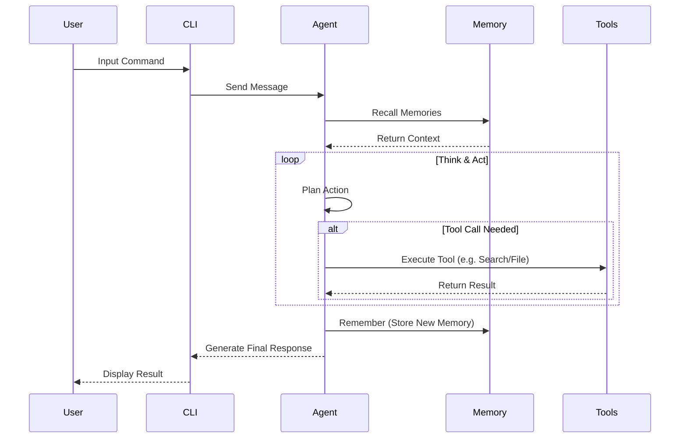
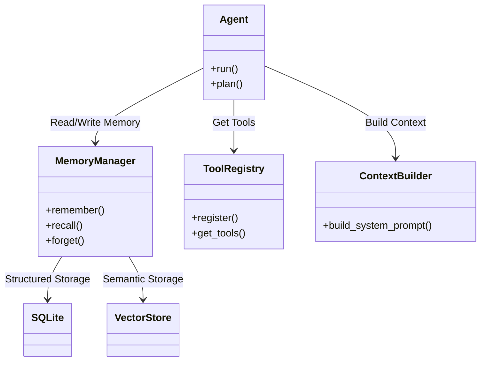

# FinchBot

[](https://opensource.org/licenses/MIT)
[](https://www.python.org/downloads/release/python-3130/)
[](https://github.com/astral-sh/ruff)

**FinchBot** is a lightweight, modular AI Agent framework built on LangChain and LangGraph. It is designed to provide a flexible and scalable foundation for building intelligent assistants with persistent memory, tool usage capabilities, and multi-language support.

[中文文档](README_CN.md) | [English Documentation](docs/en-US/README.md)

## ✨ Features

- **🧠 Powerful Memory System**:
    - **Layered Storage**: Combines SQLite (structured facts) and Vector Store (semantic associations).
    - **Automatic Maintenance**: Supports automatic classification, importance scoring, and rule-based forgetting mechanisms.
    - **Consistency**: Built-in data synchronization service ensures consistency across storage layers.
- **🔌 Modular Tool Ecosystem (11+ Built-in Tools)**:
    - **File Operations**: `read_file`, `write_file`, `edit_file`, `list_dir` - Complete local filesystem control.
    - **Web Capabilities**: `web_search` (Tavily/Brave), `web_extract` - Real-time information retrieval.
    - **Memory Management**: `remember`, `recall`, `forget` - Proactive long-term memory management.
    - **System Control**: `exec_command` - Secure shell execution; `session_title` - Manage session titles.
- **🎓 Skill Extension System (3+ Built-in Skills)**:
    - **Skill-Creator**: Interactive guide for creating new skills.
    - **Summarize**: Intelligent document/conversation summarization.
    - **Weather**: Weather query demonstration skill.
    - Supports defining new skills (SOPs) via Markdown for In-Context Learning.
- **💻 Powerful CLI Interface**:
    - **Session Management**: Interactively select, rename, and delete history sessions.
    - **Auto-Title**: Automatically generates concise session titles based on conversation content.
    - **Time Travel**: Supports `/rollback` and `/back` commands to revert conversation state or create branch sessions.
    - **Rich Experience**: Built on Rich, supporting Markdown rendering, loading animations, and syntax highlighting.
- **🌍 Complete Internationalization (i18n)**:
    - Automatic system language detection.
    - Supports switching interfaces and prompts between Chinese, English, and Traditional Chinese.
- **🛠️ Developer Friendly**:
    - **Type Safety**: Comprehensive use of Python Type Hints.
    - **Well Documented**: Core code comment coverage > 95%.
    - **Modern Engineering**: Uses `uv` for dependency management and `ruff` for code quality.
- **🚀 Modern Tech Stack**: Python 3.13+, LangGraph (Stateful Agents), Pydantic v2.

## 🌟 Key Advantages

1.  **Privacy-First Local Memory**: Uses `FastEmbed` locally for vector generation by default, avoiding uploading memory content to OpenAI Embedding API, ensuring privacy and zero cost.
2.  **True Persistence**: Unlike simple `chat_history` lists, FinchBot's memory system is structured, retrievable, and features "forgetting" mechanisms over time, simulating human memory.
3.  **Production-Grade Stability**:
    - **Double-Checked Locking**: Ensures thread-safe tool registration.
    - **Robust Error Handling**: Auto-retry for network requests, timeout control for Shell execution.
    - **Full Test Coverage**: Core logic is unit tested.
4.  **Flexible Extensibility**:
    - Want a new tool? Inherit `FinchTool` and write a Python class.
    - Want a new process? Write a `SKILL.md` and drop it in the `skills/` directory.
    - Want to switch models? Seamlessly switch between OpenAI, Anthropic, Gemini, Ollama via config.

## 🏗️ Architecture Overview

### 1. System Interaction Flow



### 2. Core Components



## 🚀 Quick Start

### Prerequisites

- Windows / Linux / macOS
- Python 3.13+
- [uv](https://github.com/astral-sh/uv) (Recommended)

### Installation

1.  Clone the repository:
    ```bash
    git clone https://github.com/yourusername/finchbot.git
    cd finchbot
    ```

2.  Create environment and install dependencies using uv:
    ```bash
    uv sync
    ```

3.  Configure environment variables:
    Copy `.env.example` to `.env` and fill in your API Key.
    ```bash
    cp .env.example .env
    ```

### Usage

Start an interactive chat session:

```bash
uv run finchbot chat
```

View help:

```bash
uv run finchbot --help
```

## 📖 Documentation

Detailed documentation is available in the `docs/` directory:

- [System Architecture](docs/en-US/architecture.md) 🌟
- [User Guide (CLI)](docs/en-US/guide/usage.md) 🌟
- [API Reference](docs/en-US/api.md)
- [Configuration Guide](docs/en-US/config.md)
- [Extension Guide (Adding Tools/Skills)](docs/en-US/guide/extension.md)
- [Deployment Guide](docs/en-US/deployment.md)
- [Development Guide](docs/en-US/development.md)
- [Contributing Guide](docs/en-US/contributing.md)

## 🤝 Contributing

Contributions are welcome! Please read the [Contributing Guide](docs/en-US/contributing.md) for more information.

## 📄 License

This project is licensed under the [MIT License](LICENSE).
