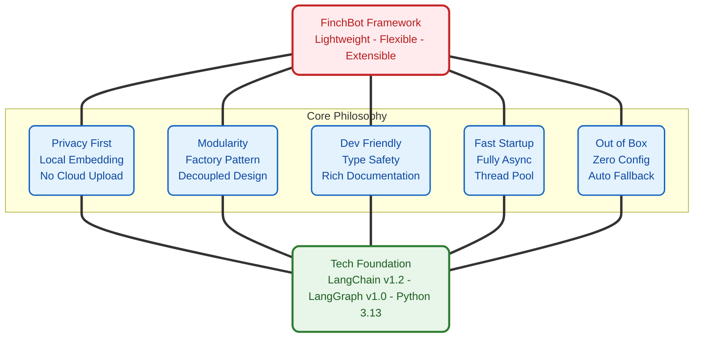
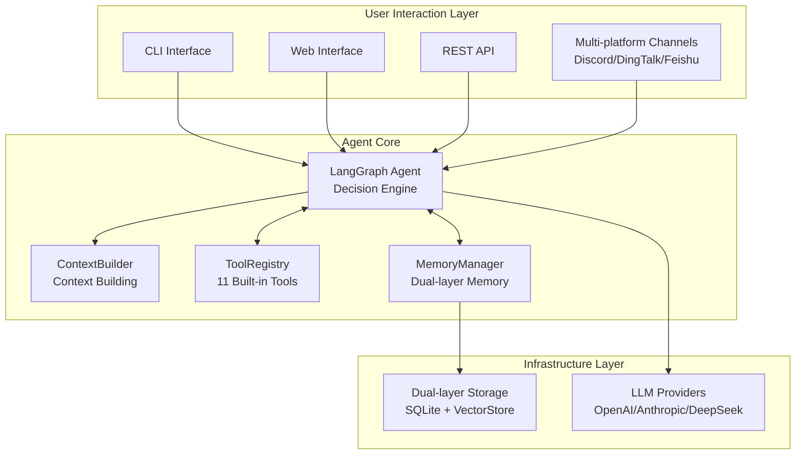
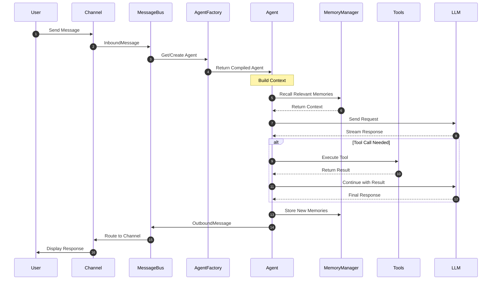
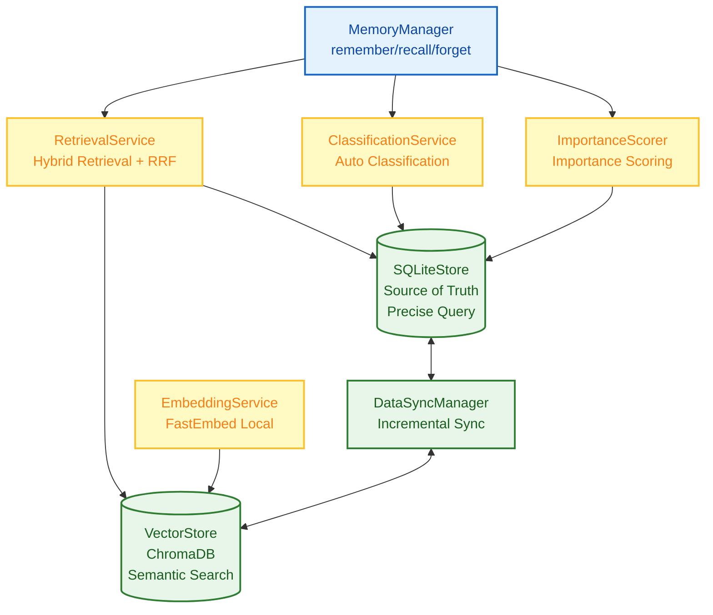
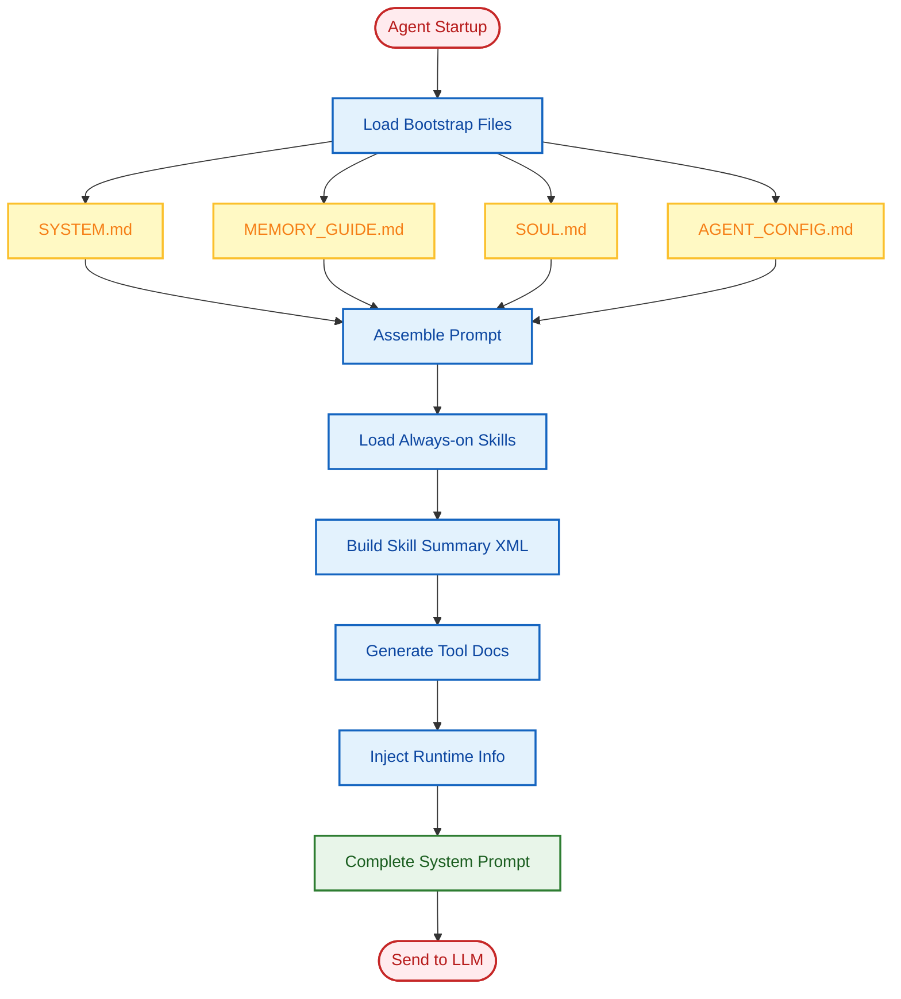
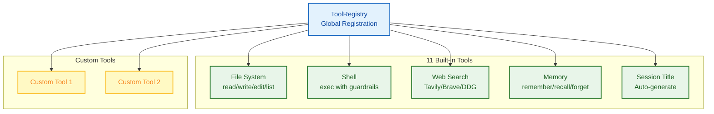
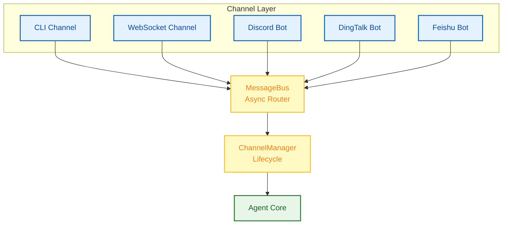

# FinchBot - A Lightweight, Flexible, and Infinitely Extensible AI Agent Framework

<p align="center">
  
</p>

<p align="center">
  <em>Built on LangChain v1.2 and LangGraph v1.0<br>
  with persistent memory, dynamic prompts, and seamless tool integration</em>
</p>

<p align="center">
  <a href="https://blog.csdn.net/Yunyi_Chi">
    
  </a>
  <a href="https://github.com/xt765/FinchBot">
    
  </a>
  <a href="https://gitee.com/xt765/FinchBot">
    
  </a>
</p>

<p align="center">
  
  
  
  
  
</p>

**FinchBot** is a lightweight, modular AI Agent framework built on **LangChain v1.2** and **LangGraph v1.0**. It is not just another LLM wrapper. It is a thoughtfully designed architecture focused on three core challenges:

1. **How to enable infinite Agent extensibility?** - Through a dual-layer extension mechanism of Skills and Tools
2. **How to give Agents real memory?** - Through a dual-layer storage architecture and Agentic RAG
3. **How to make Agent behavior customizable?** - Through a dynamic prompt file system

[中文文档](README_CN.md) | [English Documentation](docs/en-US/README.md)

## Table of Contents

1. [Why FinchBot?](#why-finchbot)
2. [System Architecture](#system-architecture)
3. [Core Components](#core-components)
4. [Quick Start](#quick-start)
5. [Tech Stack](#tech-stack)
6. [Extension Guide](#extension-guide)
7. [Documentation](#documentation)

---

## Why FinchBot?

### Pain Points of Existing Frameworks

| Pain Point | Traditional Approach | FinchBot Solution |
|------------|---------------------|-------------------|
| Hard to Extend | Requires modifying core code | Inherit base class or create Markdown files |
| Fragile Memory | Relies on LLM context window | Dual-layer persistent storage and semantic retrieval |
| Rigid Prompts | Hardcoded in source code | File system with hot reloading |
| Slow Startup | Synchronous blocking I/O | Fully async with Thread pool concurrency |
| Outdated Architecture | Based on old LangChain APIs | LangChain v1.2 and LangGraph v1.0 |

### Design Philosophy



### Multi-Platform Messaging

FinchBot unified message routing architecture - develop once, reach everywhere:

     

### Web Interface (Beta)

FinchBot provides a modern Web interface built with React, Vite, and FastAPI:

```bash
# Start the backend server
uv run finchbot serve

# In another terminal, start the frontend
cd web
npm install
npm run dev
```

The Web interface supports:
- Real-time chat via WebSocket
- Multi-session management (coming soon)
- Rich text rendering

### Command Line Interface

FinchBot provides a full-featured command line interface, three commands to get started:

```bash
# Step 1: Configure API keys and default model
uv run finchbot config

# Step 2: Manage your sessions
uv run finchbot sessions

# Step 3: Start chatting
uv run finchbot chat
```

| Feature | Description |
|---------|-------------|
| Environment Variables | All configurations can be set via environment variables (OPENAI_API_KEY, ANTHROPIC_API_KEY, etc.) |
| i18n Support | Built-in Chinese/English support, auto-detects system language |
| Auto Fallback | Web search automatically falls back through Tavily to Brave to DuckDuckGo |

---

## System Architecture

FinchBot is built on **LangChain v1.2** and **LangGraph v1.0**, serving as an Agent system with persistent memory, dynamic tool scheduling, and multi-platform messaging support.

### Overall Architecture



### Data Flow



### Directory Structure

```
finchbot/
├── agent/              # Agent Core
│   ├── core.py        # Agent creation and execution
│   ├── factory.py     # AgentFactory for component assembly
│   ├── context.py     # ContextBuilder for prompt assembly
│   └── skills.py      # SkillsLoader for Markdown skills
├── channels/           # Multi-Platform Messaging
│   ├── base.py        # BaseChannel abstract class
│   ├── bus.py         # MessageBus async router
│   ├── manager.py     # ChannelManager coordinator
│   └── schema.py      # InboundMessage/OutboundMessage models
├── cli/                # CLI Interface
│   ├── chat_session.py
│   ├── config_manager.py
│   ├── providers.py
│   └── ui.py
├── config/             # Configuration Management
│   ├── loader.py
│   └── schema.py
├── constants.py        # Centralized constants
├── i18n/               # Internationalization
│   ├── loader.py      # Language detection and loading
│   └── locales/
├── memory/             # Memory System
│   ├── manager.py
│   ├── types.py
│   ├── services/       # Service Layer
│   │   ├── classification.py
│   │   ├── embedding.py
│   │   ├── importance.py
│   │   └── retrieval.py
│   ├── storage/        # Storage Layer
│   │   ├── sqlite.py
│   │   └── vector.py
│   └── vector_sync.py
├── providers/          # LLM Providers
│   └── factory.py
├── server/             # Web Server
│   ├── main.py        # FastAPI application
│   └── loop.py        # AgentLoop for WebSocket
├── sessions/           # Session Management
│   ├── metadata.py
│   ├── selector.py
│   └── title_generator.py
├── skills/             # Skill System
│   ├── skill-creator/
│   ├── summarize/
│   └── weather/
├── tools/              # Tool System
│   ├── base.py
│   ├── factory.py     # ToolFactory for tool creation
│   ├── registry.py
│   ├── filesystem.py
│   ├── memory.py
│   ├── shell.py
│   ├── web.py
│   ├── session_title.py
│   └── search/
└── utils/              # Utility Functions
    ├── cache.py       # File-based caching
    ├── logger.py
    └── model_downloader.py
```

---

## Core Components

### 1. Memory Architecture: Dual-Layer Storage and Agentic RAG

FinchBot implements an advanced **dual-layer memory architecture** that solves LLM context window limits and long-term forgetting issues.

#### Why Agentic RAG?

| Dimension | Traditional RAG | Agentic RAG (FinchBot) |
|-----------|-----------------|------------------------|
| Retrieval Trigger | Fixed pipeline | Agent autonomous decision |
| Retrieval Strategy | Single vector retrieval | Hybrid retrieval with dynamic weight adjustment |
| Memory Management | Passive storage | Active remember/recall/forget |
| Classification | None | Auto-classification and importance scoring |
| Update Mechanism | Full rebuild | Incremental sync |

#### Dual-Layer Storage Architecture



#### Hybrid Retrieval Strategy

FinchBot uses **Weighted RRF (Weighted Reciprocal Rank Fusion)** strategy:

```python
class QueryType(StrEnum):
    """Query type determines retrieval weights"""
    KEYWORD_ONLY = "keyword_only"      # Pure keyword (1.0/0.0)
    SEMANTIC_ONLY = "semantic_only"    # Pure semantic (0.0/1.0)
    FACTUAL = "factual"                # Factual (0.8/0.2)
    CONCEPTUAL = "conceptual"          # Conceptual (0.2/0.8)
    COMPLEX = "complex"                # Complex (0.5/0.5)
    AMBIGUOUS = "ambiguous"            # Ambiguous (0.3/0.7)
```

### 2. Dynamic Prompt System: User-Editable Agent Brain

FinchBot's prompt system uses **file system and modular assembly** design.

#### Bootstrap File System

```
~/.finchbot/
├── SYSTEM.md           # Role definition
├── MEMORY_GUIDE.md     # Memory usage guide
├── SOUL.md             # Personality settings
├── AGENT_CONFIG.md     # Agent configuration
└── workspace/
    └── skills/         # Custom skills
```

#### Prompt Loading Flow



### 3. Tool System: Code-Level Capability Extension

Tools are the bridge for Agent to interact with the external world. FinchBot provides 11 built-in tools with easy extension.

#### Tool System Architecture



#### Built-in Tools Overview

| Tool | Description | Use Case |
|------|-------------|----------|
| read_file | Read file content | Code review, file analysis |
| write_file | Write file content | Code generation, document creation |
| edit_file | Edit file content | Code refactoring, text replacement |
| list_dir | List directory contents | Project exploration |
| exec | Execute shell command | System operations, git commands |
| web_search | Search the web | Information retrieval, fact checking |
| remember | Store memory | Long-term knowledge retention |
| recall | Retrieve memory | Context-aware information retrieval |
| forget | Delete memory | Memory management |
| generate_session_title | Generate session title | Auto-naming chat sessions |

#### Creating Custom Tools

```python
from finchbot.tools.base import FinchTool
from pydantic import Field

class MyTool(FinchTool):
    """Tool description"""
    name: str = "my_tool"
    description: str = "What this tool does"
    
    arg1: str = Field(description="Argument description")
    
    def _run(self, arg1: str) -> str:
        # Tool implementation
        return f"Result: {arg1}"
```

### 4. Skill System: Natural Language Capability Extension

Skills are FinchBot's unique **natural language extension mechanism**. Unlike Tools (code-level), Skills extend Agent capabilities through Markdown files.

#### Skill vs Tool

| Dimension | Tool | Skill |
|-----------|------|-------|
| Extension Level | Code | Natural Language |
| Implementation | Python class | Markdown file |
| Capability | Execute actions | Provide knowledge and workflows |
| Hot Reload | No (requires restart) | Yes (file change detection) |
| Use Case | File operations, API calls | Domain expertise, task templates |

#### Skill File Format

```markdown
---
name: weather
description: Get weather information for any city
alwaysOn: false
---

# Weather Skill

## Overview

This skill helps you get weather information for any city worldwide.

## Workflow

1. Identify the city mentioned by the user
2. Use web_search to find current weather
3. Summarize the weather information
4. Provide recommendations if needed

## Example

User: "What's the weather like in Beijing?"

Assistant: [Uses web_search to find Beijing weather, then responds]
```

### 5. Multi-Platform Channel System

FinchBot's channel system uses **MessageBus + ChannelManager** architecture for unified multi-platform support.

#### Channel Architecture



---

## Quick Start

### Prerequisites

- Python 3.13+
- UV package manager (recommended)
- API keys for LLM providers (OpenAI, Anthropic, or DeepSeek)

### Installation

```bash
# Clone the repository
git clone https://github.com/xt765/FinchBot.git
cd FinchBot

# Install dependencies with UV
uv sync

# Or use pip
pip install -e ".[dev]"
```

### Configuration

```bash
# Interactive configuration
uv run finchbot config

# Or set environment variables
export OPENAI_API_KEY="your-api-key"
export MODEL_NAME="gpt-4o"
```

### Start Chatting

```bash
# Start interactive chat
uv run finchbot chat

# With specific model
uv run finchbot chat --model claude-sonnet-4-20250514
```

---

## Tech Stack

### Core Dependencies

| Package | Version | Purpose |
|---------|---------|---------|
| LangChain | 1.2.10+ | LLM framework |
| LangGraph | 1.0.8+ | Agent workflow |
| FastEmbed | 0.6.0+ | Local embedding |
| ChromaDB | 0.6.0+ | Vector storage |
| FastAPI | 0.133.0+ | Web API |
| Pydantic | 2.11.0+ | Data validation |

### Development Tools

| Tool | Purpose |
|------|---------|
| Ruff | Linting and formatting |
| Basedpyright | Type checking |
| Pytest | Testing |
| Pre-commit | Git hooks |

---

## Extension Guide

### Creating Custom Tools

See [Tool Extension Guide](docs/en-US/guide/extension.md#tools)

### Creating Custom Skills

See [Skill Extension Guide](docs/en-US/guide/extension.md#skills)

### Adding New Channels

See [Channel Extension Guide](docs/en-US/guide/extension.md#channels)

---

## Documentation

- [Architecture](docs/en-US/architecture.md)
- [Usage Guide](docs/en-US/guide/usage.md)
- [Extension Guide](docs/en-US/guide/extension.md)
- [Development Guide](docs/en-US/development.md)
- [Deployment Guide](docs/en-US/deployment.md)
- [Contributing](docs/en-US/contributing.md)
- [API Reference](docs/en-US/api.md)

---

## License

FinchBot is released under the [MIT License](LICENSE).

---

## Acknowledgments

FinchBot is inspired by:
- [LangChain](https://github.com/langchain-ai/langchain) - LLM framework
- [LangGraph](https://github.com/langchain-ai/langgraph) - Agent workflows
- [Nanobot](https://github.com/ischaojie/nanobot) - Skill system design

---

**Built with care by [Xuantong765](https://github.com/xt765)**
