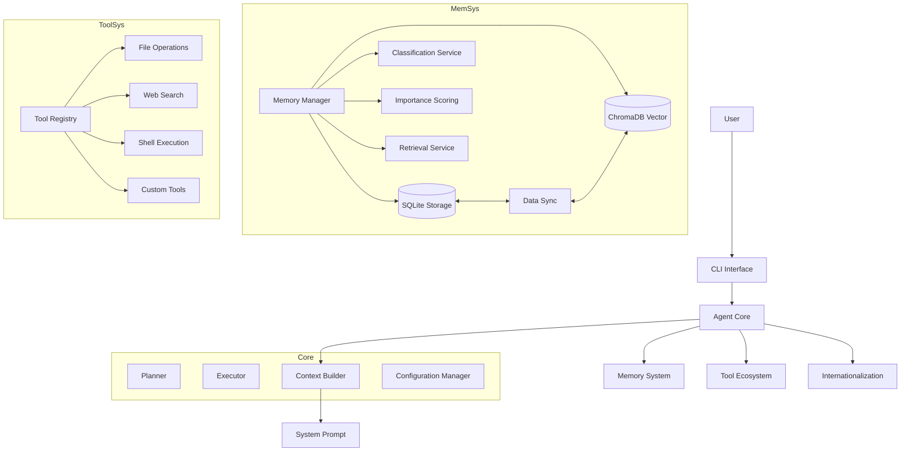
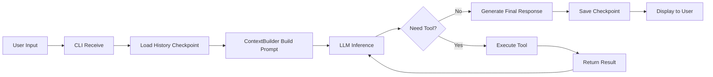

# FinchBot

[](https://opensource.org/licenses/MIT)
[](https://www.python.org/downloads/release/python-3130/)
[](https://github.com/astral-sh/ruff)
[](https://github.com/DetachHead/basedpyright)

**FinchBot** is a lightweight, modular AI Agent framework built on LangChain and LangGraph. It is designed to provide a flexible and scalable foundation for building intelligent assistants with persistent memory, tool usage capabilities, and multi-language support.

[中文文档](README_CN.md) | [English Documentation](docs/en-US/README.md)

## Table of Contents

1. [System Architecture](#system-architecture)
2. [Core Components](#core-components)
3. [Workflows](#workflows)
4. [Design Principles](#design-principles)
5. [Key Advantages](#key-advantages)
6. [Quick Start](#quick-start)
7. [Tech Stack](#tech-stack)
8. [Extension Guide](#extension-guide)

---

## System Architecture

FinchBot is built on **LangChain** and **LangGraph**, serving as an Agent system with persistent memory and dynamic tool scheduling. The system consists of three core components:



### Directory Structure

```
finchbot/
├── agent/              # Agent Core
│   ├── core.py        # Agent creation and execution
│   ├── context.py     # Context building
│   └── skills.py      # Skill system
├── cli/                # CLI Interface
│   ├── chat_session.py
│   ├── config_manager.py
│   ├── providers.py
│   └── ui.py
├── config/             # Configuration Management
│   ├── loader.py
│   └── schema.py
├── i18n/               # Internationalization
│   ├── loader.py
│   ├── detector.py
│   └── locales/
├── memory/             # Memory System
│   ├── manager.py
│   ├── types.py
│   ├── services/       # Service Layer
│   │   ├── classification.py
│   │   ├── embedding.py
│   │   ├── importance.py
│   │   └── retrieval.py
│   ├── storage/        # Storage Layer
│   │   ├── sqlite.py
│   │   └── vector.py
│   └── vector_sync.py
├── providers/          # LLM Providers
│   └── factory.py
├── sessions/           # Session Management
│   ├── metadata.py
│   ├── selector.py
│   └── title_generator.py
├── skills/             # Skill System
│   ├── skill-creator/
│   ├── summarize/
│   └── weather/
├── tools/              # Tool System
│   ├── base.py
│   ├── registry.py
│   ├── filesystem.py
│   ├── memory.py
│   ├── shell.py
│   ├── web.py
│   ├── session_title.py
│   └── search/
└── utils/              # Utility Functions
    ├── logger.py
    └── model_downloader.py
```

---

## Core Components

### Agent Core

**Implementation**: `src/finchbot/agent/core.py`

Agent Core is the brain of FinchBot, responsible for decision-making, planning, and tool scheduling.

#### Core Features

*   **State Management**: Based on `LangGraph`'s `StateGraph`, maintaining conversation state (`messages`).
*   **Persistence**: Uses `SqliteSaver` (`checkpoints.db`) to save state snapshots, supporting resume and history rollback.
*   **Context Construction**:
    *   Dynamically assembles the system prompt, including:
        *   **Identity**: `SYSTEM.md` (Role definition)
        *   **Memory Guide**: `MEMORY_GUIDE.md` (Memory usage guidelines)
        *   **Soul**: `SOUL.md` (Soul definition)
        *   **Skills**: Dynamically loaded skill descriptions
        *   **Tools**: `TOOLS.md` (Tool documentation)
        *   **Runtime Info**: Current time, OS, Python version, etc.

#### Key Classes and Functions

| Function/Class | Description |
|----------------|-------------|
| `create_finch_agent()` | Creates and configures FinchBot Agent |
| `build_system_prompt()` | Builds the complete system prompt |
| `get_default_workspace()` | Gets the default workspace directory |
| `get_sqlite_checkpointer()` | Gets SQLite persistence checkpoint |
| `get_memory_checkpointer()` | Gets in-memory checkpoint |

#### Thread Safety Mechanism

Tool registration uses the **Double-checked locking pattern** for lazy loading, ensuring thread safety:

```python
def _register_default_tools() -> None:
    global _default_tools_registered

    if _default_tools_registered:
        return

    with _tools_registration_lock:
        if _default_tools_registered:
            return
        # Actual registration logic...
```

#### Skill Extension System

FinchBot provides a flexible skill extension system, supporting new skills defined via Markdown:

| Skill | Function | Status |
|-------|----------|--------|
| skill-creator | Interactive guide for creating new skills | Built-in |
| summarize | Intelligent document/conversation summarization | Built-in |
| weather | Weather query demonstration | Built-in |
| Custom Skills | Define new skills via Markdown | Supported |

### Memory System

**Implementation**: `src/finchbot/memory/`

FinchBot implements an advanced **Layered Memory Architecture** designed to solve LLM context window limits and long-term forgetting issues.

#### Layered Design

1.  **Structured Layer (SQLite)**:
    *   **Role**: Source of Truth.
    *   **Content**: Full text, metadata (tags, source), category, importance score, access logs.
    *   **Advantage**: Supports precise queries (e.g., filtering by time, category).
    *   **Implementation**: `SQLiteStore` class, using `aiosqlite` for async operations.

2.  **Semantic Layer (Vector Store)**:
    *   **Role**: Fuzzy retrieval and association.
    *   **Content**: Embedding vectors of text.
    *   **Tech Stack**: ChromaDB + FastEmbed (Local lightweight models).
    *   **Advantage**: Supports natural language semantic search (e.g., "that Python library I mentioned last time").
    *   **Implementation**: `VectorMemoryStore` class.

#### Core Features

| Feature | Description | Status |
|---------|-------------|--------|
| Layered Storage | SQLite (structured facts) + ChromaDB (semantic vectors) | Implemented |
| Auto Classification | Automatic memory classification based on keywords and semantics | Implemented |
| Importance Scoring | Automatic memory importance calculation (0-1) | Implemented |
| Manual Forgetting | Keyword-based deletion/archiving of memories | Implemented |
| Data Sync | Bidirectional sync between SQLite and Vector Store for consistency | Implemented |
| Auto Maintenance | Rule-based automatic forgetting mechanism | Planned |

#### Core Services

| Service | Location | Function |
|---------|----------|----------|
| **DataSyncManager** | `memory/vector_sync.py` | Ensures eventual consistency between SQLite and Vector Store, with retry support |
| **ImportanceScorer** | `memory/services/importance.py` | Automatically evaluates memory importance (0.0-1.0) for cleanup and prioritization |
| **RetrievalService** | `memory/services/retrieval.py` | Hybrid retrieval strategy combining vector similarity and metadata filtering |
| **ClassificationService** | `memory/services/classification.py` | Automatic classification based on keywords and semantics |
| **EmbeddingService** | `memory/services/embedding.py` | Local embedding generation using FastEmbed |

#### MemoryManager Interface

```python
class MemoryManager:
    def remember(self, content: str, category=None, importance=None, ...)
    def recall(self, query: str, top_k=5, category=None, ...)
    def forget(self, pattern: str)
    def get_stats(self) -> dict
    def search_memories(self, ...)
    def get_recent_memories(self, days=7, limit=20)
    def get_important_memories(self, min_importance=0.8, limit=20)
```

### Tool Ecosystem

**Implementation**: `src/finchbot/tools/`

FinchBot provides a rich tool ecosystem that enables the Agent to interact with the external world, with 11 built-in tools.

#### Registration Mechanism

*   **ToolRegistry**: Singleton registry managing all available tools.
*   **Lazy Loading**: Default tools (File, Search, etc.) are automatically registered when the Agent starts.
*   **OpenAI Compatible**: Supports exporting tool definitions in OpenAI Function Calling format.

#### Tool Base Class

All tools inherit from the `FinchTool` base class and must implement:
- `name`: Tool name
- `description`: Tool description
- `parameters`: Parameter definition (JSON Schema)
- `execute()`: Execution logic

#### Security Sandbox

*   **File Operations**: Restricted to the workspace (`workspace`) to prevent unauthorized system access.
*   **Shell Execution**: High-risk commands (rm -rf /) are disabled by default, with timeout control.

#### Built-in Tools List

| Category | Tool | Function |
|----------|------|----------|
| File Operations | read_file | Read local files |
| File Operations | write_file | Write local files |
| File Operations | edit_file | Edit file content |
| File Operations | list_dir | List directory contents |
| Web Capabilities | web_search | Web search (Tavily/Brave/DDG) |
| Web Capabilities | web_extract | Web content extraction |
| Memory Management | remember | Proactively store memories |
| Memory Management | recall | Retrieve memories |
| Memory Management | forget | Delete/archive memories |
| System Control | exec_command | Secure shell execution |
| System Control | session_title | Manage session titles |

### I18n System (Internationalization)

**Implementation**: `src/finchbot/i18n/`

FinchBot provides complete multi-language support, allowing users worldwide to use it in their familiar language.

#### Supported Languages

| Language | Status |
|----------|--------|
| Simplified Chinese | Full Support |
| Traditional Chinese | Full Support |
| English | Full Support |

#### Language Fallback Chain

The system implements an intelligent fallback mechanism:
```
zh-CN → zh → en-US
zh-HK → zh → en-US
en-US → (no fallback)
```

#### Configuration Priority

1.  Environment variable: `FINCHBOT_LANG`
2.  User config: `~/.finchbot/config.json`
3.  System language detection
4.  Default: `en-US`

### Configuration System

**Implementation**: `src/finchbot/config/`

Uses Pydantic v2 + Pydantic Settings for type-safe configuration management.

#### Configuration Structure

```
Config (Root)
├── language
├── default_model
├── agents
│   └── defaults (Agent defaults)
├── providers
│   ├── openai
│   ├── anthropic
│   ├── deepseek
│   ├── moonshot
│   ├── dashscope
│   ├── groq
│   ├── gemini
│   ├── openrouter
│   └── custom
└── tools
    ├── web.search (Search config)
    ├── exec (Shell execution config)
    └── restrict_to_workspace
```

---

## Workflows

### Conversation Flow



1.  User input -> Received by CLI
2.  Agent loads history state (Checkpoint)
3.  ContextBuilder constructs current Prompt (including relevant memory)
4.  LLM generates response or tool call request
5.  If tool call -> Execute tool -> Return result to LLM -> Loop
6.  LLM generates final response -> Display to user

### CLI Features

FinchBot's CLI provides a rich interactive experience:

| Feature | Description |
|---------|-------------|
| Session Management | Interactively select, rename, and delete history sessions |
| Auto-Title | Automatically generates session titles based on conversation |
| Time Travel | Supports \rollback and \back commands to revert conversation state |
| Rich Experience | Markdown rendering, loading animations, syntax highlighting |

### Memory Write Flow (Remember)

1.  Agent calls `remember` tool
2.  `MemoryManager` receives content
3.  Automatically calculates `category` (ClassificationService)
4.  Automatically calculates `importance` (ImportanceScorer)
5.  Writes to SQLite, generating a unique ID
6.  Synchronously calls Embedding service, writing vector to ChromaDB
7.  Records access log

### Memory Retrieval Flow (Recall)

1.  Agent calls `recall` tool (Query: "What is my API Key")
2.  `RetrievalService` converts query to vector
3.  Searches Top-K similar results in Vector Store
4.  (Optional) Combines with SQLite for metadata filtering (category, time range, etc.)
5.  Returns results to Agent

---

## Design Principles

### Modularity

Each component has clear responsibility boundaries:
- `MemoryManager` doesn't directly handle storage details, delegates to `SQLiteStore` and `VectorMemoryStore`
- `ToolRegistry` only handles registration and lookup, doesn't care about tool implementation
- `I18n` system is independent of business logic

### Dependency Inversion

High-level modules don't depend on low-level modules, both depend on abstractions:
```
AgentCore → MemoryManager (Interface)
                ↓
         SQLiteStore / VectorStore (Implementation)
```

### Privacy First

- Embedding generation happens locally (FastEmbed), no cloud upload
- Configuration files stored in user directory `~/.finchbot`
- File operations restricted to workspace

### Defensive Programming

- Double-checked locking prevents concurrency issues
- Vector store failure doesn't affect SQLite writes (degradation strategy)
- Timeout control prevents tool hanging
- Complete error logging (Loguru)

### Developer Features

FinchBot provides a comprehensive development experience for developers:

| Feature | Description |
|---------|-------------|
| Type Safety | Comprehensive use of Python Type Hints |
| Code Quality | Ruff formatting + BasedPyright type checking |
| Dependency Management | uv for fast package management, 10-100x faster |
| Tech Stack | Python 3.13+, LangGraph v1.0+, Pydantic v2 |
| Testing Framework | pytest + pytest-asyncio + pytest-cov |

---

## Key Advantages

| Advantage | Description |
|-----------|-------------|
| Privacy First | Uses FastEmbed locally for vector generation, no cloud upload |
| True Persistence | Dual-layer memory storage with semantic retrieval and precise queries |
| Production Grade | Double-checked locking, auto-retry, timeout control mechanisms |
| Flexible Extension | Inherit FinchTool to add new tools without modifying core code |
| Model Agnostic | Supports OpenAI, Anthropic, Gemini, Ollama, DeepSeek, Moonshot, etc. |
| Thread Safe | Tool registration uses double-checked locking pattern |

---

## Quick Start

### Prerequisites

| Item | Requirement |
|------|-------------|
| OS | Windows / Linux / macOS |
| Python | 3.13+ |
| Package Manager | uv (Recommended) |

### Installation

1. Clone the repository

```bash
git clone https://github.com/yourusername/finchbot.git
cd finchbot
```

2. Create environment and install dependencies using uv

```bash
uv sync
```

3. Configure environment variables

Copy `.env.example` to `.env` and fill in your API Key

```bash
cp .env.example .env
```

### Usage

Start an interactive chat session

```bash
uv run finchbot chat
```

View help

```bash
uv run finchbot --help
```

Download local embedding models

```bash
uv run finchbot models download
```

Manage sessions

```bash
uv run finchbot sessions
```

Configuration management

```bash
uv run finchbot config
```

---

## Tech Stack

| Layer | Technology | Version |
|-------|------------|---------|
| Core Language | Python | 3.13+ |
| Agent Framework | LangChain | 1.2.10+ |
| State Management | LangGraph | 1.0.8+ |
| Data Validation | Pydantic | v2 |
| Vector Storage | ChromaDB | 0.5.0+ |
| Local Embedding | FastEmbed | 0.4.0+ |
| Search Enhancement | BM25 | 0.2.2+ |
| CLI Framework | Typer | 0.23.0+ |
| Rich Text | Rich | 14.3.0+ |
| Logging | Loguru | 0.7.3+ |
| Configuration | Pydantic Settings | 2.12.0+ |

---

## Extension Guide

### Adding New Tools

Inherit the `FinchTool` base class, implement the `execute()` method, then register with `ToolRegistry`.

### Adding New LLM Providers

Add a new Provider class in `providers/factory.py`.

### Custom Memory Retrieval Strategy

Inherit `RetrievalService` or modify the `search()` method.

### Adding New Languages

Add a new `.toml` file under `i18n/locales/`.

---

## Documentation

| Document | Description |
|----------|-------------|
| [User Guide (CLI)](docs/en-US/guide/usage.md) | CLI usage tutorial |
| [API Reference](docs/en-US/api.md) | API reference |
| [Configuration Guide](docs/en-US/config.md) | Configuration options |
| [Extension Guide](docs/en-US/guide/extension.md) | Adding tools/skills |
| [Deployment Guide](docs/en-US/deployment.md) | Deployment instructions |
| [Development Guide](docs/en-US/development.md) | Development environment setup |
| [Contributing Guide](docs/en-US/contributing.md) | Contribution guidelines |

---

## Contributing

Contributions are welcome! Please read the [Contributing Guide](docs/en-US/contributing.md) for more information.

---

## License

This project is licensed under the [MIT License](LICENSE).

---

## Star History

If this project is helpful to you, please give it a Star ⭐️
