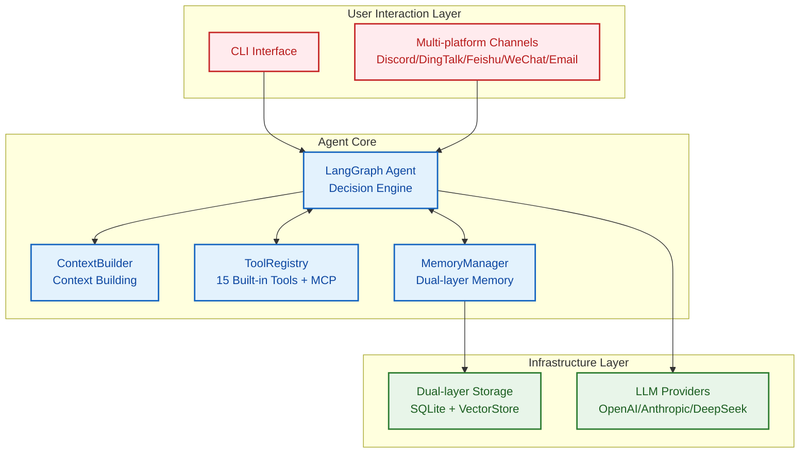
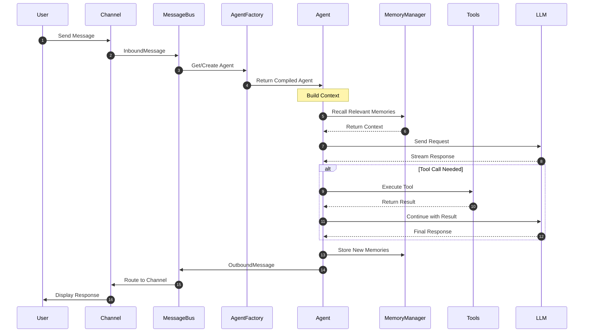
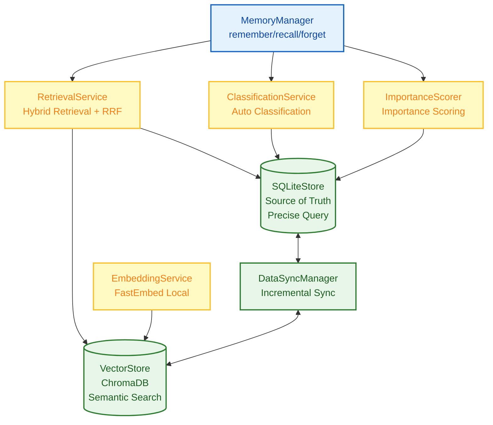
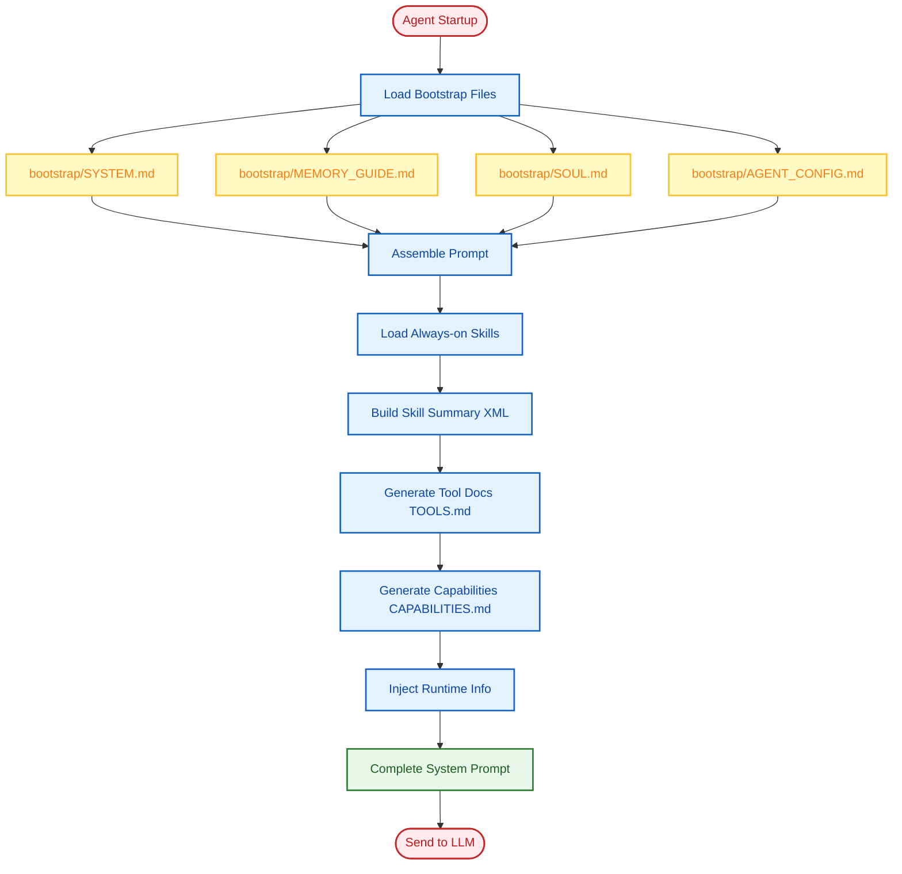
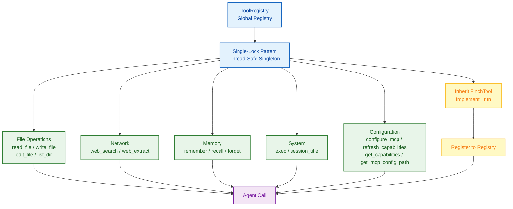
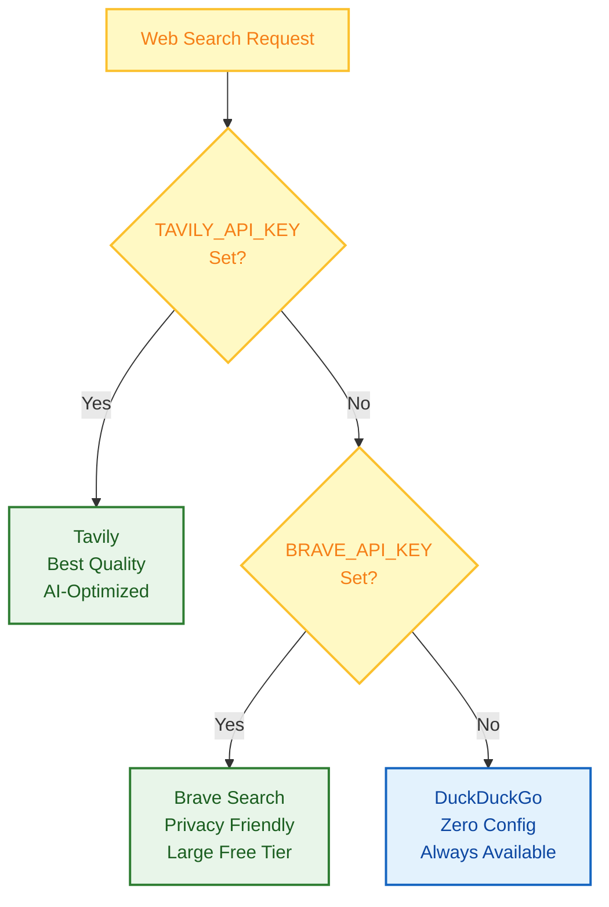
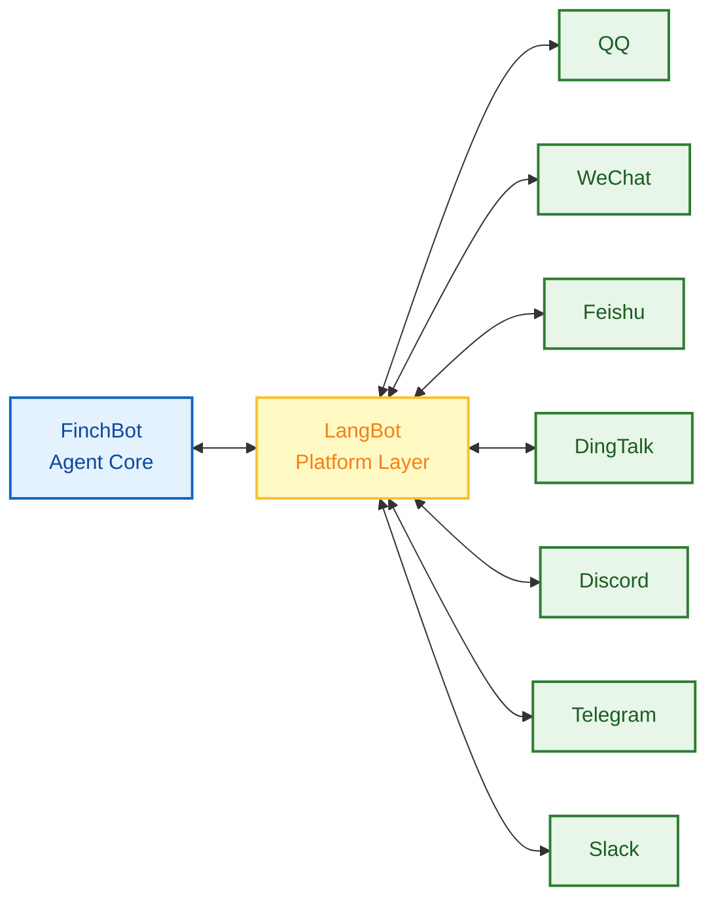

# FinchBot — A Lightweight, Flexible, and Infinitely Extensible AI Agent Framework

<p align="center">
  
</p>

<p align="center">
  <em>Built on LangChain v1.2 & LangGraph v1.0<br>
  with persistent memory, dynamic prompts, and seamless tool integration</em>
</p>

<p align="center">🌐 <strong>Language</strong>: <a href="README.md">English</a> | <a href="README_CN.md">中文</a></p>

<p align="center">
  <a href="https://blog.csdn.net/Yunyi_Chi">
    
  </a>
  <a href="https://github.com/xt765/FinchBot">
    
  </a>
  <a href="https://gitee.com/xt765/FinchBot">
    
  </a>
  
</p>

<p align="center">
  
  
  
  
  
</p>

**FinchBot** is a lightweight, modular AI Agent framework built on **LangChain v1.2** and **LangGraph v1.0**. It's not just another LLM wrapper—it's a thoughtfully designed architecture focused on three core challenges:

1. **How to enable infinite Agent extensibility?** — Through a dual-layer extension mechanism of Skills and Tools
2. **How to give Agents real memory?** — Through a dual-layer storage architecture + Agentic RAG
3. **How to make Agent behavior customizable?** — Through a dynamic prompt file system

## Table of Contents

1. [Why FinchBot?](#why-finchbot)
2. [System Architecture](#system-architecture)
3. [Core Components](#core-components)
4. [Quick Start](#quick-start)
5. [Tech Stack](#tech-stack)
6. [Extension Guide](#extension-guide)
7. [Documentation](#documentation)

---

## Why FinchBot?

### Pain Points of Existing Frameworks

|           Pain Point           | Traditional Approach         | FinchBot Solution                                        |
| :-----------------------------: | :--------------------------- | :------------------------------------------------------- |
|    **Hard to Extend**    | Requires modifying core code | Inherit FinchTool base class or create Markdown skill files |
|    **Fragile Memory**    | Relies on LLM context window | SQLite + Vector dual storage + Agentic RAG + Weighted RRF |
|     **Rigid Prompts**     | Hardcoded in source code     | Bootstrap file system, user-customizable prompts, hot reload |
|     **Slow Startup**     | Synchronous blocking I/O     | Fully async + Thread pool concurrency, 3-5x faster startup |
| **Outdated Architecture** | Based on old LangChain APIs  | LangChain v1.2 + LangGraph v1.0 state graph orchestration |

### Design Philosophy


### Multi-Platform Messaging (via LangBot)

FinchBot integrates with [LangBot](https://github.com/langbot-app/LangBot) for multi-platform messaging - develop once, reach everywhere:

      

**LangBot** (15k+ GitHub Stars) is a production-grade multi-platform bot framework supporting 12+ messaging platforms.

Quick Start with LangBot:
```bash
# Install LangBot
uvx langbot

# Access WebUI at http://localhost:5300
# Configure your platforms and connect to FinchBot
```

### MCP (Model Context Protocol) Support

FinchBot uses the official `langchain-mcp-adapters` library for MCP integration:

```bash
# Configure MCP servers in config
finchbot config
# Select "MCP Configuration" option
```

MCP Features:
- Dynamic tool discovery and registration
- Standardized tool calling interface
- Support for stdio and HTTP transports
- Multiple MCP servers support

### Command Line Interface

FinchBot provides a full-featured command line interface, three commands to get started:

```bash
# Step 1: Configure API keys and default model
uv run finchbot config

# Step 2: Manage your sessions
uv run finchbot sessions

# Step 3: Start chatting
uv run finchbot chat
```

|             Feature             | Description                                                                                               |
| :-----------------------------: | :-------------------------------------------------------------------------------------------------------- |
| **Environment Variables** | All configurations can be set via environment variables (`OPENAI_API_KEY`, `ANTHROPIC_API_KEY`, etc.) |
|     **i18n Support**     | Built-in Chinese/English support, auto-detects system language                                            |
|     **Auto Fallback**     | Web search automatically falls back through Tavily → Brave → DuckDuckGo                                 |

---

## System Architecture

FinchBot is built on **LangChain v1.2** and **LangGraph v1.0**, serving as an Agent system with persistent memory, dynamic tool scheduling, and multi-platform messaging support.

### Overall Architecture



### Data Flow



### Directory Structure

```
finchbot/
├── agent/              # Agent Core
│   ├── core.py        # Agent creation and execution
│   ├── factory.py     # AgentFactory for component assembly
│   ├── context.py     # ContextBuilder for prompt assembly
│   ├── capabilities.py # CapabilitiesBuilder for capability building
│   └── skills.py      # SkillsLoader for Markdown skills
├── channels/           # Multi-Platform Messaging (via LangBot)
│   ├── base.py        # BaseChannel abstract class
│   ├── bus.py         # MessageBus async router
│   ├── manager.py     # ChannelManager coordinator
│   ├── schema.py      # Message models
│   └── langbot_integration.py  # LangBot integration guide
├── cli/                # CLI Interface
│   ├── chat_session.py
│   ├── config_manager.py
│   ├── providers.py
│   └── ui.py
├── config/             # Configuration Management
│   ├── loader.py
│   ├── schema.py      # Includes MCPConfig, ChannelsConfig
│   └── ...
├── constants.py        # Unified constants definition
├── i18n/               # Internationalization
│   ├── loader.py      # Language loader
│   └── locales/
├── memory/             # Memory System
│   ├── manager.py
│   ├── types.py
│   ├── services/
│   └── storage/
├── providers/          # LLM Providers
│   └── factory.py
├── sessions/           # Session Management
│   ├── metadata.py
│   ├── selector.py
│   └── title_generator.py
├── skills/             # Skill System
│   ├── skill-creator/
│   ├── summarize/
│   └── weather/
├── tools/              # Tool System
│   ├── base.py
│   ├── factory.py     # MCP tools via langchain-mcp-adapters
│   ├── registry.py
│   ├── config_tools.py # Configuration tools
│   ├── tools_generator.py # Tool documentation generator
│   ├── filesystem.py
│   ├── memory.py
│   ├── shell.py
│   ├── web.py
│   ├── session_title.py
│   └── search/
└── utils/              # Utility Functions
    ├── cache.py
    ├── logger.py
    └── model_downloader.py
```

---

## Core Components

### 1. Memory Architecture: Dual-Layer Storage + Agentic RAG

FinchBot implements an advanced **dual-layer memory architecture** that solves LLM context window limits and long-term forgetting issues.

#### Why Agentic RAG?

|          Dimension          | Traditional RAG         | Agentic RAG (FinchBot)                       |
| :--------------------------: | :---------------------- | :------------------------------------------- |
| **Retrieval Trigger** | Fixed pipeline          | Agent autonomous decision                    |
| **Retrieval Strategy** | Single vector retrieval | Hybrid retrieval + dynamic weight adjustment |
| **Memory Management** | Passive storage         | Active remember/recall/forget                |
|   **Classification**   | None                    | Auto-classification + importance scoring     |
|  **Update Mechanism**  | Full rebuild            | Incremental sync                             |

#### Dual-Layer Storage Architecture



#### Hybrid Retrieval Strategy

FinchBot uses **Weighted RRF (Weighted Reciprocal Rank Fusion)** strategy:

```python
class QueryType(StrEnum):
    """Query type determines retrieval weights"""
    KEYWORD_ONLY = "keyword_only"      # Pure keyword (1.0/0.0)
    SEMANTIC_ONLY = "semantic_only"    # Pure semantic (0.0/1.0)
    FACTUAL = "factual"                # Factual (0.8/0.2)
    CONCEPTUAL = "conceptual"          # Conceptual (0.2/0.8)
    COMPLEX = "complex"                # Complex (0.5/0.5)
    AMBIGUOUS = "ambiguous"            # Ambiguous (0.3/0.7)
```

### 2. Dynamic Prompt System: User-Editable Agent Brain

FinchBot's prompt system uses **file system + modular assembly** design.

#### Bootstrap File System

```
~/.finchbot/
├── config.json              # Main configuration file
└── workspace/
    ├── bootstrap/           # Bootstrap files directory
    │   ├── SYSTEM.md        # Role definition
    │   ├── MEMORY_GUIDE.md  # Memory usage guide
    │   ├── SOUL.md          # Personality settings
    │   └── AGENT_CONFIG.md  # Agent configuration
    ├── config/              # Configuration directory
    │   └── mcp.json         # MCP server configuration
    ├── generated/           # Auto-generated files
    │   ├── TOOLS.md         # Tool documentation
    │   └── CAPABILITIES.md  # Capabilities info
    ├── skills/              # Custom skills
    ├── memory/              # Memory storage
    └── sessions/            # Session data
```

#### Prompt Loading Flow



### 3. Tool System: Code-Level Capability Extension

Tools are the bridge for Agent to interact with the external world. FinchBot provides 15 built-in tools with easy extension.

#### Tool System Architecture



#### Built-in Tools

|      Category      | Tool              | Function                      |
| :----------------: | :---------------- | :---------------------------- |
| **File Ops** | `read_file`     | Read local files              |
|                    | `write_file`    | Write local files             |
|                    | `edit_file`     | Edit file content             |
|                    | `list_dir`      | List directory contents       |
| **Network** | `web_search`    | Web search (Tavily/Brave/DDG) |
|                    | `web_extract`   | Web content extraction        |
|  **Memory**  | `remember`      | Proactively store memories    |
|                    | `recall`        | Retrieve memories             |
|                    | `forget`        | Delete/archive memories       |
|  **System**  | `exec`          | Secure shell execution        |
|                    | `session_title` | Manage session titles         |
|  **Configuration**  | `configure_mcp` | Dynamically configure MCP servers (enable/disable/add/update/remove/list) |
|                    | `refresh_capabilities` | Refresh capabilities file |
|                    | `get_capabilities` | Get current capabilities  |
|                    | `get_mcp_config_path` | Get MCP config path   |

#### Web Search: Three-Engine Fallback Design



| Priority |         Engine         |   API Key   | Features                                |
| :------: | :--------------------: | :----------: | :-------------------------------------- |
|    1    |    **Tavily**    |   Required   | Best quality, AI-optimized, deep search |
|    2    | **Brave Search** |   Required   | Large free tier, privacy-friendly       |
|    3    |  **DuckDuckGo**  | Not required | Always available, zero config           |

**How it works**:

1. If `TAVILY_API_KEY` is set → Use Tavily (best quality)
2. Else if `BRAVE_API_KEY` is set → Use Brave Search
3. Else → Use DuckDuckGo (no API key needed, always works)

This design ensures **web search works out of the box** even without any API key configuration!

#### Session Title: Smart Naming, Out of the Box

The `session_title` tool embodies FinchBot's out-of-the-box philosophy:

|         Method         | Description                                                        | Example                                  |
| :---------------------: | :----------------------------------------------------------------- | :--------------------------------------- |
| **Auto Generate** | After 2-3 turns, AI automatically generates title based on content | "Python Async Programming Discussion"    |
| **Agent Modify** | Tell Agent "Change session title to XXX"                           | Agent calls tool to modify automatically |
| **Manual Rename** | Press `r` key in session manager to rename                       | User manually enters new title           |

This design lets users **manage sessions without technical details**—whether automatic or manual.

### 4. Skill System: Define Agent Capabilities with Markdown

Skills are FinchBot's unique innovation—**defining Agent capabilities through Markdown files**.

#### Key Feature: Agent Auto-Creates Skills

FinchBot includes a built-in **skill-creator** skill, the ultimate expression of the out-of-the-box philosophy:

> **Just tell the Agent what skill you want, and it will create it automatically!**

```
User: Help me create a translation skill that can translate Chinese to English

Agent: Okay, I'll create a translation skill for you...
       [Invokes skill-creator skill]
       ✅ Created skills/translator/SKILL.md
       You can now use the translation feature directly!
```

No manual file creation, no coding—**extend Agent capabilities with just one sentence**!

#### Skill File Structure

```
skills/
├── skill-creator/        # Skill creator (Built-in) - Core of out-of-the-box
│   └── SKILL.md
├── summarize/            # Intelligent summarization (Built-in)
│   └── SKILL.md
├── weather/              # Weather query (Built-in)
│   └── SKILL.md
└── my-custom-skill/      # Agent auto-created or user-defined
    └── SKILL.md
```

#### Core Design Highlights

|            Feature            | Description                                       |
| :---------------------------: | :------------------------------------------------ |
|  **Agent Auto-Create**  | Tell Agent your needs, auto-generates skill files |
|  **Dual Skill Source**  | Workspace skills first, built-in skills fallback  |
|  **Dependency Check**  | Auto-check CLI tools and environment variables    |
| **Cache Invalidation** | Smart caching based on file modification time     |
| **Progressive Loading** | Always-on skills first, others on demand          |

### 5. Channel System: Multi-Platform Messaging (via LangBot)

FinchBot integrates with [LangBot](https://github.com/langbot-app/LangBot) for production-grade multi-platform messaging.

**Why LangBot?**
- 15k+ GitHub Stars, actively maintained
- Supports 12+ platforms: QQ, WeChat, WeCom, Feishu, DingTalk, Discord, Telegram, Slack, LINE, KOOK, Satori
- Built-in WebUI for easy configuration
- Plugin ecosystem with MCP support



#### Quick Start with LangBot

```bash
# Install LangBot
uvx langbot

# Access WebUI at http://localhost:5300
# Configure your platforms and connect to FinchBot
```

For more details, see [LangBot Documentation](https://docs.langbot.app).

### 6. LangChain v1.2 Architecture Practice

FinchBot is built on **LangChain v1.2** and **LangGraph v1.0**, using the latest Agent architecture.

```python
from langchain.agents import create_agent
from langgraph.checkpoint.sqlite import SqliteSaver

def create_finch_agent(
    model: BaseChatModel,
    workspace: Path,
    tools: Sequence[BaseTool] | None = None,
    use_persistent: bool = True,
) -> tuple[CompiledStateGraph, SqliteSaver | MemorySaver]:

    # 1. Initialize checkpoint (persistent state)
    if use_persistent:
        checkpointer = SqliteSaver.from_conn_string(str(db_path))
    else:
        checkpointer = MemorySaver()

    # 2. Build system prompt
    system_prompt = build_system_prompt(workspace)

    # 3. Create Agent (using LangChain official API)
    agent = create_agent(
        model=model,
        tools=list(tools) if tools else None,
        system_prompt=system_prompt,
        checkpointer=checkpointer,
    )

    return agent, checkpointer
```

#### Supported LLM Providers

| Provider | Models                      | Features                  |
| :-------: | :-------------------------- | :------------------------ |
|  OpenAI  | GPT-5, GPT-5.2, O3-mini     | Best overall capability   |
| Anthropic | Claude Sonnet 4.5, Opus 4.6 | High safety, long context |
| DeepSeek | DeepSeek Chat, Reasoner     | Chinese, cost-effective   |
|  Gemini  | Gemini 2.5 Flash            | Google's latest           |
|   Groq   | Llama 4 Scout/Maverick      | Ultra-fast inference      |
| Moonshot | Kimi K1.5/K2.5              | Long context, Chinese     |

---

## Quick Start

### Prerequisites

|      Item      | Requirement             |
| :-------------: | :---------------------- |
|       OS       | Windows / Linux / macOS |
|     Python     | 3.13+                   |
| Package Manager | uv (Recommended)        |

### Installation

```bash
# Clone repository (choose one)
# Gitee (recommended for users in China)
git clone https://gitee.com/xt765/finchbot.git
# or GitHub
git clone https://github.com/xt765/finchbot.git

cd finchbot

# Install dependencies
uv sync
```

> **Note**: The embedding model (~95MB) will be automatically downloaded to the local cache when you run the application for the first time (e.g., `finchbot chat`). No manual intervention required.

<details>
<summary>Development Installation</summary>

For development, install with dev dependencies:

```bash
uv sync --extra dev
```

This includes: pytest, ruff, basedpyright

</details>

### Best Practice: Three Commands to Get Started

```bash
# Step 1: Configure API keys and default model
uv run finchbot config

# Step 2: Manage your sessions
uv run finchbot sessions

# Step 3: Start chatting
uv run finchbot chat
```

That's it! These three commands cover the complete workflow:

- `finchbot config` — Interactive configuration for LLM providers, API keys, and settings
- `finchbot sessions` — Full-screen session manager for creating, renaming, deleting sessions
- `finchbot chat` — Start or continue an interactive conversation

### Docker Deployment

FinchBot provides official Docker support for easy deployment:

```bash
# Clone repository
git clone https://github.com/xt765/finchbot.git
cd finchbot

# Create .env file with your API keys
cp .env.example .env
# Edit .env and add your API keys

# Build and run
docker-compose up -d

# Access the Web interface
# http://localhost:8000
```

| Feature | Description |
| :-----: | :---------- |
| **One-command Deploy** | `docker-compose up -d` |
| **Persistent Storage** | Workspace and model cache via volumes |
| **Health Check** | Built-in container health monitoring |
| **Multi-arch Support** | Works on x86_64 and ARM64 |

### Alternative: Environment Variables

```bash
# Or set environment variables directly
export OPENAI_API_KEY="your-api-key"
uv run finchbot chat
```

### Log Level Control

```bash
# Default: Show WARNING and above logs
finchbot chat

# Show INFO and above logs
finchbot -v chat

# Show DEBUG and above logs (debug mode)
finchbot -vv chat
```

### Optional: Download Local Embedding Model

```bash
# For memory system semantic search (optional but recommended)
uv run finchbot models download
```

### Create Custom Skill

```bash
# Create skill directory
mkdir -p ~/.finchbot/workspace/skills/my-skill

# Create skill file
cat > ~/.finchbot/workspace/skills/my-skill/SKILL.md << 'EOF'
---
name: my-skill
description: My custom skill
metadata:
  finchbot:
    emoji: ✨
    always: false
---

# My Custom Skill

When user requests XXX, I should...
EOF
```

---

## Tech Stack

|       Layer       | Technology        | Version |
| :----------------: | :---------------- | :------: |
|   Core Language   | Python            |  3.13+  |
|  Agent Framework  | LangChain         | 1.2.10+ |
|  State Management  | LangGraph         |  1.0.8+  |
|  Data Validation  | Pydantic          |    v2    |
|   Vector Storage   | ChromaDB          |  0.5.0+  |
|  Local Embedding  | FastEmbed         |  0.4.0+  |
| Search Enhancement | BM25              |  0.2.2+  |
|   CLI Framework   | Typer             | 0.23.0+ |
|     Rich Text     | Rich              | 14.3.0+ |
|      Logging      | Loguru            |  0.7.3+  |
|   Configuration   | Pydantic Settings | 2.12.0+ |
|    Web Backend    | FastAPI           | 0.115.0+ |
|    Web Frontend    | React + Vite      |  Latest  |

---

## Extension Guide

### Adding New Tools

Inherit `FinchTool` base class, implement `_run()` method, then register with `ToolRegistry`.

### Adding MCP Tools

Configure MCP servers in `finchbot config` or directly in the config file. MCP tools are automatically loaded via `langchain-mcp-adapters`.

### Adding New Skills

Create a `SKILL.md` file in `~/.finchbot/workspace/skills/{skill-name}/`.

### Adding New LLM Providers

Add a new Provider class in `providers/factory.py`.

### Adding New Languages

Add a new `.toml` file under `i18n/locales/`.

### Multi-Platform Messaging

Use [LangBot](https://github.com/langbot-app/LangBot) for multi-platform support. See the [LangBot Documentation](https://docs.langbot.app) for details.

---

## Key Advantages

|          Advantage          | Description                                                                |
| :--------------------------: | :------------------------------------------------------------------------- |
|   **Privacy First**   | Uses FastEmbed locally for vector generation, no cloud upload              |
|  **True Persistence**  | Dual-layer memory storage with semantic retrieval and precise queries      |
|  **Production Ready**  | Double-checked locking, auto-retry, timeout control mechanisms             |
| **Flexible Extension** | Inherit FinchTool or create SKILL.md to extend without modifying core code |
|   **Model Agnostic**   | Supports OpenAI, Anthropic, Gemini, DeepSeek, Moonshot, Groq, etc.         |
|    **Thread Safe**    | Tool registration uses double-checked locking pattern                      |
|   **Multi-Platform**   | Via LangBot: QQ, WeChat, Feishu, DingTalk, Discord, Telegram, Slack, etc.  |
|   **MCP Support**   | Official langchain-mcp-adapters for stdio and HTTP transports              |

---

## Documentation

| Document                                      | Description                   |
| :-------------------------------------------- | :---------------------------- |
| [User Guide](docs/en-US/guide/usage.md)          | CLI usage tutorial            |
| [API Reference](docs/en-US/api.md)               | API reference                 |
| [Configuration Guide](docs/en-US/config.md)      | Configuration options         |
| [Extension Guide](docs/en-US/guide/extension.md) | Adding tools/skills           |
| [Architecture](docs/en-US/architecture.md)       | System architecture           |
| [Deployment Guide](docs/en-US/deployment.md)     | Deployment instructions       |
| [Development Guide](docs/en-US/development.md)   | Development environment setup |
| [Contributing Guide](docs/en-US/contributing.md) | Contribution guidelines       |

---

## Contributing

Contributions are welcome! Please read the [Contributing Guide](docs/en-US/contributing.md) for more information.

---

## License

This project is licensed under the [MIT License](LICENSE).

---

## Star History

If this project is helpful to you, please give it a Star ⭐️
