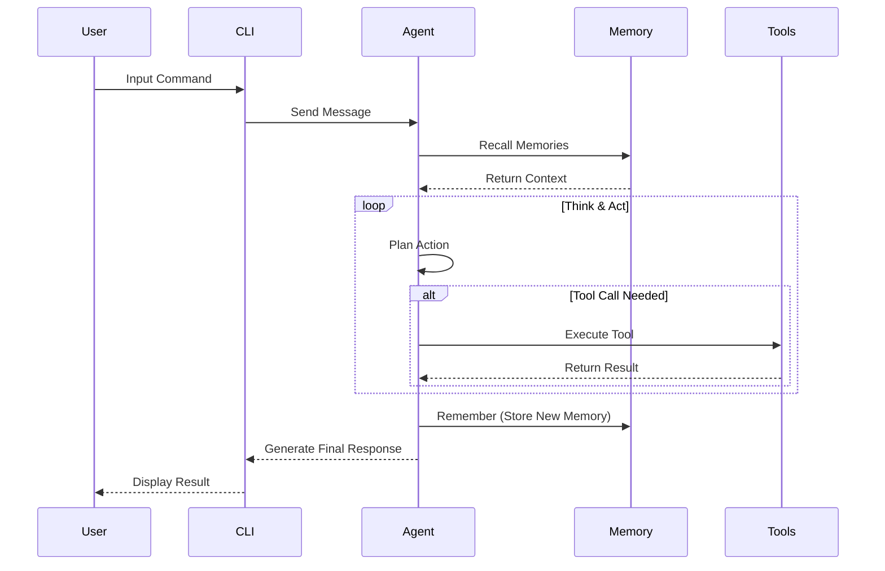
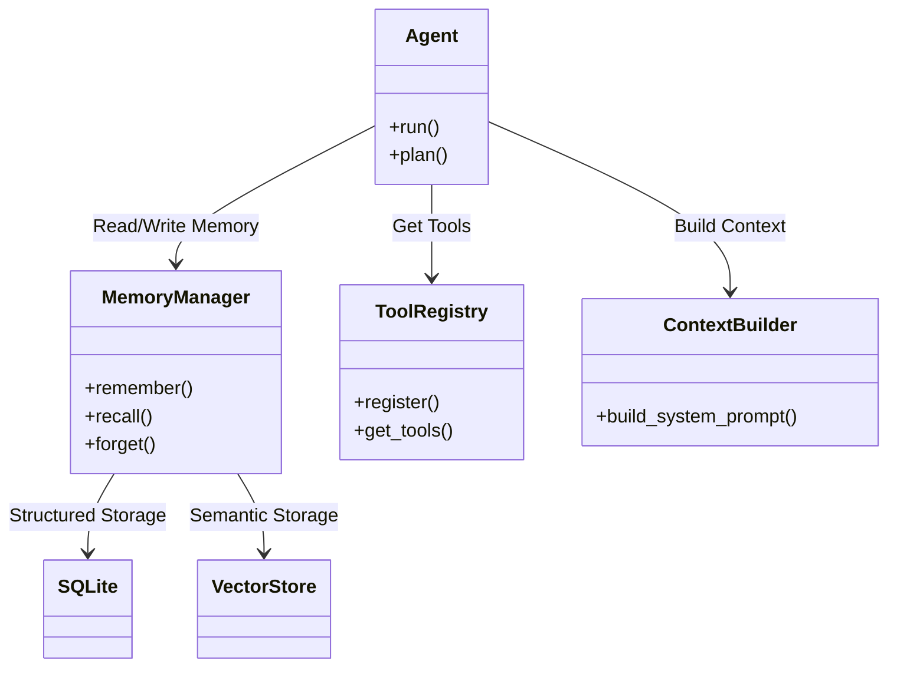

# FinchBot

[](https://opensource.org/licenses/MIT)
[](https://www.python.org/downloads/release/python-3130/)
[](https://github.com/astral-sh/ruff)

**FinchBot** is a lightweight, modular AI Agent framework built on LangChain and LangGraph. It is designed to provide a flexible and scalable foundation for building intelligent assistants with persistent memory, tool usage capabilities, and multi-language support.

[中文文档](README_CN.md) | [English Documentation](docs/en-US/README.md)

## Features

### Memory System

| Feature | Description | Status |
|---------|-------------|--------|
| Layered Storage | SQLite (structured facts) + Vector Store (semantic associations) | Implemented |
| Auto Classification | Automatic classification based on keywords and semantics | Implemented |
| Importance Scoring | Automatic memory importance calculation (0-1) | Implemented |
| Manual Forgetting | Keyword-based deletion/archiving of memories | Implemented |
| Auto Maintenance | Rule-based automatic forgetting mechanism | Not Implemented |

### Tool Ecosystem (11 Built-in Tools)

| Category | Tool | Function |
|----------|------|----------|
| File Operations | read_file | Read local files |
| File Operations | write_file | Write local files |
| File Operations | edit_file | Edit file content |
| File Operations | list_dir | List directory contents |
| Web Capabilities | web_search | Web search (Tavily/Brave/DDG) |
| Web Capabilities | web_extract | Web content extraction |
| Memory Management | remember | Proactively store memories |
| Memory Management | recall | Retrieve memories |
| Memory Management | forget | Delete/archive memories |
| System Control | exec_command | Secure shell execution |
| System Control | session_title | Manage session titles |

### Skill Extension System

| Skill | Function | Status |
|-------|----------|--------|
| skill-creator | Interactive guide for creating new skills | Built-in |
| summarize | Intelligent document/conversation summarization | Built-in |
| weather | Weather query demonstration | Built-in |
| Custom Skills | Define new skills via Markdown | Supported |

### Command Line Interface

| Feature | Description |
|---------|-------------|
| Session Management | Interactively select, rename, and delete history sessions |
| Auto-Title | Automatically generates session titles based on conversation |
| Time Travel | Supports \\rollback and \\back commands to revert conversation state |
| Rich Experience | Markdown rendering, loading animations, syntax highlighting |

### Internationalization Support

| Language | Status |
|----------|--------|
| Simplified Chinese | Full Support |
| Traditional Chinese | Full Support |
| English | Full Support |

### Developer Features

| Feature | Description |
|---------|-------------|
| Type Safety | Comprehensive use of Python Type Hints |
| Code Quality | Ruff formatting + BasedPyright type checking |
| Dependency Management | uv for fast package management |
| Tech Stack | Python 3.13+, LangGraph, Pydantic v2 |

## Key Advantages

| Advantage | Description |
|-----------|-------------|
| Privacy First | Uses FastEmbed locally for vector generation, no cloud upload |
| True Persistence | Structured memory storage with semantic retrieval |
| Production Grade | Double-checked locking, auto-retry, timeout control |
| Flexible Extension | Inherit FinchTool to add new tools |
| Model Agnostic | Supports OpenAI, Anthropic, Gemini, Ollama, etc. |

## Architecture Overview

### System Interaction Flow



### Core Components



## Quick Start

### Prerequisites

| Item | Requirement |
|------|-------------|
| OS | Windows / Linux / macOS |
| Python | 3.13+ |
| Package Manager | uv (Recommended) |

### Installation

1. Clone the repository

```bash
git clone https://github.com/yourusername/finchbot.git
cd finchbot
```

2. Create environment and install dependencies using uv

```bash
uv sync
```

3. Configure environment variables

Copy `.env.example` to `.env` and fill in your API Key

```bash
cp .env.example .env
```

### Usage

Start an interactive chat session

```bash
uv run finchbot chat
```

View help

```bash
uv run finchbot --help
```

## Documentation

| Document | Description |
|----------|-------------|
| [System Architecture](docs/en-US/architecture.md) | Architecture design |
| [User Guide (CLI)](docs/en-US/guide/usage.md) | CLI usage tutorial |
| [API Reference](docs/en-US/api.md) | API reference |
| [Configuration Guide](docs/en-US/config.md) | Configuration options |
| [Extension Guide](docs/en-US/guide/extension.md) | Adding tools/skills |
| [Deployment Guide](docs/en-US/deployment.md) | Deployment instructions |
| [Development Guide](docs/en-US/development.md) | Development environment setup |
| [Contributing Guide](docs/en-US/contributing.md) | Contribution guidelines |

## Contributing

Contributions are welcome! Please read the [Contributing Guide](docs/en-US/contributing.md) for more information.

## License

This project is licensed under the [MIT License](LICENSE).
