# FinchBot — A Lightweight, Flexible, and Infinitely Extensible AI Agent Framework

<p align="center">
  
</p>

<p align="center">
  <em>Built on LangChain v1.2 & LangGraph v1.0<br>
  with persistent memory, dynamic prompts, and seamless tool integration</em>
</p>

<p align="center">
  <a href="https://blog.csdn.net/Yunyi_Chi">
    
  </a>
  <a href="https://github.com/xt765/FinchBot">
    
  </a>
  <a href="https://gitee.com/xt765/FinchBot">
    
  </a>
</p>

<p align="center">
  
  
  
  
  
</p>

**FinchBot** is a lightweight, modular AI Agent framework built on **LangChain v1.2** and **LangGraph v1.0**. It's not just another LLM wrapper—it's a thoughtfully designed architecture focused on three core challenges:

1. **How to enable infinite Agent extensibility?** — Through a dual-layer extension mechanism of Skills and Tools
2. **How to give Agents real memory?** — Through a dual-layer storage architecture + Agentic RAG
3. **How to make Agent behavior customizable?** — Through a dynamic prompt file system

[中文文档](README_CN.md) | [English Documentation](docs/en-US/README.md)

## Table of Contents

1. [Why FinchBot?](#why-finchbot)
2. [System Architecture](#system-architecture)
3. [Core Components](#core-components)
4. [Quick Start](#quick-start)
5. [Tech Stack](#tech-stack)
6. [Extension Guide](#extension-guide)
7. [Documentation](#documentation)

---

## Why FinchBot?

### Pain Points of Existing Frameworks

|           Pain Point           | Traditional Approach         | FinchBot Solution                                  |
| :-----------------------------: | :--------------------------- | :------------------------------------------------- |
|    **Hard to Extend**    | Requires modifying core code | Inherit base class or create Markdown files        |
|    **Fragile Memory**    | Relies on LLM context window | Dual-layer persistent storage + semantic retrieval |
|     **Rigid Prompts**     | Hardcoded in source code     | File system with hot reloading                     |
|     **Slow Startup**     | Synchronous blocking I/O     | Fully async + Thread pool concurrency              |
| **Outdated Architecture** | Based on old LangChain APIs  | LangChain v1.2 + LangGraph v1.0                    |

### Design Philosophy

```mermaid
graph BT
    %% Styles
    classDef roof fill:#ffebee,stroke:#c62828,stroke-width:3px,color:#b71c1c,rx:10,ry:10;
    classDef pillar fill:#e3f2fd,stroke:#1565c0,stroke-width:2px,color:#0d47a1,rx:8,ry:8;
    classDef base fill:#e8f5e9,stroke:#2e7d32,stroke-width:3px,color:#1b5e20,rx:10,ry:10;

    %% Roof
    Roof("🦅 <b>FinchBot Framework</b><br/>Lightweight • Flexible • Extensible"):::roof

    %% Pillars
    subgraph Pillars [Core Philosophy]
        direction LR
        P("🛡️ <b>Privacy First</b><br/>Local Embedding<br/>No Cloud Upload"):::pillar
        M("🧩 <b>Modularity</b><br/>Factory Pattern<br/>Decoupled Design"):::pillar
        D("❤️ <b>Dev Friendly</b><br/>Type Safety<br/>Rich Documentation"):::pillar
        S("⚡ <b>Fast Startup</b><br/>Fully Async<br/>Thread Pool"):::pillar
        O("📦 <b>Out of Box</b><br/>Zero Config<br/>Auto Fallback"):::pillar
    end

    %% Foundation
    Base("🏗️ <b>Tech Foundation</b><br/>LangChain v1.2 • LangGraph v1.0 • Python 3.13"):::base

    %% Connections
    Base === P & M & D & S & O
    P & M & D & S & O === Roof
```



### Web Interface (Beta)

FinchBot now provides a modern Web interface built with React + Vite + FastAPI.

```bash
# Start the backend server
uv run finchbot serve

# In another terminal, start the frontend
cd web
npm install
npm run dev
```

The Web interface supports:

- Real-time chat via WebSocket
- Multi-session management (coming soon)
- Rich text rendering

**Three Commands to Get Started:**

```bash
# Step 1: Configure API keys and default model
uv run finchbot config

# Step 2: Manage your sessions
uv run finchbot sessions

# Step 3: Start chatting
uv run finchbot chat
```

|             Feature             | Description                                                                                               |
| :-----------------------------: | :-------------------------------------------------------------------------------------------------------- |
|   **Three-Step Start**   | `config` → `sessions` → `chat`, complete workflow in three commands                               |
| **Environment Variables** | All configurations can be set via environment variables (`OPENAI_API_KEY`, `ANTHROPIC_API_KEY`, etc.) |
|  **Rich CLI Interface**  | Full-screen keyboard navigation with ↑/↓ arrows, interactive selection                                  |
|     **i18n Support**     | Built-in Chinese/English support, auto-detects system language                                            |
|     **Auto Fallback**     | Web search automatically falls back through Tavily → Brave → DuckDuckGo                                 |
|   **Zero Config Start**   | Just set API key and run `finchbot chat`                                                                |

---

## System Architecture

FinchBot is built on **LangChain v1.2** and **LangGraph v1.0**, serving as an Agent system with persistent memory, dynamic tool scheduling, and multi-platform messaging support.

### Overall Architecture

```mermaid
graph TD
    %% Style Definitions
    classDef userLayer fill:#ffebee,stroke:#c62828,stroke-width:2px,color:#b71c1c;
    classDef factoryLayer fill:#fff9c4,stroke:#fbc02d,stroke-width:2px,color:#f57f17;
    classDef coreLayer fill:#e1f5fe,stroke:#01579b,stroke-width:2px,color:#01579b;
    classDef memoryLayer fill:#e8f5e9,stroke:#2e7d32,stroke-width:2px,color:#1b5e20;
    classDef toolLayer fill:#f3e5f5,stroke:#7b1fa2,stroke-width:2px,color:#7b1fa2;
    classDef channelLayer fill:#fce4ec,stroke:#c2185b,stroke-width:2px,color:#c2185b;
    classDef infraLayer fill:#e0f2f1,stroke:#00695c,stroke-width:2px,color:#00695c;

    %% User Interaction Layer
    subgraph UserLayer [User Interaction Layer]
        direction LR
        CLI[🖥️ CLI Interface]
        WebUI[🌐 Web Interface]
        API[🔌 REST API]
    end
    class CLI,WebUI,API userLayer

    %% Channel System
    subgraph ChannelSystem [Channel System - Multi-Platform Messaging]
        direction TB
        Bus[📨 MessageBus<br/>Async Router]
        CM[🎛️ ChannelManager]
      
        Bus <--> CM
      
        subgraph Channels [Platform Channels]
            WebCh[Web]
            DiscordCh[Discord]
            DingTalkCh[DingTalk]
            FeishuCh[Feishu]
            WeChatCh[WeChat]
            EmailCh[Email]
        end
      
        CM <--> Channels
    end
    class Bus,CM channelLayer
    class WebCh,DiscordCh,DingTalkCh,FeishuCh,WeChatCh,EmailCh channelLayer

    %% Factory Layer
    subgraph FactoryLayer [Factory Layer - Component Assembly]
        direction LR
        AF[🏭 AgentFactory<br/>Agent Assembly]
        TF[🔧 ToolFactory<br/>Tool Creation]
    end
    class AF,TF factoryLayer

    %% Agent Core
    subgraph AgentCore [Agent Core - Intelligence Engine]
        direction TB
        Agent[🧠 LangGraph Agent]
        CB[📝 ContextBuilder]
        SP[📄 System Prompt]
      
        Agent --> CB
        CB --> SP
    end
    class Agent,CB,SP coreLayer

    %% Memory System
    subgraph MemorySystem [Memory System - Dual-Layer Storage]
        direction TB
        MM[💾 MemoryManager]
      
        subgraph Services [Service Layer]
            RS[🔍 RetrievalService]
            CS[📊 ClassificationService]
            IS[⭐ ImportanceScorer]
        end
      
        subgraph Storage [Storage Layer]
            SQLite[(🗄️ SQLite<br/>Source of Truth)]
            Vector[(🧮 VectorStore<br/>Semantic Search)]
        end
      
        MM --> RS & CS & IS
        RS --> SQLite & Vector
        SQLite <--> Vector
    end
    class MM,RS,CS,IS,SQLite,Vector memoryLayer

    %% Tool Ecosystem
    subgraph ToolEcosystem [Tool Ecosystem - 11 Built-in Tools]
        direction TB
        TR[📋 ToolRegistry]
      
        subgraph BuiltInTools [Built-in Tools]
            FileTools[📁 File Ops<br/>read/write/edit/list]
            WebTools[🌐 Network<br/>search/extract]
            MemTools[💾 Memory<br/>remember/recall/forget]
            SysTools[⚙️ System<br/>exec/session_title]
        end
      
        TR --> BuiltInTools
    end
    class TR,FileTools,WebTools,MemTools,SysTools toolLayer

    %% LLM Providers
    subgraph LLMProviders [LLM Providers - Multi-Model Support]
        direction LR
        OpenAI[OpenAI]
        Anthropic[Anthropic]
        DeepSeek[DeepSeek]
        Gemini[Gemini]
        Groq[Groq]
        Moonshot[Moonshot]
    end
    class OpenAI,Anthropic,DeepSeek,Gemini,Groq,Moonshot infraLayer

    %% Connections
    CLI & WebUI --> Bus
    API --> AF
  
    Bus --> AF
    AF --> Agent
    AF --> TF
    TF --> TR
  
    Agent <--> MM
    Agent <--> TR
    Agent --> OpenAI & Anthropic & DeepSeek & Gemini & Groq & Moonshot
```



### Data Flow


### Directory Structure

```
finchbot/
├── agent/              # Agent Core
│   ├── core.py        # Agent creation and execution
│   ├── factory.py     # AgentFactory for component assembly
│   ├── context.py     # ContextBuilder for prompt assembly
│   └── skills.py      # SkillsLoader for Markdown skills
├── channels/           # Multi-Platform Messaging
│   ├── base.py        # BaseChannel abstract class
│   ├── bus.py         # MessageBus async router
│   ├── manager.py     # ChannelManager coordinator
│   └── schema.py      # InboundMessage/OutboundMessage models
├── cli/                # CLI Interface
│   ├── chat_session.py
│   ├── config_manager.py
│   ├── providers.py
│   └── ui.py
├── config/             # Configuration Management
│   ├── loader.py
│   └── schema.py
├── i18n/               # Internationalization
│   ├── loader.py
│   ├── detector.py
│   └── locales/
├── memory/             # Memory System
│   ├── manager.py
│   ├── types.py
│   ├── services/       # Service Layer
│   │   ├── classification.py
│   │   ├── embedding.py
│   │   ├── importance.py
│   │   └── retrieval.py
│   ├── storage/        # Storage Layer
│   │   ├── sqlite.py
│   │   └── vector.py
│   └── vector_sync.py
├── providers/          # LLM Providers
│   └── factory.py
├── server/             # Web Server
│   ├── main.py        # FastAPI application
│   └── loop.py        # AgentLoop for WebSocket
├── sessions/           # Session Management
│   ├── metadata.py
│   ├── selector.py
│   └── title_generator.py
├── skills/             # Skill System
│   ├── skill-creator/
│   ├── summarize/
│   └── weather/
├── tools/              # Tool System
│   ├── base.py
│   ├── factory.py     # ToolFactory for tool creation
│   ├── registry.py
│   ├── filesystem.py
│   ├── memory.py
│   ├── shell.py
│   ├── web.py
│   ├── session_title.py
│   └── search/
└── utils/              # Utility Functions
    ├── logger.py
    └── model_downloader.py
```

---

## Core Components

### 1. Memory Architecture: Dual-Layer Storage + Agentic RAG

FinchBot implements an advanced **dual-layer memory architecture** that solves LLM context window limits and long-term forgetting issues.

#### Why Agentic RAG?

|          Dimension          | Traditional RAG         | Agentic RAG (FinchBot)                       |
| :--------------------------: | :---------------------- | :------------------------------------------- |
| **Retrieval Trigger** | Fixed pipeline          | Agent autonomous decision                    |
| **Retrieval Strategy** | Single vector retrieval | Hybrid retrieval + dynamic weight adjustment |
| **Memory Management** | Passive storage         | Active remember/recall/forget                |
|   **Classification**   | None                    | Auto-classification + importance scoring     |
|  **Update Mechanism**  | Full rebuild            | Incremental sync                             |

#### Dual-Layer Storage Architecture

```mermaid
flowchart TB
    %% Style Definitions
    classDef businessLayer fill:#e3f2fd,stroke:#1565c0,stroke-width:2px,color:#0d47a1;
    classDef serviceLayer fill:#fff9c4,stroke:#fbc02d,stroke-width:2px,color:#f57f17;
    classDef storageLayer fill:#e8f5e9,stroke:#2e7d32,stroke-width:2px,color:#1b5e20;

    subgraph Business [Business Layer]
        MM[💾 MemoryManager<br/>remember/recall/forget]
    end
    class MM businessLayer

    subgraph Services [Service Layer]
        RS[🔍 RetrievalService<br/>Hybrid Retrieval + RRF]
        CS[📊 ClassificationService<br/>Auto Classification]
        IS[⭐ ImportanceScorer<br/>Importance Scoring]
        ES[🧮 EmbeddingService<br/>FastEmbed Local]
    end
    class RS,CS,IS,ES serviceLayer

    subgraph Storage [Storage Layer]
        direction LR
        SQLite[(🗄️ SQLiteStore<br/>Source of Truth<br/>Precise Query)]
        Vector[(🧮 VectorStore<br/>ChromaDB<br/>Semantic Search)]
        DS[🔄 DataSyncManager<br/>Incremental Sync]
    end
    class SQLite,Vector,DS storageLayer

    %% Connections
    MM --> RS & CS & IS
    RS --> SQLite & Vector
    CS --> SQLite
    IS --> SQLite
    ES --> Vector
  
    SQLite <--> DS <--> Vector
```



#### Hybrid Retrieval Strategy

FinchBot uses **Weighted RRF (Weighted Reciprocal Rank Fusion)** strategy:

```python
class QueryType(StrEnum):
    """Query type determines retrieval weights"""
    KEYWORD_ONLY = "keyword_only"      # Pure keyword (1.0/0.0)
    SEMANTIC_ONLY = "semantic_only"    # Pure semantic (0.0/1.0)
    FACTUAL = "factual"                # Factual (0.8/0.2)
    CONCEPTUAL = "conceptual"          # Conceptual (0.2/0.8)
    COMPLEX = "complex"                # Complex (0.5/0.5)
    AMBIGUOUS = "ambiguous"            # Ambiguous (0.3/0.7)
```

### 2. Dynamic Prompt System: User-Editable Agent Brain

FinchBot's prompt system uses **file system + modular assembly** design.

#### Bootstrap File System

```
~/.finchbot/
├── SYSTEM.md           # Role definition
├── MEMORY_GUIDE.md     # Memory usage guide
├── SOUL.md             # Personality settings
├── AGENT_CONFIG.md     # Agent configuration
└── workspace/
    └── skills/         # Custom skills
```

#### Prompt Loading Flow

```mermaid
flowchart TD
    %% Style Definitions
    classDef startEnd fill:#ffebee,stroke:#c62828,stroke-width:2px,color:#b71c1c;
    classDef process fill:#e3f2fd,stroke:#1565c0,stroke-width:2px,color:#0d47a1;
    classDef file fill:#fff9c4,stroke:#fbc02d,stroke-width:2px,color:#f57f17;
    classDef output fill:#e8f5e9,stroke:#2e7d32,stroke-width:2px,color:#1b5e20;

    A([🚀 Agent Startup]):::startEnd --> B[📂 Load Bootstrap Files]:::process
  
    B --> C[SYSTEM.md]:::file
    B --> D[MEMORY_GUIDE.md]:::file
    B --> E[SOUL.md]:::file
    B --> F[AGENT_CONFIG.md]:::file

    C --> G[🔧 Assemble Prompt]:::process
    D --> G
    E --> G
    F --> G

    G --> H[📚 Load Always-on Skills]:::process
    H --> I[🏗️ Build Skill Summary XML]:::process
    I --> J[📋 Generate Tool Docs]:::process
    J --> K[⚙️ Inject Runtime Info]:::process
    K --> L[📝 Complete System Prompt]:::output

    L --> M([📤 Send to LLM]):::startEnd
```



### 3. Tool System: Code-Level Capability Extension

Tools are the bridge for Agent to interact with the external world. FinchBot provides 11 built-in tools with easy extension.

#### Tool System Architecture

```mermaid
flowchart TB
    %% Style Definitions
    classDef registry fill:#e3f2fd,stroke:#1565c0,stroke-width:2px,color:#0d47a1;
    classDef builtin fill:#e8f5e9,stroke:#2e7d32,stroke-width:2px,color:#1b5e20;
    classDef custom fill:#fff9c4,stroke:#fbc02d,stroke-width:2px,color:#f57f17;
    classDef agent fill:#f3e5f5,stroke:#7b1fa2,stroke-width:2px,color:#7b1fa2;

    subgraph Registry [Tool Registry Center]
        TR[📋 ToolRegistry<br/>Global Registry]
        Lock[🔒 Double-checked Lock<br/>Thread Safe Singleton]
    end
    class TR,Lock registry

    subgraph BuiltIn [Built-in Tools - 11 Total]
        direction TB
        File[📁 File Operations<br/>read_file / write_file<br/>edit_file / list_dir]
        Web[🌐 Network<br/>web_search / web_extract]
        Memory[💾 Memory<br/>remember / recall / forget]
        System[⚙️ System<br/>exec / session_title]
    end
    class File,Web,Memory,System builtin

    subgraph Custom [Custom Extension]
        Inherit[📝 Inherit FinchTool<br/>Implement _run()]
        Register[✅ Register to Registry]
    end
    class Inherit,Register custom

    Agent[🧠 Agent Call]:::agent

    TR --> Lock
    Lock --> BuiltIn
    Lock --> Custom

    File --> Agent
    Web --> Agent
    Memory --> Agent
    System --> Agent
    Register --> Agent
```

#### Built-in Tools

|      Category      | Tool              | Function                      |
| :----------------: | :---------------- | :---------------------------- |
| **File Ops** | `read_file`     | Read local files              |
|                    | `write_file`    | Write local files             |
|                    | `edit_file`     | Edit file content             |
|                    | `list_dir`      | List directory contents       |
| **Network** | `web_search`    | Web search (Tavily/Brave/DDG) |
|                    | `web_extract`   | Web content extraction        |
|  **Memory**  | `remember`      | Proactively store memories    |
|                    | `recall`        | Retrieve memories             |
|                    | `forget`        | Delete/archive memories       |
|  **System**  | `exec`          | Secure shell execution        |
|                    | `session_title` | Manage session titles         |

#### Web Search: Three-Engine Fallback Design

```mermaid
flowchart TD
    %% Style Definitions
    classDef check fill:#fff9c4,stroke:#fbc02d,stroke-width:2px,color:#f57f17;
    classDef engine fill:#e8f5e9,stroke:#2e7d32,stroke-width:2px,color:#1b5e20;
    classDef fallback fill:#e3f2fd,stroke:#1565c0,stroke-width:2px,color:#0d47a1;

    Start[🔍 Web Search Request]:::check
  
    Check1{TAVILY_API_KEY<br/>Set?}:::check
    Tavily[🚀 Tavily<br/>Best Quality<br/>AI-Optimized]:::engine
  
    Check2{BRAVE_API_KEY<br/>Set?}:::check
    Brave[🦁 Brave Search<br/>Privacy Friendly<br/>Large Free Tier]:::engine
  
    DDG[🦆 DuckDuckGo<br/>Zero Config<br/>Always Available]:::fallback

    Start --> Check1
    Check1 -->|Yes| Tavily
    Check1 -->|No| Check2
    Check2 -->|Yes| Brave
    Check2 -->|No| DDG
```



| Priority |         Engine         |   API Key   | Features                                |
| :------: | :--------------------: | :----------: | :-------------------------------------- |
|    1    |    **Tavily**    |   Required   | Best quality, AI-optimized, deep search |
|    2    | **Brave Search** |   Required   | Large free tier, privacy-friendly       |
|    3    |  **DuckDuckGo**  | Not required | Always available, zero config           |

**How it works**:

1. If `TAVILY_API_KEY` is set → Use Tavily (best quality)
2. Else if `BRAVE_API_KEY` is set → Use Brave Search
3. Else → Use DuckDuckGo (no API key needed, always works)

This design ensures **web search works out of the box** even without any API key configuration!

#### Session Title: Smart Naming, Out of the Box

The `session_title` tool embodies FinchBot's out-of-the-box philosophy:

|         Method         | Description                                                        | Example                                  |
| :---------------------: | :----------------------------------------------------------------- | :--------------------------------------- |
| **Auto Generate** | After 2-3 turns, AI automatically generates title based on content | "Python Async Programming Discussion"    |
| **Agent Modify** | Tell Agent "Change session title to XXX"                           | Agent calls tool to modify automatically |
| **Manual Rename** | Press `r` key in session manager to rename                       | User manually enters new title           |

This design lets users **manage sessions without technical details**—whether automatic or manual.

### 4. Skill System: Define Agent Capabilities with Markdown

Skills are FinchBot's unique innovation—**defining Agent capabilities through Markdown files**.

#### Key Feature: Agent Auto-Creates Skills

FinchBot includes a built-in **skill-creator** skill, the ultimate expression of the out-of-the-box philosophy:

> **Just tell the Agent what skill you want, and it will create it automatically!**

```
User: Help me create a translation skill that can translate Chinese to English

Agent: Okay, I'll create a translation skill for you...
       [Invokes skill-creator skill]
       ✅ Created skills/translator/SKILL.md
       You can now use the translation feature directly!
```

No manual file creation, no coding—**extend Agent capabilities with just one sentence**!

#### Skill File Structure

```
skills/
├── skill-creator/        # Skill creator (Built-in) - Core of out-of-the-box
│   └── SKILL.md
├── summarize/            # Intelligent summarization (Built-in)
│   └── SKILL.md
├── weather/              # Weather query (Built-in)
│   └── SKILL.md
└── my-custom-skill/      # Agent auto-created or user-defined
    └── SKILL.md
```

#### Core Design Highlights

|            Feature            | Description                                       |
| :---------------------------: | :------------------------------------------------ |
|  **Agent Auto-Create**  | Tell Agent your needs, auto-generates skill files |
|  **Dual Skill Source**  | Workspace skills first, built-in skills fallback  |
|  **Dependency Check**  | Auto-check CLI tools and environment variables    |
| **Cache Invalidation** | Smart caching based on file modification time     |
| **Progressive Loading** | Always-on skills first, others on demand          |

### 5. Channel System: Multi-Platform Messaging

FinchBot's Channel system provides unified messaging across multiple platforms.

```mermaid
flowchart LR
    %% Style Definitions
    classDef bus fill:#e3f2fd,stroke:#1565c0,stroke-width:2px,color:#0d47a1;
    classDef manager fill:#fff9c4,stroke:#fbc02d,stroke-width:2px,color:#f57f17;
    classDef channel fill:#e8f5e9,stroke:#2e7d32,stroke-width:2px,color:#1b5e20;

    subgraph Core [Message Routing Core]
        Bus[📨 MessageBus<br/>Inbound/Outbound Queues]:::bus
        CM[🎛️ ChannelManager<br/>Channel Coordination]:::manager
    end

    subgraph Platforms [Platform Channels]
        direction TB
        Web[🌐 Web<br/>WebSocket]
        Discord[💬 Discord<br/>Bot API]
        DingTalk[📱 DingTalk<br/>Webhook]
        Feishu[🪶 Feishu<br/>Bot API]
        WeChat[💚 WeChat<br/>Enterprise]
        Email[📧 Email<br/>SMTP/IMAP]
    end
    class Web,Discord,DingTalk,Feishu,WeChat,Email channel

    Bus <--> CM
    CM <--> Web & Discord & DingTalk & Feishu & WeChat & Email
```



#### Channel Architecture

|         Component         | Description                                       |
| :-----------------------: | :------------------------------------------------ |
|   **BaseChannel**   | Abstract base class defining channel interface    |
|   **MessageBus**   | Async message router with inbound/outbound queues |
| **ChannelManager** | Coordinates multiple channels and message routing |
| **InboundMessage** | Standardized incoming message format              |
| **OutboundMessage** | Standardized outgoing message format              |

### 6. LangChain v1.2 Architecture Practice

FinchBot is built on **LangChain v1.2** and **LangGraph v1.0**, using the latest Agent architecture.

```python
from langchain.agents import create_agent
from langgraph.checkpoint.sqlite import SqliteSaver

def create_finch_agent(
    model: BaseChatModel,
    workspace: Path,
    tools: Sequence[BaseTool] | None = None,
    use_persistent: bool = True,
) -> tuple[CompiledStateGraph, SqliteSaver | MemorySaver]:

    # 1. Initialize checkpoint (persistent state)
    if use_persistent:
        checkpointer = SqliteSaver.from_conn_string(str(db_path))
    else:
        checkpointer = MemorySaver()

    # 2. Build system prompt
    system_prompt = build_system_prompt(workspace)

    # 3. Create Agent (using LangChain official API)
    agent = create_agent(
        model=model,
        tools=list(tools) if tools else None,
        system_prompt=system_prompt,
        checkpointer=checkpointer,
    )

    return agent, checkpointer
```

#### Supported LLM Providers

| Provider | Models                      | Features                  |
| :-------: | :-------------------------- | :------------------------ |
|  OpenAI  | GPT-5, GPT-5.2, O3-mini     | Best overall capability   |
| Anthropic | Claude Sonnet 4.5, Opus 4.6 | High safety, long context |
| DeepSeek | DeepSeek Chat, Reasoner     | Chinese, cost-effective   |
|  Gemini  | Gemini 2.5 Flash            | Google's latest           |
|   Groq   | Llama 4 Scout/Maverick      | Ultra-fast inference      |
| Moonshot | Kimi K1.5/K2.5              | Long context, Chinese     |

---

## Quick Start

### Prerequisites

|      Item      | Requirement             |
| :-------------: | :---------------------- |
|       OS       | Windows / Linux / macOS |
|     Python     | 3.13+                   |
| Package Manager | uv (Recommended)        |

### Installation

```bash
# Clone repository (choose one)
# Gitee (recommended for users in China)
git clone https://gitee.com/xt765/finchbot.git
# or GitHub
git clone https://github.com/xt765/finchbot.git

cd finchbot

# Install dependencies
uv sync
```

> **Note**: The embedding model (~95MB) will be automatically downloaded to the local cache when you run the application for the first time (e.g., `finchbot chat`). No manual intervention required.

<details>
<summary>Development Installation</summary>

For development, install with dev dependencies:

```bash
uv sync --extra dev
```

This includes: pytest, ruff, basedpyright

</details>

### Best Practice: Three Commands to Get Started

```bash
# Step 1: Configure API keys and default model
uv run finchbot config

# Step 2: Manage your sessions
uv run finchbot sessions

# Step 3: Start chatting
uv run finchbot chat
```

That's it! These three commands cover the complete workflow:

- `finchbot config` — Interactive configuration for LLM providers, API keys, and settings
- `finchbot sessions` — Full-screen session manager for creating, renaming, deleting sessions
- `finchbot chat` — Start or continue an interactive conversation

### Alternative: Environment Variables

```bash
# Or set environment variables directly
export OPENAI_API_KEY="your-api-key"
uv run finchbot chat
```

### Log Level Control

```bash
# Default: Show WARNING and above logs
finchbot chat

# Show INFO and above logs
finchbot -v chat

# Show DEBUG and above logs (debug mode)
finchbot -vv chat
```

### Optional: Download Local Embedding Model

```bash
# For memory system semantic search (optional but recommended)
uv run finchbot models download
```

### Create Custom Skill

```bash
# Create skill directory
mkdir -p ~/.finchbot/workspace/skills/my-skill

# Create skill file
cat > ~/.finchbot/workspace/skills/my-skill/SKILL.md << 'EOF'
---
name: my-skill
description: My custom skill
metadata:
  finchbot:
    emoji: ✨
    always: false
---

# My Custom Skill

When user requests XXX, I should...
EOF
```

---

## Tech Stack

|       Layer       | Technology        | Version |
| :----------------: | :---------------- | :------: |
|   Core Language   | Python            |  3.13+  |
|  Agent Framework  | LangChain         | 1.2.10+ |
|  State Management  | LangGraph         |  1.0.8+  |
|  Data Validation  | Pydantic          |    v2    |
|   Vector Storage   | ChromaDB          |  0.5.0+  |
|  Local Embedding  | FastEmbed         |  0.4.0+  |
| Search Enhancement | BM25              |  0.2.2+  |
|   CLI Framework   | Typer             | 0.23.0+ |
|     Rich Text     | Rich              | 14.3.0+ |
|      Logging      | Loguru            |  0.7.3+  |
|   Configuration   | Pydantic Settings | 2.12.0+ |
|    Web Backend    | FastAPI           | 0.115.0+ |
|    Web Frontend    | React + Vite      |  Latest  |

---

## Extension Guide

### Adding New Tools

Inherit `FinchTool` base class, implement `_run()` method, then register with `ToolRegistry`.

### Adding New Skills

Create a `SKILL.md` file in `~/.finchbot/workspace/skills/{skill-name}/`.

### Adding New LLM Providers

Add a new Provider class in `providers/factory.py`.

### Adding New Languages

Add a new `.toml` file under `i18n/locales/`.

### Adding New Channels

Inherit `BaseChannel` class, implement required methods, register with `ChannelManager`.

---

## Key Advantages

|          Advantage          | Description                                                                |
| :--------------------------: | :------------------------------------------------------------------------- |
|   **Privacy First**   | Uses FastEmbed locally for vector generation, no cloud upload              |
|  **True Persistence**  | Dual-layer memory storage with semantic retrieval and precise queries      |
|  **Production Ready**  | Double-checked locking, auto-retry, timeout control mechanisms             |
| **Flexible Extension** | Inherit FinchTool or create SKILL.md to extend without modifying core code |
|   **Model Agnostic**   | Supports OpenAI, Anthropic, Gemini, DeepSeek, Moonshot, Groq, etc.         |
|    **Thread Safe**    | Tool registration uses double-checked locking pattern                      |
|   **Multi-Platform**   | Channel system supports Web, Discord, DingTalk, Feishu, WeChat, Email      |

---

## Documentation

| Document                                      | Description                   |
| :-------------------------------------------- | :---------------------------- |
| [User Guide](docs/en-US/guide/usage.md)          | CLI usage tutorial            |
| [API Reference](docs/en-US/api.md)               | API reference                 |
| [Configuration Guide](docs/en-US/config.md)      | Configuration options         |
| [Extension Guide](docs/en-US/guide/extension.md) | Adding tools/skills           |
| [Architecture](docs/en-US/architecture.md)       | System architecture           |
| [Deployment Guide](docs/en-US/deployment.md)     | Deployment instructions       |
| [Development Guide](docs/en-US/development.md)   | Development environment setup |
| [Contributing Guide](docs/en-US/contributing.md) | Contribution guidelines       |

---

## Contributing

Contributions are welcome! Please read the [Contributing Guide](docs/en-US/contributing.md) for more information.

---

## License

This project is licensed under the [MIT License](LICENSE).

---

## Star History

If this project is helpful to you, please give it a Star ⭐️
