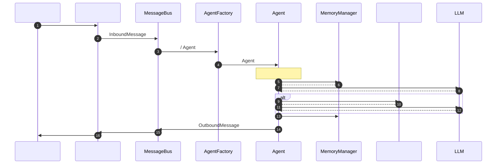
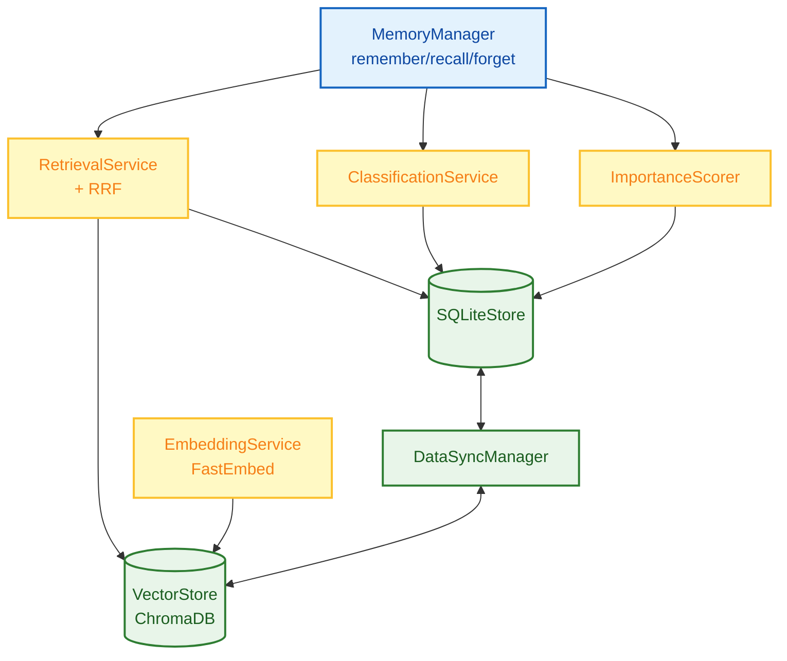
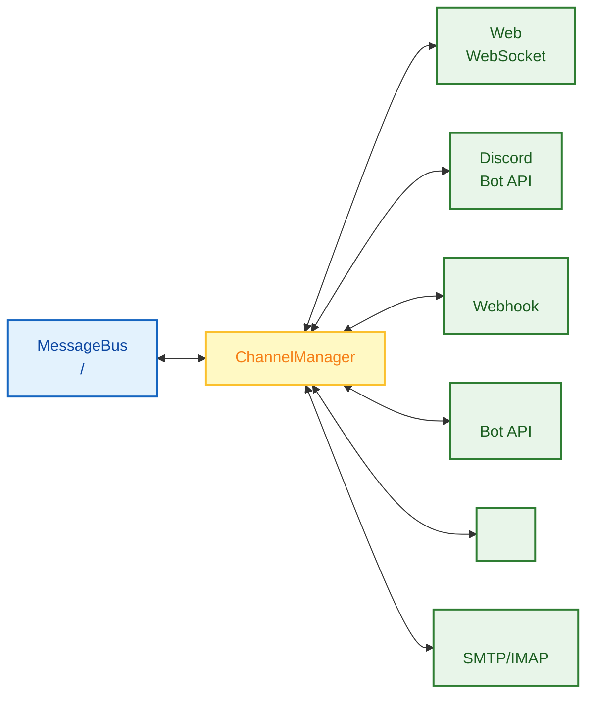

# FinchBot () —  AI Agent 

<p align="center">
  
</p>

<p align="center">
  <em> LangChain v1.2  LangGraph v1.0 <br>
  </em>
</p>

<p align="center">
  <a href="https://blog.csdn.net/Yunyi_Chi">
    
  </a>
  <a href="https://github.com/xt765/FinchBot">
    
  </a>
  <a href="https://gitee.com/xt765/FinchBot">
    
  </a>
</p>

<p align="center">
  
  
  
  
  
</p>

**FinchBot ()**  AI Agent  **LangChain v1.2**  **LangGraph v1.0**  LLM 

1. ** Agent ** —  (Skill)  (Tool) 
2. ** Agent ** —  + Agentic RAG
3. ** Agent ** — 

[](docs/zh-CN/README.md) | [English Documentation](README.md)

## 

1. [ FinchBot](#-finchbot)
2. [](#)
3. [](#)
4. [](#)
5. [](#)
6. [](#)
7. [](#)

---

##  FinchBot

### 

|                  |                 | FinchBot                    |
| :------------------: | :---------------------- | :------------------------------ |
|  ****  |         |  Markdown     |
|  ****  |  LLM      |  +        |
| **** |           |                 |
|  ****  |             |  +    |
|  ****  |  LangChain  API | LangChain v1.2 + LangGraph v1.0 |

### 

```mermaid
graph BT
    classDef roof fill:#ffebee,stroke:#c62828,stroke-width:3px,color:#b71c1c,rx:10,ry:10;
    classDef pillar fill:#e3f2fd,stroke:#1565c0,stroke-width:2px,color:#0d47a1,rx:8,ry:8;
    classDef base fill:#e8f5e9,stroke:#2e7d32,stroke-width:3px,color:#1b5e20,rx:10,ry:10;

    Roof("FinchBot Framework<br/> •  • "):::roof

    subgraph Pillars []
        direction LR
        P("<br/> Embedding<br/>"):::pillar
        M("<br/><br/>"):::pillar
        D("<br/><br/>"):::pillar
        S("<br/><br/>"):::pillar
        O("<br/><br/>"):::pillar
    end

    Base("<br/>LangChain v1.2 • LangGraph v1.0 • Python 3.13"):::base

    Base === P & M & D & S & O
    P & M & D & S & O === Roof
```

### 

FinchBot 

     

### Web  (Beta)

FinchBot  React + Vite + FastAPI  Web 

```bash
# 
uv run finchbot serve

# 
cd web
npm install
npm run dev
```

Web 
- WebSocket 
-  ()
- 

### 

FinchBot 

```bash
#  API 
uv run finchbot config

# 
uv run finchbot sessions

# 
uv run finchbot chat
```

|                    |                                                                          |
| :---------------------: | :--------------------------------------------------------------------------- |
| **** | `OPENAI_API_KEY``ANTHROPIC_API_KEY`  |
|  **i18n **  |                                              |
|   ****   | Tavily → Brave → DuckDuckGo                              |

---

## 

FinchBot  **LangChain v1.2** + **LangGraph v1.0**  Agent 

### 

```mermaid
graph TB
    subgraph UI []
        CLI[CLI ]
        Web[Web ]
        API[REST API]
        Channels[<br/>Discord//]
    end

    subgraph Core [Agent ]
        Agent[LangGraph Agent<br/>]
        Context[ContextBuilder<br/>]
        Tools[ToolRegistry<br/>11]
        Memory[MemoryManager<br/>]
    end

    subgraph Infra []
        Storage[<br/>SQLite + VectorStore]
        LLM[LLM <br/>OpenAI/Anthropic/DeepSeek]
    end

    CLI --> Agent
    Web --> Agent
    API --> Agent
    Channels --> Agent

    Agent --> Context
    Agent <--> Tools
    Agent <--> Memory

    Memory --> Storage
    Agent --> LLM
```

### 



### 

```
finchbot/
 agent/              # Agent 
    core.py        # Agent 
    factory.py     # AgentFactory 
    context.py     # ContextBuilder 
    skills.py      # SkillsLoader Markdown 
 channels/           # 
    base.py        # BaseChannel 
    bus.py         # MessageBus 
    manager.py     # ChannelManager 
    schema.py      # InboundMessage/OutboundMessage 
 cli/                # 
    chat_session.py
    config_manager.py
    providers.py
    ui.py
 config/             # 
    loader.py
    schema.py
 i18n/               # 
    loader.py
    detector.py
    locales/
 memory/             # 
    manager.py
    types.py
    services/       # 
       classification.py
       embedding.py
       importance.py
       retrieval.py
    storage/        # 
       sqlite.py
       vector.py
    vector_sync.py
 providers/          # LLM 
    factory.py
 server/             # Web 
    main.py        # FastAPI 
    loop.py        # AgentLoop WebSocket 
 sessions/           # 
    metadata.py
    selector.py
    title_generator.py
 skills/             # 
    skill-creator/
    summarize/
    weather/
 tools/              # 
    base.py
    factory.py     # ToolFactory 
    registry.py
    filesystem.py
    memory.py
    shell.py
    web.py
    session_title.py
    search/
 utils/              # 
     logger.py
     model_downloader.py
```

---

## 

### 1.  + Agentic RAG

FinchBot **** LLM 

####  Agentic RAG

|            |  RAG     | Agentic RAG (FinchBot)      |
| :----------------: | :----------- | :-------------------------- |
| **** |      | Agent               |
| **** |  |  +      |
| **** |      |  remember/recall/forget |
| **** |            |  +        |
| **** |      |                     |

#### 



#### 

FinchBot ** RRF (Weighted Reciprocal Rank Fusion)** 

```python
class QueryType(StrEnum):
    """"""
    KEYWORD_ONLY = "keyword_only"      #  (1.0/0.0)
    SEMANTIC_ONLY = "semantic_only"    #  (0.0/1.0)
    FACTUAL = "factual"                #  (0.8/0.2)
    CONCEPTUAL = "conceptual"          #  (0.2/0.8)
    COMPLEX = "complex"                #  (0.5/0.5)
    AMBIGUOUS = "ambiguous"            #  (0.3/0.7)
```

### 2.  Agent 

FinchBot ** + **

#### Bootstrap 

```
~/.finchbot/
 SYSTEM.md           # 
 MEMORY_GUIDE.md     # 
 SOUL.md             # 
 AGENT_CONFIG.md     # Agent 
 workspace/
     skills/         # 
```

#### 

```mermaid
flowchart TD
    classDef startEnd fill:#ffebee,stroke:#c62828,stroke-width:2px,color:#b71c1c;
    classDef process fill:#e3f2fd,stroke:#1565c0,stroke-width:2px,color:#0d47a1;
    classDef file fill:#fff9c4,stroke:#fbc02d,stroke-width:2px,color:#f57f17;
    classDef output fill:#e8f5e9,stroke:#2e7d32,stroke-width:2px,color:#1b5e20;

    A([Agent ]):::startEnd --> B[ Bootstrap ]:::process
    
    B --> C[SYSTEM.md]:::file
    B --> D[MEMORY_GUIDE.md]:::file
    B --> E[SOUL.md]:::file
    B --> F[AGENT_CONFIG.md]:::file

    C --> G[]:::process
    D --> G
    E --> G
    F --> G

    G --> H[]:::process
    H --> I[ XML]:::process
    I --> J[]:::process
    J --> K[]:::process
    K --> L[]:::output

    L --> M([ LLM]):::startEnd
```

### 3. 

 Agent FinchBot  11 

#### 

```mermaid
flowchart TB
    classDef registry fill:#e3f2fd,stroke:#1565c0,stroke-width:2px,color:#0d47a1;
    classDef builtin fill:#e8f5e9,stroke:#2e7d32,stroke-width:2px,color:#1b5e20;
    classDef custom fill:#fff9c4,stroke:#fbc02d,stroke-width:2px,color:#f57f17;
    classDef agent fill:#f3e5f5,stroke:#7b1fa2,stroke-width:2px,color:#7b1fa2;

    TR[ToolRegistry<br/>]:::registry
    Lock[<br/>]:::registry

    File[<br/>read_file / write_file<br/>edit_file / list_dir]:::builtin
    Web[<br/>web_search / web_extract]:::builtin
    Memory[<br/>remember / recall / forget]:::builtin
    System[<br/>exec / session_title]:::builtin

    Inherit[ FinchTool<br/> _run()]:::custom
    Register[ Registry]:::custom

    Agent[Agent ]:::agent

    TR --> Lock
    Lock --> File & Web & Memory & System
    Lock --> Inherit --> Register

    File --> Agent
    Web --> Agent
    Memory --> Agent
    System --> Agent
    Register --> Agent
```

#### 

|                |               |                         |
| :----------------: | :---------------- | :-------------------------- |
| **** | `read_file`     |                 |
|                    | `write_file`    |                 |
|                    | `edit_file`     |                 |
|                    | `list_dir`      |                 |
| **** | `web_search`    |  (Tavily/Brave/DDG) |
|                    | `web_extract`   |                 |
| **** | `remember`      |                 |
|                    | `recall`        |                     |
|                    | `forget`        | /               |
| **** | `exec`          |  Shell          |
|                    | `session_title` |                 |

#### 

```mermaid
flowchart TD
    classDef check fill:#fff9c4,stroke:#fbc02d,stroke-width:2px,color:#f57f17;
    classDef engine fill:#e8f5e9,stroke:#2e7d32,stroke-width:2px,color:#1b5e20;
    classDef fallback fill:#e3f2fd,stroke:#1565c0,stroke-width:2px,color:#0d47a1;

    Start[]:::check
    
    Check1{TAVILY_API_KEY<br/>?}:::check
    Tavily[Tavily<br/><br/>AI ]:::engine
    
    Check2{BRAVE_API_KEY<br/>?}:::check
    Brave[Brave Search<br/><br/>]:::engine
    
    DDG[DuckDuckGo<br/><br/>]:::fallback

    Start --> Check1
    Check1 -->|| Tavily
    Check1 -->|| Check2
    Check2 -->|| Brave
    Check2 -->|| DDG
```

|  |                    | API Key |                              |
| :----: | :--------------------: | :-----: | :------------------------------- |
|   1   |    **Tavily**    |    |  AI  |
|   2   | **Brave Search** |    |              |
|   3   |  **DuckDuckGo**  |    |                  |

****

1.  `TAVILY_API_KEY` →  Tavily
2.  `BRAVE_API_KEY` →  Brave Search
3.  →  DuckDuckGo API Key

** API Key **

#### 

`session_title`  FinchBot 

|              |                                    |                    |
| :------------------: | :------------------------------------- | :--------------------- |
|  ****  |  2-3 AI  | "Python "  |
| **Agent ** |  Agent " XXX"        | Agent  |
| **** |  `r`         |      |

****

### 4.  Markdown  Agent 

 FinchBot ——** Markdown  Agent **

#### Agent 

FinchBot  **skill-creator** 

> ** Agent Agent **

```
: 

Agent: ...
       [ skill-creator ]
         skills/translator/SKILL.md
       
```

** Agent **

#### 

```
skills/
 skill-creator/        # - 
    SKILL.md
 summarize/            # 
    SKILL.md
 weather/              # 
    SKILL.md
 my-custom-skill/      # Agent 
     SKILL.md
```

#### 

|                      |                               |
| :----------------------: | :-------------------------------- |
| **Agent ** |  Agent  |
|   ****   |       |
|    ****    |  CLI        |
|  ****  |         |
|   ****   |         |

### 5. 

FinchBot 



#### 

|        |                          |
| :--------: | :--------------------------- |
| **BaseChannel** |        |
| **MessageBus** | / |
| **ChannelManager** |          |
| **InboundMessage** |            |
| **OutboundMessage** |            |

### 6. LangChain 1.2 

FinchBot  **LangChain v1.2**  **LangGraph v1.0**  Agent 

```python
from langchain.agents import create_agent
from langgraph.checkpoint.sqlite import SqliteSaver

def create_finch_agent(
    model: BaseChatModel,
    workspace: Path,
    tools: Sequence[BaseTool] | None = None,
    use_persistent: bool = True,
) -> tuple[CompiledStateGraph, SqliteSaver | MemorySaver]:

    # 1. 
    if use_persistent:
        checkpointer = SqliteSaver.from_conn_string(str(db_path))
    else:
        checkpointer = MemorySaver()

    # 2. 
    system_prompt = build_system_prompt(workspace)

    # 3.  Agent LangChain  API
    agent = create_agent(
        model=model,
        tools=list(tools) if tools else None,
        system_prompt=system_prompt,
        checkpointer=checkpointer,
    )

    return agent, checkpointer
```

####  LLM 

|    |                         |              |
| :-------: | :-------------------------- | :--------------- |
|  OpenAI  | GPT-5, GPT-5.2, O3-mini     |      |
| Anthropic | Claude Sonnet 4.5, Opus 4.6 |  |
| DeepSeek | DeepSeek Chat, Reasoner     |    |
|  Gemini  | Gemini 2.5 Flash            | Google       |
|   Groq   | Llama 4 Scout/Maverick      |          |
| Moonshot | Kimi K1.5/K2.5              |      |

---

## 

### 

|      |                     |
| :------: | :---------------------- |
|  | Windows / Linux / macOS |
|  Python  | 3.13+                   |
|  | uv ()               |

### 

```bash
# 
# Gitee
git clone https://gitee.com/xt765/finchbot.git
#  GitHub
git clone https://github.com/xt765/finchbot.git

cd finchbot

# 
uv sync
```

> **** 95MB `finchbot chat`

<details>
<summary></summary>


```bash
uv sync --extra dev
```

pytestruffbasedpyright

</details>

### 

```bash
#  API 
uv run finchbot config

# 
uv run finchbot sessions

# 
uv run finchbot chat
```


- `finchbot config` —  LLM API 
- `finchbot sessions` — 
- `finchbot chat` — 

### Docker 

FinchBot  Docker 

```bash
# 
git clone https://gitee.com/xt765/finchbot.git
cd finchbot

#  .env  API 
cp .env.example .env
#  .env  API 

# 
docker-compose up -d

#  Web 
# http://localhost:8000
```

|  |  |
| :--: | :--- |
| **** | `docker-compose up -d` |
| **** |  |
| **** |  |
| **** |  x86_64  ARM64 |

### 

```bash
# 
export OPENAI_API_KEY="your-api-key"
uv run finchbot chat
```

### 

```bash
#  WARNING 
finchbot chat

#  INFO 
finchbot -v chat

#  DEBUG 
finchbot -vv chat
```

### 

```bash
# 
uv run finchbot models download
```

### 

```bash
# 
mkdir -p ~/.finchbot/workspace/skills/my-skill

# 
cat > ~/.finchbot/workspace/skills/my-skill/SKILL.md << 'EOF'
---
name: my-skill
description: 
metadata:
  finchbot:
    emoji: 
    always: false
---

# 

 XXX ...
EOF
```

---

## 

|        |               |    |
| :--------: | :---------------- | :-----: |
|    | Python            |  3.13+  |
| Agent  | LangChain         | 1.2.10+ |
|    | LangGraph         | 1.0.8+ |
|    | Pydantic          |   v2   |
|    | ChromaDB          | 0.5.0+ |
|    | FastEmbed         | 0.4.0+ |
|    | BM25              | 0.2.2+ |
|  CLI   | Typer             | 0.23.0+ |
|      | Rich              | 14.3.0+ |
|        | Loguru            | 0.7.3+ |
|    | Pydantic Settings | 2.12.0+ |
| Web   | FastAPI           | 0.115.0+ |
| Web   | React + Vite      | Latest  |

---

## 

### 

 `FinchTool`  `_run()`  `ToolRegistry`

### 

 `~/.finchbot/workspace/skills/{skill-name}/`  `SKILL.md` 

###  LLM 

 `providers/factory.py`  Provider 

### 

 `i18n/locales/`  `.toml` 

### 

 `BaseChannel`  `ChannelManager`

---

## 

|                  |                                                         |
| :------------------: | :---------------------------------------------------------- |
|  ****  |  FastEmbed                |
|  ****  |                     |
| **** |                           |
|  ****  |  FinchTool  SKILL.md    |
|  ****  |  OpenAI, Anthropic, Gemini, DeepSeek, Moonshot, Groq  |
|  ****  |                       |
| **** |  WebDiscord           |

---

## 

|                                    |           |
| :------------------------------------- | :------------ |
| [](docs/zh-CN/guide/usage.md)     | CLI   |
| [API ](docs/zh-CN/api.md)         | API       |
| [](docs/zh-CN/config.md)          |     |
| [](docs/zh-CN/guide/extension.md) | / |
| [](docs/zh-CN/architecture.md)    |   |
| [](docs/zh-CN/deployment.md)      |       |
| [](docs/zh-CN/development.md) |   |
| [](docs/zh-CN/contributing.md)    |       |

---

## 

 Issue  Pull Request [](docs/zh-CN/contributing.md) 

---

## 

 [MIT ](LICENSE)

---

## Star History

 Star 
