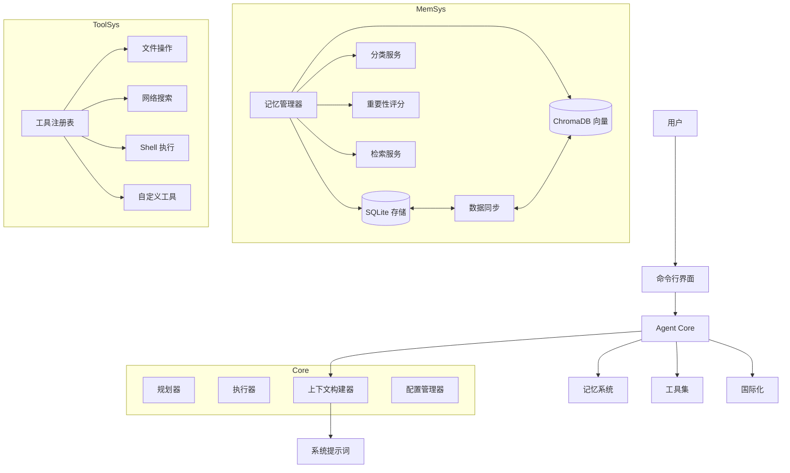
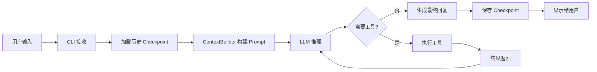

# FinchBot (雀翎)

[](https://opensource.org/licenses/MIT)
[](https://www.python.org/downloads/release/python-3130/)
[](https://github.com/astral-sh/ruff)
[](https://github.com/DetachHead/basedpyright)

**FinchBot (雀翎)** 是一个轻量级、模块化的 AI Agent 框架，基于 LangChain 和 LangGraph 构建。它旨在提供一个灵活、可扩展的基础，用于构建具有持久记忆、工具使用能力和多语言支持的智能助手。

[中文文档](docs/zh-CN/README.md) | [English Documentation](docs/en-US/README.md)

## 目录

1. [系统架构](#系统架构)
2. [核心组件](#核心组件)
3. [工作流程](#工作流程)
4. [设计理念](#设计理念)
5. [项目优势](#项目优势)
6. [快速开始](#快速开始)
7. [技术栈](#技术栈)
8. [扩展指南](#扩展指南)

---

## 系统架构

FinchBot 采用 **LangChain** + **LangGraph** 构建，是一个具备持久化记忆和动态工具调度的 Agent 系统。系统主要由三个核心部分组成：



### 目录结构

```
finchbot/
├── agent/              # Agent 核心
│   ├── core.py        # Agent 创建与运行
│   ├── context.py     # 上下文构建
│   └── skills.py      # 技能系统
├── cli/                # 命令行界面
│   ├── chat_session.py
│   ├── config_manager.py
│   ├── providers.py
│   └── ui.py
├── config/             # 配置管理
│   ├── loader.py
│   └── schema.py
├── i18n/               # 国际化
│   ├── loader.py
│   ├── detector.py
│   └── locales/
├── memory/             # 记忆系统
│   ├── manager.py
│   ├── types.py
│   ├── services/       # 服务层
│   │   ├── classification.py
│   │   ├── embedding.py
│   │   ├── importance.py
│   │   └── retrieval.py
│   ├── storage/        # 存储层
│   │   ├── sqlite.py
│   │   └── vector.py
│   └── vector_sync.py
├── providers/          # LLM 提供商
│   └── factory.py
├── sessions/           # 会话管理
│   ├── metadata.py
│   ├── selector.py
│   └── title_generator.py
├── skills/             # 技能系统
│   ├── skill-creator/
│   ├── summarize/
│   └── weather/
├── tools/              # 工具系统
│   ├── base.py
│   ├── registry.py
│   ├── filesystem.py
│   ├── memory.py
│   ├── shell.py
│   ├── web.py
│   ├── session_title.py
│   └── search/
└── utils/              # 工具函数
    ├── logger.py
    └── model_downloader.py
```

---

## 核心组件

### Agent Core (智能体核心)

**实现位置**: `src/finchbot/agent/core.py`

Agent Core 是 FinchBot 的大脑，负责决策、规划和工具调度。

#### 核心功能

*   **状态管理**: 基于 `LangGraph` 的 `StateGraph`，维护对话状态 (`messages`)。
*   **持久化**: 使用 `SqliteSaver` (`checkpoints.db`) 保存状态快照，支持断点续传和历史回溯。
*   **上下文构建**: 动态组合系统提示词，包括：
    *   **Identity**: `SYSTEM.md` (角色设定)
    *   **Memory Guide**: `MEMORY_GUIDE.md` (记忆使用准则)
    *   **Soul**: `SOUL.md` (灵魂设定)
    *   **Skills**: 动态加载的技能描述
    *   **Tools**: `TOOLS.md` (工具文档)
    *   **Runtime Info**: 当前时间、操作系统、Python 版本等。

#### 关键类与函数

| 函数/类 | 说明 |
|---------|------|
| `create_finch_agent()` | 创建并配置 FinchBot Agent |
| `build_system_prompt()` | 构建完整的系统提示词 |
| `get_default_workspace()` | 获取默认工作目录 |
| `get_sqlite_checkpointer()` | 获取 SQLite 持久化检查点 |
| `get_memory_checkpointer()` | 获取内存检查点 |

#### 线程安全机制

工具注册采用 **双重检查锁定模式 (Double-checked locking)** 实现懒加载，确保线程安全：

```python
def _register_default_tools() -> None:
    global _default_tools_registered

    if _default_tools_registered:
        return

    with _tools_registration_lock:
        if _default_tools_registered:
            return
        # 实际注册逻辑...
```

#### 技能扩展系统

FinchBot 提供了灵活的技能扩展系统，支持通过 Markdown 定义新技能：

| 技能 | 功能 | 状态 |
|------|------|------|
| skill-creator | 交互式引导创建新技能 | 内置 |
| summarize | 智能文档/对话总结 | 内置 |
| weather | 天气查询演示 | 内置 |
| 自定义技能 | 通过 Markdown 定义新技能 | 支持 |

### Memory System (记忆系统)

**实现位置**: `src/finchbot/memory/`

FinchBot 实现了先进的 **双层记忆架构**，旨在解决 LLM 上下文窗口限制和长期记忆遗忘问题。

#### 分层设计

1.  **结构化层 (SQLite)**:
    *   **作用**: 事实来源 (Source of Truth)。
    *   **存储内容**: 完整文本、元数据 (tags, source)、分类 (category)、重要性评分 (importance)、访问日志。
    *   **优势**: 支持精确查询（如按时间、分类过滤）。
    *   **实现**: `SQLiteStore` 类，使用 `aiosqlite` 异步操作。

2.  **语义层 (Vector Store)**:
    *   **作用**: 模糊检索与联想。
    *   **存储内容**: 文本的 Embedding 向量。
    *   **技术栈**: ChromaDB + FastEmbed (本地轻量级模型)。
    *   **优势**: 支持自然语言语义搜索（如"上次我提到的那个Python库"）。
    *   **实现**: `VectorMemoryStore` 类。

#### 核心特性

| 特性 | 说明 | 状态 |
|------|------|------|
| 分层存储 | SQLite (结构化事实) + ChromaDB (语义向量) | 已实现 |
| 自动分类 | 基于关键词和语义自动分类记忆 | 已实现 |
| 重要性评分 | 自动计算记忆重要性 (0-1) | 已实现 |
| 手动遗忘 | 支持关键词模式删除/归档记忆 | 已实现 |
| 数据同步 | SQLite 与向量存储双向同步，确保一致性 | 已实现 |
| 自动维护 | 基于规则的自动遗忘机制 | 规划中 |

#### 核心服务

| 服务 | 位置 | 功能 |
|------|------|------|
| **DataSyncManager** | `memory/vector_sync.py` | 确保 SQLite 和 Vector Store 的数据最终一致性，支持失败重试 |
| **ImportanceScorer** | `memory/services/importance.py` | 自动评估记忆重要性 (0.0-1.0)，用于记忆清理和优先级排序 |
| **RetrievalService** | `memory/services/retrieval.py` | 混合检索策略，结合向量相似度和元数据过滤 |
| **ClassificationService** | `memory/services/classification.py` | 基于关键词和语义的自动分类 |
| **EmbeddingService** | `memory/services/embedding.py` | 本地 Embedding 生成，使用 FastEmbed |

#### MemoryManager 接口

```python
class MemoryManager:
    def remember(self, content: str, category=None, importance=None, ...)
    def recall(self, query: str, top_k=5, category=None, ...)
    def forget(self, pattern: str)
    def get_stats(self) -> dict
    def search_memories(self, ...)
    def get_recent_memories(self, days=7, limit=20)
    def get_important_memories(self, min_importance=0.8, limit=20)
```

### Tool Ecosystem (工具生态)

**实现位置**: `src/finchbot/tools/`

FinchBot 提供了丰富的工具生态，让 Agent 能够与外部世界交互，共包含 11 个内置工具。

#### 注册机制

*   **ToolRegistry**: 单例注册表，管理所有可用工具。
*   **Lazy Loading**: 默认工具（文件、搜索等）在 Agent 启动时自动注册。
*   **OpenAI 兼容**: 支持导出工具定义为 OpenAI Function Calling 格式。

#### 工具基类

所有工具继承自 `FinchTool` 基类，必须实现：
- `name`: 工具名称
- `description`: 工具描述
- `parameters`: 参数定义 (JSON Schema)
- `execute()`: 执行逻辑

#### 安全沙箱

*   **文件操作**: 限制在工作区 (`workspace`) 内，防止越权访问系统文件。
*   **Shell 执行**: 默认禁用高危命令 (rm -rf /)，支持超时控制。

#### 内置工具列表

| 类别 | 工具 | 功能 |
|------|------|------|
| 文件操作 | read_file | 读取本地文件 |
| 文件操作 | write_file | 写入本地文件 |
| 文件操作 | edit_file | 编辑文件内容 |
| 文件操作 | list_dir | 列出目录内容 |
| 网络能力 | web_search | 联网搜索 (Tavily/Brave/DDG) |
| 网络能力 | web_extract | 网页内容提取 |
| 记忆管理 | remember | 主动存储记忆 |
| 记忆管理 | recall | 检索记忆 |
| 记忆管理 | forget | 删除/归档记忆 |
| 系统控制 | exec_command | 安全执行 Shell 命令 |
| 系统控制 | session_title | 管理会话标题 |

### I18n 系统 (国际化)

**实现位置**: `src/finchbot/i18n/`

FinchBot 提供了完整的多语言支持，让全球用户都能以自己熟悉的语言使用。

#### 支持的语言

| 语言 | 状态 |
|------|------|
| 简体中文 | 完整支持 |
| 繁体中文 | 完整支持 |
| 英文 | 完整支持 |

#### 语言回退链

系统实现了智能回退机制：
```
zh-CN → zh → en-US
zh-HK → zh → en-US
en-US → (无回退)
```

#### 配置优先级

1.  环境变量: `FINCHBOT_LANG`
2.  用户配置: `~/.finchbot/config.json`
3.  系统语言检测
4.  默认: `en-US`

### 配置系统

**实现位置**: `src/finchbot/config/`

使用 Pydantic v2 + Pydantic Settings 实现类型安全的配置管理。

#### 配置结构

```
Config (根配置)
├── language
├── default_model
├── agents
│   └── defaults (Agent 默认配置)
├── providers
│   ├── openai
│   ├── anthropic
│   ├── deepseek
│   ├── moonshot
│   ├── dashscope
│   ├── groq
│   ├── gemini
│   ├── openrouter
│   └── custom
└── tools
    ├── web.search (搜索配置)
    ├── exec (Shell 执行配置)
    └── restrict_to_workspace
```

---

## 工作流程

### 对话流程



1.  用户输入 -> CLI 接收
2.  Agent 加载历史状态 (Checkpoint)
3.  ContextBuilder 构建当前 Prompt (包含相关记忆)
4.  LLM 生成回复或工具调用请求
5.  如果调用工具 -> 执行工具 -> 结果回传 LLM -> 循环
6.  LLM 生成最终回复 -> 显示给用户

### 命令行界面特性

FinchBot 的 CLI 提供了丰富的交互体验：

| 功能 | 说明 |
|------|------|
| 会话管理 | 交互式选择、重命名、删除历史会话 |
| 自动标题 | 基于对话内容自动生成会话标题 |
| 时光倒流 | 支持 \rollback 和 \back 指令回退对话状态 |
| 富文本体验 | Markdown 渲染、加载动画、语法高亮 |

### 记忆写入流程 (Remember)

1.  Agent 调用 `remember` 工具
2.  `MemoryManager` 接收内容
3.  自动计算 `category` (ClassificationService)
4.  自动计算 `importance` (ImportanceScorer)
5.  写入 SQLite，生成唯一 ID
6.  同步调用 Embedding 服务，将向量写入 ChromaDB
7.  记录访问日志

### 记忆检索流程 (Recall)

1.  Agent 调用 `recall` 工具 (查询: "我的API Key是多少")
2.  `RetrievalService` 将查询转换为向量
3.  在 Vector Store 中搜索 Top-K 相似结果
4.  (可选) 结合 SQLite 进行元数据过滤 (category, time range 等)
5.  返回结果给 Agent

---

## 设计理念

### 模块化 (Modularity)

每个组件都有清晰的职责边界：
- `MemoryManager` 不直接处理存储细节，委托给 `SQLiteStore` 和 `VectorMemoryStore`
- `ToolRegistry` 只负责注册和查找，不关心工具实现
- `I18n` 系统独立于业务逻辑

### 依赖倒置 (Dependency Inversion)

高层模块不依赖低层模块，都依赖抽象：
```
AgentCore → MemoryManager (接口)
                ↓
         SQLiteStore / VectorStore (实现)
```

### 隐私优先 (Privacy First)

- Embedding 生成在本地 (FastEmbed)，不上传云端
- 配置文件存储在用户目录 `~/.finchbot`
- 文件操作限制在工作区

### 防御性编程 (Defensive Programming)

- 双重检查锁定防止并发问题
- 向量存储失败不影响 SQLite 写入（降级策略）
- 超时控制防止工具卡死
- 完整的错误日志 (Loguru)

### 开发者特性

FinchBot 为开发者提供了完善的开发体验：

| 特性 | 说明 |
|------|------|
| 类型安全 | 全面使用 Python 类型提示 (Type Hints) |
| 代码质量 | Ruff 格式化 + BasedPyright 类型检查 |
| 依赖管理 | uv 快速管理，构建速度提升 10-100x |
| 技术栈 | Python 3.13+, LangGraph v1.0+, Pydantic v2 |
| 测试框架 | pytest + pytest-asyncio + pytest-cov |

---

## 项目优势

| 优势 | 说明 |
|------|------|
| 隐私优先 | 使用 FastEmbed 本地生成向量，无需上传云端数据 |
| 真持久化 | 双层记忆存储架构，支持语义检索和精确查询 |
| 生产级稳定 | 双重检查锁、自动重试、超时控制机制 |
| 灵活扩展 | 继承 FinchTool 即可添加新工具，无需修改核心代码 |
| 模型无关 | 支持 OpenAI, Anthropic, Gemini, Ollama, DeepSeek, Moonshot 等 |
| 并发安全 | 工具注册使用双重检查锁定模式，线程安全 |

---

## 快速开始

### 前置要求

| 项目 | 要求 |
|------|------|
| 操作系统 | Windows / Linux / macOS |
| Python | 3.13+ |
| 包管理器 | uv (推荐) |

### 安装步骤

1. 克隆仓库

```bash
git clone https://github.com/yourusername/finchbot.git
cd finchbot
```

2. 使用 uv 创建环境并安装依赖

```bash
uv sync
```

3. 配置环境变量

复制 `.env.example` 为 `.env` 并填入 API Key

```bash
cp .env.example .env
```

### 使用

启动交互式对话

```bash
uv run finchbot chat
```

查看帮助

```bash
uv run finchbot --help
```

下载本地嵌入模型

```bash
uv run finchbot models download
```

管理会话

```bash
uv run finchbot sessions
```

配置管理

```bash
uv run finchbot config
```

---

## 技术栈

| 层级 | 技术 | 版本 |
|------|------|------|
| 基础语言 | Python | 3.13+ |
| Agent 框架 | LangChain | 1.2.10+ |
| 状态管理 | LangGraph | 1.0.8+ |
| 数据验证 | Pydantic | v2 |
| 向量存储 | ChromaDB | 0.5.0+ |
| 本地嵌入 | FastEmbed | 0.4.0+ |
| 搜索增强 | BM25 | 0.2.2+ |
| CLI 框架 | Typer | 0.23.0+ |
| 富文本 | Rich | 14.3.0+ |
| 日志 | Loguru | 0.7.3+ |
| 配置管理 | Pydantic Settings | 2.12.0+ |

---

## 扩展指南

### 添加新工具

继承 `FinchTool` 基类，实现 `execute()` 方法，然后注册到 `ToolRegistry`。

### 添加新的 LLM 提供商

在 `providers/factory.py` 中添加新的 Provider 类。

### 自定义记忆检索策略

继承 `RetrievalService` 或修改 `search()` 方法。

### 添加新语言

在 `i18n/locales/` 下添加新的 `.toml` 文件。

---

## 文档

| 文档 | 说明 |
|------|------|
| [使用指南](docs/zh-CN/guide/usage.md) | CLI 使用教程 |
| [API 接口文档](docs/zh-CN/api.md) | API 参考 |
| [配置指南](docs/zh-CN/config.md) | 配置项说明 |
| [扩展指南](docs/zh-CN/guide/extension.md) | 添加工具/技能 |
| [部署指南](docs/zh-CN/deployment.md) | 部署说明 |
| [开发环境搭建](docs/zh-CN/development.md) | 开发环境配置 |
| [贡献指南](docs/zh-CN/contributing.md) | 贡献规范 |

---

## 贡献

欢迎提交 Issue 和 Pull Request。请阅读 [贡献指南](docs/zh-CN/contributing.md) 了解更多信息。

---

## 许可证

本项目采用 [MIT 许可证](LICENSE)。

---

## Star History

如果这个项目对你有帮助，请给个 Star ⭐️
