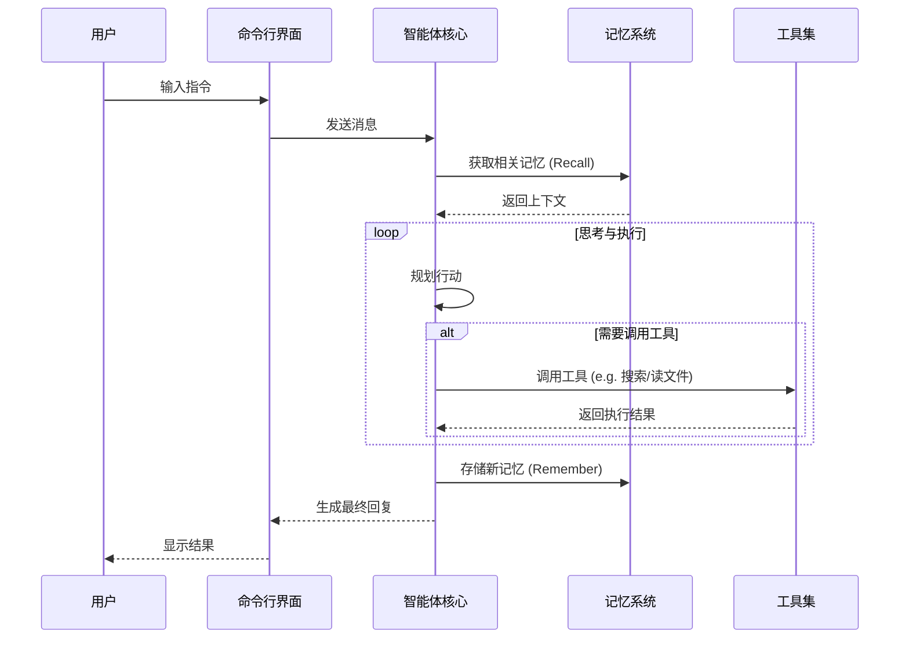
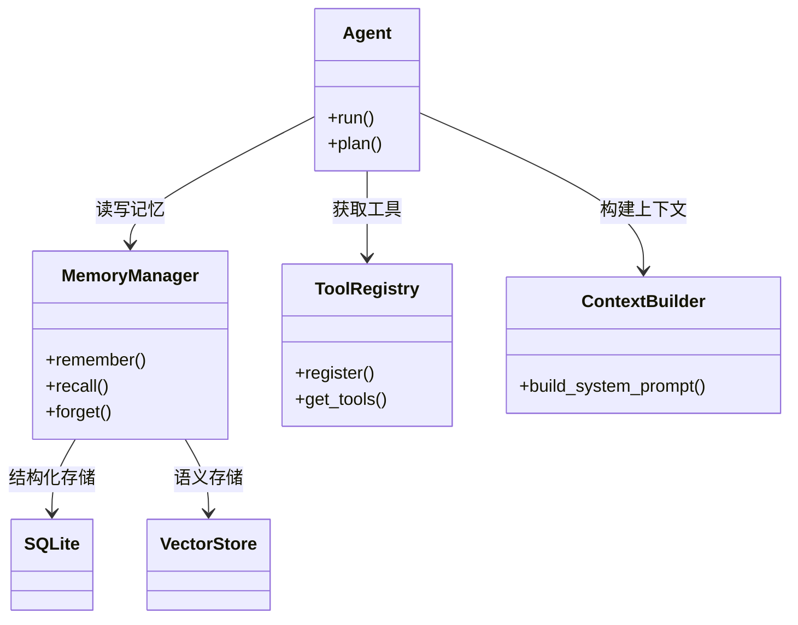

# FinchBot (雀翎)

[](https://opensource.org/licenses/MIT)
[](https://www.python.org/downloads/release/python-3130/)
[](https://github.com/astral-sh/ruff)

**FinchBot (雀翎)** 是一个轻量级、模块化的 AI Agent 框架，基于 LangChain 和 LangGraph 构建。它旨在提供一个灵活、可扩展的基础，用于构建具有持久记忆、工具使用能力和多语言支持的智能助手。

[中文文档](docs/zh-CN/README.md) | [English Documentation](docs/en-US/README.md)

## ✨ 特性

- **🧠 强大的记忆系统**: 
    - **分层存储**: 结合 SQLite (结构化事实) 和 Vector Store (语义联想)。
    - **自动维护**: 支持自动分类、重要性评分和基于规则的遗忘机制。
    - **一致性**: 内置数据同步服务，确保多层存储间的数据一致性。
- **🔌 模块化工具生态 (11 个内置工具)**: 
    - **文件操作**: `read_file`, `write_file`, `edit_file`, `list_dir` - 完整的本地文件系统控制。
    - **网络能力**: `web_search` (Tavily/Brave/DuckDuckGo), `web_extract` - 实时联网获取信息。
    - **记忆管理**: `remember`, `recall`, `forget` - 主动管理长期记忆。
    - **系统控制**: `exec_command` - 安全执行 Shell 命令；`session_title` - 管理会话标题。
- **🎓 技能扩展系统 (3 个内置技能)**:
    - **skill-creator**: 交互式引导创建新技能。
    - **summarize**: 智能文档/对话总结。
    - **weather**: 天气查询演示技能。
    - 支持通过 Markdown 定义新技能 (SOP)，实现 In-Context Learning。
- **💻 强大的命令行界面 (CLI)**:
    - **会话管理**: 交互式选择、重命名、删除历史会话。
    - **自动标题**: 基于对话内容自动生成简洁的会话标题。
    - **时光倒流**: 支持 `\rollback` 和 `\back` 指令，随时回退到之前的对话状态，甚至创建分支会话。
    - **富文本体验**: 基于 Rich 构建，支持 Markdown 渲染、加载动画和语法高亮。
- **🌍 完整的国际化 (i18n)**: 
    - 自动检测系统语言。
    - 支持中、英、繁体中文界面和提示词切换。
- **🛠️ 开发者友好**: 
    - **类型安全**: 全面使用 Python 类型提示 (Type Hints)。
    - **文档完善**: 核心代码注释覆盖率 > 95%。
    - **现代工程**: 使用 `uv` 管理依赖，`ruff` 保证代码质量。
- **🚀 现代技术栈**: Python 3.13+, LangGraph (Stateful Agents), Pydantic v2.

## 🌟 项目优势

1.  **隐私优先的本地化记忆**: 默认使用 `FastEmbed` 本地生成向量，无需将记忆内容上传到 OpenAI Embedding API，保护隐私且零成本。
2.  **真·持久化**: 不同于简单的 `chat_history` 列表，FinchBot 的记忆系统是结构化的、可检索的，并且随时间推移具有“遗忘”机制，模拟人类记忆。
3.  **生产级稳定性**: 
    - **双重检查锁**: 确保工具注册的线程安全。
    - **鲁棒的错误处理**: 网络请求自动重试，Shell 执行超时控制。
    - **完整的测试覆盖**: 核心逻辑均经过单元测试。
4.  **灵活的扩展性**: 
    - 想要新工具？继承 `FinchTool` 写个 Python 类。
    - 想要新流程？写个 `SKILL.md` 放到 `skills/` 目录。
    - 想要换模型？修改配置即可无缝切换 OpenAI, Anthropic, Gemini, Ollama 等。

## 🏗️ 架构概览

### 1. 系统交互流程



### 2. 核心组件关系



## 🚀 快速开始

### 前置要求

- Windows / Linux / macOS
- Python 3.13+
- [uv](https://github.com/astral-sh/uv) (推荐)

### 安装

1.  克隆仓库：
    ```bash
    git clone https://github.com/yourusername/finchbot.git
    cd finchbot
    ```

2.  使用 uv 创建环境并安装依赖：
    ```bash
    uv sync
    ```

3.  配置环境变量：
    复制 `.env.example` 为 `.env` 并填入 API Key。
    ```bash
    cp .env.example .env
    ```

### 使用

启动交互式对话：

```bash
uv run finchbot chat
```

查看帮助：

```bash
uv run finchbot --help
```

## 📖 文档

详细文档请参考 `docs/` 目录：

- [系统架构详解](docs/zh-CN/architecture.md) 🌟
- [使用指南 (CLI)](docs/zh-CN/guide/usage.md) 🌟
- [API 接口文档](docs/zh-CN/api.md)
- [配置指南](docs/zh-CN/config.md)
- [扩展指南 (添加工具/技能)](docs/zh-CN/guide/extension.md)
- [部署指南](docs/zh-CN/deployment.md)
- [开发环境搭建](docs/zh-CN/development.md)
- [贡献指南](docs/zh-CN/contributing.md)

## 🤝 贡献

欢迎提交 Issue 和 Pull Request！请阅读 [贡献指南](docs/zh-CN/contributing.md) 了解更多信息。

## 📄 许可证

本项目采用 [MIT 许可证](LICENSE)。
