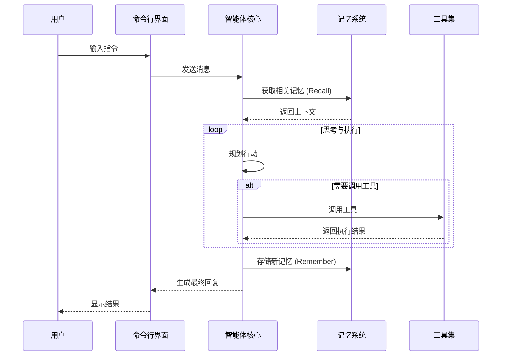
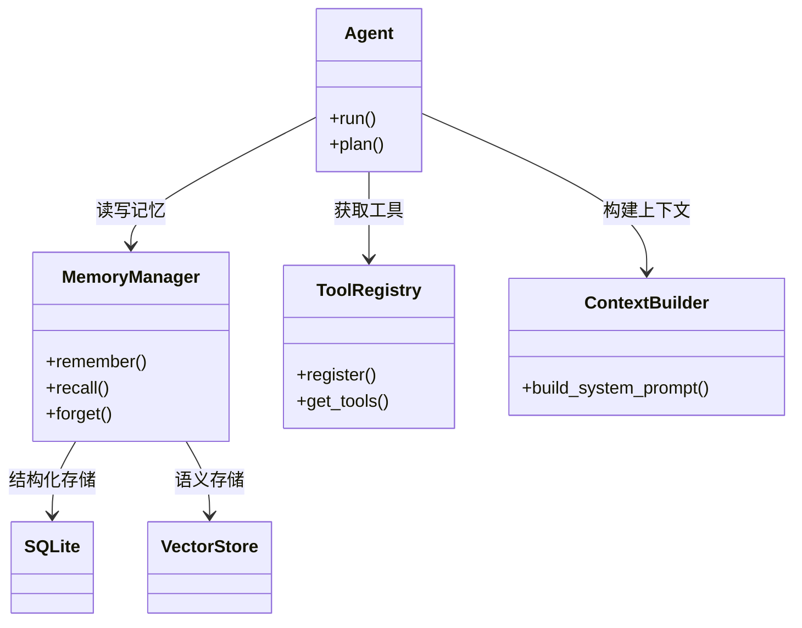

# FinchBot (雀翎)

[](https://opensource.org/licenses/MIT)
[](https://www.python.org/downloads/release/python-3130/)
[](https://github.com/astral-sh/ruff)

**FinchBot (雀翎)** 是一个轻量级、模块化的 AI Agent 框架，基于 LangChain 和 LangGraph 构建。它旨在提供一个灵活、可扩展的基础，用于构建具有持久记忆、工具使用能力和多语言支持的智能助手。

[中文文档](docs/zh-CN/README.md) | [English Documentation](docs/en-US/README.md)

## 特性

### 记忆系统

| 特性 | 说明 | 状态 |
|------|------|------|
| 分层存储 | SQLite (结构化事实) + Vector Store (语义联想) | 已实现 |
| 自动分类 | 基于关键词和语义自动分类记忆 | 已实现 |
| 重要性评分 | 自动计算记忆重要性 (0-1) | 已实现 |
| 手动遗忘 | 支持关键词模式删除/归档记忆 | 已实现 |
| 自动维护 | 基于规则的自动遗忘机制 | 未实现 |

### 工具生态 (11 个内置工具)

| 类别 | 工具 | 功能 |
|------|------|------|
| 文件操作 | read_file | 读取本地文件 |
| 文件操作 | write_file | 写入本地文件 |
| 文件操作 | edit_file | 编辑文件内容 |
| 文件操作 | list_dir | 列出目录内容 |
| 网络能力 | web_search | 联网搜索 (Tavily/Brave/DDG) |
| 网络能力 | web_extract | 网页内容提取 |
| 记忆管理 | remember | 主动存储记忆 |
| 记忆管理 | recall | 检索记忆 |
| 记忆管理 | forget | 删除/归档记忆 |
| 系统控制 | exec_command | 安全执行 Shell 命令 |
| 系统控制 | session_title | 管理会话标题 |

### 技能扩展系统

| 技能 | 功能 | 状态 |
|------|------|------|
| skill-creator | 交互式引导创建新技能 | 内置 |
| summarize | 智能文档/对话总结 | 内置 |
| weather | 天气查询演示 | 内置 |
| 自定义技能 | 通过 Markdown 定义新技能 | 支持 |

### 命令行界面

| 功能 | 说明 |
|------|------|
| 会话管理 | 交互式选择、重命名、删除历史会话 |
| 自动标题 | 基于对话内容自动生成会话标题 |
| 时光倒流 | 支持 \\rollback 和 \\back 指令回退对话状态 |
| 富文本体验 | Markdown 渲染、加载动画、语法高亮 |

### 国际化支持

| 语言 | 状态 |
|------|------|
| 简体中文 | 完整支持 |
| 繁体中文 | 完整支持 |
| 英文 | 完整支持 |

### 开发者特性

| 特性 | 说明 |
|------|------|
| 类型安全 | 全面使用 Python 类型提示 |
| 代码质量 | Ruff 格式化 + BasedPyright 类型检查 |
| 依赖管理 | uv 快速管理 |
| 技术栈 | Python 3.13+, LangGraph, Pydantic v2 |

## 项目优势

| 优势 | 说明 |
|------|------|
| 隐私优先 | 使用 FastEmbed 本地生成向量，无需上传云端 |
| 真持久化 | 结构化记忆存储，支持语义检索 |
| 生产级稳定 | 双重检查锁、自动重试、超时控制 |
| 灵活扩展 | 继承 FinchTool 即可添加新工具 |
| 模型无关 | 支持 OpenAI, Anthropic, Gemini, Ollama 等 |

## 架构概览

### 系统交互流程



### 核心组件关系



## 快速开始

### 前置要求

| 项目 | 要求 |
|------|------|
| 操作系统 | Windows / Linux / macOS |
| Python | 3.13+ |
| 包管理器 | uv (推荐) |

### 安装步骤

1. 克隆仓库

```bash
git clone https://github.com/yourusername/finchbot.git
cd finchbot
```

2. 使用 uv 创建环境并安装依赖

```bash
uv sync
```

3. 配置环境变量

复制 `.env.example` 为 `.env` 并填入 API Key

```bash
cp .env.example .env
```

### 使用

启动交互式对话

```bash
uv run finchbot chat
```

查看帮助

```bash
uv run finchbot --help
```

## 文档

| 文档 | 说明 |
|------|------|
| [系统架构详解](docs/zh-CN/architecture.md) | 架构设计说明 |
| [使用指南](docs/zh-CN/guide/usage.md) | CLI 使用教程 |
| [API 接口文档](docs/zh-CN/api.md) | API 参考 |
| [配置指南](docs/zh-CN/config.md) | 配置项说明 |
| [扩展指南](docs/zh-CN/guide/extension.md) | 添加工具/技能 |
| [部署指南](docs/zh-CN/deployment.md) | 部署说明 |
| [开发环境搭建](docs/zh-CN/development.md) | 开发环境配置 |
| [贡献指南](docs/zh-CN/contributing.md) | 贡献规范 |


## 贡献

欢迎提交 Issue 和 Pull Request。请阅读 [贡献指南](docs/zh-CN/contributing.md) 了解更多信息。

## 许可证

本项目采用 [MIT 许可证](LICENSE)。
