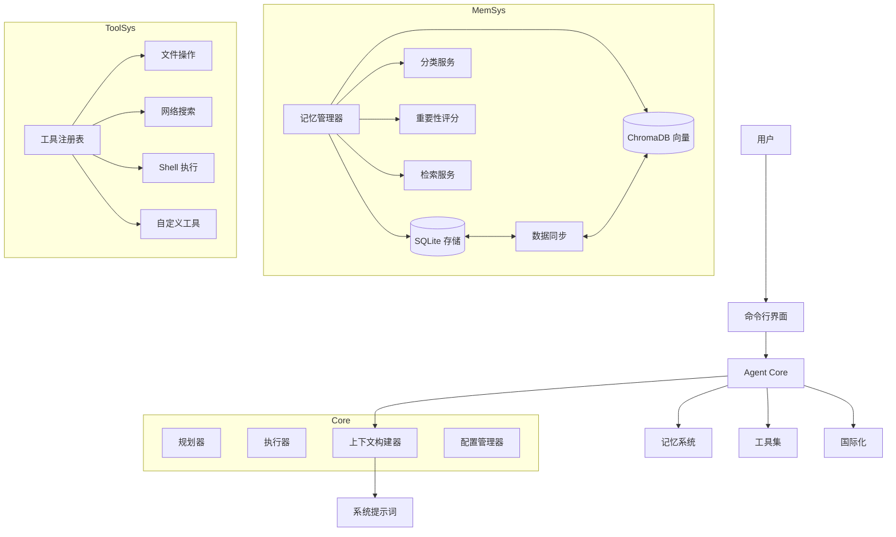
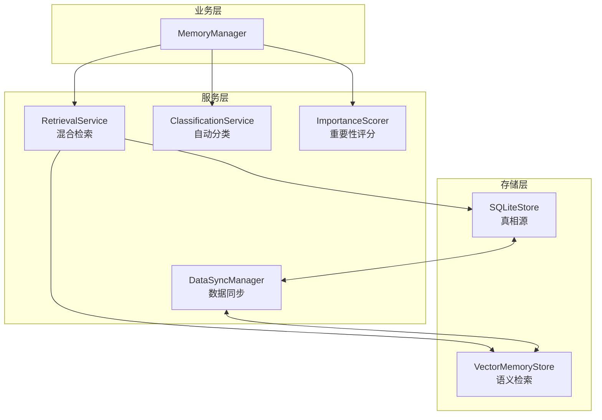
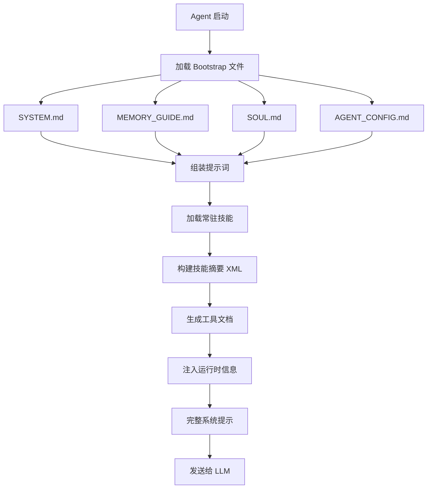

# FinchBot (雀翎)

[](https://opensource.org/licenses/MIT)
[](https://www.python.org/downloads/release/python-3130/)
[](https://github.com/astral-sh/ruff)
[](https://github.com/DetachHead/basedpyright)

**FinchBot (雀翎)** 是一个轻量级、模块化的 AI Agent 框架，基于 **LangChain v1.2** 和 **LangGraph v1.0** 构建。它不是又一个简单的 LLM 封装，而是一个深思熟虑的架构设计，专注于三个核心问题：

1. **如何让 Agent 的能力无限扩展？** — 通过技能 (Skill) 和工具 (Tool) 的双层扩展机制
2. **如何让 Agent 拥有真正的记忆？** — 通过双层存储架构 + Agentic RAG
3. **如何让 Agent 的行为可定制？** — 通过动态提示词文件系统

[中文文档](docs/zh-CN/README.md) | [English Documentation](README.md)

## 目录

1. [为什么选择 FinchBot？](#为什么选择-finchbot)
2. [系统架构](#系统架构)
3. [核心组件](#核心组件)
4. [快速开始](#快速开始)
5. [技术栈](#技术栈)
6. [扩展指南](#扩展指南)
7. [文档](#文档)

---

## 为什么选择 FinchBot？

### 现有框架的痛点

| 痛点 | 传统方案 | FinchBot 方案 |
|:---:|:---|:---|
| **扩展困难** | 需要修改核心代码 | 继承基类或创建 Markdown 文件 |
| **记忆脆弱** | 依赖 LLM 上下文窗口 | 双层持久化存储 + 语义检索 |
| **提示词僵化** | 硬编码在代码中 | 文件系统，热加载 |
| **架构过时** | 基于 LangChain 旧版 API | LangChain v1.2 + LangGraph v1.0 |

### 设计哲学

```
隐私优先 → 本地 Embedding，数据不上云
模块化 → 每个组件独立可替换
开发者友好 → 类型安全 + 完善文档
生产级稳定 → 双重检查锁 + 自动重试 + 超时控制
开箱即用 → 零配置启动，自动降级，富文本界面
```

### 开箱即用体验

FinchBot 将 **"开箱即用"** 作为核心设计理念——无需复杂配置即可上手：

**三步快速上手：**

```bash
# 第一步：配置 API 密钥和默认模型
uv run finchbot config

# 第二步：管理你的会话
uv run finchbot sessions

# 第三步：开始对话
uv run finchbot chat
```

| 特性 | 说明 |
|:---:|:---|
| **三步上手** | `config` → `sessions` → `chat`，三个命令完成完整工作流程 |
| **环境变量配置** | 所有配置均可通过环境变量设置（`OPENAI_API_KEY`、`ANTHROPIC_API_KEY` 等） |
| **Rich CLI 界面** | 全屏键盘导航，↑/↓ 箭头选择，交互式操作 |
| **i18n 国际化** | 内置中英文支持，自动检测系统语言 |
| **自动降级** | 网页搜索自动降级：Tavily → Brave → DuckDuckGo |
| **零配置启动** | 只需设置 API Key，运行 `finchbot chat` 即可 |

---

## 系统架构

FinchBot 采用 **LangChain v1.2** + **LangGraph v1.0** 构建，是一个具备持久化记忆和动态工具调度的 Agent 系统。



### 目录结构

```
finchbot/
├── agent/              # Agent 核心
│   ├── core.py        # Agent 创建与运行
│   ├── context.py     # 上下文构建
│   └── skills.py      # 技能系统
├── cli/                # 命令行界面
│   ├── chat_session.py
│   ├── config_manager.py
│   ├── providers.py
│   └── ui.py
├── config/             # 配置管理
│   ├── loader.py
│   └── schema.py
├── i18n/               # 国际化
│   ├── loader.py
│   ├── detector.py
│   └── locales/
├── memory/             # 记忆系统
│   ├── manager.py
│   ├── types.py
│   ├── services/       # 服务层
│   │   ├── classification.py
│   │   ├── embedding.py
│   │   ├── importance.py
│   │   └── retrieval.py
│   ├── storage/        # 存储层
│   │   ├── sqlite.py
│   │   └── vector.py
│   └── vector_sync.py
├── providers/          # LLM 提供商
│   └── factory.py
├── sessions/           # 会话管理
│   ├── metadata.py
│   ├── selector.py
│   └── title_generator.py
├── skills/             # 技能系统
│   ├── skill-creator/
│   ├── summarize/
│   └── weather/
├── tools/              # 工具系统
│   ├── base.py
│   ├── registry.py
│   ├── filesystem.py
│   ├── memory.py
│   ├── shell.py
│   ├── web.py
│   ├── session_title.py
│   └── search/
└── utils/              # 工具函数
    ├── logger.py
    └── model_downloader.py
```

---

## 核心组件

### 1. 技能系统：用 Markdown 定义 Agent 能力

技能是 FinchBot 的独特创新——**用 Markdown 文件定义 Agent 的能力边界**。

#### 技能文件结构

```
skills/
├── skill-creator/        # 技能创建器（内置）
│   └── SKILL.md
├── summarize/            # 智能总结（内置）
│   └── SKILL.md
├── weather/              # 天气查询（内置）
│   └── SKILL.md
└── my-custom-skill/      # 你的自定义技能
    └── SKILL.md
```

#### 技能定义格式

```markdown
<!-- skills/weather/SKILL.md -->
---
name: weather
description: 查询当前天气和天气预报（无需 API 密钥）
metadata:
  finchbot:
    emoji: 🌤️
    always: false
    requires:
      bins: [curl]
      env: []
---

# 天气查询技能

## 功能说明
使用 wttr.in 服务查询天气信息...

## 使用方式
当用户询问天气相关问题时...
```

#### 核心设计亮点

| 特性 | 说明 |
|:---:|:---|
| **双层技能源** | 工作区技能优先，内置技能兜底 |
| **依赖检查** | 自动检查 CLI 工具和环境变量 |
| **缓存失效检测** | 基于文件修改时间，智能缓存 |
| **渐进式加载** | 常驻技能优先，按需加载其他 |

### 2. 工具系统：代码级能力扩展

工具是 Agent 与外部世界交互的桥梁。FinchBot 提供了 11 个内置工具，并支持轻松扩展。

#### 内置工具一览

| 类别 | 工具 | 功能 |
|:---:|:---|:---|
| **文件操作** | `read_file` | 读取本地文件 |
| | `write_file` | 写入本地文件 |
| | `edit_file` | 编辑文件内容 |
| | `list_dir` | 列出目录内容 |
| **网络能力** | `web_search` | 联网搜索 (Tavily/Brave/DDG) |
| | `web_extract` | 网页内容提取 |
| **记忆管理** | `remember` | 主动存储记忆 |
| | `recall` | 检索记忆 |
| | `forget` | 删除/归档记忆 |
| **系统控制** | `exec` | 安全执行 Shell 命令 |
| | `session_title` | 管理会话标题 |

#### 网页搜索：三引擎降级设计

FinchBot 的网页搜索工具采用巧妙的**三引擎自动降级机制**，兼顾灵活性和开箱即用体验：

| 优先级 | 引擎 | API Key | 特点 |
|:---:|:---:|:---:|:---|
| 1 | **Tavily** | 需要 | 质量最佳，专为 AI 优化，深度搜索 |
| 2 | **Brave Search** | 需要 | 免费额度大，隐私友好 |
| 3 | **DuckDuckGo** | 无需 | 始终可用，零配置 |

**工作原理**：
1. 如果设置了 `TAVILY_API_KEY` → 使用 Tavily（质量最佳）
2. 否则如果设置了 `BRAVE_API_KEY` → 使用 Brave Search
3. 否则 → 使用 DuckDuckGo（无需 API Key，始终可用）

这个设计确保**即使没有任何 API Key 配置，网页搜索也能开箱即用**！

#### 工具注册机制

```python
from finchbot.tools.base import FinchTool
from typing import Any, ClassVar

class MyCustomTool(FinchTool):
    """自定义工具示例"""
    
    name: str = "my_custom_tool"
    description: str = "我的自定义工具描述"
    parameters: ClassVar[dict[str, Any]] = {
        "type": "object",
        "properties": {
            "input_text": {
                "type": "string",
                "description": "输入文本"
            }
        },
        "required": ["input_text"]
    }
    
    def _run(self, input_text: str) -> str:
        # 实现你的逻辑
        return f"处理结果: {input_text}"
```

### 3. 记忆架构：双层存储 + Agentic RAG

FinchBot 实现了先进的**双层记忆架构**，彻底解决了 LLM 上下文窗口限制和长期记忆遗忘问题。

#### 为什么是 Agentic RAG？

| 对比维度 | 传统 RAG | Agentic RAG (FinchBot) |
|:---:|:---|:---|
| **检索触发** | 固定流程 | Agent 自主决策 |
| **检索策略** | 单一向量检索 | 混合检索 + 权重动态调整 |
| **记忆管理** | 被动存储 | 主动 remember/recall/forget |
| **分类能力** | 无 | 自动分类 + 重要性评分 |
| **更新机制** | 全量重建 | 增量同步 |

#### 双层存储架构



#### 混合检索策略

FinchBot 采用**加权 RRF (Weighted Reciprocal Rank Fusion)** 策略：

```python
class QueryType(StrEnum):
    """查询类型，决定检索权重"""
    KEYWORD_ONLY = "keyword_only"      # 纯关键词 (1.0/0.0)
    SEMANTIC_ONLY = "semantic_only"    # 纯语义 (0.0/1.0)
    FACTUAL = "factual"                # 事实型 (0.8/0.2)
    CONCEPTUAL = "conceptual"          # 概念型 (0.2/0.8)
    COMPLEX = "complex"                # 复杂型 (0.5/0.5)
    AMBIGUOUS = "ambiguous"            # 歧义型 (0.3/0.7)
```

### 4. 动态提示词系统：用户可编辑的 Agent 大脑

FinchBot 的提示词系统采用**文件系统 + 模块化组装**的设计。

#### Bootstrap 文件系统

```
~/.finchbot/
├── SYSTEM.md           # 角色设定
├── MEMORY_GUIDE.md     # 记忆使用指南
├── SOUL.md             # 灵魂设定（性格特征）
├── AGENT_CONFIG.md     # Agent 配置
└── workspace/
    └── skills/         # 自定义技能
```

#### 提示词加载流程



### 5. LangChain 1.2 架构实践

FinchBot 基于 **LangChain v1.2** 和 **LangGraph v1.0** 构建，采用最新的 Agent 架构。

```python
from langchain.agents import create_agent
from langgraph.checkpoint.sqlite import SqliteSaver

def create_finch_agent(
    model: BaseChatModel,
    workspace: Path,
    tools: Sequence[BaseTool] | None = None,
    use_persistent: bool = True,
) -> tuple[CompiledStateGraph, SqliteSaver | MemorySaver]:
    
    # 1. 初始化检查点（持久化状态）
    if use_persistent:
        checkpointer = SqliteSaver.from_conn_string(str(db_path))
    else:
        checkpointer = MemorySaver()
    
    # 2. 构建系统提示
    system_prompt = build_system_prompt(workspace)
    
    # 3. 创建 Agent（使用 LangChain 官方 API）
    agent = create_agent(
        model=model,
        tools=list(tools) if tools else None,
        system_prompt=system_prompt,
        checkpointer=checkpointer,
    )
    
    return agent, checkpointer
```

#### 支持的 LLM 提供商

| 提供商 | 模型 | 特点 |
|:---:|:---|:---|
| OpenAI | GPT-4, GPT-4o, O1, O3 | 综合能力最强 |
| Anthropic | Claude 3.5/4 Sonnet, Opus | 安全性高，长文本 |
| DeepSeek | DeepSeek-V3, R1 | 国产，性价比高 |
| Gemini | Gemini 2.0/2.5 Flash | Google 最新 |
| Groq | Llama 4, Mixtral | 极速推理 |
| Moonshot | Kimi K1.5/K2.5 | 长文本，国产 |

---

## 快速开始

### 前置要求

| 项目 | 要求 |
|:---:|:---|
| 操作系统 | Windows / Linux / macOS |
| Python | 3.13+ |
| 包管理器 | uv (推荐) |

### 安装步骤

```bash
# 克隆仓库
git clone https://github.com/xt765/finchbot.git
cd finchbot

# 使用 uv 安装依赖
uv sync
```

### 最佳实践：三步上手

```bash
# 第一步：配置 API 密钥和默认模型
uv run finchbot config

# 第二步：管理你的会话
uv run finchbot sessions

# 第三步：开始对话
uv run finchbot chat
```

就这么简单！这三个命令覆盖了完整的工作流程：
- `finchbot config` — 交互式配置 LLM 提供商、API 密钥和设置
- `finchbot sessions` — 全屏会话管理器，创建、重命名、删除会话
- `finchbot chat` — 开始或继续交互式对话

### 备选方案：环境变量

```bash
# 或直接设置环境变量
export OPENAI_API_KEY="your-api-key"
uv run finchbot chat
```

### 可选：下载本地嵌入模型

```bash
# 用于记忆系统的语义搜索（可选但推荐）
uv run finchbot models download
```

### 创建自定义技能

```bash
# 创建技能目录
mkdir -p ~/.finchbot/workspace/skills/my-skill

# 创建技能文件
cat > ~/.finchbot/workspace/skills/my-skill/SKILL.md << 'EOF'
---
name: my-skill
description: 我的自定义技能
metadata:
  finchbot:
    emoji: ✨
    always: false
---

# 我的自定义技能

当用户请求 XXX 时，我应该...
EOF
```

---

## 技术栈

| 层级 | 技术 | 版本 |
|:---:|:---|:---:|
| 基础语言 | Python | 3.13+ |
| Agent 框架 | LangChain | 1.2.10+ |
| 状态管理 | LangGraph | 1.0.8+ |
| 数据验证 | Pydantic | v2 |
| 向量存储 | ChromaDB | 0.5.0+ |
| 本地嵌入 | FastEmbed | 0.4.0+ |
| 搜索增强 | BM25 | 0.2.2+ |
| CLI 框架 | Typer | 0.23.0+ |
| 富文本 | Rich | 14.3.0+ |
| 日志 | Loguru | 0.7.3+ |
| 配置管理 | Pydantic Settings | 2.12.0+ |

---

## 扩展指南

### 添加新工具

继承 `FinchTool` 基类，实现 `_run()` 方法，然后注册到 `ToolRegistry`。

### 添加新技能

在 `~/.finchbot/workspace/skills/{skill-name}/` 下创建 `SKILL.md` 文件。

### 添加新的 LLM 提供商

在 `providers/factory.py` 中添加新的 Provider 类。

### 添加新语言

在 `i18n/locales/` 下添加新的 `.toml` 文件。

---

## 项目优势

| 优势 | 说明 |
|:---:|:---|
| **隐私优先** | 使用 FastEmbed 本地生成向量，无需上传云端数据 |
| **真持久化** | 双层记忆存储架构，支持语义检索和精确查询 |
| **生产级稳定** | 双重检查锁、自动重试、超时控制机制 |
| **灵活扩展** | 继承 FinchTool 或创建 SKILL.md 即可扩展，无需修改核心代码 |
| **模型无关** | 支持 OpenAI, Anthropic, Gemini, DeepSeek, Moonshot, Groq 等 |
| **并发安全** | 工具注册使用双重检查锁定模式，线程安全 |

---

## 文档

| 文档 | 说明 |
|:---|:---|
| [使用指南](docs/zh-CN/guide/usage.md) | CLI 使用教程 |
| [API 接口文档](docs/zh-CN/api.md) | API 参考 |
| [配置指南](docs/zh-CN/config.md) | 配置项说明 |
| [扩展指南](docs/zh-CN/guide/extension.md) | 添加工具/技能 |
| [系统架构](docs/zh-CN/architecture.md) | 系统架构详解 |
| [部署指南](docs/zh-CN/deployment.md) | 部署说明 |
| [开发环境搭建](docs/zh-CN/development.md) | 开发环境配置 |
| [贡献指南](docs/zh-CN/contributing.md) | 贡献规范 |

---

## 贡献

欢迎提交 Issue 和 Pull Request。请阅读 [贡献指南](docs/zh-CN/contributing.md) 了解更多信息。

---

## 许可证

本项目采用 [MIT 许可证](LICENSE)。

---

## Star History

如果这个项目对你有帮助，请给个 Star ⭐️
