# FinchBot (雀翎) — 轻量灵活，无限扩展的 AI Agent 框架

<p align="center">
  
</p>

<p align="center">
  <em>基于 LangChain v1.2 与 LangGraph v1.0 构建<br>
  具备持久记忆、动态提示词、无缝工具集成</em>
</p>

<p align="center">🌐 <strong>Language</strong>: <a href="README.md">English</a> | <a href="README_CN.md">中文</a></p>

<p align="center">
  <a href="https://blog.csdn.net/Yunyi_Chi">
    
  </a>
  <a href="https://github.com/xt765/FinchBot">
    
  </a>
  <a href="https://gitee.com/xt765/FinchBot">
    
  </a>
  
</p>

<p align="center">
  
  
  
  
  
</p>

**FinchBot (雀翎)** 是一个轻量级、模块化的 AI Agent 框架，基于 **LangChain v1.2** 和 **LangGraph v1.0** 构建。它不是又一个简单的 LLM 封装，而是一个深思熟虑的架构设计，专注于三个核心问题：

1. **如何让 Agent 的能力无限扩展？** — 通过技能 (Skill) 和工具 (Tool) 的双层扩展机制
2. **如何让 Agent 拥有真正的记忆？** — 通过双层存储架构 + Agentic RAG
3. **如何让 Agent 的行为可定制？** — 通过动态提示词文件系统

## 目录

1. [为什么选择 FinchBot？](#为什么选择-finchbot)
2. [系统架构](#系统架构)
3. [核心组件](#核心组件)
4. [快速开始](#快速开始)
5. [技术栈](#技术栈)
6. [扩展指南](#扩展指南)
7. [文档](#文档)

---

## 为什么选择 FinchBot？

### 现有框架的痛点

|         痛点         | 传统方案                | FinchBot 方案                   |
| :------------------: | :---------------------- | :------------------------------ |
|  **扩展困难**  | 需要修改核心代码        | 继承基类或创建 Markdown 文件    |
|  **记忆脆弱**  | 依赖 LLM 上下文窗口     | 双层持久化存储 + 语义检索       |
| **提示词僵化** | 硬编码在代码中          | 文件系统，热加载                |
|  **启动缓慢**  | 同步阻塞加载            | 全异步架构 + 线程池并发初始化   |
|  **架构过时**  | 基于 LangChain 旧版 API | LangChain v1.2 + LangGraph v1.0 |

### 设计哲学

```mermaid
graph BT
    classDef roof fill:#ffebee,stroke:#c62828,stroke-width:3px,color:#b71c1c,rx:10,ry:10;
    classDef pillar fill:#e3f2fd,stroke:#1565c0,stroke-width:2px,color:#0d47a1,rx:8,ry:8;
    classDef base fill:#e8f5e9,stroke:#2e7d32,stroke-width:3px,color:#1b5e20,rx:10,ry:10;

    Roof("FinchBot Framework<br/>轻量 • 灵活 • 无限扩展"):::roof

    subgraph Pillars [核心哲学]
        direction LR
        P("隐私优先<br/>本地 Embedding<br/>数据不上云"):::pillar
        M("模块化<br/>工厂模式<br/>组件解耦"):::pillar
        D("开发者友好<br/>类型安全<br/>文档完善"):::pillar
        S("极速启动<br/>全异步架构<br/>线程池并发"):::pillar
        O("开箱即用<br/>零配置启动<br/>自动降级"):::pillar
    end

    Base("技术基石<br/>LangChain v1.2 • LangGraph v1.0 • Python 3.13"):::base

    Base === P & M & D & S & O
    P & M & D & S & O === Roof
```



### 多平台消息支持

FinchBot 统一消息路由架构，一次开发，多端触达：

     

### Web 界面 (Beta)

FinchBot 提供基于 React + Vite + FastAPI 构建的现代化 Web 界面：

```bash
# 启动后端服务
uv run finchbot serve

# 在另一个终端启动前端
cd web
npm install
npm run dev
```

Web 界面支持：
- WebSocket 实时聊天
- 多会话管理 (即将推出)
- 富文本渲染

### 命令行界面

FinchBot 提供功能完整的命令行界面，三步快速上手：

```bash
# 第一步：配置 API 密钥和默认模型
uv run finchbot config

# 第二步：管理你的会话
uv run finchbot sessions

# 第三步：开始对话
uv run finchbot chat
```

|          特性          | 说明                                                                         |
| :---------------------: | :--------------------------------------------------------------------------- |
| **环境变量配置** | 所有配置均可通过环境变量设置（`OPENAI_API_KEY`、`ANTHROPIC_API_KEY` 等） |
|  **i18n 国际化**  | 内置中英文支持，自动检测系统语言                                             |
|   **自动降级**   | 网页搜索自动降级：Tavily → Brave → DuckDuckGo                              |

---

## 系统架构

FinchBot 采用 **LangChain v1.2** + **LangGraph v1.0** 构建，是一个具备持久化记忆、动态工具调度和多平台消息支持的 Agent 系统。

### 整体架构

```mermaid
graph TB
    subgraph UI [用户交互层]
        CLI[CLI 界面]
        Web[Web 界面]
        API[REST API]
        Channels[多平台通道<br/>Discord/钉钉/飞书]
    end

    subgraph Core [Agent 核心]
        Agent[LangGraph Agent<br/>决策引擎]
        Context[ContextBuilder<br/>上下文构建]
        Tools[ToolRegistry<br/>11个内置工具]
        Memory[MemoryManager<br/>双层记忆]
    end

    subgraph Infra [基础设施层]
        Storage[双层存储<br/>SQLite + VectorStore]
        LLM[LLM 提供商<br/>OpenAI/Anthropic/DeepSeek]
    end

    CLI --> Agent
    Web --> Agent
    API --> Agent
    Channels --> Agent

    Agent --> Context
    Agent <--> Tools
    Agent <--> Memory

    Memory --> Storage
    Agent --> LLM
```



### 数据流

```mermaid
sequenceDiagram
    autonumber
    participant U as 用户
    participant C as 通道
    participant B as MessageBus
    participant F as AgentFactory
    participant A as Agent
    participant M as MemoryManager
    participant T as 工具
    participant L as LLM

    U->>C: 发送消息
    C->>B: InboundMessage
    B->>F: 获取/创建 Agent
    F->>A: 返回编译后的 Agent
    
    Note over A: 构建上下文
    A->>M: 召回相关记忆
    M-->>A: 返回上下文
    
    A->>L: 发送请求
    L-->>A: 流式响应
    
    alt 需要工具调用
        A->>T: 执行工具
        T-->>A: 返回结果
        A->>L: 继续处理
        L-->>A: 最终响应
    end
    
    A->>M: 存储新记忆
    A->>B: OutboundMessage
    B->>C: 路由到通道
    C->>U: 显示响应
```



### 目录结构

```
finchbot/
├── agent/              # Agent 核心
│   ├── core.py        # Agent 创建与运行
│   ├── factory.py     # AgentFactory 组件装配
│   ├── context.py     # ContextBuilder 提示词组装
│   └── skills.py      # SkillsLoader Markdown 技能加载
├── channels/           # 多平台消息
│   ├── base.py        # BaseChannel 抽象基类
│   ├── bus.py         # MessageBus 异步路由器
│   ├── manager.py     # ChannelManager 协调器
│   └── schema.py      # InboundMessage/OutboundMessage 模型
├── cli/                # 命令行界面
│   ├── chat_session.py
│   ├── config_manager.py
│   ├── providers.py
│   └── ui.py
├── config/             # 配置管理
│   ├── loader.py
│   └── schema.py
├── constants.py        # 统一常量定义
├── i18n/               # 国际化
│   ├── loader.py      # 语言加载器
│   └── locales/
├── memory/             # 记忆系统
│   ├── manager.py
│   ├── types.py
│   ├── services/       # 服务层
│   │   ├── classification.py
│   │   ├── embedding.py
│   │   ├── importance.py
│   │   └── retrieval.py
│   ├── storage/        # 存储层
│   │   ├── sqlite.py
│   │   └── vector.py
│   └── vector_sync.py
├── providers/          # LLM 提供商
│   └── factory.py
├── server/             # Web 服务器
│   ├── main.py        # FastAPI 应用
│   └── loop.py        # AgentLoop WebSocket 处理
├── sessions/           # 会话管理
│   ├── metadata.py
│   ├── selector.py
│   └── title_generator.py
├── skills/             # 技能系统
│   ├── skill-creator/
│   ├── summarize/
│   └── weather/
├── tools/              # 工具系统
│   ├── base.py
│   ├── factory.py     # ToolFactory 工具创建
│   ├── registry.py
│   ├── filesystem.py
│   ├── memory.py
│   ├── shell.py
│   ├── web.py
│   ├── session_title.py
│   └── search/
└── utils/              # 工具函数
    ├── cache.py       # 通用缓存基类
    ├── logger.py
    └── model_downloader.py
```

---

## 核心组件

### 1. 记忆架构：双层存储 + Agentic RAG

FinchBot 实现了先进的**双层记忆架构**，彻底解决了 LLM 上下文窗口限制和长期记忆遗忘问题。

#### 为什么是 Agentic RAG？

|      对比维度      | 传统 RAG     | Agentic RAG (FinchBot)      |
| :----------------: | :----------- | :-------------------------- |
| **检索触发** | 固定流程     | Agent 自主决策              |
| **检索策略** | 单一向量检索 | 混合检索 + 权重动态调整     |
| **记忆管理** | 被动存储     | 主动 remember/recall/forget |
| **分类能力** | 无           | 自动分类 + 重要性评分       |
| **更新机制** | 全量重建     | 增量同步                    |

#### 双层存储架构

```mermaid
flowchart TB
    classDef businessLayer fill:#e3f2fd,stroke:#1565c0,stroke-width:2px,color:#0d47a1;
    classDef serviceLayer fill:#fff9c4,stroke:#fbc02d,stroke-width:2px,color:#f57f17;
    classDef storageLayer fill:#e8f5e9,stroke:#2e7d32,stroke-width:2px,color:#1b5e20;

    MM[MemoryManager<br/>remember/recall/forget]:::businessLayer

    RS[RetrievalService<br/>混合检索 + RRF]:::serviceLayer
    CS[ClassificationService<br/>自动分类]:::serviceLayer
    IS[ImportanceScorer<br/>重要性评分]:::serviceLayer
    ES[EmbeddingService<br/>FastEmbed 本地]:::serviceLayer

    SQLite[(SQLiteStore<br/>真相源<br/>精确查询)]:::storageLayer
    Vector[(VectorStore<br/>ChromaDB<br/>语义检索)]:::storageLayer
    DS[DataSyncManager<br/>增量同步]:::storageLayer

    MM --> RS & CS & IS
    RS --> SQLite & Vector
    CS --> SQLite
    IS --> SQLite
    ES --> Vector
    
    SQLite <--> DS <--> Vector
```



#### 混合检索策略

FinchBot 采用**加权 RRF (Weighted Reciprocal Rank Fusion)** 策略：

```python
class QueryType(StrEnum):
    """查询类型，决定检索权重"""
    KEYWORD_ONLY = "keyword_only"      # 纯关键词 (1.0/0.0)
    SEMANTIC_ONLY = "semantic_only"    # 纯语义 (0.0/1.0)
    FACTUAL = "factual"                # 事实型 (0.8/0.2)
    CONCEPTUAL = "conceptual"          # 概念型 (0.2/0.8)
    COMPLEX = "complex"                # 复杂型 (0.5/0.5)
    AMBIGUOUS = "ambiguous"            # 歧义型 (0.3/0.7)
```

### 2. 动态提示词系统：用户可编辑的 Agent 大脑

FinchBot 的提示词系统采用**文件系统 + 模块化组装**的设计。

#### Bootstrap 文件系统

```
~/.finchbot/
├── SYSTEM.md           # 角色设定
├── MEMORY_GUIDE.md     # 记忆使用指南
├── SOUL.md             # 灵魂设定（性格特征）
├── AGENT_CONFIG.md     # Agent 配置
└── workspace/
    └── skills/         # 自定义技能
```

#### 提示词加载流程

```mermaid
flowchart TD
    classDef startEnd fill:#ffebee,stroke:#c62828,stroke-width:2px,color:#b71c1c;
    classDef process fill:#e3f2fd,stroke:#1565c0,stroke-width:2px,color:#0d47a1;
    classDef file fill:#fff9c4,stroke:#fbc02d,stroke-width:2px,color:#f57f17;
    classDef output fill:#e8f5e9,stroke:#2e7d32,stroke-width:2px,color:#1b5e20;

    A([Agent 启动]):::startEnd --> B[加载 Bootstrap 文件]:::process
    
    B --> C[SYSTEM.md]:::file
    B --> D[MEMORY_GUIDE.md]:::file
    B --> E[SOUL.md]:::file
    B --> F[AGENT_CONFIG.md]:::file

    C --> G[组装提示词]:::process
    D --> G
    E --> G
    F --> G

    G --> H[加载常驻技能]:::process
    H --> I[构建技能摘要 XML]:::process
    I --> J[生成工具文档]:::process
    J --> K[注入运行时信息]:::process
    K --> L[完整系统提示]:::output

    L --> M([发送给 LLM]):::startEnd
```



### 3. 工具系统：代码级能力扩展

工具是 Agent 与外部世界交互的桥梁。FinchBot 提供了 11 个内置工具，并支持轻松扩展。

#### 工具系统架构

```mermaid
flowchart TB
    classDef registry fill:#e3f2fd,stroke:#1565c0,stroke-width:2px,color:#0d47a1;
    classDef builtin fill:#e8f5e9,stroke:#2e7d32,stroke-width:2px,color:#1b5e20;
    classDef custom fill:#fff9c4,stroke:#fbc02d,stroke-width:2px,color:#f57f17;
    classDef agent fill:#f3e5f5,stroke:#7b1fa2,stroke-width:2px,color:#7b1fa2;

    TR[ToolRegistry<br/>全局注册表]:::registry
    Lock[单锁模式<br/>线程安全单例]:::registry

    File[文件操作<br/>read_file / write_file<br/>edit_file / list_dir]:::builtin
    Web[网络<br/>web_search / web_extract]:::builtin
    Memory[记忆<br/>remember / recall / forget]:::builtin
    System[系统<br/>exec / session_title]:::builtin

    Inherit[继承 FinchTool<br/>实现 _run]:::custom
    Register[注册到 Registry]:::custom

    Agent[Agent 调用]:::agent

    TR --> Lock
    Lock --> File & Web & Memory & System
    Lock --> Inherit --> Register

    File --> Agent
    Web --> Agent
    Memory --> Agent
    System --> Agent
    Register --> Agent
```



#### 内置工具一览

|        类别        | 工具              | 功能                        |
| :----------------: | :---------------- | :-------------------------- |
| **文件操作** | `read_file`     | 读取本地文件                |
|                    | `write_file`    | 写入本地文件                |
|                    | `edit_file`     | 编辑文件内容                |
|                    | `list_dir`      | 列出目录内容                |
| **网络能力** | `web_search`    | 联网搜索 (Tavily/Brave/DDG) |
|                    | `web_extract`   | 网页内容提取                |
| **记忆管理** | `remember`      | 主动存储记忆                |
|                    | `recall`        | 检索记忆                    |
|                    | `forget`        | 删除/归档记忆               |
| **系统控制** | `exec`          | 安全执行 Shell 命令         |
|                    | `session_title` | 管理会话标题                |

#### 网页搜索：三引擎降级设计

```mermaid
flowchart TD
    classDef check fill:#fff9c4,stroke:#fbc02d,stroke-width:2px,color:#f57f17;
    classDef engine fill:#e8f5e9,stroke:#2e7d32,stroke-width:2px,color:#1b5e20;
    classDef fallback fill:#e3f2fd,stroke:#1565c0,stroke-width:2px,color:#0d47a1;

    Start[网页搜索请求]:::check
    
    Check1{TAVILY_API_KEY<br/>已设置?}:::check
    Tavily[Tavily<br/>质量最佳<br/>AI 优化]:::engine
    
    Check2{BRAVE_API_KEY<br/>已设置?}:::check
    Brave[Brave Search<br/>隐私友好<br/>免费额度大]:::engine
    
    DDG[DuckDuckGo<br/>零配置<br/>始终可用]:::fallback

    Start --> Check1
    Check1 -->|是| Tavily
    Check1 -->|否| Check2
    Check2 -->|是| Brave
    Check2 -->|否| DDG
```



| 优先级 |          引擎          | API Key | 特点                             |
| :----: | :--------------------: | :-----: | :------------------------------- |
|   1   |    **Tavily**    |  需要  | 质量最佳，专为 AI 优化，深度搜索 |
|   2   | **Brave Search** |  需要  | 免费额度大，隐私友好             |
|   3   |  **DuckDuckGo**  |  无需  | 始终可用，零配置                 |

**工作原理**：

1. 如果设置了 `TAVILY_API_KEY` → 使用 Tavily（质量最佳）
2. 否则如果设置了 `BRAVE_API_KEY` → 使用 Brave Search
3. 否则 → 使用 DuckDuckGo（无需 API Key，始终可用）

这个设计确保**即使没有任何 API Key 配置，网页搜索也能开箱即用**！

#### 会话标题：智能命名，开箱即用

`session_title` 工具体现了 FinchBot 的开箱即用理念：

|       操作方式       | 说明                                   | 示例                   |
| :------------------: | :------------------------------------- | :--------------------- |
|  **自动生成**  | 对话 2-3 轮后，AI 自动根据内容生成标题 | "Python 异步编程讨论"  |
| **Agent 修改** | 告诉 Agent "把会话标题改成 XXX"        | Agent 调用工具自动修改 |
| **手动重命名** | 在会话管理器中按 `r` 键重命名        | 用户手动输入新标题     |

这个设计让用户**无需关心技术细节**，无论是自动还是手动，都能轻松管理会话。

### 4. 技能系统：用 Markdown 定义 Agent 能力

技能是 FinchBot 的独特创新——**用 Markdown 文件定义 Agent 的能力边界**。

#### 最大特色：Agent 自动创建技能

FinchBot 内置了 **skill-creator** 技能，这是开箱即用理念的极致体现：

> **只需告诉 Agent 你想要什么技能，Agent 就会自动创建好！**

```
用户: 帮我创建一个翻译技能，可以把中文翻译成英文

Agent: 好的，我来为你创建翻译技能...
       [调用 skill-creator 技能]
       ✅ 已创建 skills/translator/SKILL.md
       现在你可以直接使用翻译功能了！
```

无需手动创建文件、无需编写代码，**一句话就能扩展 Agent 能力**！

#### 技能文件结构

```
skills/
├── skill-creator/        # 技能创建器（内置）- 开箱即用的核心
│   └── SKILL.md
├── summarize/            # 智能总结（内置）
│   └── SKILL.md
├── weather/              # 天气查询（内置）
│   └── SKILL.md
└── my-custom-skill/      # Agent 自动创建或用户自定义
    └── SKILL.md
```

#### 核心设计亮点

|           特性           | 说明                              |
| :----------------------: | :-------------------------------- |
| **Agent 自动创建** | 告诉 Agent 需求，自动生成技能文件 |
|   **双层技能源**   | 工作区技能优先，内置技能兜底      |
|    **依赖检查**    | 自动检查 CLI 工具和环境变量       |
|  **缓存失效检测**  | 基于文件修改时间，智能缓存        |
|   **渐进式加载**   | 常驻技能优先，按需加载其他        |

### 5. 通道系统：多平台消息支持

FinchBot 的通道系统提供统一的多平台消息支持。

```mermaid
flowchart LR
    classDef bus fill:#e3f2fd,stroke:#1565c0,stroke-width:2px,color:#0d47a1;
    classDef manager fill:#fff9c4,stroke:#fbc02d,stroke-width:2px,color:#f57f17;
    classDef channel fill:#e8f5e9,stroke:#2e7d32,stroke-width:2px,color:#1b5e20;

    Bus[MessageBus<br/>入站/出站队列]:::bus
    CM[ChannelManager<br/>通道协调]:::manager

    Web[Web<br/>WebSocket]:::channel
    Discord[Discord<br/>Bot API]:::channel
    DingTalk[钉钉<br/>Webhook]:::channel
    Feishu[飞书<br/>Bot API]:::channel
    WeChat[微信<br/>企业微信]:::channel
    Email[邮件<br/>SMTP/IMAP]:::channel

    Bus <--> CM
    CM <--> Web & Discord & DingTalk & Feishu & WeChat & Email
```



#### 通道架构

|    组件    | 说明                         |
| :--------: | :--------------------------- |
| **BaseChannel** | 抽象基类，定义通道接口       |
| **MessageBus** | 异步消息路由器，入站/出站队列 |
| **ChannelManager** | 协调多通道和消息路由         |
| **InboundMessage** | 标准化入站消息格式           |
| **OutboundMessage** | 标准化出站消息格式           |

### 6. LangChain 1.2 架构实践

FinchBot 基于 **LangChain v1.2** 和 **LangGraph v1.0** 构建，采用最新的 Agent 架构。

```python
from langchain.agents import create_agent
from langgraph.checkpoint.sqlite import SqliteSaver

def create_finch_agent(
    model: BaseChatModel,
    workspace: Path,
    tools: Sequence[BaseTool] | None = None,
    use_persistent: bool = True,
) -> tuple[CompiledStateGraph, SqliteSaver | MemorySaver]:

    # 1. 初始化检查点（持久化状态）
    if use_persistent:
        checkpointer = SqliteSaver.from_conn_string(str(db_path))
    else:
        checkpointer = MemorySaver()

    # 2. 构建系统提示
    system_prompt = build_system_prompt(workspace)

    # 3. 创建 Agent（使用 LangChain 官方 API）
    agent = create_agent(
        model=model,
        tools=list(tools) if tools else None,
        system_prompt=system_prompt,
        checkpointer=checkpointer,
    )

    return agent, checkpointer
```

#### 支持的 LLM 提供商

|  提供商  | 模型                        | 特点             |
| :-------: | :-------------------------- | :--------------- |
|  OpenAI  | GPT-5, GPT-5.2, O3-mini     | 综合能力最强     |
| Anthropic | Claude Sonnet 4.5, Opus 4.6 | 安全性高，长文本 |
| DeepSeek | DeepSeek Chat, Reasoner     | 国产，性价比高   |
|  Gemini  | Gemini 2.5 Flash            | Google 最新      |
|   Groq   | Llama 4 Scout/Maverick      | 极速推理         |
| Moonshot | Kimi K1.5/K2.5              | 长文本，国产     |

---

## 快速开始

### 前置要求

|   项目   | 要求                    |
| :------: | :---------------------- |
| 操作系统 | Windows / Linux / macOS |
|  Python  | 3.13+                   |
| 包管理器 | uv (推荐)               |

### 安装步骤

```bash
# 克隆仓库（二选一）
# Gitee（国内推荐）
git clone https://gitee.com/xt765/finchbot.git
# 或 GitHub
git clone https://github.com/xt765/finchbot.git

cd finchbot

# 安装依赖
uv sync
```

> **注意**：嵌入模型（约 95MB）会在首次运行时（如运行 `finchbot chat`）自动下载到本地。无需手动干预。

<details>
<summary>开发环境安装</summary>

如需参与开发，安装开发依赖：

```bash
uv sync --extra dev
```

包含：pytest、ruff、basedpyright

</details>

### 最佳实践：三步上手

```bash
# 第一步：配置 API 密钥和默认模型
uv run finchbot config

# 第二步：管理你的会话
uv run finchbot sessions

# 第三步：开始对话
uv run finchbot chat
```

就这么简单！这三个命令覆盖了完整的工作流程：

- `finchbot config` — 交互式配置 LLM 提供商、API 密钥和设置
- `finchbot sessions` — 全屏会话管理器，创建、重命名、删除会话
- `finchbot chat` — 开始或继续交互式对话

### Docker 部署

FinchBot 提供官方 Docker 支持，一键部署：

```bash
# 克隆仓库
git clone https://gitee.com/xt765/finchbot.git
cd finchbot

# 创建 .env 文件配置 API 密钥
cp .env.example .env
# 编辑 .env 填入你的 API 密钥

# 构建并运行
docker-compose up -d

# 访问 Web 界面
# http://localhost:8000
```

| 特性 | 说明 |
| :--: | :--- |
| **一键部署** | `docker-compose up -d` |
| **持久化存储** | 通过卷持久化工作区和模型缓存 |
| **健康检查** | 内置容器健康监控 |
| **多架构支持** | 支持 x86_64 和 ARM64 |

### 备选方案：环境变量

```bash
# 或直接设置环境变量
export OPENAI_API_KEY="your-api-key"
uv run finchbot chat
```

### 日志级别控制

```bash
# 默认：显示 WARNING 及以上日志
finchbot chat

# 显示 INFO 及以上日志
finchbot -v chat

# 显示 DEBUG 及以上日志（调试模式）
finchbot -vv chat
```

### 可选：下载本地嵌入模型

```bash
# 用于记忆系统的语义搜索（可选但推荐）
uv run finchbot models download
```

### 创建自定义技能

```bash
# 创建技能目录
mkdir -p ~/.finchbot/workspace/skills/my-skill

# 创建技能文件
cat > ~/.finchbot/workspace/skills/my-skill/SKILL.md << 'EOF'
---
name: my-skill
description: 我的自定义技能
metadata:
  finchbot:
    emoji: ✨
    always: false
---

# 我的自定义技能

当用户请求 XXX 时，我应该...
EOF
```

---

## 技术栈

|    层级    | 技术              |  版本  |
| :--------: | :---------------- | :-----: |
|  基础语言  | Python            |  3.13+  |
| Agent 框架 | LangChain         | 1.2.10+ |
|  状态管理  | LangGraph         | 1.0.8+ |
|  数据验证  | Pydantic          |   v2   |
|  向量存储  | ChromaDB          | 0.5.0+ |
|  本地嵌入  | FastEmbed         | 0.4.0+ |
|  搜索增强  | BM25              | 0.2.2+ |
|  CLI 框架  | Typer             | 0.23.0+ |
|   富文本   | Rich              | 14.3.0+ |
|    日志    | Loguru            | 0.7.3+ |
|  配置管理  | Pydantic Settings | 2.12.0+ |
| Web 后端  | FastAPI           | 0.115.0+ |
| Web 前端  | React + Vite      | Latest  |

---

## 扩展指南

### 添加新工具

继承 `FinchTool` 基类，实现 `_run()` 方法，然后注册到 `ToolRegistry`。

### 添加新技能

在 `~/.finchbot/workspace/skills/{skill-name}/` 下创建 `SKILL.md` 文件。

### 添加新的 LLM 提供商

在 `providers/factory.py` 中添加新的 Provider 类。

### 添加新语言

在 `i18n/locales/` 下添加新的 `.toml` 文件。

### 添加新通道

继承 `BaseChannel` 类，实现必要方法，注册到 `ChannelManager`。

---

## 项目优势

|         优势         | 说明                                                        |
| :------------------: | :---------------------------------------------------------- |
|  **隐私优先**  | 使用 FastEmbed 本地生成向量，无需上传云端数据               |
|  **真持久化**  | 双层记忆存储架构，支持语义检索和精确查询                    |
| **生产级稳定** | 双重检查锁、自动重试、超时控制机制                          |
|  **灵活扩展**  | 继承 FinchTool 或创建 SKILL.md 即可扩展，无需修改核心代码   |
|  **模型无关**  | 支持 OpenAI, Anthropic, Gemini, DeepSeek, Moonshot, Groq 等 |
|  **并发安全**  | 工具注册使用双重检查锁定模式，线程安全                      |
| **多平台支持** | 通道系统支持 Web、Discord、钉钉、飞书、微信、邮件           |

---

## 文档

| 文档                                   | 说明          |
| :------------------------------------- | :------------ |
| [使用指南](docs/zh-CN/guide/usage.md)     | CLI 使用教程  |
| [API 接口文档](docs/zh-CN/api.md)         | API 参考      |
| [配置指南](docs/zh-CN/config.md)          | 配置项说明    |
| [扩展指南](docs/zh-CN/guide/extension.md) | 添加工具/技能 |
| [系统架构](docs/zh-CN/architecture.md)    | 系统架构详解  |
| [部署指南](docs/zh-CN/deployment.md)      | 部署说明      |
| [开发环境搭建](docs/zh-CN/development.md) | 开发环境配置  |
| [贡献指南](docs/zh-CN/contributing.md)    | 贡献规范      |

---

## 贡献

欢迎提交 Issue 和 Pull Request。请阅读 [贡献指南](docs/zh-CN/contributing.md) 了解更多信息。

---

## 许可证

本项目采用 [MIT 许可证](LICENSE)。

---

## Star History

如果这个项目对你有帮助，请给个 Star ⭐️
