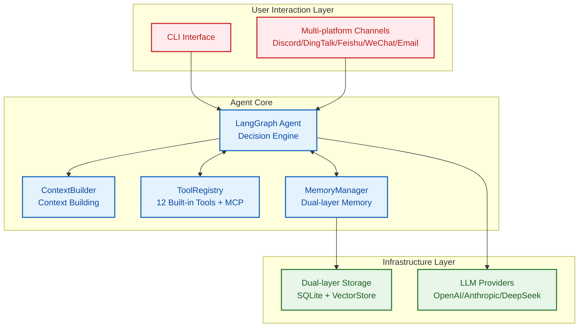
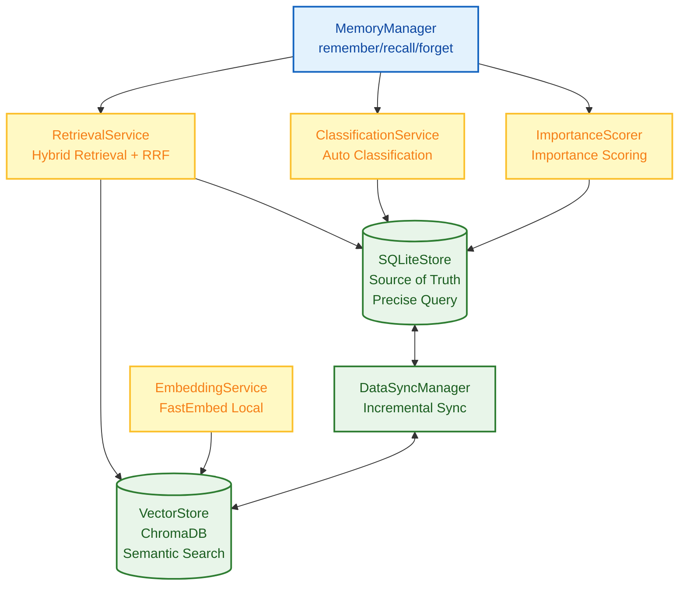
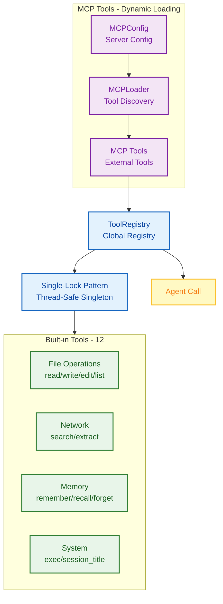
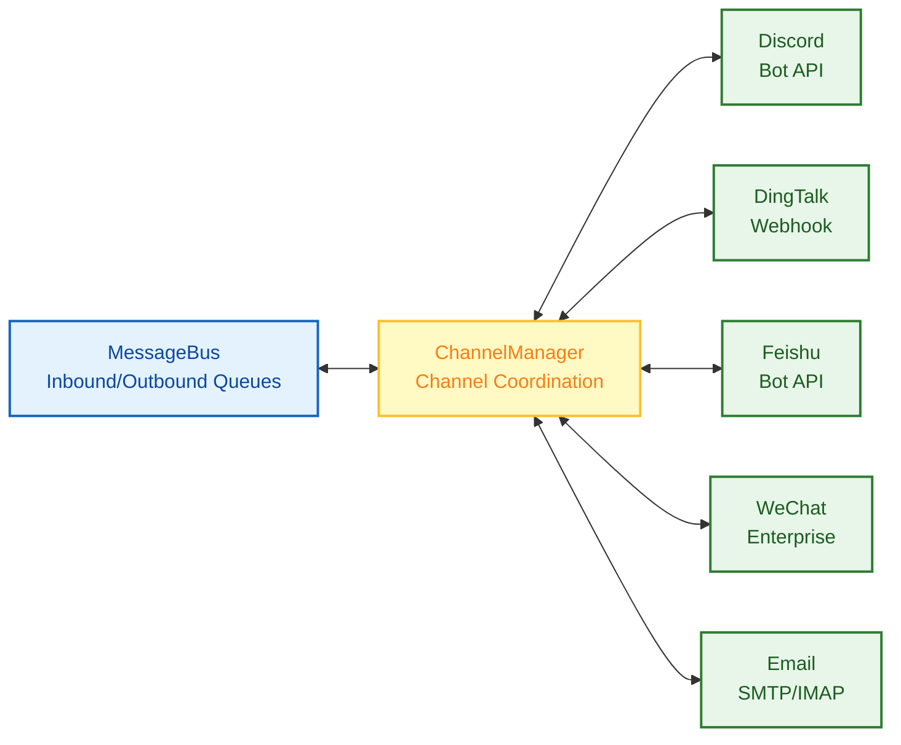
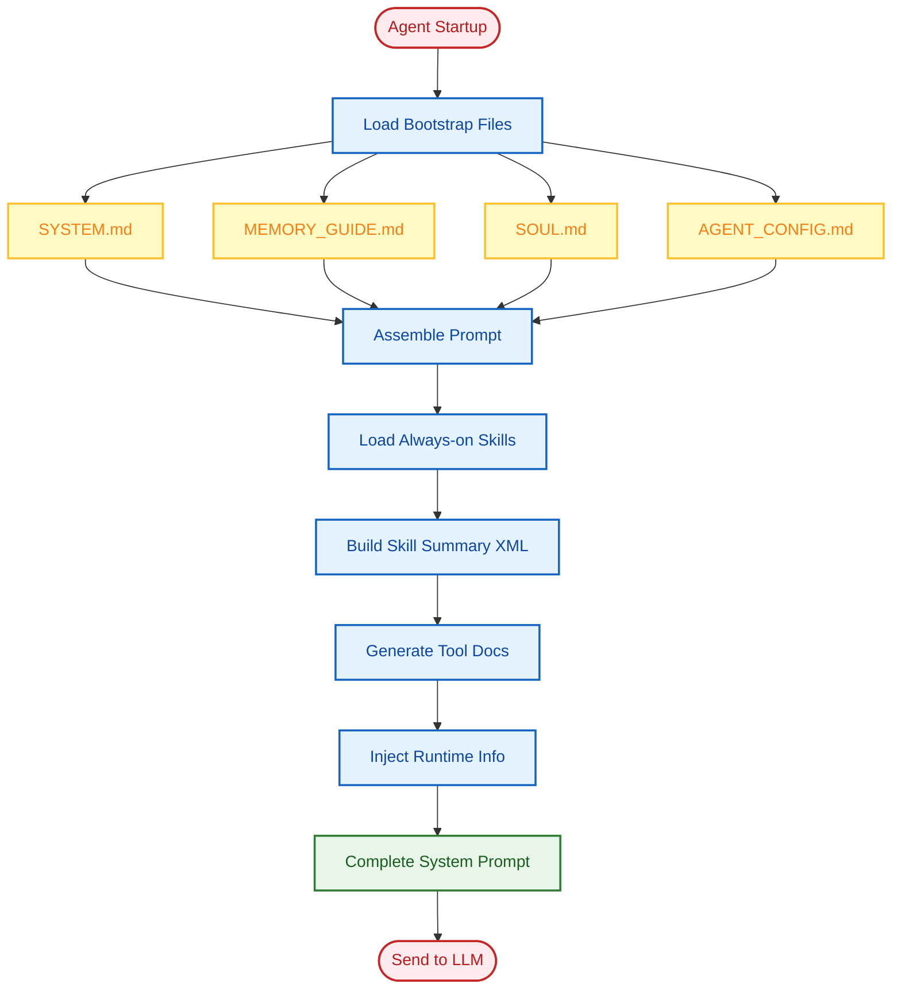

# System Architecture

This document provides an in-depth introduction to FinchBot's system architecture, core components, and their interactions.

## Table of Contents

1. [Overall Architecture](#1-overall-architecture)
2. [Core Components](#2-core-components)
3. [Data Flow](#3-data-flow)
4. [Design Principles](#4-design-principles)
5. [Extension Points](#5-extension-points)

---

## 1. Overall Architecture

FinchBot is built on **LangChain v1.2** + **LangGraph v1.0**, featuring persistent memory, dynamic tool scheduling, multi-platform messaging, and **fully asynchronous concurrent startup**. The system consists of four core components:

1. **Agent Core (Brain)**: Responsible for decision-making, planning, and tool scheduling, supporting async streaming output.
2. **Memory System**: Responsible for long-term information storage and retrieval, utilizing a hybrid architecture of SQLite + FastEmbed + ChromaDB.
3. **Tool Ecosystem**: Responsible for interacting with the external world, supporting lazy loading and thread-pool concurrent initialization, with MCP protocol support.
4. **Channel System**: Responsible for multi-platform message routing, supporting Discord, DingTalk, Feishu, WeChat, Email, etc.

### 1.1 Overall Architecture Diagram



### 1.2 Directory Structure

```
finchbot/
├── agent/              # Agent Core
│   ├── core.py        # Agent creation and execution (Async Optimized)
│   ├── factory.py     # AgentFactory (Concurrent Thread Pool)
│   ├── context.py     # ContextBuilder for prompt assembly
│   └── skills.py      # SkillsLoader for Markdown skills
├── channels/           # Multi-Platform Messaging
│   ├── base.py        # BaseChannel abstract class
│   ├── bus.py         # MessageBus async router
│   ├── manager.py     # ChannelManager coordinator
│   ├── schema.py      # Message models
│   └── implementations/  # Channel implementations
│       ├── discord.py
│       ├── feishu.py
│       ├── dingtalk.py
│       ├── wechat.py
│       └── email.py
├── cli/                # CLI Interface
│   ├── chat_session.py # Async Session Management
│   ├── config_manager.py
│   ├── providers.py
│   └── ui.py
├── config/             # Configuration Management
│   ├── loader.py
│   ├── schema.py      # Includes MCPConfig, ChannelsConfig
│   └── utils.py
├── constants.py        # Unified constants definition
├── i18n/               # Internationalization
│   ├── loader.py      # Language loader
│   └── locales/
├── memory/             # Memory System
│   ├── manager.py
│   ├── types.py
│   ├── services/       # Service Layer
│   ├── storage/        # Storage Layer
│   └── vector_sync.py
├── providers/          # LLM Providers
│   └── factory.py
├── sessions/           # Session Management
│   ├── metadata.py
│   ├── selector.py
│   └── title_generator.py
├── skills/             # Skill System
│   ├── skill-creator/
│   ├── summarize/
│   └── weather/
├── tools/              # Tool System
│   ├── base.py
│   ├── registry.py
│   ├── factory.py     # ToolFactory
│   ├── mcp.py         # MCP Tool Support
│   ├── filesystem.py
│   ├── memory.py
│   ├── shell.py
│   ├── web.py
│   ├── session_title.py
│   └── search/
└── utils/              # Utility Functions
    ├── cache.py
    ├── logger.py
    └── model_downloader.py
```

---

### 1.3 Async Startup Process

FinchBot introduces a fully asynchronous startup architecture, leveraging `asyncio` and `concurrent.futures.ThreadPoolExecutor` to execute time-consuming operations concurrently, significantly improving startup speed.

```mermaid
sequenceDiagram
    autonumber
    participant CLI as CLI (Main Thread)
    participant Loop as Event Loop
    participant Pool as Thread Pool
    participant LLM as LLM Init
    participant Mem as Memory Store
    participant Tools as Tool Factory

    CLI->>Loop: Start _run_chat_session_async
    
    par Concurrent Init Tasks
        Loop->>Pool: Submit create_chat_model
        Pool->>LLM: Load Tiktoken/Schema (Slow)
        LLM-->>Pool: Return ChatModel
        
        Loop->>Pool: Submit SessionMetadataStore
        Pool->>Mem: Connect SQLite
        Mem-->>Pool: Return Store
        
        Loop->>Pool: Submit get_default_workspace
        Pool->>Pool: File I/O Check
    end
    
    Loop->>Pool: Submit AgentFactory.create_for_cli
    Pool->>Tools: create_default_tools
    Tools-->>Pool: Return Tool List
    Pool->>Loop: Return Agent & Tools
    
    Loop->>CLI: Init Complete, Enter Interaction Loop
```

---

## 2. Core Components

### 2.1 Agent Core

**Implementation**: `src/finchbot/agent/`

Agent Core is the brain of FinchBot, responsible for decision-making, planning, and tool scheduling. It now uses a factory pattern to decouple creation logic.

#### Core Components

* **AgentFactory (`factory.py`)**: Responsible for assembling the Agent, coordinating ToolFactory to create toolsets, and initializing Checkpointer.
* **Agent Core (`core.py`)**: Responsible for Agent runtime logic.
    * **State Management**: Based on `LangGraph`'s `StateGraph`, maintaining conversation state (`messages`)
    * **Persistence**: Uses `SqliteSaver` (`checkpoints.db`) to save state snapshots, supporting resume and history rollback
* **ContextBuilder (`context.py`)**: Dynamically assembles the system prompt, including:
    * **Identity**: `SYSTEM.md` (Role definition)
    * **Memory Guide**: `MEMORY_GUIDE.md` (Memory usage guidelines)
    * **Soul**: `SOUL.md` (Soul definition)
    * **Skills**: Dynamically loaded skill descriptions
    * **Tools**: `TOOLS.md` (Tool documentation)
    * **Runtime Info**: Current time, OS, Python version, etc.

#### Key Classes and Functions

| Function/Class | Description |
|:---|:---|
| `AgentFactory.create_for_cli()` | Static factory method to create a configured Agent for CLI |
| `create_finch_agent()` | Creates and configures LangGraph Agent |
| `build_system_prompt()` | Builds the complete system prompt |
| `get_sqlite_checkpointer()` | Gets SQLite persistence checkpoint |

#### Thread Safety Mechanism

Tool registration uses the **single-lock pattern** for lazy loading, ensuring thread safety:

```python
def _register_default_tools() -> None:
    global _default_tools_registered

    if _default_tools_registered:
        return

    with _tools_registration_lock:
        if _default_tools_registered:
            return
        # Actual registration logic...
```

---

### 2.2 Skill System

**Implementation**: `src/finchbot/agent/skills.py`

Skills are FinchBot's unique innovation—**defining Agent capabilities through Markdown files**.

#### Key Feature: Agent Auto-Creates Skills

FinchBot includes a built-in **skill-creator** skill, the ultimate expression of the out-of-the-box philosophy:

> **Just tell the Agent what skill you want, and it will create it automatically!**

```
User: Help me create a translation skill that can translate Chinese to English

Agent: Okay, I'll create a translation skill for you...
       [Invokes skill-creator skill]
        Created skills/translator/SKILL.md
       You can now use the translation feature directly!
```

No manual file creation, no coding—**extend Agent capabilities with just one sentence**!

#### Skill File Structure

```yaml
# SKILL.md example
---
name: weather
description: Query current weather and forecast (no API key required)
metadata:
  finchbot:
    emoji: 
    always: false
    requires:
      bins: [curl]
      env: []
---
# Skill content...
```

#### Core Design Patterns

| Pattern | Description |
|:---:|:---|
| **Dual Skill Source** | Workspace skills first, built-in skills fallback |
| **Dependency Check** | Auto-check CLI tools and environment variables |
| **Cache Invalidation** | Smart caching based on file modification time |
| **Progressive Loading** | Always-on skills first, others on demand |

---

### 2.3 Memory System

**Implementation**: `src/finchbot/memory/`

FinchBot implements an advanced **dual-layer memory architecture** designed to solve LLM context window limits and long-term forgetting issues.

#### Why Agentic RAG?

| Dimension | Traditional RAG | Agentic RAG (FinchBot) |
|:---:|:---|:---|
| **Retrieval Trigger** | Fixed pipeline | Agent autonomous decision |
| **Retrieval Strategy** | Single vector retrieval | Hybrid retrieval + dynamic weight adjustment |
| **Memory Management** | Passive storage | Active remember/recall/forget |
| **Classification** | None | Auto-classification + importance scoring |
| **Update Mechanism** | Full rebuild | Incremental sync |

#### Dual-Layer Storage Architecture



#### Layered Design

1. **Structured Layer (SQLite)**:
    * **Role**: Source of Truth
    * **Content**: Full text, metadata (tags, source), category, importance score, access logs
    * **Advantage**: Supports precise queries (e.g., filtering by time, category)
    * **Implementation**: `SQLiteStore` class, using `aiosqlite` for async operations

2. **Semantic Layer (Vector Store)**:
    * **Role**: Fuzzy retrieval and association
    * **Content**: Embedding vectors of text
    * **Tech Stack**: ChromaDB + FastEmbed (Local lightweight models)
    * **Advantage**: Supports natural language semantic search (e.g., "that Python library I mentioned last time")
    * **Implementation**: `VectorMemoryStore` class

#### Core Services

| Service | Location | Function |
|:---|:---|:---|
| **DataSyncManager** | `memory/vector_sync.py` | Ensures eventual consistency between SQLite and Vector Store, with retry support |
| **ImportanceScorer** | `memory/services/importance.py` | Automatically evaluates memory importance (0.0-1.0) for cleanup and prioritization |
| **RetrievalService** | `memory/services/retrieval.py` | Hybrid retrieval strategy combining vector similarity and metadata filtering |
| **ClassificationService** | `memory/services/classification.py` | Automatic classification based on keywords and semantics |
| **EmbeddingService** | `memory/services/embedding.py` | Local embedding generation using FastEmbed |

#### Hybrid Retrieval Strategy

FinchBot uses **Weighted RRF (Weighted Reciprocal Rank Fusion)** strategy:

```python
class QueryType(StrEnum):
    """Query type determines retrieval weights"""
    KEYWORD_ONLY = "keyword_only"      # Pure keyword (1.0/0.0)
    SEMANTIC_ONLY = "semantic_only"    # Pure semantic (0.0/1.0)
    FACTUAL = "factual"                # Factual (0.8/0.2)
    CONCEPTUAL = "conceptual"          # Conceptual (0.2/0.8)
    COMPLEX = "complex"                # Complex (0.5/0.5)
    AMBIGUOUS = "ambiguous"            # Ambiguous (0.3/0.7)
```

---

### 2.4 Tool Ecosystem

**Implementation**: `src/finchbot/tools/`

#### Registration Mechanism and Factory Pattern

* **ToolFactory (`factory.py`)**: Responsible for creating and assembling the tool list based on configuration. It handles the auto-fallback logic for WebSearchTool (Tavily/Brave/DuckDuckGo).
* **ToolRegistry**: Singleton registry managing all available tools.
* **Lazy Loading**: Default tools (File, Search, etc.) are created by the Factory and automatically registered when the Agent starts.
* **OpenAI Compatible**: Supports exporting tool definitions in OpenAI Function Calling format.
* **MCP Support**: Supports MCP protocol via `mcp.py` for dynamic loading of external tools.

#### Tool System Architecture



#### Tool Base Class

All tools inherit from the `FinchTool` base class and must implement:
- `name`: Tool name
- `description`: Tool description
- `parameters`: Parameter definition (JSON Schema)
- `_run()`: Execution logic

#### Security Sandbox

* **File Operations**: Restricted to the workspace (`workspace`) to prevent unauthorized system access
* **Shell Execution**: High-risk commands (rm -rf /) are disabled by default, with timeout control

#### Built-in Tools

| Tool Name | Category | File | Function |
|:---|:---|:---|:---|
| `read_file` | File | `filesystem.py` | Read file content |
| `write_file` | File | `filesystem.py` | Write file |
| `edit_file` | File | `filesystem.py` | Edit file (line-level) |
| `list_dir` | File | `filesystem.py` | List directory contents |
| `exec` | System | `shell.py` | Execute Shell command |
| `web_search` | Network | `web.py` / `search/` | Web search (supports Tavily/Brave/DuckDuckGo) |
| `web_extract` | Network | `web.py` | Extract web content (supports Jina AI fallback) |
| `remember` | Memory | `memory.py` | Store memory |
| `recall` | Memory | `memory.py` | Retrieve memory |
| `forget` | Memory | `memory.py` | Delete/archive memory |
| `session_title` | System | `session_title.py` | Manage session title |

#### Web Search: Three-Engine Fallback Design


| Priority | Engine | API Key | Features |
|:---:|:---:|:---:|:---|
| 1 | **Tavily** | Required | Best quality, AI-optimized, deep search |
| 2 | **Brave Search** | Required | Large free tier, privacy-friendly |
| 3 | **DuckDuckGo** | Not required | Always available as fallback |

**How it works**:
1. If `TAVILY_API_KEY` is set → Use Tavily (best quality)
2. Else if `BRAVE_API_KEY` is set → Use Brave Search
3. Else → Use DuckDuckGo (no API key needed, always works)

This design ensures **web search works out of the box even without any API key configuration**!

#### Session Title: Smart Naming, Out of the Box

The `session_title` tool embodies FinchBot's out-of-the-box philosophy:

| Method | Description | Example |
|:---:|:---|:---|
| **Auto Generate** | After 2-3 turns, AI automatically generates title based on content | "Python Async Programming Discussion" |
| **Agent Modify** | Tell Agent "Change session title to XXX" | Agent calls tool to modify automatically |
| **Manual Rename** | Press `r` key in session manager to rename | User manually enters new title |

This design lets users **manage sessions without technical details**—whether automatic or manual.

---

### 2.5 Channel System

**Implementation**: `src/finchbot/channels/`

The Channel system is FinchBot's multi-platform messaging infrastructure, providing unified message routing and platform abstraction.

#### Channel System Architecture



#### Core Components

| Component | File | Function |
|:---|:---|:---|
| **BaseChannel** | `base.py` | Abstract base class defining channel interface (start, stop, send, receive) |
| **MessageBus** | `bus.py` | Async message router managing inbound/outbound message queues |
| **ChannelManager** | `manager.py` | Coordinates multiple channels, handles message routing and channel lifecycle |
| **InboundMessage** | `schema.py` | Standardized inbound message format |
| **OutboundMessage** | `schema.py` | Standardized outbound message format |

#### Message Models

```python
class InboundMessage(BaseModel):
    """Inbound message - from platform to Agent"""
    channel_id: str          # Channel identifier
    user_id: str             # User identifier
    content: str             # Message content
    session_id: str | None   # Session ID
    metadata: dict = {}      # Additional metadata

class OutboundMessage(BaseModel):
    """Outbound message - from Agent to platform"""
    channel_id: str          # Target channel
    user_id: str             # Target user
    content: str             # Response content
    session_id: str | None   # Session ID
    metadata: dict = {}      # Additional metadata
```

#### Extending New Channels

1. Inherit `BaseChannel` class
2. Implement required methods: `start()`, `stop()`, `send()`, `receive()`
3. Register with `ChannelManager`

---

### 2.6 Dynamic Prompt System

**Implementation**: `src/finchbot/agent/context.py`

#### Bootstrap File System

```
~/.finchbot/
 SYSTEM.md           # Role definition
 MEMORY_GUIDE.md     # Memory usage guide
 SOUL.md             # Personality settings
 AGENT_CONFIG.md     # Agent configuration
 workspace/
     skills/         # Custom skills
```

#### Prompt Loading Flow



---

### 2.7 I18n System (Internationalization)

**Implementation**: `src/finchbot/i18n/`

#### Supported Languages

- `zh-CN`: Simplified Chinese
- `zh-HK`: Traditional Chinese
- `en-US`: English

#### Language Fallback Chain

The system implements a smart fallback mechanism:
```
zh-CN → zh → en-US
zh-HK → zh → en-US
en-US → (no fallback)
```

#### Configuration Priority

1. Environment variable: `FINCHBOT_LANG`
2. User config: `~/.finchbot/config.json`
3. System language detection
4. Default: `en-US`

---

### 2.8 Configuration System

**Implementation**: `src/finchbot/config/`

Uses Pydantic v2 + Pydantic Settings for type-safe configuration management.

#### Configuration Structure

```
Config (Root)
├── language
├── default_model
├── agents
│   └── defaults (Agent defaults)
├── providers
│   ├── openai
│   ├── anthropic
│   ├── deepseek
│   ├── moonshot
│   ├── dashscope
│   ├── groq
│   ├── gemini
│   ├── openrouter
│   └── custom
├── tools
│   ├── web.search (Search config)
│   ├── exec (Shell execution config)
│   └── restrict_to_workspace
├── mcp                    # MCP Configuration
│   └── servers
│       └── {server_name}
│           ├── command
│           ├── args
│           └── env
└── channels               # Channel Configuration
    ├── discord
    ├── feishu
    ├── dingtalk
    ├── wechat
    └── email
```

#### MCP Configuration Example

```python
class MCPServerConfig(BaseModel):
    command: str           # Startup command
    args: list[str]        # Command arguments
    env: dict[str, str]    # Environment variables

class MCPConfig(BaseModel):
    servers: dict[str, MCPServerConfig]
```

#### Channel Configuration Example

| Channel | Required Config | Description |
|---------|-----------------|-------------|
| Discord | `token` | Bot Token |
| Feishu | `app_id`, `app_secret` | App credentials |
| DingTalk | `client_id`, `client_secret` | Client credentials |
| WeChat | `corp_id`, `agent_id`, `secret` | Enterprise app config |
| Email | `smtp_host`, `smtp_user`, `smtp_password` | SMTP config |

---

## 3. Data Flow

### 3.1 Complete Data Flow


### 3.2 Conversation Flow


1. User input -> Received by CLI
2. Agent loads history state (Checkpoint)
3. ContextBuilder constructs current Prompt (including relevant memory)
4. LLM generates response or tool call request
5. If tool call -> Execute tool -> Return result to LLM -> Loop
6. LLM generates final response -> Display to user

### 3.3 Memory Write Flow (Remember)

1. Agent calls `remember` tool
2. `MemoryManager` receives content
3. Automatically calculates `category` (ClassificationService)
4. Automatically calculates `importance` (ImportanceScorer)
5. Writes to SQLite, generating unique ID
6. Synchronously calls Embedding service, writing vector to ChromaDB
7. Records access log

### 3.4 Memory Retrieval Flow (Recall)

1. Agent calls `recall` tool (Query: "What is my API Key")
2. `RetrievalService` converts query to vector
3. Searches Top-K similar results in Vector Store
4. (Optional) Combines with SQLite for metadata filtering (category, time range, etc.)
5. Returns results to Agent

---

## 4. Design Principles

### 4.1 Modularity

Each component has clear responsibility boundaries:
- `MemoryManager` doesn't directly handle storage details, delegates to `SQLiteStore` and `VectorMemoryStore`
- `ToolRegistry` only handles registration and lookup, doesn't care about tool implementation
- `I18n` system is independent of business logic
- `ChannelManager` coordinates multiple channels, decoupled from Agent core

### 4.2 Dependency Inversion

High-level modules don't depend on low-level modules, both depend on abstractions:
```
AgentCore → MemoryManager (Interface)
                ↓
         SQLiteStore / VectorStore (Implementation)
```

### 4.3 Privacy First

- Embedding generation happens locally (FastEmbed), no cloud upload
- Configuration files stored in user directory `~/.finchbot`
- File operations restricted to workspace

### 4.4 Out of the Box

FinchBot makes "Out of the Box" a core design principle:

| Feature | Description |
|:---:|:---|
| **Three-Step Start** | `config` → `sessions` → `chat`, complete workflow in three commands |
| **Environment Variables** | All configurations can be set via environment variables |
| **Rich CLI Interface** | Full-screen keyboard navigation, interactive operation |
| **i18n Support** | Built-in Chinese/English support, auto-detects system language |
| **Auto Fallback** | Web search automatically falls back: Tavily → Brave → DuckDuckGo |
| **Agent Auto-Create Skills** | Tell Agent your needs, auto-generates skill files |

### 4.5 Defensive Programming

- Single-lock pattern prevents concurrency issues
- Vector store failure doesn't affect SQLite writes (degradation strategy)
- Timeout control prevents tool hanging
- Complete error logging (Loguru)

---

## 5. Extension Points

### 5.1 Adding New Tools

Inherit `FinchTool` base class, implement `_run()` method, then register with `ToolRegistry`.

### 5.2 Adding New Skills

Create a `SKILL.md` file in `~/.finchbot/workspace/skills/{skill-name}/`.

### 5.3 Adding New LLM Providers

Add a new Provider class in `providers/factory.py`.

### 5.4 Adding New Channels

1. Inherit `BaseChannel` class
2. Implement required methods: `start()`, `stop()`, `send()`, `receive()`
3. Register with `ChannelManager`

### 5.5 Custom Memory Retrieval Strategy

Inherit `RetrievalService` or modify the `search()` method.

### 5.6 Adding New Languages

Add a new `.toml` file under `i18n/locales/`.

---

## Summary

FinchBot's architecture design focuses on:
- **Extensibility**: Clear component boundaries and interfaces
- **Reliability**: Degradation strategies, retry mechanisms, thread safety
- **Maintainability**: Type safety, comprehensive logging, modular design
- **Privacy**: Local processing of sensitive data
- **Multi-Platform Support**: Channel system supports Discord, DingTalk, Feishu, WeChat, Email
