<div align="center">
  
  <h1><strong>Xuantong 765 (xt765)</strong></h1>
  <p><strong>LLM Development Engineer | Communication University of China · Digital Media Technology</strong></p>
  <p>
    <a href="https://blog.csdn.net/Yunyi_Chi" target="_blank" style="text-decoration: none;">
      <span style="background-color: #f39c12; color: white; padding: 2px 8px; border-radius: 4px; font-size: 12px; font-weight: bold; display: inline-block;">CSDN · Homepage |</span>
    </a>
    <a href="https://github.com/xt765" target="_blank" style="text-decoration: none; margin-left: 8px;">
      <span style="background-color: #24292e; color: white; padding: 2px 8px; border-radius: 4px; font-size: 12px; font-weight: bold; display: inline-block;">GitHub · Follow</span>
    </a>
  </p>
</div>

---

### **About the Author**

- **Focus Areas**: LLM Development / RAG Knowledge Base / AI Agent Implementation / Model Fine-tuning
- **Tech Stack**: Python | RAG (LangChain / Dify + Milvus) | FastAPI + Docker
- **Engineering**: Model engineering deployment, knowledge base construction & optimization, full-stack solutions

> **"Making AI interaction smarter, making technology implementation more efficient"**
> Welcome technical discussions and project cooperation!

---

# FinchBot - A Truly Flexible AI Agent Framework


> Author: Xuantong 765 (xt765)
> Project: [GitHub - FinchBot](https://github.com/xt765/finchbot)
> Mirror: [Gitee - FinchBot](https://gitee.com/xt765/finchbot)

## Abstract

FinchBot is a lightweight, modular AI Agent framework built on **LangChain v1.2** and **LangGraph v1.0**. It's not just another LLM wrapper—it's a thoughtfully designed architecture focused on three core challenges:

1. **How to enable infinite Agent extensibility?** — Through a dual-layer extension mechanism of Skills and Tools
2. **How to give Agents real memory?** — Through a dual-layer storage architecture + Agentic RAG
3. **How to make Agent behavior customizable?** — Through a dynamic prompt file system

This article dives deep into FinchBot's architecture, showing you the birth of a production-ready Agent framework.

---

## 1. Why FinchBot?

With so many AI Agent frameworks out there, you might ask: Why FinchBot?

### 1.1 Pain Points of Existing Frameworks

| Pain Point | Traditional Approach | FinchBot Solution |
| :---: | :--- | :--- |
| **Hard to Extend** | Modify core code | Inherit base class or create Markdown files |
| **Fragile Memory** | Rely on LLM context window | Dual-layer persistent storage + semantic retrieval |
| **Rigid Prompts** | Hardcoded in source | File system with hot reloading |
| **Outdated Arch** | Old LangChain APIs | LangChain v1.2 + LangGraph v1.0 |

### 1.2 Design Philosophy

```mermaid
graph BT
    %% Style Definitions
    classDef roof fill:#ffebee,stroke:#c62828,stroke-width:3px,color:#b71c1c,rx:10,ry:10;
    classDef pillar fill:#e3f2fd,stroke:#1565c0,stroke-width:2px,color:#0d47a1,rx:8,ry:8;
    classDef base fill:#e8f5e9,stroke:#2e7d32,stroke-width:3px,color:#1b5e20,rx:10,ry:10;

    %% Roof
    Roof("🦅 <b>FinchBot Framework</b><br/>Lightweight • Flexible • Extensible"):::roof

    %% Pillars
    subgraph Pillars [Core Philosophy]
        direction LR
        P("🛡️ <b>Privacy First</b><br/>Local Embedding<br/>No Cloud Upload"):::pillar
        M("🧩 <b>Modularity</b><br/>Factory Pattern<br/>Decoupled"):::pillar
        D("❤️ <b>Dev Friendly</b><br/>Type Safety<br/>Rich Docs"):::pillar
        S("⚡ <b>Fast Startup</b><br/>Fully Async<br/>Thread Pool"):::pillar
        O("📦 <b>Out of Box</b><br/>Zero Config<br/>Auto Fallback"):::pillar
    end

    %% Foundation
    Base("🏗️ <b>Tech Foundation</b><br/>LangChain v1.2 • LangGraph v1.0 • Python 3.13"):::base

    %% Connections
    Base === P & M & D & S & O
    P & M & D & S & O === Roof
```



### 1.3 Out-of-the-Box Experience

FinchBot is designed with **"Out of the Box"** as a core principle:

**Three Commands to Get Started:**

```bash
# Step 1: Configure API keys and default model
uv run finchbot config

# Step 2: Manage your sessions
uv run finchbot sessions

# Step 3: Start chatting
uv run finchbot chat
```

| Feature | Description |
| :---: | :--- |
| **Three-Step Start** | `config` → `sessions` → `chat`, complete workflow |
| **Env Vars** | Configure via `OPENAI_API_KEY`, etc. |
| **Rich CLI** | Full-screen keyboard navigation |
| **i18n** | Built-in English/Chinese support |
| **Auto Fallback** | Web search: Tavily → Brave → DuckDuckGo |
| **Zero Config** | Just set API Key and run |

---

## 2. Architecture: Modularity & Factory Pattern

FinchBot uses the Factory Pattern to enhance flexibility and maintainability.

### 2.1 Overall Architecture

```mermaid
graph TD
    %% Style Definitions
    classDef userLayer fill:#ffebee,stroke:#c62828,stroke-width:2px,color:#b71c1c;
    classDef factoryLayer fill:#fff9c4,stroke:#fbc02d,stroke-width:2px,color:#f57f17;
    classDef coreLayer fill:#e1f5fe,stroke:#01579b,stroke-width:2px,color:#01579b;
    classDef memoryLayer fill:#e8f5e9,stroke:#2e7d32,stroke-width:2px,color:#1b5e20;
    classDef toolLayer fill:#f3e5f5,stroke:#7b1fa2,stroke-width:2px,color:#7b1fa2;
    classDef channelLayer fill:#fce4ec,stroke:#c2185b,stroke-width:2px,color:#c2185b;
    classDef infraLayer fill:#e0f2f1,stroke:#00695c,stroke-width:2px,color:#00695c;

    %% User Interaction Layer
    subgraph UserLayer [User Interaction Layer]
        direction LR
        CLI[🖥️ CLI Interface]
        WebUI[🌐 Web Interface]
        API[🔌 REST API]
    end
    class CLI,WebUI,API userLayer

    %% Channel System
    subgraph ChannelSystem [Channel System - Multi-Platform Messaging]
        direction TB
        Bus[📨 MessageBus]
        CM[🎛️ ChannelManager]
        
        Bus <--> CM
        
        subgraph Channels [Platform Channels]
            WebCh[Web]
            DiscordCh[Discord]
            DingTalkCh[DingTalk]
            FeishuCh[Feishu]
            WeChatCh[WeChat]
            EmailCh[Email]
        end
        
        CM <--> Channels
    end
    class Bus,CM channelLayer
    class WebCh,DiscordCh,DingTalkCh,FeishuCh,WeChatCh,EmailCh channelLayer

    %% Factory Layer
    subgraph FactoryLayer [Factory Layer - Component Assembly]
        direction LR
        AF[🏭 AgentFactory]
        TF[🔧 ToolFactory]
    end
    class AF,TF factoryLayer

    %% Agent Core
    subgraph AgentCore [Agent Core - Intelligence Engine]
        direction TB
        Agent[🧠 LangGraph Agent]
        CB[📝 ContextBuilder]
        SP[📄 System Prompt]
        
        Agent --> CB
        CB --> SP
    end
    class Agent,CB,SP coreLayer

    %% Memory System
    subgraph MemorySystem [Memory System - Dual-Layer Storage]
        direction TB
        MM[💾 MemoryManager]
        
        subgraph Services [Service Layer]
            RS[🔍 RetrievalService]
            CS[📊 ClassificationService]
            IS[⭐ ImportanceScorer]
        end
        
        subgraph Storage [Storage Layer]
            SQLite[(🗄️ SQLite)]
            Vector[(🧮 VectorStore)]
        end
        
        MM --> RS & CS & IS
        RS --> SQLite & Vector
        SQLite <--> Vector
    end
    class MM,RS,CS,IS,SQLite,Vector memoryLayer

    %% Tool Ecosystem
    subgraph ToolEcosystem [Tool Ecosystem - 11 Built-in Tools]
        direction TB
        TR[📋 ToolRegistry]
        
        subgraph BuiltInTools [Built-in Tools]
            FileTools[📁 File Ops]
            WebTools[🌐 Network]
            MemTools[💾 Memory]
            SysTools[⚙️ System]
        end
        
        TR --> BuiltInTools
    end
    class TR,FileTools,WebTools,MemTools,SysTools toolLayer

    %% LLM Providers
    subgraph LLMProviders [LLM Providers - Multi-Model Support]
        direction LR
        OpenAI[OpenAI]
        Anthropic[Anthropic]
        DeepSeek[DeepSeek]
        Gemini[Gemini]
        Groq[Groq]
        Moonshot[Moonshot]
    end
    class OpenAI,Anthropic,DeepSeek,Gemini,Groq,Moonshot infraLayer

    %% Connections
    CLI & WebUI --> Bus
    API --> AF
    
    Bus --> AF
    AF --> Agent
    AF --> TF
    TF --> TR
    
    Agent <--> MM
    Agent <--> TR
    Agent --> OpenAI & Anthropic & DeepSeek & Gemini & Groq & Moonshot
```



### 2.2 Agent Factory

`AgentFactory` assembles a complete Agent instance, hiding initialization complexity.

```python
# Simple creation interface
agent, checkpointer, tools = AgentFactory.create_for_cli(
    session_id=session_id,
    workspace=ws_path,
    model=chat_model,
    config=config_obj,
)
```

### 2.3 Tool Factory

`ToolFactory` manages tool instantiation, handling dependencies and fallback logic.

---

## 3. Memory: Dual-Layer Storage + Agentic RAG

FinchBot implements advanced **dual-layer memory** to solve context limits and forgetting.

### 3.1 Why Agentic RAG?

| Dimension | Traditional RAG | Agentic RAG (FinchBot) |
| :---: | :--- | :--- |
| **Trigger** | Fixed pipeline | Agent decides |
| **Strategy** | Single vector | Hybrid + dynamic weights |
| **Management** | Passive | Active remember/recall/forget |
| **Classification** | None | Auto-classification + scoring |
| **Update** | Full rebuild | Incremental sync |

### 3.2 Dual-Layer Storage

```mermaid
flowchart TB
    %% Style Definitions
    classDef businessLayer fill:#e3f2fd,stroke:#1565c0,stroke-width:2px,color:#0d47a1;
    classDef serviceLayer fill:#fff9c4,stroke:#fbc02d,stroke-width:2px,color:#f57f17;
    classDef storageLayer fill:#e8f5e9,stroke:#2e7d32,stroke-width:2px,color:#1b5e20;

    subgraph Business [Business Layer]
        MM[💾 MemoryManager<br/>remember/recall/forget]
    end
    class MM businessLayer

    subgraph Services [Service Layer]
        RS[🔍 RetrievalService<br/>Hybrid Retrieval + RRF]
        CS[📊 ClassificationService<br/>Auto Classification]
        IS[⭐ ImportanceScorer<br/>Importance Scoring]
        ES[🧮 EmbeddingService<br/>FastEmbed Local]
    end
    class RS,CS,IS,ES serviceLayer

    subgraph Storage [Storage Layer]
        direction LR
        SQLite[(🗄️ SQLiteStore<br/>Source of Truth<br/>Precise Query)]
        Vector[(🧮 VectorStore<br/>ChromaDB<br/>Semantic Search)]
        DS[🔄 DataSyncManager<br/>Incremental Sync]
    end
    class SQLite,Vector,DS storageLayer

    %% Connections
    MM --> RS & CS & IS
    RS --> SQLite & Vector
    CS --> SQLite
    IS --> SQLite
    ES --> Vector
    
    SQLite <--> DS <--> Vector
```



### 3.3 Hybrid Retrieval Strategy

FinchBot uses **Weighted RRF (Weighted Reciprocal Rank Fusion)** to blend keyword and vector search results.

```python
class QueryType(StrEnum):
    """Query type determines retrieval weights"""
    KEYWORD_ONLY = "keyword_only"      # Pure keyword (1.0/0.0)
    SEMANTIC_ONLY = "semantic_only"    # Pure semantic (0.0/1.0)
    FACTUAL = "factual"                # Factual (0.8/0.2)
    CONCEPTUAL = "conceptual"          # Conceptual (0.2/0.8)
    COMPLEX = "complex"                # Complex (0.5/0.5)
    AMBIGUOUS = "ambiguous"            # Ambiguous (0.3/0.7)
```

---

## 4. Dynamic Prompts: Editable Brain

FinchBot uses a **file system + modular assembly** approach for prompts.

### 4.1 Bootstrap Files

```
~/.finchbot/
├── SYSTEM.md           # Role definition
├── MEMORY_GUIDE.md     # Memory guide
├── SOUL.md             # Personality
├── AGENT_CONFIG.md     # Configuration
└── workspace/
    └── skills/         # Custom skills
```

### 4.2 Loading Flow

```mermaid
flowchart TD
    %% Style Definitions
    classDef startEnd fill:#ffebee,stroke:#c62828,stroke-width:2px,color:#b71c1c;
    classDef process fill:#e3f2fd,stroke:#1565c0,stroke-width:2px,color:#0d47a1;
    classDef file fill:#fff9c4,stroke:#fbc02d,stroke-width:2px,color:#f57f17;
    classDef output fill:#e8f5e9,stroke:#2e7d32,stroke-width:2px,color:#1b5e20;

    A([🚀 Agent Startup]):::startEnd --> B[📂 Load Bootstrap Files]:::process
    
    B --> C[SYSTEM.md]:::file
    B --> D[MEMORY_GUIDE.md]:::file
    B --> E[SOUL.md]:::file
    B --> F[AGENT_CONFIG.md]:::file

    C --> G[🔧 Assemble Prompt]:::process
    D --> G
    E --> G
    F --> G

    G --> H[📚 Load Always-on Skills]:::process
    H --> I[🏗️ Build Skill Summary XML]:::process
    I --> J[📋 Generate Tool Docs]:::process
    J --> K[⚙️ Inject Runtime Info]:::process
    K --> L[📝 Complete System Prompt]:::output

    L --> M([📤 Send to LLM]):::startEnd
```



---

## 5. Skills & Tools: Infinite Extensibility

### 5.1 Tool System

Tools connect the Agent to the world. FinchBot provides 11 built-in tools.

#### Web Search: Three-Engine Fallback

```mermaid
flowchart TD
    %% Style Definitions
    classDef check fill:#fff9c4,stroke:#fbc02d,stroke-width:2px,color:#f57f17;
    classDef engine fill:#e8f5e9,stroke:#2e7d32,stroke-width:2px,color:#1b5e20;
    classDef fallback fill:#e3f2fd,stroke:#1565c0,stroke-width:2px,color:#0d47a1;

    Start[🔍 Web Search Request]:::check
    
    Check1{TAVILY_API_KEY<br/>Set?}:::check
    Tavily[🚀 Tavily<br/>Best Quality<br/>AI-Optimized]:::engine
    
    Check2{BRAVE_API_KEY<br/>Set?}:::check
    Brave[🦁 Brave Search<br/>Privacy Friendly<br/>Large Free Tier]:::engine
    
    DDG[🦆 DuckDuckGo<br/>Zero Config<br/>Always Available]:::fallback

    Start --> Check1
    Check1 -->|Yes| Tavily
    Check1 -->|No| Check2
    Check2 -->|Yes| Brave
    Check2 -->|No| DDG
```



| Priority | Engine | API Key | Features |
| :---: | :---: | :---: | :--- |
| 1 | **Tavily** | Required | Best quality, AI-optimized |
| 2 | **Brave** | Required | Privacy-friendly |
| 3 | **DuckDuckGo** | None | Always available |

### 5.2 Skill System

Skills are defined via Markdown files.

#### Killer Feature: Agent Auto-Creates Skills

> **Just tell the Agent what skill you want, and it creates it!**

```
User: Create a translation skill for Chinese to English.

Agent: Okay, creating translation skill...
       [Invokes skill-creator]
       ✅ Created skills/translator/SKILL.md
       You can now use translation!
```

---

## 6. Web Interface & Docker Deployment

### 6.1 Web Interface (Beta)

FinchBot now provides a modern Web interface built with React + Vite + FastAPI.

```mermaid
flowchart TB
    %% Style Definitions
    classDef backend fill:#e3f2fd,stroke:#1565c0,stroke-width:2px,color:#0d47a1;
    classDef frontend fill:#e8f5e9,stroke:#2e7d32,stroke-width:2px,color:#1b5e20;
    classDef user fill:#fff9c4,stroke:#fbc02d,stroke-width:2px,color:#f57f17;

    subgraph Backend [Backend Service]
        API[FastAPI<br/>:8000]:::backend
        WS[WebSocket<br/>Real-time]:::backend
    end

    subgraph Frontend [Frontend Interface]
        React[React + Vite<br/>:5173]:::frontend
        MD[Markdown Rendering]:::frontend
    end

    U[👤 User]:::user --> React
    React <--> WS
    WS <--> API

    API --> React
    React --> MD
    MD --> U
```



**How to Start**:

```bash
# Start backend server
uv run finchbot serve

# In another terminal, start frontend
cd web
npm install
npm run dev
```

Web Interface Features:
- Real-time streaming output
- Markdown rich text rendering
- Code highlighting
- Auto-loading history

### 6.2 Docker Deployment

FinchBot provides complete Docker support with one-click deployment:

```bash
# 1. Clone repository
git clone https://github.com/xt765/finchbot.git
cd finchbot

# 2. Configure environment variables
cp .env.example .env
# Edit .env file and add your API keys

# 3. Build and start
docker-compose up -d

# 4. Access the service
# Web UI: http://localhost:8000
```

**docker-compose.yml Configuration**:

```yaml
services:
  finchbot:
    build:
      context: .
      dockerfile: Dockerfile
    container_name: finchbot
    ports:
      - "8000:8000"
    environment:
      - OPENAI_API_KEY=${OPENAI_API_KEY}
      - ANTHROPIC_API_KEY=${ANTHROPIC_API_KEY}
      - FINCHBOT_LANGUAGE=en-US
    volumes:
      - finchbot_workspace:/root/.finchbot/workspace
      - finchbot_models:/root/.cache/huggingface
    restart: unless-stopped
    healthcheck:
      test: ["CMD", "curl", "-f", "http://localhost:8000/health"]
      interval: 30s
      timeout: 10s
      retries: 3

volumes:
  finchbot_workspace:
  finchbot_models:
```

**Docker Deployment Features**:

| Feature | Description |
| :-----: | :---------- |
| **One-command Deploy** | `docker-compose up -d` |
| **Persistent Storage** | Workspace and model cache via volumes |
| **Health Check** | Built-in container health monitoring |
| **Multi-arch Support** | Works on x86_64 and ARM64 |

---

## 7. LangChain 1.2 Practice

FinchBot is built on the latest stack.

### 7.1 Supported Providers

| Provider | Models | Features |
| :---: | :--- | :--- |
| OpenAI | GPT-5, GPT-5.2, O3-mini | Best capability |
| Anthropic | Claude Sonnet 4.5, Opus 4.6 | Safety, long context |
| DeepSeek | DeepSeek Chat, Reasoner | Cost-effective |
| Gemini | Gemini 2.5 Flash | Google's latest |
| Groq | Llama 4 Scout/Maverick | Ultra-fast |
| Moonshot | Kimi K1.5/K2.5 | Long context |

---

## 8. Summary

FinchBot is a thoughtfully designed Agent framework:

| Feature | Highlight |
| :---: | :--- |
| **Architecture** | Factory pattern, high cohesion |
| **Memory** | Dual-layer, Agentic RAG, Weighted RRF |
| **Prompts** | File system, hot reload, modular |
| **Tools** | Registry pattern, thread safe, auto fallback |
| **Skills** | Markdown definition, auto-create |
| **Stack** | LangChain v1.2, LangGraph v1.0 |
| **Deployment** | CLI / Web Interface / Docker |
| **Experience** | Env vars, Rich CLI, i18n |

If you are looking for a framework that is:

* ✅ Privacy First
* ✅ Truly Persistent
* ✅ Production Ready
* ✅ Flexible & Extensible
* ✅ Modern Architecture
* ✅ Out of the Box
* ✅ Multiple Deployment Options

FinchBot is worth a try.

---

## Links

* 📦 **Project**: [GitHub - FinchBot](https://github.com/xt765/finchbot) | [Gitee - FinchBot](https://gitee.com/xt765/finchbot)
* 📖 **Docs**: [FinchBot Docs](https://github.com/xt765/finchbot/tree/main/docs)
* 💬 **Issues**: [GitHub Issues](https://github.com/xt765/finchbot/issues)

---

> If this helps you, please give it a Star ⭐️
