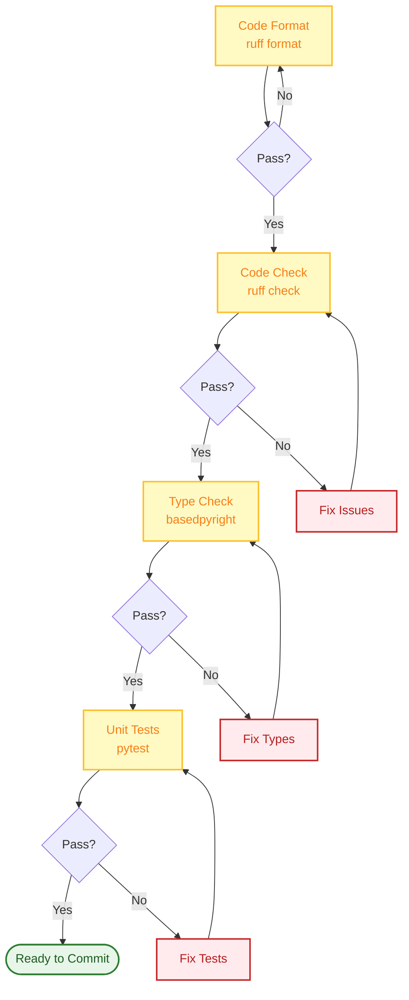
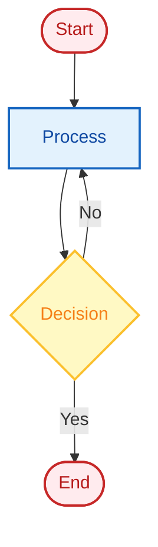

# Contributing Guide

Thank you for your interest in FinchBot! We welcome all forms of contributions, including code, documentation, design, testing, and feedback.

## Table of Contents

1. [Quick Start](#1-quick-start)
2. [Development Workflow](#2-development-workflow)
3. [Code Style](#3-code-style)
4. [Commit Convention](#4-commit-convention)
5. [Documentation Contribution](#5-documentation-contribution)
6. [Code of Conduct](#6-code-of-conduct)

---

## 1. Quick Start

### Contribution Process


### 1.1 Fork Repository

Fork the project to your account on GitHub or Gitee.

### 1.2 Create Branch

Create your feature branch based on `main`:

```bash
git checkout -b feature/your-feature-name
# or
git checkout -b fix/your-bug-fix
```

### 1.3 Development

- Follow code style guidelines (Ruff)
- Add unit tests for new features
- Ensure all tests pass
- Use `uv run` for local testing

### 1.4 Submit Pull Request

Push your branch to GitHub and create a Pull Request. Please describe your changes in detail in the PR description.

---

## 2. Development Workflow

### 2.1 Environment Setup

```bash
# Install dev dependencies
uv sync --extra dev

# Configure pre-commit hooks (optional)
pre-commit install
```

### 2.2 Development Checklist



### 2.3 Run Tests

```bash
# Run all tests
uv run pytest

# Run specific test
uv run pytest tests/test_memory.py

# Run coverage test
uv run pytest --cov=src --cov-report=html
```

---

## 3. Code Style

### 3.1 Formatting Tool

Use **Ruff** for code formatting and linting:

```bash
# Format code
uv run ruff format .

# Lint code
uv run ruff check .

# Auto-fix
uv run ruff check --fix .
```

### 3.2 Type Hints

**Type Hints** are required, checked by BasedPyright:

```python
# Good example
def remember(self, content: str, category: str | None = None) -> str:
    ...

# Bad example
def remember(self, content, category=None):
    ...
```

### 3.3 Docstrings

Use **Google Style Docstrings**:

```python
def recall(self, query: str, top_k: int = 5) -> list[dict[str, Any]]:
    """Retrieve relevant memories.

    Args:
        query: The query text.
        top_k: Number of results to return.

    Returns:
        List of memory dictionaries.

    Raises:
        ValueError: If query is empty.
    """
    ...
```

---

## 4. Commit Convention

### 4.1 Conventional Commits

Follow [Conventional Commits](https://www.conventionalcommits.org/) specification:

```
<type>(<scope>): <description>

[optional body]

[optional footer(s)]
```

### 4.2 Commit Types

| Type | Description | Example |
| :--- | :--- | :--- |
| `feat` | New feature | `feat: add memory recall tool` |
| `fix` | Bug fix | `fix: handle api timeout error` |
| `docs` | Documentation update | `docs: update installation guide` |
| `style` | Code format | `style: format with ruff` |
| `refactor` | Refactoring | `refactor: simplify memory manager` |
| `test` | Testing | `test: add unit tests for tools` |
| `chore` | Miscellaneous | `chore: update dependencies` |

### 4.3 Commit Examples

```bash
# Good commits
git commit -m "feat: add web search fallback to DuckDuckGo"
git commit -m "fix: handle empty query in recall tool"
git commit -m "docs: update architecture diagram"

# Bad commits
git commit -m "update code"
git commit -m "fix bug"
git commit -m "changes"
```

---

## 5. Documentation Contribution

### 5.1 Documentation Structure

```
docs/
 zh-CN/              # Chinese docs
    architecture.md
    api.md
    config.md
    deployment.md
    development.md
    contributing.md
    guide/
       usage.md
       extension.md
    blog/
 en-US/              # English docs
     ...
```

### 5.2 Documentation Guidelines

1. **Sync Updates**: Update related docs when modifying code
2. **Bilingual Maintenance**: Keep Chinese and English docs consistent
3. **Mermaid Diagrams**: Use Mermaid for architecture and flow diagrams
4. **Code Examples**: Provide runnable code examples

### 5.3 Mermaid Diagram Style



---

## 6. Code of Conduct

- Respect all contributors
- Maintain professional and friendly communication
- Accept constructive criticism
- Focus on what's best for the community

---

## Contact

- **Issues**: [GitHub Issues](https://github.com/xt765/finchbot/issues)
- **Pull Requests**: [GitHub PRs](https://github.com/xt765/finchbot/pulls)
- **Gitee**: [Gitee Repository](https://gitee.com/xt765/finchbot)

Thank you for your contribution! 
