# Deployment Guide

This document covers FinchBot deployment methods, including local deployment, Docker deployment, and production environment recommendations.

## Table of Contents

1. [Local Deployment](#1-local-deployment)
2. [Docker Deployment](#2-docker-deployment)
3. [Production Recommendations](#3-production-recommendations)
4. [Security Considerations](#4-security-considerations)

---

## 1. Local Deployment

### Prerequisites

| Requirement | Description |
| :--- | :--- |
| OS | Windows / Linux / macOS |
| Python | 3.13+ |
| Package Manager | uv (Recommended) |
| Disk Space | ~500MB (including embedding model) |

### Quick Deployment

```bash
# 1. Clone repository
git clone https://gitee.com/xt765/finchbot.git
# or git clone https://github.com/xt765/finchbot.git

cd finchbot

# 2. Install dependencies
uv sync

# 3. Configure
uv run finchbot config

# 4. Run
uv run finchbot chat
```

---

## 2. Docker Deployment

FinchBot doesn't provide official Docker images yet, but you can build using this `Dockerfile`:

### Dockerfile

```dockerfile
FROM python:3.13-slim

WORKDIR /app

# Install uv
RUN pip install uv

# Copy project files
COPY pyproject.toml uv.lock ./
COPY src/ ./src/
COPY README.md ./

# Install dependencies
RUN uv sync --frozen

# Set entrypoint
ENTRYPOINT ["uv", "run", "finchbot"]
CMD ["chat"]
```

### Build and Run

```bash
# Build image
docker build -t finchbot .

# Run container (interactive mode)
docker run -it \
    -v ~/.finchbot:/root/.finchbot \
    -e OPENAI_API_KEY=sk-... \
    finchbot chat

# Run web service
docker run -d \
    -p 8000:8000 \
    -v ~/.finchbot:/root/.finchbot \
    -e OPENAI_API_KEY=sk-... \
    finchbot serve
```

### Docker Compose

```yaml
version: '3.8'

services:
  finchbot:
    build: .
    ports:
      - "8000:8000"
    volumes:
      - ~/.finchbot:/root/.finchbot
    environment:
      - OPENAI_API_KEY=${OPENAI_API_KEY}
      - FINCHBOT_LANGUAGE=en-US
    command: serve
```

---

## 3. Production Recommendations

### Architecture Recommendations

```mermaid
flowchart TB
    %% Style Definitions
    classDef userLayer fill:#ffebee,stroke:#c62828,stroke-width:2px,color:#b71c1c;
    classDef appLayer fill:#e3f2fd,stroke:#1565c0,stroke-width:2px,color:#0d47a1;
    classDef dataLayer fill:#e8f5e9,stroke:#2e7d32,stroke-width:2px,color:#1b5e20;

    subgraph Users [User Layer]
        U[👤 User]:::userLayer
    end

    subgraph App [Application Layer]
        LB[⚖️ Load Balancer]:::appLayer
        API[🚀 API Server<br/>FastAPI]:::appLayer
        Agent[🧠 Agent<br/>LangGraph]:::appLayer
    end

    subgraph Data [Data Layer]
        PG[(🐘 PostgreSQL<br/>Checkpointer)]:::dataLayer
        Vector[(🧮 Vector DB<br/>Pinecone/Milvus)]:::dataLayer
        Redis[(⚡ Redis<br/>Cache)]:::dataLayer
    end

    U --> LB
    LB --> API
    API --> Agent
    Agent --> PG & Vector & Redis
```



### Database Upgrade

| Component | Development | Production |
| :--- | :--- | :--- |
| Checkpointer | SQLite | PostgreSQL |
| Vector DB | ChromaDB (local) | Pinecone / Milvus |
| Cache | None | Redis |

### Log Management

```python
# Configure log output to ELK Stack
import logging
from loguru import logger

# Remove default handler
logger.remove()

# Add JSON format output
logger.add(
    "logs/finchbot.json",
    format="{message}",
    serialize=True,
    rotation="100 MB",
    retention="7 days"
)
```

### Monitoring Metrics

| Metric | Description |
| :--- | :--- |
| Response Time | API request latency |
| Token Usage | LLM call statistics |
| Memory Storage | SQLite / Vector DB size |
| Tool Call Frequency | Tool usage statistics |

---

## 4. Security Considerations

### API Key Management


| Method | Security | Recommended For |
| :--- | :---: | :--- |
| Environment Variables | ✅ High | All environments |
| Secret Management Service | ✅ High | Production |
| Config File | ⚠️ Medium | Development |
| Hardcoded | ❌ Low | Not recommended |

### Shell Execution Security

`ExecTool` has potential risks. Recommendations:

1. **Blacklist Filtering**: Disable high-risk commands by default (`rm -rf /`, `mkfs`, `dd`)
2. **Sandbox Isolation**: Run in Docker container
3. **Permission Restriction**: Run as non-root user
4. **Timeout Control**: Set command execution timeout

```python
# Configure Shell execution limits
tools:
  exec:
    timeout: 60
    disabled_commands:
      - "rm -rf /"
      - "mkfs"
      - "dd"
      - "shutdown"
```

### File System Security

```python
# Restrict file operations scope
tools:
  restrict_to_workspace: true
```

| Setting | Description |
| :--- | :--- |
| `restrict_to_workspace: true` | File operations restricted to workspace |
| `restrict_to_workspace: false` | Allow access to any path (not recommended) |

---

## Deployment Checklist

- [ ] API Key configured as environment variable
- [ ] File operations restricted to workspace
- [ ] Shell execution blacklist configured
- [ ] Log output configured
- [ ] Database backup strategy set
- [ ] Monitoring alerts configured
