# Development Guide

This document covers FinchBot development environment setup, testing, code quality standards, and project structure.

## Table of Contents

1. [Environment Setup](#1-environment-setup)
2. [Testing](#2-testing)
3. [Code Quality](#3-code-quality)
4. [Directory Structure](#4-directory-structure)
5. [Automation Mechanisms](#5-automation-mechanisms)

---

## 1. Environment Setup

### 1.1 Install UV

FinchBot uses [uv](https://github.com/astral-sh/uv) for dependency management and virtual environment isolation.

```powershell
# Windows (PowerShell)
powershell -ExecutionPolicy ByPass -c "irm https://astral.sh/uv/install.ps1 | iex"

# macOS/Linux
curl -LsSf https://astral.sh/uv/install.sh | sh
```

### 1.2 Clone Repository

```bash
# Gitee (recommended for users in China)
git clone https://gitee.com/xt765/finchbot.git

# or GitHub
git clone https://github.com/xt765/finchbot.git

cd finchbot
```

### 1.3 Install Dependencies

**Production** (regular users):

```bash
uv sync
```

**Development** (contributors):

```bash
uv sync --extra dev
```

> **Note**:
> - `uv sync` installs production dependencies
> - `--extra dev` additionally installs dev tools: pytest, ruff, basedpyright
> - The embedding model (~95MB) will be automatically downloaded on first run to `.models/fastembed/`, no manual intervention required.

### 1.4 Development Environment Setup Flow

```mermaid
flowchart LR
    %% Style Definitions
    classDef step fill:#e3f2fd,stroke:#1565c0,stroke-width:2px,color:#0d47a1,rx:10,ry:10;

    A["1️⃣ Install uv"]:::step --> B["2️⃣ Clone Repository"]:::step
    B --> C["3️⃣ uv sync --extra dev"]:::step
    C --> D["4️⃣ finchbot config"]:::step
    D --> E["5️⃣ Start Development"]:::step
```



---

## 2. Testing

### 2.1 Run Unit Tests

```bash
uv run pytest
```

### 2.2 Run Coverage Tests

```bash
uv run pytest --cov=src --cov-report=html
```

View `htmlcov/index.html` report.

### 2.3 Test Specific Modules

```bash
# Test specific file
uv run pytest tests/test_memory.py

# Test specific function
uv run pytest tests/test_memory.py::test_remember

# Verbose output
uv run pytest -v tests/
```

### 2.4 Test Structure

```
tests/
├── test_agent.py        # Agent related tests
├── test_memory.py       # Memory system tests
├── test_tools.py        # Tool tests
├── test_config.py       # Configuration tests
└── conftest.py          # Test configuration and fixtures
```

---

## 3. Code Quality

### 3.1 Formatting

```bash
uv run ruff format .
```

### 3.2 Linting

```bash
uv run ruff check .
```

### 3.3 Type Checking

```bash
uv run basedpyright src
```

### 3.4 Development Workflow

```mermaid
flowchart TD
    %% Style Definitions
    classDef startEnd fill:#ffebee,stroke:#c62828,stroke-width:2px,color:#b71c1c;
    classDef process fill:#e3f2fd,stroke:#1565c0,stroke-width:2px,color:#0d47a1;
    classDef decision fill:#fff9c4,stroke:#fbc02d,stroke-width:2px,color:#f57f17;

    A([📝 Write Code]):::startEnd --> B[🔧 ruff format]:::process
    B --> C{Format OK?}:::decision
    C -->|No| B
    C -->|Yes| D[🔍 ruff check]:::process
    D --> E{Lint Pass?}:::decision
    E -->|No| F[Fix Issues]:::process
    F --> D
    E -->|Yes| G[📊 basedpyright]:::process
    G --> H{Types OK?}:::decision
    H -->|No| I[Fix Types]:::process
    I --> G
    H -->|Yes| J[🧪 pytest]:::process
    J --> K{Tests Pass?}:::decision
    K -->|No| L[Fix Tests]:::process
    L --> J
    K -->|Yes| M([✅ Commit Code]):::startEnd
```



### 3.5 Pre-commit Hooks (Optional)

Create `.pre-commit-config.yaml`:

```yaml
repos:
  - repo: https://github.com/astral-sh/ruff-pre-commit
    rev: v0.1.0
    hooks:
      - id: ruff
        args: [--fix]
      - id: ruff-format
```

---

## 4. Directory Structure

```
finchbot/
├── src/finchbot/          # Source code
│   ├── agent/             # Agent logic
│   │   ├── core.py       # Agent creation and execution
│   │   ├── factory.py    # AgentFactory
│   │   ├── context.py    # ContextBuilder
│   │   └── skills.py     # SkillsLoader
│   ├── memory/            # Memory system
│   │   ├── manager.py    # MemoryManager
│   │   ├── types.py      # Type definitions
│   │   ├── services/     # Service layer
│   │   └── storage/      # Storage layer
│   ├── tools/             # Tool collection
│   │   ├── base.py       # FinchTool base class
│   │   ├── factory.py    # ToolFactory
│   │   ├── registry.py   # ToolRegistry
│   │   └── *.py          # Tool implementations
│   ├── channels/          # Multi-platform messaging
│   │   ├── base.py       # BaseChannel
│   │   ├── bus.py        # MessageBus
│   │   └── manager.py    # ChannelManager
│   ├── cli/               # Command line interface
│   │   ├── chat_session.py
│   │   ├── config_manager.py
│   │   └── ui.py
│   ├── config/            # Configuration management
│   │   ├── loader.py
│   │   └── schema.py
│   ├── i18n/              # Internationalization
│   │   ├── loader.py
│   │   └── locales/
│   ├── providers/         # LLM providers
│   │   └── factory.py
│   ├── server/            # Web server
│   │   ├── main.py       # FastAPI
│   │   └── loop.py       # AgentLoop
│   ├── sessions/          # Session management
│   └── utils/             # Utility functions
│       ├── logger.py
│       └── model_downloader.py
├── tests/                 # Test directory
├── docs/                  # Documentation
│   ├── zh-CN/            # Chinese docs
│   └── en-US/            # English docs
├── web/                   # Web frontend
│   ├── src/
│   └── package.json
├── .models/               # Local model cache (auto-generated)
├── pyproject.toml         # Project configuration
└── uv.lock               # Dependency lock
```

---

## 5. Automation Mechanisms

### 5.1 Model Lazy Loading

FinchBot uses **Runtime Lazy Loading** strategy for large file dependencies:

```mermaid
flowchart TD
    %% Style Definitions
    classDef startEnd fill:#ffebee,stroke:#c62828,stroke-width:2px,color:#b71c1c;
    classDef process fill:#e3f2fd,stroke:#1565c0,stroke-width:2px,color:#0d47a1;
    classDef decision fill:#fff9c4,stroke:#fbc02d,stroke-width:2px,color:#f57f17;

    A([📦 uv sync]):::startEnd --> B[Install Python deps only]:::process
    B --> C([🚀 finchbot chat]):::startEnd
    C --> D{Model exists?}:::decision
    D -->|Yes| E([✅ Start directly]):::startEnd
    D -->|No| F[Detect network]:::process
    F --> G{China network?}:::decision
    G -->|Yes| H[Use hf-mirror.com]:::process
    G -->|No| I[Use Hugging Face]:::process
    H --> J[Download model]:::process
    I --> J
    J --> E
```



1. **Install Phase**: `uv sync` only installs Python dependencies, not the model.
2. **Runtime Phase**: When user runs `finchbot chat`:
    - System checks `.models/fastembed` directory.
    - If model doesn't exist, automatically selects best mirror (China/International) and downloads.
    - After download, seamlessly enters the application.

This design avoids build isolation issues and ensures good download experience for users in China.

### 5.2 Tool Lazy Loading

Tool registration uses **Double-checked locking** for thread-safe lazy loading:

```python
def _register_default_tools() -> None:
    global _default_tools_registered

    if _default_tools_registered:
        return

    with _tools_registration_lock:
        if _default_tools_registered:
            return
        # Actual registration logic...
        _default_tools_registered = True
```

### 5.3 Async Startup Optimization

FinchBot uses `asyncio` + `ThreadPoolExecutor` for concurrent initialization:

| Task | Duration | Concurrent |
| :--- | :--- | :---: |
| LLM Model Init | ~2-5s | ✅ |
| SQLite Connection | ~0.1s | ✅ |
| Workspace Check | ~0.1s | ✅ |
| Tool Creation | ~0.5s | ✅ |

---

## FAQ

### Q: How to debug Agent behavior?

```bash
# Enable DEBUG logging
finchbot -vv chat
```

### Q: How to test specific tool?

```python
# tests/test_tools.py
from finchbot.tools.filesystem import ReadFileTool

def test_read_file():
    tool = ReadFileTool()
    result = tool._run(file_path="test.txt")
    assert result is not None
```

### Q: How to add new tests?

1. Create `test_*.py` file in `tests/` directory
2. Write tests using `pytest` framework
3. Run `uv run pytest` to verify
