# Extension Guide

FinchBot provides powerful extension capabilities, allowing developers to enhance Agent capabilities by **adding new Tools** and **writing new Skills**.

## Table of Contents

1. [Adding New Tools](#1-adding-new-tools)
2. [Writing New Skills](#2-writing-new-skills)
3. [Custom Memory Retrieval Strategy](#3-custom-memory-retrieval-strategy)
4. [Adding New LLM Providers](#4-adding-new-llm-providers)
5. [Best Practices](#5-best-practices)

---

## 1. Adding New Tools

Tools are Python code used to perform actual operations (such as calling APIs, processing data, manipulating files, etc.). All tools must inherit from `finchbot.tools.base.FinchTool`.

### Tool Development Process

```mermaid
flowchart LR
    %% Style Definitions
    classDef step fill:#e3f2fd,stroke:#1565c0,stroke-width:2px,color:#0d47a1,rx:10,ry:10;

    A["1️⃣ Create Tool Class<br/>Inherit FinchTool"]:::step --> B["2️⃣ Define Parameters<br/>JSON Schema"]:::step
    B --> C["3️⃣ Implement Logic<br/>_run / _arun"]:::step
    C --> D["4️⃣ Register Tool<br/>Factory / Registry"]:::step
```



### Step 1: Create Tool Class

Create a new Python file (e.g., `src/finchbot/tools/custom/my_tool.py`) and define the tool class.

```python
from typing import Any, ClassVar
from finchbot.tools.base import FinchTool

class WeatherTool(FinchTool):
    """Weather query tool.
    
    Allows Agent to query weather conditions for a specified city.
    """
    
    name: str = "get_weather"
    
    description: str = "Get current weather for a specific city."
    
    parameters: ClassVar[dict[str, Any]] = {
        "type": "object",
        "properties": {
            "city": {
                "type": "string",
                "description": "The name of the city, e.g. Beijing, New York",
            },
            "unit": {
                "type": "string",
                "enum": ["celsius", "fahrenheit"],
                "description": "Temperature unit",
                "default": "celsius"
            }
        },
        "required": ["city"],
    }

    def _run(self, city: str, unit: str = "celsius") -> str:
        """Synchronous execution logic."""
        return f"The weather in {city} is Sunny, 25 degrees {unit}."

    async def _arun(self, city: str, unit: str = "celsius") -> str:
        """Asynchronous execution logic (optional)."""
        return self._run(city, unit)
```

### Step 2: Register Tool

**Method A: Modify Tool Factory (Recommended for built-in tools)**

Modify `create_default_tools` in `src/finchbot/tools/factory.py`:

```python
from finchbot.tools.custom.my_tool import WeatherTool

class ToolFactory:
    def create_default_tools(self) -> list[BaseTool]:
        tools: list[BaseTool] = [
            # ... existing tools
            WeatherTool(),  # Add new tool instance
        ]
        return tools
```

**Method B: Runtime Registration (Recommended for plugins)**

```python
from finchbot.tools.registry import get_global_registry
from my_plugin import WeatherTool

registry = get_global_registry()
registry.register(WeatherTool())
```

### Tool Design Principles

| Principle | Description |
| :---: | :--- |
| **Single Responsibility** | One tool does one thing |
| **Clear Description** | `description` and `parameters` must be clear, this determines if LLM can call correctly |
| **Error Handling** | Return meaningful error messages, don't throw exceptions |
| **Security Limits** | Sensitive operations need permission checks |

### Built-in Tool Example: session_title

The `session_title` tool embodies FinchBot's out-of-the-box philosophy:

| Method | Description | Example |
| :---: | :--- | :--- |
| **Auto Generate** | After 2-3 turns, AI automatically generates title based on content | "Python Async Programming Discussion" |
| **Agent Modify** | Tell Agent "Change session title to XXX" | Agent calls tool to modify automatically |
| **Manual Rename** | Press `r` key in session manager to rename | User manually enters new title |

```python
# Agent call example
session_title(action="set", title="New Session Title")

# Get current title
session_title(action="get")
```

---

## 2. Writing New Skills

Skills are Markdown-based documents used to teach Agent how to handle specific types of tasks. They are similar to "Standard Operating Procedures (SOP)" or "In-Context Learning" examples.

### Out of the Box: Agent Auto-Creates Skills

FinchBot includes a built-in **skill-creator** skill, the ultimate expression of the out-of-the-box philosophy:

```mermaid
sequenceDiagram
    autonumber
    participant U as User
    participant A as Agent
    participant S as skill-creator
    participant F as File System

    U->>A: Help me create a translation skill
    A->>S: Invoke skill-creator skill
    S->>F: Create skills/translator/SKILL.md
    F-->>S: Success
    S-->>A: Return result
    A-->>U: ✅ Translation skill created, ready to use!
```



> **Just tell the Agent what skill you want, and it will create it automatically!**

```
User: Help me create a translation skill that can translate Chinese to English

Agent: Okay, I'll create a translation skill for you...
       [Invokes skill-creator skill]
       ✅ Created skills/translator/SKILL.md
       You can now use the translation feature directly!
```

No manual file creation, no coding—**extend Agent capabilities with just one sentence**!

### Manual Skill Creation

If you prefer to create skills manually, follow the steps below.

### Skill Directory Structure

Skill files are stored in the workspace's `skills/` directory (default is `~/.finchbot/workspace/skills/`).

```text
workspace/
  skills/
    data-analysis/
      SKILL.md      # Skill definition file
    python-coding/
      SKILL.md
```

### Step 1: Create Skill Directory

Create a new directory under `skills/`, e.g., `report-writing`.

### Step 2: Write SKILL.md

Create a `SKILL.md` file in the directory. The file contains **YAML Frontmatter** and **Markdown content**.

**Example**:

```markdown
---
name: report-writing
description: Guide Agent on how to write professional analysis reports
metadata:
  finchbot:
    emoji: 📝
    always: false  # Whether to always load this skill (true/false)
    requires:
      bins: []     # Required CLI tools
      env: []      # Required environment variables
---

# Report Writing Guide

When user requests an analysis report, follow these structure and principles:

## 1. Structure Requirements

*   **Title**: Clearly reflect the topic.
*   **Executive Summary**: Briefly outline key findings (within 200 words).
*   **Methodology**: Explain data sources and analysis methods.
*   **Detailed Analysis**: Present points with data support.
*   **Conclusions and Recommendations**: Provide actionable suggestions.

## 2. Writing Style

*   Remain objective and neutral.
*   Use professional terminology, but explain uncommon terms.
*   Use lists and tables to present data.
```

### Frontmatter Field Description

| Field | Type | Required | Description |
| :--- | :--- | :---: | :--- |
| `name` | string | ✅ | Skill unique identifier |
| `description` | string | ✅ | Skill description, used for Agent to decide when to use |
| `metadata.finchbot.emoji` | string | ❌ | Skill icon |
| `metadata.finchbot.always` | boolean | ❌ | Whether to always load (default false) |
| `metadata.finchbot.requires.bins` | list | ❌ | Required CLI tools list |
| `metadata.finchbot.requires.env` | list | ❌ | Required environment variables list |

### Skill Loading Mechanism

```mermaid
flowchart TD
    %% Style Definitions
    classDef startEnd fill:#ffebee,stroke:#c62828,stroke-width:2px,color:#b71c1c;
    classDef process fill:#e3f2fd,stroke:#1565c0,stroke-width:2px,color:#0d47a1;
    classDef decision fill:#fff9c4,stroke:#fbc02d,stroke-width:2px,color:#f57f17;

    A([🚀 Agent Startup]):::startEnd --> B[📂 Scan skills/ directory]:::process
    B --> C{always: true?}:::decision
    C -->|Yes| D[📝 Inject into System Prompt]:::process
    C -->|No| E[📋 Add to available skills list]:::process
    D --> F([✅ Skill Ready]):::startEnd
    E --> F
```



1. **Auto Discovery**: Agent automatically scans `skills/` directory at startup
2. **Dynamic Injection**:
    - If `always: true`, skill content is directly appended to System Prompt
    - If `always: false`, skill's `name` and `description` appear in System Prompt's available skills list

---

## 3. Custom Memory Retrieval Strategy

FinchBot's memory retrieval uses **Weighted RRF** strategy. You can adjust retrieval behavior by modifying `QueryType` or customizing `RetrievalService`.

### Modify Retrieval Weights

Modify `QueryType` weight mapping in `src/finchbot/memory/types.py`:

```python
QUERY_WEIGHTS = {
    QueryType.KEYWORD_ONLY: (1.0, 0.0),    # (keyword weight, semantic weight)
    QueryType.SEMANTIC_ONLY: (0.0, 1.0),
    QueryType.FACTUAL: (0.8, 0.2),
    QueryType.CONCEPTUAL: (0.2, 0.8),
    QueryType.COMPLEX: (0.5, 0.5),
    QueryType.AMBIGUOUS: (0.3, 0.7),
}
```

### Custom Retrieval Service

Inherit `RetrievalService` and override `search()` method:

```python
from finchbot.memory.services.retrieval import RetrievalService

class MyRetrievalService(RetrievalService):
    async def search(
        self,
        query: str,
        query_type: QueryType,
        top_k: int = 5,
        **kwargs
    ) -> list[dict]:
        # Custom retrieval logic
        results = await super().search(query, query_type, top_k, **kwargs)
        
        # Apply custom ranking
        results = self._apply_custom_ranking(results)
        
        return results
```

---

## 4. Adding New LLM Providers

Add a new Provider class in `src/finchbot/providers/factory.py`.

### Example: Adding Custom Provider

```python
from langchain_core.language_models import BaseChatModel
from langchain_openai import ChatOpenAI

def create_my_provider_model(config: ProviderConfig) -> BaseChatModel:
    """Create custom provider model instance."""
    return ChatOpenAI(
        model=config.model or "my-default-model",
        api_key=config.api_key,
        base_url=config.api_base or "https://api.my-provider.com/v1",
        temperature=config.temperature or 0.7,
    )

# Register in ProviderFactory
PROVIDER_FACTORIES = {
    # ... existing providers
    "my-provider": create_my_provider_model,
}
```

---

## 5. Best Practices

### Tools vs Skills


| Scenario | Use Tools | Use Skills |
| :--- | :---: | :---: |
| Need to perform actions (network, read files, calculate) | ✅ | ❌ |
| Need to follow processes or specific styles | ❌ | ✅ |
| Need to call external APIs | ✅ | ❌ |
| Need to teach Agent how to think | ❌ | ✅ |

### Tool Development Best Practices

1. **Atomicity**: Keep tool functionality single, one tool does one thing
2. **Documentation**: Write clear `description` and `parameters` for tools
3. **Error Handling**: Return meaningful error messages, don't throw exceptions
4. **Security Limits**: Sensitive operations need permission checks

### Skill Development Best Practices

1. **Clear Scenarios**: Skill description should clearly define applicable scenarios
2. **Provide Examples**: Include specific input/output examples
3. **Clear Structure**: Use headings, lists, tables to organize content
4. **Moderate Length**: Skill content shouldn't be too long to avoid consuming too much context

### Extension Example

```python
# Complete custom tool example
from typing import Any, ClassVar
from finchbot.tools.base import FinchTool
import aiohttp

class JokeTool(FinchTool):
    """Random joke tool."""
    
    name: str = "get_joke"
    description: str = "Get a random joke to make the user happy."
    parameters: ClassVar[dict[str, Any]] = {
        "type": "object",
        "properties": {
            "category": {
                "type": "string",
                "enum": ["programming", "general", "dad"],
                "description": "Joke category",
                "default": "programming"
            }
        },
        "required": [],
    }
    
    async def _arun(self, category: str = "programming") -> str:
        async with aiohttp.ClientSession() as session:
            url = f"https://official-joke-api.appspot.com/jokes/{category}/random"
            async with session.get(url) as response:
                if response.status == 200:
                    data = await response.json()
                    joke = data[0] if isinstance(data, list) else data
                    return f"{joke['setup']} - {joke['punchline']}"
                return "Sorry, couldn't fetch a joke right now."
    
    def _run(self, category: str = "programming") -> str:
        import asyncio
        return asyncio.run(self._arun(category))
```
