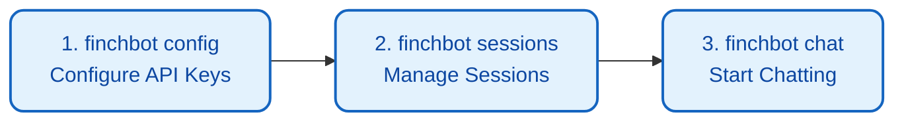
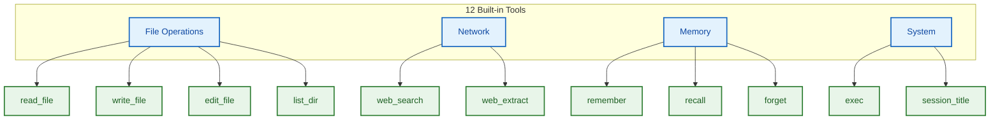

# User Guide

FinchBot provides a rich Command Line Interface (CLI) for interacting with the agent. This document details all available commands and interaction modes.

## Quick Start: Three Commands

```bash
# Step 1: Configure API keys and default model
uv run finchbot config

# Step 2: Manage your sessions
uv run finchbot sessions

# Step 3: Start chatting
uv run finchbot chat
```

These three commands cover FinchBot's core workflow:



| Command | Function | Description |
| :--- | :--- | :--- |
| `finchbot config` | Interactive configuration | Configure LLM providers, API keys, default model, web search, etc. |
| `finchbot sessions` | Session management | Full-screen interface to create, rename, delete sessions, view history |
| `finchbot chat` | Start conversation | Launch interactive chat, auto-loads the last active session |

---

## 1. Startup & Basic Interaction

### 1.1 CLI Interface

#### Start FinchBot

```bash
finchbot chat
```

Or use `uv run`:

```bash
uv run finchbot chat
```

#### Specify Session

You can specify a session ID to continue a previous conversation or start a new one:

```bash
finchbot chat --session "project-alpha"
```

#### Specify Model

```bash
finchbot chat --model "gpt-5"
```

---

## 2. Slash Commands

In the chat interface, inputs starting with `/` are treated as special commands.

### `/history`

View history messages of the current session.

- **Function**: Displays all messages (User, AI, Tool calls) from the beginning of the session.
- **Usage**: Review context or check message indices (for rollback).

**Example Output**:

```
 Turn 1 

  You                          
 Hello, please remember my email is test@example.com


  FinchBot                     
 I've saved your email address.  

```

### `/rollback <index> [new_session_id]`

Time Travel: Rollback the conversation state to a specific message index.

- **Parameters**:
    - `<index>`: The target message index (view via `/history`).
    - `[new_session_id]` (Optional): If provided, creates a new branch session, keeping the original one intact. If not, overwrites the current session.
- **Examples**:
    - `/rollback 5`: Rollback to the state after message 5 (deletes all messages with index > 5).
    - `/rollback 5 branch-b`: Create a new session `branch-b` based on the state at message 5.

**Use Cases**:
- Correct wrong direction: Rollback when conversation goes off track
- Explore branches: Create new sessions to try different conversation paths

### `/back <n>`

Undo the last n messages.

- **Parameters**:
    - `<n>`: Number of messages to undo.
- **Examples**:
    - `/back 1`: Undo the last message (useful for correcting a typo).
    - `/back 2`: Undo the last turn of conversation (User query + AI response).

---

## 3. Session Manager

FinchBot provides a full-screen interactive session manager.

### Enter Manager

Run the sessions command directly:

```bash
finchbot sessions
```

Or start `finchbot chat` without arguments when no history sessions exist.

### Controls

| Key | Action |
| :--- | :--- |
| ↑ / ↓ | Navigate sessions |
| Enter | Enter selected session |
| r | Rename selected session |
| d | Delete selected session |
| n | Create new session |
| q | Quit manager |

### Session Information Display

The session list shows the following information:

| Column | Description |
| :--- | :--- |
| ID | Session unique identifier |
| Title | Session title (auto-generated or manually set) |
| Messages | Total messages in session |
| Turns | Number of conversation turns |
| Created | Session creation time |
| Last Active | Last interaction time |

---

## 4. Configuration Manager

FinchBot provides an interactive configuration manager.

### Enter Config Manager

```bash
finchbot config
```

This will launch an interactive interface to configure:

### Configuration Options

| Option | Description |
| :--- | :--- |
| Language | Interface language (Chinese/English) |
| LLM Provider | OpenAI, Anthropic, DeepSeek, etc. |
| API Key | API Key for each provider |
| API Base URL | Custom API endpoint (optional) |
| Default Model | Default chat model to use |
| Web Search | Tavily / Brave Search API Key |

### Supported LLM Providers

| Provider | Description |
| :--- | :--- |
| OpenAI | GPT-5, GPT-5.2, O3-mini |
| Anthropic | Claude Sonnet 4.5, Claude Opus 4.6 |
| DeepSeek | DeepSeek Chat, DeepSeek Reasoner |
| DashScope | Alibaba Cloud Qwen, QwQ |
| Groq | Llama 4 Scout/Maverick, Llama 3.3 |
| Moonshot | Kimi K1.5/K2.5 |
| OpenRouter | Multi-provider gateway |
| Google Gemini | Gemini 2.5 Flash |

### Environment Variable Configuration

You can also configure via environment variables:

```bash
# OpenAI
export OPENAI_API_KEY="sk-..."
export OPENAI_API_BASE="https://api.openai.com/v1"  # optional

# Anthropic
export ANTHROPIC_API_KEY="sk-ant-..."

# DeepSeek
export DEEPSEEK_API_KEY="sk-..."

# Tavily (web search)
export TAVILY_API_KEY="tvly-..."
```

---

## 5. Model Management

### Automatic Download

FinchBot uses a **runtime automatic download** mechanism.

When you run `finchbot chat` or other features requiring the embedding model for the first time, the system automatically checks for the model. If missing, it will automatically download it from the best mirror source to the `.models/fastembed/` directory.

> **Note**: The model is ~95MB. No manual intervention is needed; just wait a moment during the first startup.

### Manual Download

If you wish to download the model in advance (e.g., before deploying to an offline environment), you can run:

```bash
finchbot models download
```

The system will automatically detect your network environment and choose the best mirror source:
- Users in China: Uses hf-mirror.com mirror
- International users: Uses Hugging Face official source

**Model Information**:
- Model Name: `BAAI/bge-small-zh-v1.5`
- Purpose: Semantic retrieval for memory system

---

## 6. Built-in Tools Usage

FinchBot includes 12 built-in tools across four categories:



### File Operation Tools

| Tool | Description | Use Case |
| :--- | :--- | :--- |
| `read_file` | Read file contents | View code, config files |
| `write_file` | Write file (overwrite) | Create new files |
| `edit_file` | Edit file (replace) | Modify specific parts of existing files |
| `list_dir` | List directory contents | Explore project structure |

**Best Practice**:

```
1. Use list_dir to understand directory structure
2. Use read_file to view file contents
3. Use write_file or edit_file as needed
```

### Network Tools

| Tool | Description | Use Case |
| :--- | :--- | :--- |
| `web_search` | Search the internet | Get latest info, verify facts |
| `web_extract` | Extract web page content | Get full web page content |

**Search Engine Priority**:
1. Tavily (best quality, AI-optimized)
2. Brave Search (large free tier, privacy-friendly)
3. DuckDuckGo (no API key required, always available)

**Best Practice**:

```
1. Use web_search to find relevant URLs
2. Use web_extract to get detailed content
```

### Memory Management Tools

| Tool | Description | Use Case |
| :--- | :--- | :--- |
| `remember` | Save memory | Record user info, preferences |
| `recall` | Retrieve memory | Recall previous information |
| `forget` | Delete memory | Clear outdated or incorrect info |

#### Memory Categories

| Category | Description | Example |
| :--- | :--- | :--- |
| personal | Personal information | Name, age, address |
| preference | User preferences | Likes, habits |
| work | Work-related | Projects, tasks, meetings |
| contact | Contact information | Email, phone |
| goal | Goals and plans | Wishes, plans |
| schedule | Schedule | Time, reminders |
| general | General | Other information |

#### Retrieval Strategies (QueryType)

| Strategy | Weights | Use Case |
| :--- | :--- | :--- |
| `factual` | Keyword 0.8 / Semantic 0.2 | "What's my email" |
| `conceptual` | Keyword 0.2 / Semantic 0.8 | "What food do I like" |
| `complex` | Keyword 0.5 / Semantic 0.5 | Complex queries (default) |
| `ambiguous` | Keyword 0.3 / Semantic 0.7 | Ambiguous queries |
| `keyword_only` | Keyword 1.0 / Semantic 0.0 | Exact match |
| `semantic_only` | Keyword 0.0 / Semantic 1.0 | Semantic exploration |

### System Tools

| Tool | Description | Use Case |
| :--- | :--- | :--- |
| `exec` | Execute shell commands | Batch operations, system commands |
| `session_title` | Manage session title | Get/set session title |

---

## 7. Bootstrap File System

FinchBot uses an editable Bootstrap file system to define Agent behavior. These files are located in the workspace directory and can be edited at any time.

### Bootstrap Files

| File | Description |
| :--- | :--- |
| `SYSTEM.md` | System prompt, defines Agent's basic behavior |
| `MEMORY_GUIDE.md` | Memory system usage guide |
| `SOUL.md` | Agent's self-awareness and personality traits |
| `AGENT_CONFIG.md` | Agent configuration (temperature, max tokens, etc.) |

### Editing Bootstrap Files

You can directly edit these files to customize Agent behavior:

```bash
# View current workspace
finchbot chat --workspace "~/my-workspace"

# Edit system prompt
# File location: ~/my-workspace/SYSTEM.md
```

**Example - Custom SYSTEM.md**:

```markdown
# FinchBot

You are a professional code assistant focused on Python development.

## Role
You are FinchBot, a professional Python development assistant.

## Expertise
- Python 3.13+ features
- Async programming (asyncio)
- Type hints
- Test-Driven Development (TDD)
```

---

## 8. Global Options

The `finchbot` command supports the following global options:

| Option | Description |
| :--- | :--- |
| `--help` | Show help message |
| `--version` | Show version number |
| `-v` | Show INFO and above logs |
| `-vv` | Show DEBUG and above logs (debug mode) |

**Example**:

```bash
# Show INFO level logs
finchbot chat -v

# Show DEBUG level logs to see detailed thought processes and network requests
finchbot chat -vv
```

---

## 9. Command Reference

| Command | Description |
| :--- | :--- |
| `finchbot chat` | Start interactive chat session |
| `finchbot chat -s <id>` | Start/continue specific session |
| `finchbot chat -m <model>` | Use specified model |
| `finchbot chat -w <dir>` | Use specified workspace |
| `finchbot sessions` | Open session manager |
| `finchbot config` | Open configuration manager |
| `finchbot models download` | Download embedding models |
| `finchbot version` | Show version information |

---

## 10. Chat Commands Reference

| Command | Description |
| :--- | :--- |
| `/history` | Show session history (with indices) |
| `/rollback <n>` | Rollback to message n |
| `/rollback <n> <new_id>` | Create branch session |
| `/back <n>` | Undo last n messages |
| `exit` / `quit` / `q` | Exit chat |
