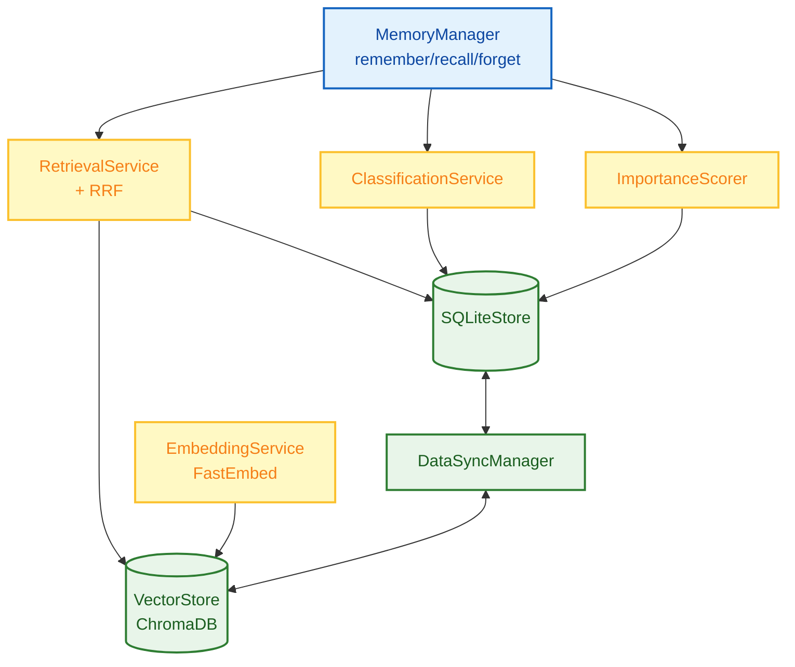
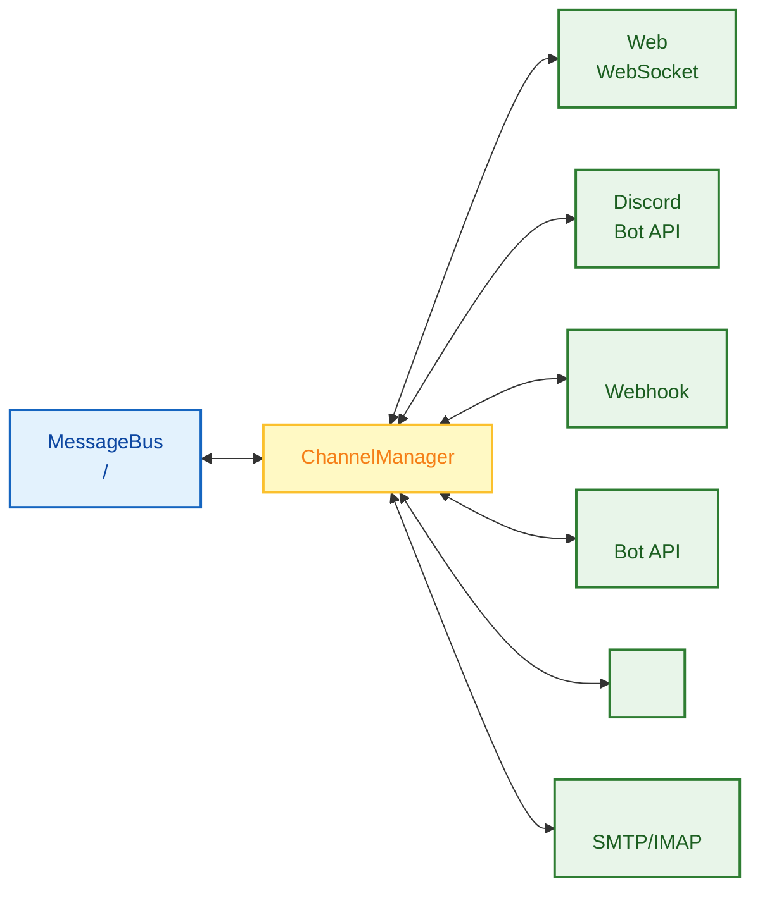
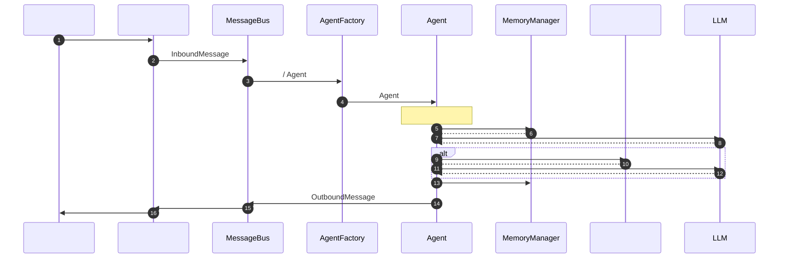

# 

 FinchBot 

## 

1. [](#1-)
2. [](#2-)
3. [](#3--data-flow)
4. [](#4-)
5. [](#5-)

---

## 1. 

FinchBot  **LangChain v1.2** + **LangGraph v1.0** **** Agent 

1. **Agent Core ()**: 
2. **Memory System ()**:  SQLite + FastEmbed + ChromaDB 
3. **Tool Ecosystem ()**: 
4. **Channel System ()**:  WebDiscord

### 1.1 

```mermaid
graph TB
    subgraph UI []
        CLI[CLI ]
        Web[Web ]
        API[REST API]
        Channels[<br/>Discord//]
    end

    subgraph Core [Agent ]
        Agent[LangGraph Agent<br/>]
        Context[ContextBuilder<br/>]
        Tools[ToolRegistry<br/>11]
        Memory[MemoryManager<br/>]
    end

    subgraph Infra []
        Storage[<br/>SQLite + VectorStore]
        LLM[LLM <br/>OpenAI/Anthropic/DeepSeek]
    end

    CLI --> Agent
    Web --> Agent
    API --> Agent
    Channels --> Agent

    Agent --> Context
    Agent <--> Tools
    Agent <--> Memory

    Memory --> Storage
    Agent --> LLM
```

### 1.2 

```
finchbot/
 agent/              # Agent 
    core.py        # Agent 
    factory.py     # AgentFactory
    context.py     # ContextBuilder 
    skills.py      # SkillsLoader 
 channels/           # 
    base.py        # BaseChannel 
    bus.py         # MessageBus 
    manager.py     # ChannelManager 
    schema.py      # InboundMessage/OutboundMessage 
 cli/                # 
    chat_session.py # 
    config_manager.py
    providers.py
    ui.py
 server/             # API 
    main.py        # FastAPI 
    loop.py        # AgentLoop 
 web/                # Web  (React + Vite)
    src/
    package.json
 config/             # 
    loader.py
    schema.py
 i18n/               # 国际化
    loader.py        # 语言检测和加载
    locales/
 memory/             # 
    manager.py
    types.py
    services/       # 
       classification.py
       embedding.py
       importance.py
       retrieval.py
    storage/        # 
       sqlite.py
       vector.py
    vector_sync.py
 providers/          # LLM 
    factory.py
 sessions/           # 
    metadata.py
    selector.py
    title_generator.py
 skills/             # 
    skill-creator/
    summarize/
    weather/
 tools/              # 
    base.py
    registry.py
    factory.py     # ToolFactory 
    filesystem.py
    memory.py
    shell.py
    web.py
    session_title.py
    search/
 utils/              # 
     logger.py
     model_downloader.py
```

---

### 1.3 

FinchBot  `asyncio`  `concurrent.futures.ThreadPoolExecutor` 

```mermaid
sequenceDiagram
    autonumber
    participant CLI as  ()
    participant Loop as 
    participant Pool as 
    participant LLM as LLM 
    participant Mem as 
    participant Tools as 

    CLI->>Loop:  _run_chat_session_async
    
    par 
        Loop->>Pool:  create_chat_model
        Pool->>LLM:  Tiktoken/Schema ()
        LLM-->>Pool:  ChatModel
        
        Loop->>Pool:  SessionMetadataStore
        Pool->>Mem:  SQLite
        Mem-->>Pool:  Store
        
        Loop->>Pool:  get_default_workspace
        Pool->>Pool:  I/O 
    end
    
    Loop->>Pool:  AgentFactory.create_for_cli
    Pool->>Tools: create_default_tools
    Tools-->>Pool:  Tool List
    Pool->>Loop:  Agent & Tools
    
    Loop->>CLI: 
```

### 1.4 Web 

Web  WebSocket  API Server 

```mermaid
sequenceDiagram
    autonumber
    participant U as 
    participant W as  (React)
    participant API as API Server (FastAPI)
    participant Loop as Agent Loop
    participant Agent as LangGraph Agent

    U->>W: 
    W->>API: WebSocket (send)
    API->>Loop: MessageBus (publish)
    
    loop 
        Loop->>Loop: 
        Loop->>Agent:  Agent (stream)
        Agent-->>Loop:  Token/State
        Loop->>API: MessageBus (publish response)
    end
    
    API-->>W: WebSocket (receive)
    W-->>U:  Markdown
```

---

## 2. 

### 2.1 Agent Core ()

****: `src/finchbot/agent/`

Agent Core  FinchBot 

#### 

* **AgentFactory (`factory.py`)**:  Agent ToolFactory  Checkpointer
* **Agent Core (`core.py`)**:  Agent 
    * ****:  `LangGraph`  `StateGraph` (`messages`)
    * ****:  `SqliteSaver` (`checkpoints.db`) 
* **ContextBuilder (`context.py`)**: 
    * **Identity**: `SYSTEM.md` ()
    * **Memory Guide**: `MEMORY_GUIDE.md` ()
    * **Soul**: `SOUL.md` ()
    * **Skills**: 
    * **Tools**: `TOOLS.md` ()
    * **Runtime Info**: Python 

#### 

| / |  |
|:---|:---|
| `AgentFactory.create_for_cli()` |  CLI  Agent |
| `create_finch_agent()` |  LangGraph Agent |
| `build_system_prompt()` |  |
| `get_sqlite_checkpointer()` |  SQLite  |

#### 

 ** (Double-checked locking)** 

```python
def _register_default_tools() -> None:
    global _default_tools_registered

    if _default_tools_registered:
        return

    with _tools_registration_lock:
        if _default_tools_registered:
            return
        # ...
```

---

### 2.2  (Skills)

****: `src/finchbot/agent/skills.py`

 FinchBot ——** Markdown  Agent **

#### Agent 

FinchBot  **skill-creator** 

> ** Agent Agent **

```
: 

Agent: ...
       [ skill-creator ]
         skills/translator/SKILL.md
       
```

** Agent **

#### 

```yaml
# SKILL.md 
---
name: weather
description:  API 
metadata:
  finchbot:
    emoji: 
    always: false
    requires:
      bins: [curl]
      env: []
---
# ...
```

#### 

|  |  |
|:---:|:---|
| **** |  |
| **** |  CLI  |
| **** |  |
| **** |  |

---

### 2.3 Memory System ()

****: `src/finchbot/memory/`

FinchBot  **** LLM 

####  Agentic RAG

|  |  RAG | Agentic RAG (FinchBot) |
|:---:|:---|:---|
| **** |  | Agent  |
| **** |  |  +  |
| **** |  |  remember/recall/forget |
| **** |  |  +  |
| **** |  |  |

#### 



#### 

1. ** (SQLite)**:
    * ****:  (Source of Truth)
    * ****:  (tags, source) (category) (importance)
    * ****: 
    * ****: `SQLiteStore`  `aiosqlite` 

2. ** (Vector Store)**:
    * ****: 
    * ****:  Embedding 
    * ****: ChromaDB + FastEmbed ()
    * ****: "Python"
    * ****: `VectorMemoryStore` 

#### 

|  |  |  |
|:---|:---|:---|
| **DataSyncManager** | `memory/vector_sync.py` |  SQLite  Vector Store  |
| **ImportanceScorer** | `memory/services/importance.py` |  (0.0-1.0) |
| **RetrievalService** | `memory/services/retrieval.py` |  |
| **ClassificationService** | `memory/services/classification.py` |  |
| **EmbeddingService** | `memory/services/embedding.py` |  Embedding  FastEmbed |

#### 

FinchBot ** RRF (Weighted Reciprocal Rank Fusion)** 

```python
class QueryType(StrEnum):
    """"""
    KEYWORD_ONLY = "keyword_only"      #  (1.0/0.0)
    SEMANTIC_ONLY = "semantic_only"    #  (0.0/1.0)
    FACTUAL = "factual"                #  (0.8/0.2)
    CONCEPTUAL = "conceptual"          #  (0.2/0.8)
    COMPLEX = "complex"                #  (0.5/0.5)
    AMBIGUOUS = "ambiguous"            #  (0.3/0.7)
```

#### MemoryManager 

```python
class MemoryManager:
    def remember(self, content: str, category=None, importance=None, ...)
    def recall(self, query: str, top_k=5, category=None, ...)
    def forget(self, pattern: str)
    def get_stats(self) -> dict
    def search_memories(self, ...)
    def get_recent_memories(self, days=7, limit=20)
    def get_important_memories(self, min_importance=0.8, limit=20)
```

---

### 2.4 Tool Ecosystem ()

****: `src/finchbot/tools/`

#### 

* **ToolFactory (`factory.py`)**:  WebSearchTool Tavily/Brave/DuckDuckGo
* **ToolRegistry**: 
* **Lazy Loading**:  Agent  Factory 
* **OpenAI **:  OpenAI Function Calling 

#### 

```mermaid
flowchart TB
    classDef registry fill:#e3f2fd,stroke:#1565c0,stroke-width:2px,color:#0d47a1;
    classDef builtin fill:#e8f5e9,stroke:#2e7d32,stroke-width:2px,color:#1b5e20;
    classDef custom fill:#fff9c4,stroke:#fbc02d,stroke-width:2px,color:#f57f17;
    classDef agent fill:#f3e5f5,stroke:#7b1fa2,stroke-width:2px,color:#7b1fa2;

    TR[ToolRegistry<br/>]:::registry
    Lock[<br/>]:::registry

    File[<br/>read_file / write_file<br/>edit_file / list_dir]:::builtin
    Web[<br/>web_search / web_extract]:::builtin
    Memory[<br/>remember / recall / forget]:::builtin
    System[<br/>exec / session_title]:::builtin

    Inherit[ FinchTool<br/> _run()]:::custom
    Register[ Registry]:::custom

    Agent[Agent ]:::agent

    TR --> Lock
    Lock --> File & Web & Memory & System
    Lock --> Inherit --> Register

    File --> Agent
    Web --> Agent
    Memory --> Agent
    System --> Agent
    Register --> Agent
```

#### 

 `FinchTool` 
- `name`: 
- `description`: 
- `parameters`:  (JSON Schema)
- `_run()`: 

#### 

* ****:  (`workspace`) 
* **Shell **:  (rm -rf /)

#### 

|  |  |  |  |
|:---|:---|:---|:---|
| `read_file` |  | `filesystem.py` |  |
| `write_file` |  | `filesystem.py` |  |
| `edit_file` |  | `filesystem.py` |  |
| `list_dir` |  | `filesystem.py` |  |
| `exec` |  | `shell.py` |  Shell  |
| `web_search` |  | `web.py` / `search/` |  Tavily/Brave/DuckDuckGo |
| `web_extract` |  | `web.py` |  Jina AI  |
| `remember` |  | `memory.py` |  |
| `recall` |  | `memory.py` |  |
| `forget` |  | `memory.py` | / |
| `session_title` |  | `session_title.py` |  |

#### 

```mermaid
flowchart TD
    classDef check fill:#fff9c4,stroke:#fbc02d,stroke-width:2px,color:#f57f17;
    classDef engine fill:#e8f5e9,stroke:#2e7d32,stroke-width:2px,color:#1b5e20;
    classDef fallback fill:#e3f2fd,stroke:#1565c0,stroke-width:2px,color:#0d47a1;

    Start[]:::check
    
    Check1{TAVILY_API_KEY<br/>?}:::check
    Tavily[Tavily<br/><br/>AI ]:::engine
    
    Check2{BRAVE_API_KEY<br/>?}:::check
    Brave[Brave Search<br/><br/>]:::engine
    
    DDG[DuckDuckGo<br/><br/>]:::fallback

    Start --> Check1
    Check1 -->|| Tavily
    Check1 -->|| Check2
    Check2 -->|| Brave
    Check2 -->|| DDG
```

|  |  | API Key |  |
|:---:|:---:|:---:|:---|
| 1 | **Tavily** |  |  AI  |
| 2 | **Brave Search** |  |  |
| 3 | **DuckDuckGo** |  |  |

****
1.  `TAVILY_API_KEY` →  Tavily
2.  `BRAVE_API_KEY` →  Brave Search
3.  →  DuckDuckGo API Key

** API Key **

#### 

`session_title`  FinchBot 

|  |  |  |
|:---:|:---|:---|
| **** |  2-3 AI  | "Python " |
| **Agent ** |  Agent " XXX" | Agent  |
| **** |  `r`  |  |

****

---

### 2.5 Channel System ()

****: `src/finchbot/channels/`

 FinchBot 

#### 



#### 

|  |  |  |
|:---|:---|:---|
| **BaseChannel** | `base.py` |  (start, stop, send, receive) |
| **MessageBus** | `bus.py` | / |
| **ChannelManager** | `manager.py` |  |
| **InboundMessage** | `schema.py` |  |
| **OutboundMessage** | `schema.py` |  |

#### 

```python
class InboundMessage(BaseModel):
    """ -  Agent"""
    channel_id: str          # 
    user_id: str             # 
    content: str             # 
    session_id: str | None   #  ID
    metadata: dict = {}      # 

class OutboundMessage(BaseModel):
    """ -  Agent """
    channel_id: str          # 
    user_id: str             # 
    content: str             # 
    session_id: str | None   #  ID
    metadata: dict = {}      # 
```

#### 

1.  `BaseChannel` 
2. `start()`, `stop()`, `send()`, `receive()`
3.  `ChannelManager`

---

### 2.6 

****: `src/finchbot/agent/context.py`

#### Bootstrap 

```
~/.finchbot/
 SYSTEM.md           # 
 MEMORY_GUIDE.md     # 
 SOUL.md             # 
 AGENT_CONFIG.md     # Agent 
 workspace/
     skills/         # 
```

#### 

```mermaid
flowchart TD
    classDef startEnd fill:#ffebee,stroke:#c62828,stroke-width:2px,color:#b71c1c;
    classDef process fill:#e3f2fd,stroke:#1565c0,stroke-width:2px,color:#0d47a1;
    classDef file fill:#fff9c4,stroke:#fbc02d,stroke-width:2px,color:#f57f17;
    classDef output fill:#e8f5e9,stroke:#2e7d32,stroke-width:2px,color:#1b5e20;

    A([Agent ]):::startEnd --> B[ Bootstrap ]:::process
    
    B --> C[SYSTEM.md]:::file
    B --> D[MEMORY_GUIDE.md]:::file
    B --> E[SOUL.md]:::file
    B --> F[AGENT_CONFIG.md]:::file

    C --> G[]:::process
    D --> G
    E --> G
    F --> G

    G --> H[]:::process
    H --> I[ XML]:::process
    I --> J[]:::process
    J --> K[]:::process
    K --> L[]:::output

    L --> M([ LLM]):::startEnd
```

---

### 2.7 I18n  ()

****: `src/finchbot/i18n/`

#### 

- `zh-CN`: 
- `zh-HK`: 
- `en-US`: 

#### 


```
zh-CN → zh → en-US
zh-HK → zh → en-US
en-US → ()
```

#### 

1. : `FINCHBOT_LANG`
2. : `~/.finchbot/config.json`
3. 
4. : `en-US`

---

### 2.8 

****: `src/finchbot/config/`

 Pydantic v2 + Pydantic Settings 

#### 

```
Config ()
 language
 default_model
 agents
    defaults (Agent )
 providers
    openai
    anthropic
    deepseek
    moonshot
    dashscope
    groq
    gemini
    openrouter
    custom
 tools
     web.search ()
     exec (Shell )
     restrict_to_workspace
```

---

## 3.  (Data Flow)

### 3.1 



### 3.2 

```mermaid
flowchart LR
    classDef startEnd fill:#ffebee,stroke:#c62828,stroke-width:2px,color:#b71c1c;
    classDef process fill:#e3f2fd,stroke:#1565c0,stroke-width:2px,color:#0d47a1;
    classDef decision fill:#fff9c4,stroke:#fbc02d,stroke-width:2px,color:#f57f17;

    A[]:::startEnd --> B[CLI ]:::process
    B --> C[ Checkpoint]:::process
    C --> D[ContextBuilder  Prompt]:::process
    D --> E[LLM ]:::process
    E --> F{?}:::decision
    F -->|| G[]:::process
    F -->|| H[]:::process
    H --> I[]:::process
    I --> E
    G --> J[ Checkpoint]:::process
    J --> K[]:::startEnd
```

1.  -> CLI 
2. Agent  (Checkpoint)
3. ContextBuilder  Prompt ()
4. LLM 
5.  ->  ->  LLM -> 
6. LLM  -> 

### 3.3  (Remember)

1. Agent  `remember` 
2. `MemoryManager` 
3.  `category` (ClassificationService)
4.  `importance` (ImportanceScorer)
5.  SQLite ID
6.  Embedding  ChromaDB
7. 

### 3.4  (Recall)

1. Agent  `recall`  (: "API Key")
2. `RetrievalService` 
3.  Vector Store  Top-K 
4. ()  SQLite  (category, time range )
5.  Agent

---

## 4. 

### 4.1  (Modularity)


- `MemoryManager`  `SQLiteStore`  `VectorMemoryStore`
- `ToolRegistry` 
- `I18n` 
- `ChannelManager`  Agent 

### 4.2  (Dependency Inversion)


```
AgentCore → MemoryManager ()
                ↓
         SQLiteStore / VectorStore ()
```

### 4.3  (Privacy First)

- Embedding  (FastEmbed)
-  `~/.finchbot`
- 

### 4.4  (Out of the Box)

FinchBot ""

|  |  |
|:---:|:---|
| **** | `config` → `sessions` → `chat` |
| **** |  |
| **Rich CLI ** |  |
| **i18n ** |  |
| **** | Tavily → Brave → DuckDuckGo |
| **Agent ** |  Agent  |

### 4.5  (Defensive Programming)

- 
-  SQLite 
- 
-  (Loguru)

---

## 5. 

### 5.1 

 `FinchTool`  `_run()`  `ToolRegistry`

### 5.2 

 `~/.finchbot/workspace/skills/{skill-name}/`  `SKILL.md` 

### 5.3  LLM 

 `providers/factory.py`  Provider 

### 5.4 

1.  `BaseChannel` 
2. `start()`, `stop()`, `send()`, `receive()`
3.  `ChannelManager`

### 5.5 

 `RetrievalService`  `search()` 

### 5.6 

 `i18n/locales/`  `.toml` 

---

## 

FinchBot 
- ****: 
- ****: 
- ****: 
- ****: 
- ****:  WebDiscord
