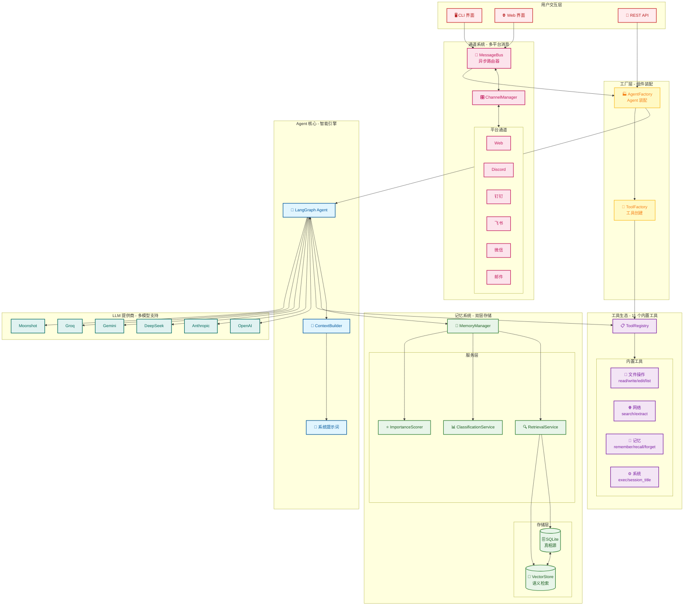
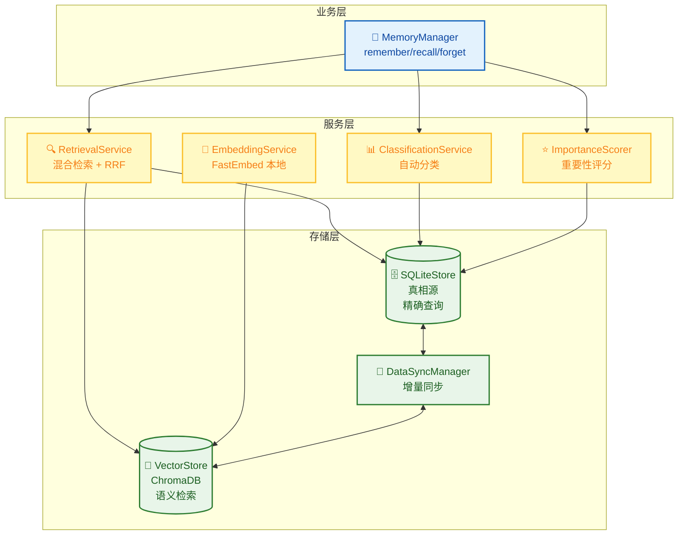
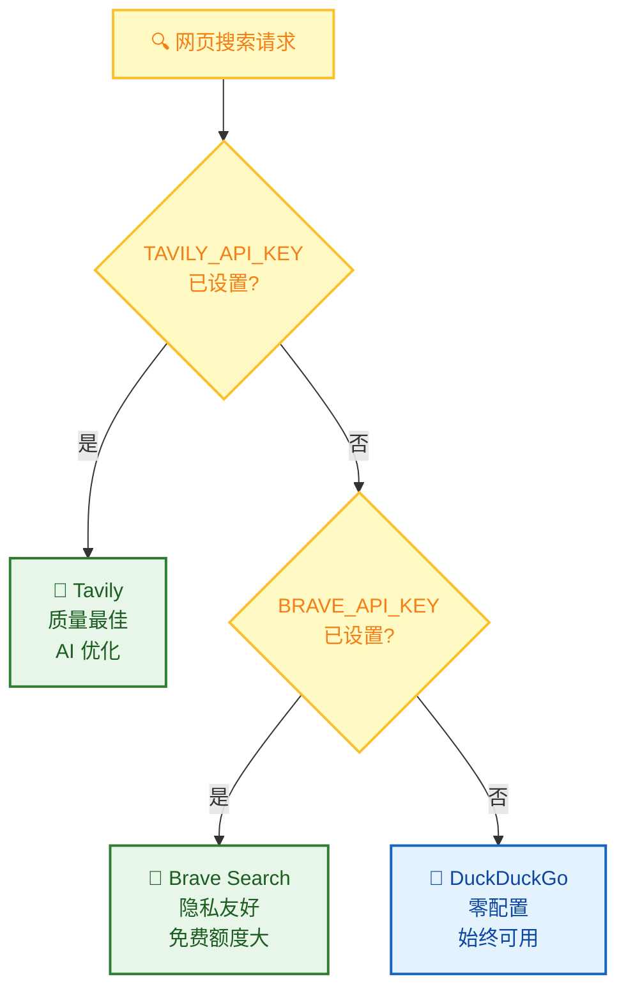
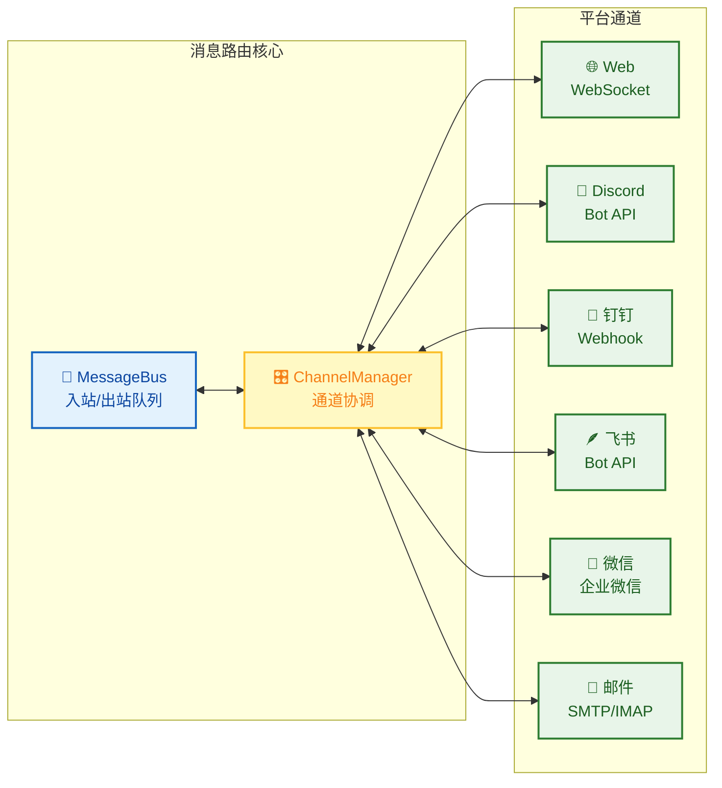
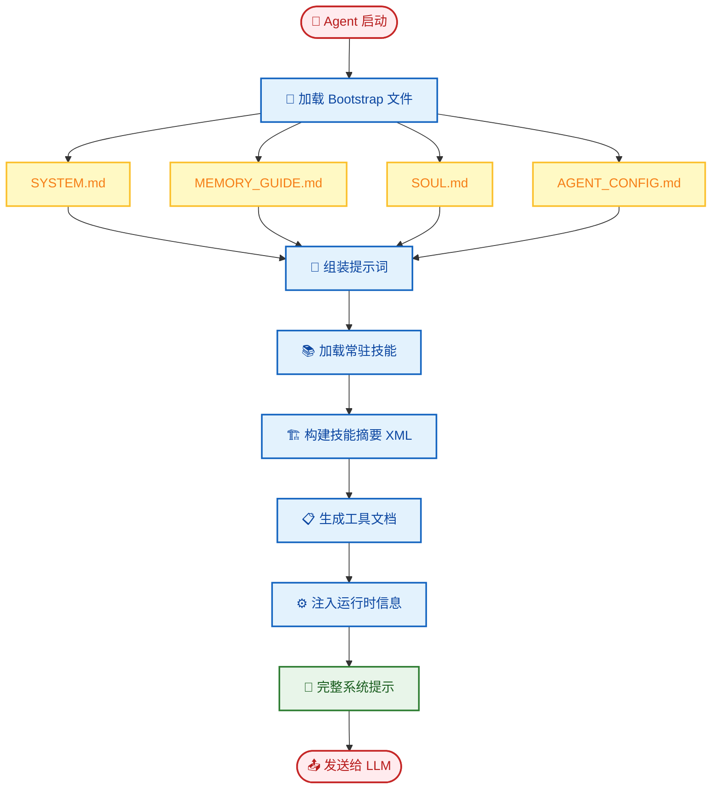
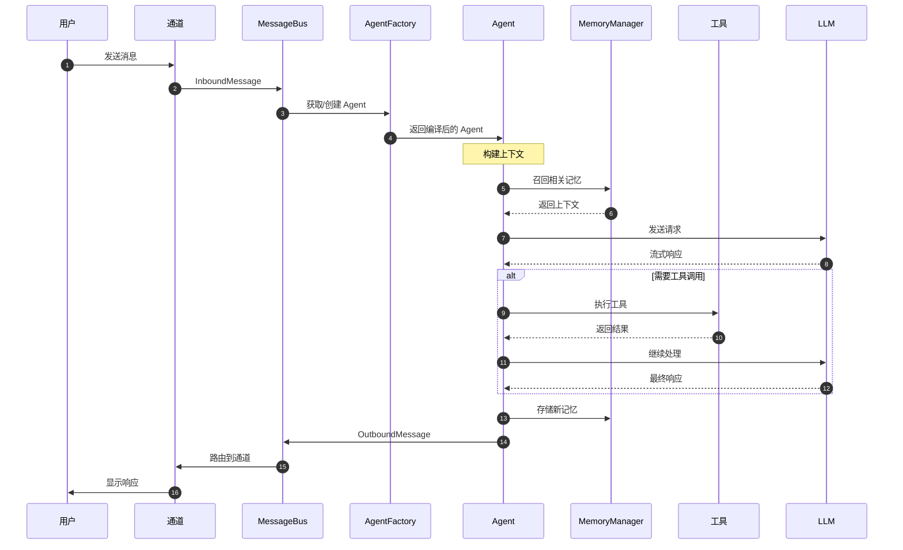
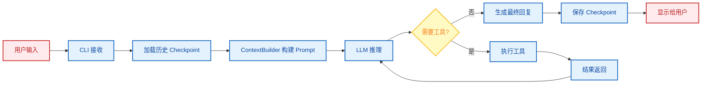

# 系统架构详解

本文档深入介绍 FinchBot 的系统架构、核心组件及其交互方式。

## 目录

1. [总体架构](#1-总体架构)
2. [核心组件详解](#2-核心组件详解)
3. [数据流向](#3-数据流向-data-flow)
4. [设计原则](#4-设计原则)
5. [扩展点](#5-扩展点)

---

## 1. 总体架构

FinchBot 采用 **LangChain v1.2** + **LangGraph v1.0** 构建，是一个具备持久化记忆、动态工具调度、多平台消息支持和**全异步并发启动**能力的 Agent 系统。系统主要由四个核心部分组成：

1. **Agent Core (大脑)**: 负责决策、规划和工具调度，支持异步流式输出
2. **Memory System (记忆)**: 负责长期信息的存储与检索，采用 SQLite + FastEmbed + ChromaDB 混合架构
3. **Tool Ecosystem (工具)**: 负责与外部世界交互，支持懒加载和线程池并发初始化
4. **Channel System (通道)**: 负责多平台消息路由，支持 Web、Discord、钉钉、飞书等

### 1.1 整体架构图



### 1.2 目录结构

```
finchbot/
├── agent/              # Agent 核心
│   ├── core.py        # Agent 创建与运行（异步优化）
│   ├── factory.py     # AgentFactory（线程池并发）
│   ├── context.py     # ContextBuilder 上下文构建
│   └── skills.py      # SkillsLoader 技能加载器
├── channels/           # 多平台消息通道
│   ├── base.py        # BaseChannel 抽象基类
│   ├── bus.py         # MessageBus 异步路由器
│   ├── manager.py     # ChannelManager 协调器
│   └── schema.py      # InboundMessage/OutboundMessage 模型
├── cli/                # 命令行界面
│   ├── chat_session.py # 异步会话管理
│   ├── config_manager.py
│   ├── providers.py
│   └── ui.py
├── server/             # API 服务器
│   ├── main.py        # FastAPI 应用
│   └── loop.py        # AgentLoop 事件循环
├── web/                # Web 前端 (React + Vite)
│   ├── src/
│   └── package.json
├── config/             # 配置管理
│   ├── loader.py
│   └── schema.py
├── i18n/               # 国际化
│   ├── loader.py
│   ├── detector.py
│   └── locales/
├── memory/             # 记忆系统
│   ├── manager.py
│   ├── types.py
│   ├── services/       # 服务层
│   │   ├── classification.py
│   │   ├── embedding.py
│   │   ├── importance.py
│   │   └── retrieval.py
│   ├── storage/        # 存储层
│   │   ├── sqlite.py
│   │   └── vector.py
│   └── vector_sync.py
├── providers/          # LLM 提供商
│   └── factory.py
├── sessions/           # 会话管理
│   ├── metadata.py
│   ├── selector.py
│   └── title_generator.py
├── skills/             # 技能系统
│   ├── skill-creator/
│   ├── summarize/
│   └── weather/
├── tools/              # 工具系统
│   ├── base.py
│   ├── registry.py
│   ├── factory.py     # ToolFactory 工具工厂
│   ├── filesystem.py
│   ├── memory.py
│   ├── shell.py
│   ├── web.py
│   ├── session_title.py
│   └── search/
└── utils/              # 工具函数
    ├── logger.py
    └── model_downloader.py
```

---

### 1.3 异步启动流程

FinchBot 引入了全异步的启动架构，通过 `asyncio` 和 `concurrent.futures.ThreadPoolExecutor` 并发执行耗时操作，显著提升启动速度。

```mermaid
sequenceDiagram
    autonumber
    participant CLI as 命令行 (主线程)
    participant Loop as 事件循环
    participant Pool as 线程池
    participant LLM as LLM 初始化
    participant Mem as 记忆存储
    participant Tools as 工具工厂

    CLI->>Loop: 启动 _run_chat_session_async
    
    par 并发初始化任务
        Loop->>Pool: 提交 create_chat_model
        Pool->>LLM: 加载 Tiktoken/Schema (耗时)
        LLM-->>Pool: 返回 ChatModel
        
        Loop->>Pool: 提交 SessionMetadataStore
        Pool->>Mem: 连接 SQLite
        Mem-->>Pool: 返回 Store
        
        Loop->>Pool: 提交 get_default_workspace
        Pool->>Pool: 文件 I/O 检查
    end
    
    Loop->>Pool: 提交 AgentFactory.create_for_cli
    Pool->>Tools: create_default_tools
    Tools-->>Pool: 返回 Tool List
    Pool->>Loop: 返回 Agent & Tools
    
    Loop->>CLI: 初始化完成，进入交互循环
```

### 1.4 Web 界面交互流程

Web 界面通过 WebSocket 与后端 API Server 通信，实现实时聊天和流式输出。

```mermaid
sequenceDiagram
    autonumber
    participant U as 用户
    participant W as 前端 (React)
    participant API as API Server (FastAPI)
    participant Loop as Agent Loop
    participant Agent as LangGraph Agent

    U->>W: 发送消息
    W->>API: WebSocket (send)
    API->>Loop: MessageBus (publish)
    
    loop 事件循环
        Loop->>Loop: 消费消息
        Loop->>Agent: 调用 Agent (stream)
        Agent-->>Loop: 流式返回 Token/State
        Loop->>API: MessageBus (publish response)
    end
    
    API-->>W: WebSocket (receive)
    W-->>U: 实时渲染 Markdown
```

---

## 2. 核心组件详解

### 2.1 Agent Core (智能体核心)

**实现位置**: `src/finchbot/agent/`

Agent Core 是 FinchBot 的大脑，负责决策、规划和工具调度。引入了工厂模式来解耦创建逻辑。

#### 核心组件

* **AgentFactory (`factory.py`)**: 负责组装 Agent，协调 ToolFactory 创建工具集，并初始化 Checkpointer。
* **Agent Core (`core.py`)**: 负责 Agent 的运行时逻辑。
    * **状态管理**: 基于 `LangGraph` 的 `StateGraph`，维护对话状态 (`messages`)
    * **持久化**: 使用 `SqliteSaver` (`checkpoints.db`) 保存状态快照，支持断点续传和历史回溯
* **ContextBuilder (`context.py`)**: 动态组合系统提示词，包括：
    * **Identity**: `SYSTEM.md` (角色设定)
    * **Memory Guide**: `MEMORY_GUIDE.md` (记忆使用准则)
    * **Soul**: `SOUL.md` (灵魂设定)
    * **Skills**: 动态加载的技能描述
    * **Tools**: `TOOLS.md` (工具文档)
    * **Runtime Info**: 当前时间、操作系统、Python 版本等

#### 关键类与函数

| 函数/类 | 说明 |
|:---|:---|
| `AgentFactory.create_for_cli()` | 静态工厂方法，为 CLI 创建配置好的 Agent |
| `create_finch_agent()` | 创建并配置 LangGraph Agent |
| `build_system_prompt()` | 构建完整的系统提示词 |
| `get_sqlite_checkpointer()` | 获取 SQLite 持久化检查点 |

#### 线程安全机制

工具注册采用 **双重检查锁定模式 (Double-checked locking)** 实现懒加载，确保线程安全：

```python
def _register_default_tools() -> None:
    global _default_tools_registered

    if _default_tools_registered:
        return

    with _tools_registration_lock:
        if _default_tools_registered:
            return
        # 实际注册逻辑...
```

---

### 2.2 技能系统 (Skills)

**实现位置**: `src/finchbot/agent/skills.py`

技能是 FinchBot 的独特创新——**用 Markdown 文件定义 Agent 的能力边界**。

#### 最大特色：Agent 自动创建技能

FinchBot 内置了 **skill-creator** 技能，这是开箱即用理念的极致体现：

> **只需告诉 Agent 你想要什么技能，Agent 就会自动创建好！**

```
用户: 帮我创建一个翻译技能，可以把中文翻译成英文

Agent: 好的，我来为你创建翻译技能...
       [调用 skill-creator 技能]
       ✅ 已创建 skills/translator/SKILL.md
       现在你可以直接使用翻译功能了！
```

无需手动创建文件、无需编写代码，**一句话就能扩展 Agent 能力**！

#### 技能文件结构

```yaml
# SKILL.md 示例
---
name: weather
description: 查询当前天气和天气预报（无需 API 密钥）
metadata:
  finchbot:
    emoji: 🌤️
    always: false
    requires:
      bins: [curl]
      env: []
---
# 技能正文...
```

#### 核心设计模式

| 模式 | 说明 |
|:---:|:---|
| **双层技能源** | 工作区技能优先，内置技能兜底 |
| **依赖检查** | 自动检查 CLI 工具和环境变量 |
| **缓存失效检测** | 基于文件修改时间，智能缓存 |
| **渐进式加载** | 常驻技能优先，按需加载其他 |

---

### 2.3 Memory System (记忆系统)

**实现位置**: `src/finchbot/memory/`

FinchBot 实现了先进的 **双层记忆架构**，旨在解决 LLM 上下文窗口限制和长期记忆遗忘问题。

#### 为什么是 Agentic RAG？

| 对比维度 | 传统 RAG | Agentic RAG (FinchBot) |
|:---:|:---|:---|
| **检索触发** | 固定流程 | Agent 自主决策 |
| **检索策略** | 单一向量检索 | 混合检索 + 权重动态调整 |
| **记忆管理** | 被动存储 | 主动 remember/recall/forget |
| **分类能力** | 无 | 自动分类 + 重要性评分 |
| **更新机制** | 全量重建 | 增量同步 |

#### 双层存储架构



#### 分层设计

1. **结构化层 (SQLite)**:
    * **作用**: 事实来源 (Source of Truth)
    * **存储内容**: 完整文本、元数据 (tags, source)、分类 (category)、重要性评分 (importance)、访问日志
    * **优势**: 支持精确查询（如按时间、分类过滤）
    * **实现**: `SQLiteStore` 类，使用 `aiosqlite` 异步操作

2. **语义层 (Vector Store)**:
    * **作用**: 模糊检索与联想
    * **存储内容**: 文本的 Embedding 向量
    * **技术栈**: ChromaDB + FastEmbed (本地轻量级模型)
    * **优势**: 支持自然语言语义搜索（如"上次我提到的那个Python库"）
    * **实现**: `VectorMemoryStore` 类

#### 核心服务

| 服务 | 位置 | 功能 |
|:---|:---|:---|
| **DataSyncManager** | `memory/vector_sync.py` | 确保 SQLite 和 Vector Store 的数据最终一致性，支持失败重试 |
| **ImportanceScorer** | `memory/services/importance.py` | 自动评估记忆重要性 (0.0-1.0)，用于记忆清理和优先级排序 |
| **RetrievalService** | `memory/services/retrieval.py` | 混合检索策略，结合向量相似度和元数据过滤 |
| **ClassificationService** | `memory/services/classification.py` | 基于关键词和语义的自动分类 |
| **EmbeddingService** | `memory/services/embedding.py` | 本地 Embedding 生成，使用 FastEmbed |

#### 混合检索策略

FinchBot 采用**加权 RRF (Weighted Reciprocal Rank Fusion)** 策略：

```python
class QueryType(StrEnum):
    """查询类型，决定检索权重"""
    KEYWORD_ONLY = "keyword_only"      # 纯关键词 (1.0/0.0)
    SEMANTIC_ONLY = "semantic_only"    # 纯语义 (0.0/1.0)
    FACTUAL = "factual"                # 事实型 (0.8/0.2)
    CONCEPTUAL = "conceptual"          # 概念型 (0.2/0.8)
    COMPLEX = "complex"                # 复杂型 (0.5/0.5)
    AMBIGUOUS = "ambiguous"            # 歧义型 (0.3/0.7)
```

#### MemoryManager 接口

```python
class MemoryManager:
    def remember(self, content: str, category=None, importance=None, ...)
    def recall(self, query: str, top_k=5, category=None, ...)
    def forget(self, pattern: str)
    def get_stats(self) -> dict
    def search_memories(self, ...)
    def get_recent_memories(self, days=7, limit=20)
    def get_important_memories(self, min_importance=0.8, limit=20)
```

---

### 2.4 Tool Ecosystem (工具生态)

**实现位置**: `src/finchbot/tools/`

#### 注册机制与工厂模式

* **ToolFactory (`factory.py`)**: 负责根据配置创建和组装工具列表。它处理了 WebSearchTool 的自动降级逻辑（Tavily/Brave/DuckDuckGo）。
* **ToolRegistry**: 单例注册表，管理所有可用工具。
* **Lazy Loading**: 默认工具（文件、搜索等）在 Agent 启动时由 Factory 创建并自动注册。
* **OpenAI 兼容**: 支持导出工具定义为 OpenAI Function Calling 格式。

#### 工具系统架构

```mermaid
flowchart TB
    %% 样式定义
    classDef registry fill:#e3f2fd,stroke:#1565c0,stroke-width:2px,color:#0d47a1;
    classDef builtin fill:#e8f5e9,stroke:#2e7d32,stroke-width:2px,color:#1b5e20;
    classDef custom fill:#fff9c4,stroke:#fbc02d,stroke-width:2px,color:#f57f17;
    classDef agent fill:#f3e5f5,stroke:#7b1fa2,stroke-width:2px,color:#7b1fa2;

    subgraph Registry [工具注册中心]
        TR[📋 ToolRegistry<br/>全局注册表]
        Lock[🔒 双重检查锁<br/>线程安全单例]
    end
    class TR,Lock registry

    subgraph BuiltIn [内置工具 - 11 个]
        direction TB
        File[📁 文件操作<br/>read_file / write_file<br/>edit_file / list_dir]
        Web[🌐 网络<br/>web_search / web_extract]
        Memory[💾 记忆<br/>remember / recall / forget]
        System[⚙️ 系统<br/>exec / session_title]
    end
    class File,Web,Memory,System builtin

    subgraph Custom [自定义扩展]
        Inherit[📝 继承 FinchTool<br/>实现 _run()]
        Register[✅ 注册到 Registry]
    end
    class Inherit,Register custom

    Agent[🧠 Agent 调用]:::agent

    TR --> Lock
    Lock --> BuiltIn
    Lock --> Custom

    File --> Agent
    Web --> Agent
    Memory --> Agent
    System --> Agent
    Register --> Agent
```

#### 工具基类

所有工具继承自 `FinchTool` 基类，必须实现：
- `name`: 工具名称
- `description`: 工具描述
- `parameters`: 参数定义 (JSON Schema)
- `_run()`: 执行逻辑

#### 安全沙箱

* **文件操作**: 限制在工作区 (`workspace`) 内，防止越权访问系统文件
* **Shell 执行**: 默认禁用高危命令 (rm -rf /)，支持超时控制

#### 内置工具列表

| 工具名 | 类别 | 文件 | 功能 |
|:---|:---|:---|:---|
| `read_file` | 文件 | `filesystem.py` | 读取文件内容 |
| `write_file` | 文件 | `filesystem.py` | 写入文件 |
| `edit_file` | 文件 | `filesystem.py` | 编辑文件（行级） |
| `list_dir` | 文件 | `filesystem.py` | 列出目录内容 |
| `exec` | 系统 | `shell.py` | 执行 Shell 命令 |
| `web_search` | 网络 | `web.py` / `search/` | 网页搜索（支持 Tavily/Brave/DuckDuckGo） |
| `web_extract` | 网络 | `web.py` | 提取网页内容（支持 Jina AI 降级） |
| `remember` | 记忆 | `memory.py` | 存储记忆 |
| `recall` | 记忆 | `memory.py` | 检索记忆 |
| `forget` | 记忆 | `memory.py` | 删除/归档记忆 |
| `session_title` | 系统 | `session_title.py` | 管理会话标题 |

#### 网页搜索：三引擎降级设计



| 优先级 | 引擎 | API Key | 特点 |
|:---:|:---:|:---:|:---|
| 1 | **Tavily** | 需要 | 质量最佳，专为 AI 优化，深度搜索 |
| 2 | **Brave Search** | 需要 | 免费额度大，隐私友好 |
| 3 | **DuckDuckGo** | 无需 | 始终可用，作为备选方案 |

**工作原理**：
1. 如果设置了 `TAVILY_API_KEY` → 使用 Tavily（质量最佳）
2. 否则如果设置了 `BRAVE_API_KEY` → 使用 Brave Search
3. 否则 → 使用 DuckDuckGo（无需 API Key，始终可用）

这个设计确保**即使没有任何 API Key 配置，网页搜索也能开箱即用**！

#### 会话标题：智能命名，开箱即用

`session_title` 工具体现了 FinchBot 的开箱即用理念：

| 操作方式 | 说明 | 示例 |
|:---:|:---|:---|
| **自动生成** | 对话 2-3 轮后，AI 自动根据内容生成标题 | "Python 异步编程讨论" |
| **Agent 修改** | 告诉 Agent "把会话标题改成 XXX" | Agent 调用工具自动修改 |
| **手动重命名** | 在会话管理器中按 `r` 键重命名 | 用户手动输入新标题 |

这个设计让用户**无需关心技术细节**，无论是自动还是手动，都能轻松管理会话。

---

### 2.5 Channel System (通道系统)

**实现位置**: `src/finchbot/channels/`

通道系统是 FinchBot 的多平台消息基础设施，提供统一的消息路由和平台抽象。

#### 通道系统架构



#### 核心组件

| 组件 | 文件 | 功能 |
|:---|:---|:---|
| **BaseChannel** | `base.py` | 抽象基类，定义通道接口 (start, stop, send, receive) |
| **MessageBus** | `bus.py` | 异步消息路由器，管理入站/出站消息队列 |
| **ChannelManager** | `manager.py` | 协调多通道，处理消息路由和通道生命周期 |
| **InboundMessage** | `schema.py` | 标准化入站消息格式 |
| **OutboundMessage** | `schema.py` | 标准化出站消息格式 |

#### 消息模型

```python
class InboundMessage(BaseModel):
    """入站消息 - 从平台到 Agent"""
    channel_id: str          # 通道标识
    user_id: str             # 用户标识
    content: str             # 消息内容
    session_id: str | None   # 会话 ID
    metadata: dict = {}      # 额外元数据

class OutboundMessage(BaseModel):
    """出站消息 - 从 Agent 到平台"""
    channel_id: str          # 目标通道
    user_id: str             # 目标用户
    content: str             # 响应内容
    session_id: str | None   # 会话 ID
    metadata: dict = {}      # 额外元数据
```

#### 扩展新通道

1. 继承 `BaseChannel` 类
2. 实现必要方法：`start()`, `stop()`, `send()`, `receive()`
3. 注册到 `ChannelManager`

---

### 2.6 动态提示词系统

**实现位置**: `src/finchbot/agent/context.py`

#### Bootstrap 文件系统

```
~/.finchbot/
├── SYSTEM.md           # 角色设定
├── MEMORY_GUIDE.md     # 记忆使用指南
├── SOUL.md             # 灵魂设定（性格特征）
├── AGENT_CONFIG.md     # Agent 配置
└── workspace/
    └── skills/         # 自定义技能
```

#### 提示词加载流程



---

### 2.7 I18n 系统 (国际化)

**实现位置**: `src/finchbot/i18n/`

#### 支持的语言

- `zh-CN`: 简体中文
- `zh-HK`: 繁体中文
- `en-US`: 英文

#### 语言回退链

系统实现了智能回退机制：
```
zh-CN → zh → en-US
zh-HK → zh → en-US
en-US → (无回退)
```

#### 配置优先级

1. 环境变量: `FINCHBOT_LANG`
2. 用户配置: `~/.finchbot/config.json`
3. 系统语言检测
4. 默认: `en-US`

---

### 2.8 配置系统

**实现位置**: `src/finchbot/config/`

使用 Pydantic v2 + Pydantic Settings 实现类型安全的配置管理。

#### 配置结构

```
Config (根配置)
├── language
├── default_model
├── agents
│   └── defaults (Agent 默认配置)
├── providers
│   ├── openai
│   ├── anthropic
│   ├── deepseek
│   ├── moonshot
│   ├── dashscope
│   ├── groq
│   ├── gemini
│   ├── openrouter
│   └── custom
└── tools
    ├── web.search (搜索配置)
    ├── exec (Shell 执行配置)
    └── restrict_to_workspace
```

---

## 3. 数据流向 (Data Flow)

### 3.1 完整数据流



### 3.2 对话流程



1. 用户输入 -> CLI 接收
2. Agent 加载历史状态 (Checkpoint)
3. ContextBuilder 构建当前 Prompt (包含相关记忆)
4. LLM 生成回复或工具调用请求
5. 如果调用工具 -> 执行工具 -> 结果回传 LLM -> 循环
6. LLM 生成最终回复 -> 显示给用户

### 3.3 记忆写入流程 (Remember)

1. Agent 调用 `remember` 工具
2. `MemoryManager` 接收内容
3. 自动计算 `category` (ClassificationService)
4. 自动计算 `importance` (ImportanceScorer)
5. 写入 SQLite，生成唯一 ID
6. 同步调用 Embedding 服务，将向量写入 ChromaDB
7. 记录访问日志

### 3.4 记忆检索流程 (Recall)

1. Agent 调用 `recall` 工具 (查询: "我的API Key是多少")
2. `RetrievalService` 将查询转换为向量
3. 在 Vector Store 中搜索 Top-K 相似结果
4. (可选) 结合 SQLite 进行元数据过滤 (category, time range 等)
5. 返回结果给 Agent

---

## 4. 设计原则

### 4.1 模块化 (Modularity)

每个组件都有清晰的职责边界：
- `MemoryManager` 不直接处理存储细节，委托给 `SQLiteStore` 和 `VectorMemoryStore`
- `ToolRegistry` 只负责注册和查找，不关心工具实现
- `I18n` 系统独立于业务逻辑
- `ChannelManager` 协调多通道，与 Agent 核心解耦

### 4.2 依赖倒置 (Dependency Inversion)

高层模块不依赖低层模块，都依赖抽象：
```
AgentCore → MemoryManager (接口)
                ↓
         SQLiteStore / VectorStore (实现)
```

### 4.3 隐私优先 (Privacy First)

- Embedding 生成在本地 (FastEmbed)，不上传云端
- 配置文件存储在用户目录 `~/.finchbot`
- 文件操作限制在工作区

### 4.4 开箱即用 (Out of the Box)

FinchBot 将"开箱即用"作为核心设计理念：

| 特性 | 说明 |
|:---:|:---|
| **三步上手** | `config` → `sessions` → `chat`，三个命令完成完整工作流程 |
| **环境变量配置** | 所有配置均可通过环境变量设置 |
| **Rich CLI 界面** | 全屏键盘导航，交互式操作 |
| **i18n 国际化** | 内置中英文支持，自动检测系统语言 |
| **自动降级** | 网页搜索自动降级：Tavily → Brave → DuckDuckGo |
| **Agent 自动创建技能** | 告诉 Agent 需求，自动生成技能文件 |

### 4.5 防御性编程 (Defensive Programming)

- 双重检查锁定防止并发问题
- 向量存储失败不影响 SQLite 写入（降级策略）
- 超时控制防止工具卡死
- 完整的错误日志 (Loguru)

---

## 5. 扩展点

### 5.1 添加新工具

继承 `FinchTool` 基类，实现 `_run()` 方法，然后注册到 `ToolRegistry`。

### 5.2 添加新技能

在 `~/.finchbot/workspace/skills/{skill-name}/` 下创建 `SKILL.md` 文件。

### 5.3 添加新的 LLM 提供商

在 `providers/factory.py` 中添加新的 Provider 类。

### 5.4 添加新通道

1. 继承 `BaseChannel` 类
2. 实现必要方法：`start()`, `stop()`, `send()`, `receive()`
3. 注册到 `ChannelManager`

### 5.5 自定义记忆检索策略

继承 `RetrievalService` 或修改 `search()` 方法。

### 5.6 添加新语言

在 `i18n/locales/` 下添加新的 `.toml` 文件。

---

## 总结

FinchBot 的架构设计注重：
- **可扩展性**: 清晰的组件边界和接口
- **可靠性**: 降级策略、重试机制、线程安全
- **可维护性**: 类型安全、完善的日志、模块化设计
- **隐私性**: 本地处理敏感数据
- **多平台支持**: 通道系统支持 Web、Discord、钉钉、飞书、微信、邮件
