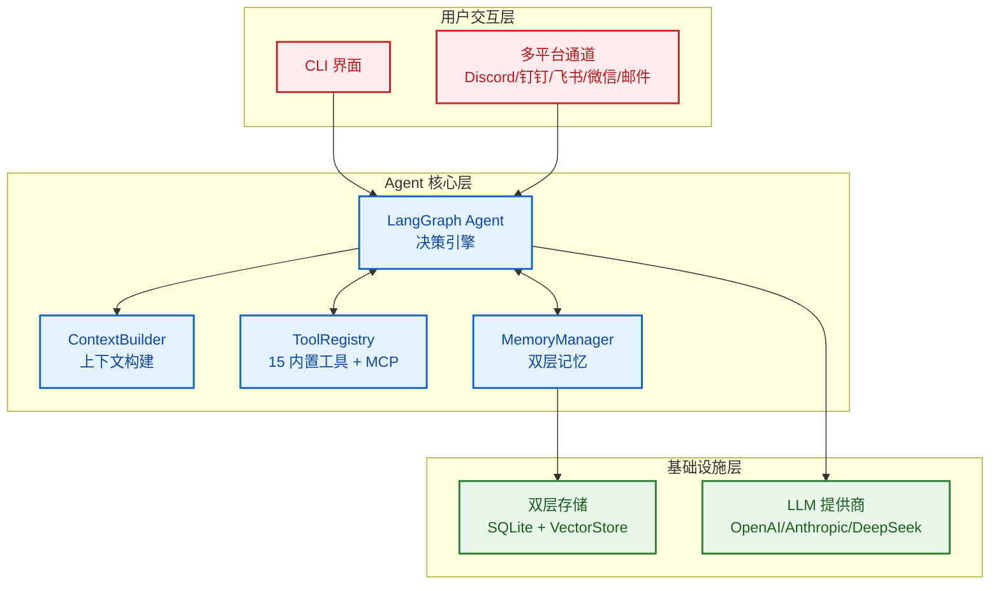
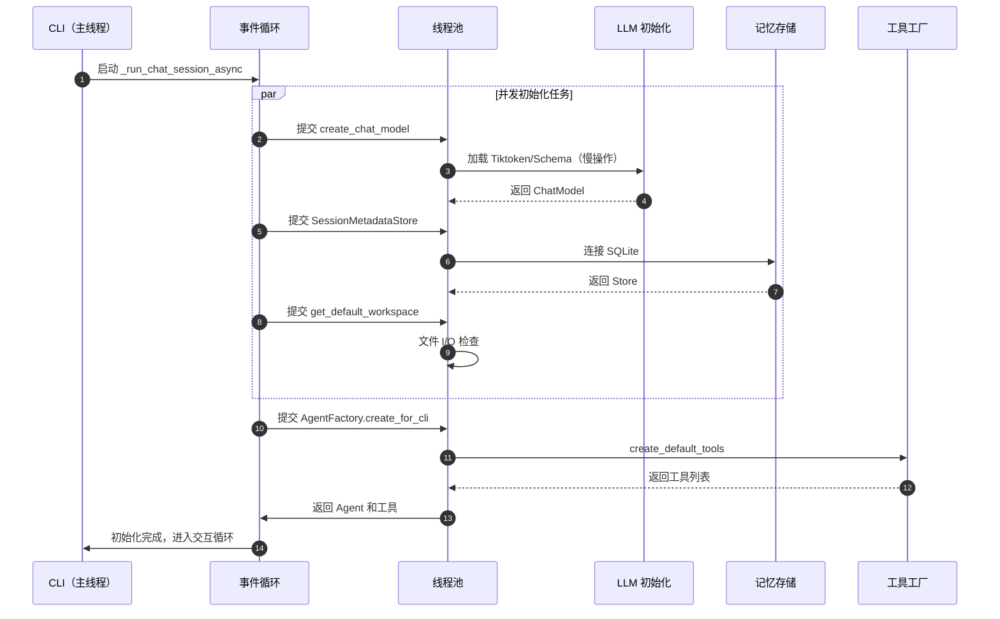
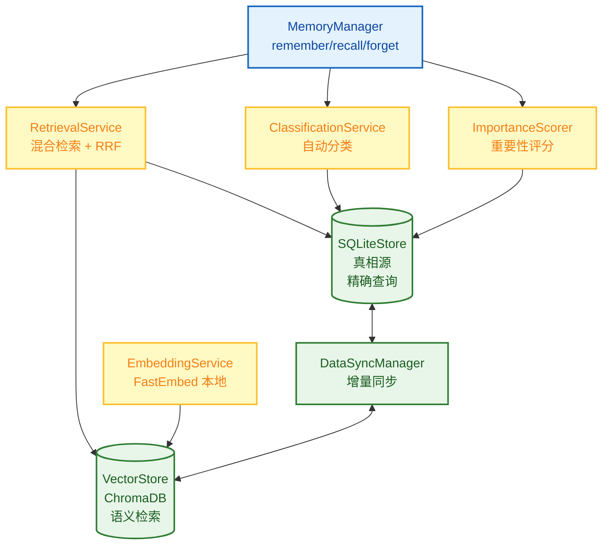
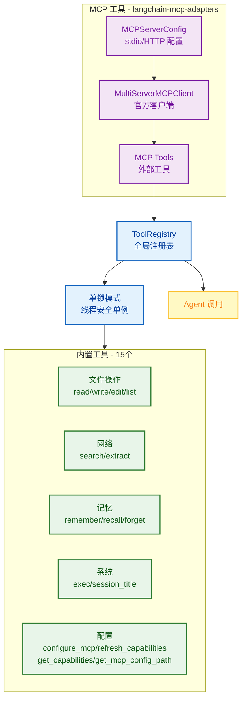
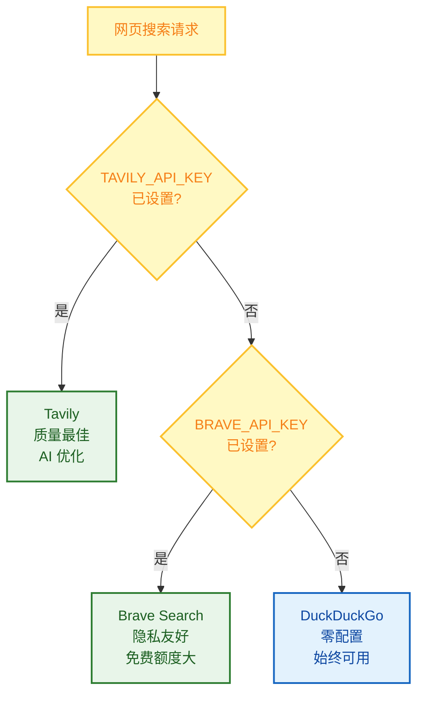
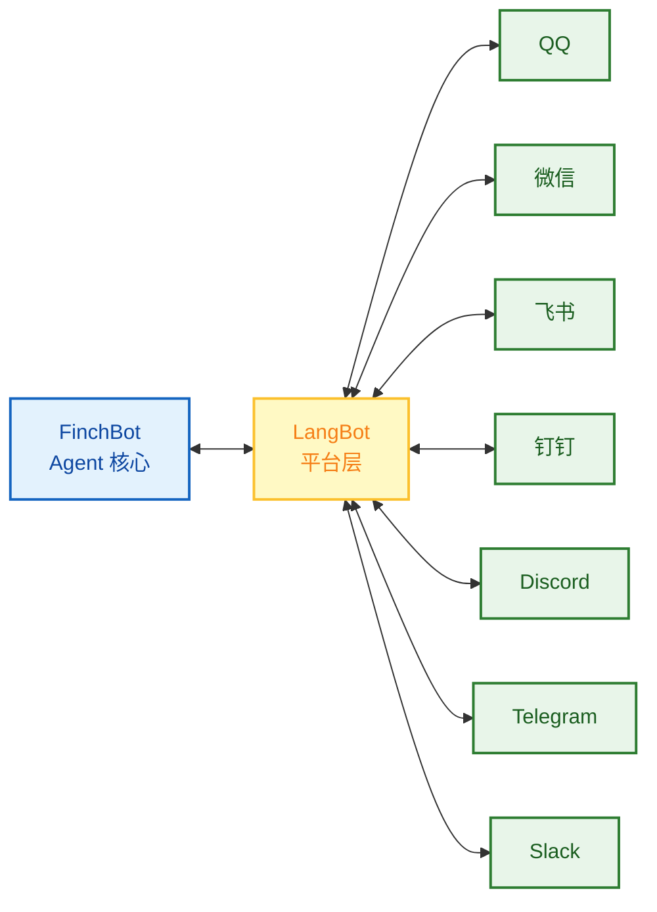
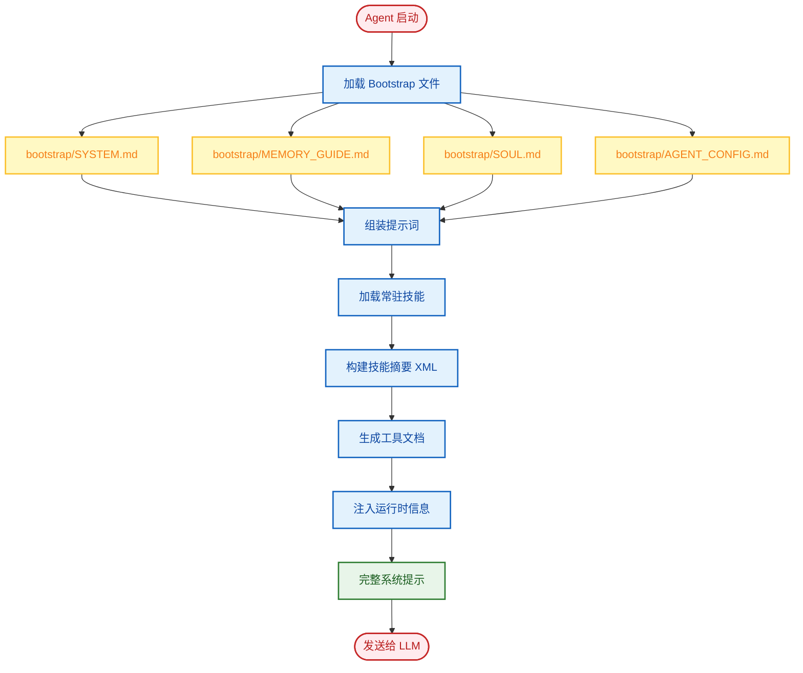

# 系统架构

本文档深入介绍 FinchBot 的系统架构、核心组件及其交互方式。

## 目录

1. [整体架构](#1-整体架构)
2. [核心组件](#2-核心组件)
3. [数据流](#3-数据流)
4. [设计原则](#4-设计原则)
5. [扩展点](#5-扩展点)

---

## 1. 整体架构

FinchBot 基于 **LangChain v1.2** + **LangGraph v1.0** 构建，具备持久化记忆、动态工具调度、多平台消息支持和全异步并发启动能力。系统由四个核心组件构成：

1. **Agent 核心（大脑）**：负责决策、规划和工具调度，支持异步流式输出
2. **记忆系统**：负责长期信息存储和检索，采用 SQLite + FastEmbed + ChromaDB 混合架构
3. **工具生态**：负责与外部世界交互，支持延迟加载和线程池并发初始化，支持 MCP 协议
4. **通道系统**：负责多平台消息路由，支持 Discord、钉钉、飞书、微信、邮件等

### 1.1 整体架构图



### 1.2 目录结构

```
finchbot/
├── agent/              # Agent 核心
│   ├── core.py        # Agent 创建与运行（异步优化）
│   ├── factory.py     # AgentFactory（并发线程池）
│   ├── context.py     # ContextBuilder 提示词组装
│   ├── capabilities.py # CapabilitiesBuilder 能力构建
│   └── skills.py      # SkillsLoader Markdown 技能加载
├── channels/           # 多平台消息（通过 LangBot）
│   ├── base.py        # BaseChannel 抽象基类
│   ├── bus.py         # MessageBus 异步路由器
│   ├── manager.py     # ChannelManager 协调器
│   ├── schema.py      # 消息模型
│   └── langbot_integration.py  # LangBot 集成指南
├── cli/                # 命令行界面
│   ├── chat_session.py # 异步会话管理
│   ├── config_manager.py
│   ├── providers.py
│   └── ui.py
├── config/             # 配置管理
│   ├── loader.py
│   ├── schema.py      # 包含 MCPConfig, ChannelsConfig
│   └── utils.py
├── constants.py        # 统一常量定义
├── i18n/               # 国际化
│   ├── loader.py      # 语言加载器
│   └── locales/
├── memory/             # 记忆系统
│   ├── manager.py
│   ├── types.py
│   ├── services/       # 服务层
│   ├── storage/        # 存储层
│   └── vector_sync.py
├── providers/          # LLM 提供商
│   └── factory.py
├── sessions/           # 会话管理
│   ├── metadata.py
│   ├── selector.py
│   └── title_generator.py
├── skills/             # 技能系统
│   ├── skill-creator/
│   ├── summarize/
│   └── weather/
├── tools/              # 工具系统
│   ├── base.py
│   ├── factory.py     # ToolFactory（MCP 工具通过 langchain-mcp-adapters）
│   ├── registry.py
│   ├── config_tools.py # 配置工具（configure_mcp 等）
│   ├── tools_generator.py # 工具文档生成器
│   ├── filesystem.py
│   ├── memory.py
│   ├── shell.py
│   ├── web.py
│   ├── session_title.py
│   └── search/
└── utils/              # 工具函数
    ├── cache.py
    ├── logger.py
    └── model_downloader.py
```

---

### 1.3 异步启动流程

FinchBot 引入了全异步启动架构，利用 `asyncio` 和 `concurrent.futures.ThreadPoolExecutor` 并发执行耗时操作，显著提升启动速度。



---

## 2. 核心组件

### 2.1 Agent 核心

**实现位置**：`src/finchbot/agent/`

Agent 核心是 FinchBot 的大脑，负责决策、规划和工具调度。现在使用工厂模式解耦创建逻辑。

#### 核心组件

* **AgentFactory（`factory.py`）**：负责组装 Agent，协调 ToolFactory 创建工具集，初始化 Checkpointer
* **Agent Core（`core.py`）**：负责 Agent 运行时逻辑
    * **状态管理**：基于 `LangGraph` 的 `StateGraph`，维护对话状态（`messages`）
    * **持久化**：使用 `SqliteSaver`（`checkpoints.db`）保存状态快照，支持恢复和历史回滚
* **ContextBuilder（`context.py`）**：动态组装系统提示词，包括：
    * **身份**：`SYSTEM.md`（角色定义）
    * **记忆指南**：`MEMORY_GUIDE.md`（记忆使用指南）
    * **灵魂**：`SOUL.md`（性格定义）
    * **技能**：动态加载的技能描述
    * **工具**：`TOOLS.md`（工具文档）
    * **能力**：`CAPABILITIES.md`（MCP 和能力信息）
    * **运行时信息**：当前时间、操作系统、Python 版本等

#### 关键类和函数

| 函数/类 | 说明 |
|:---|:---|
| `AgentFactory.create_for_cli()` | 静态工厂方法，为 CLI 创建配置好的 Agent |
| `create_finch_agent()` | 创建并配置 LangGraph Agent |
| `build_system_prompt()` | 构建完整的系统提示词 |
| `get_sqlite_checkpointer()` | 获取 SQLite 持久化检查点 |

#### 线程安全机制

工具注册使用**单锁模式**实现延迟加载，确保线程安全：

```python
def _ensure_tools_registered(
    workspace: Path | None = None,
    tools: Sequence[BaseTool] | None = None
) -> None:
    global _tools_registered

    with _tools_lock:
        if _tools_registered:
            return
        # 实际注册逻辑...
```

---

### 2.2 技能系统

**实现位置**：`src/finchbot/agent/skills.py`

技能是 FinchBot 的独特创新——**用 Markdown 文件定义 Agent 的能力边界**。

#### 最大特色：Agent 自动创建技能

FinchBot 内置了 **skill-creator** 技能，这是开箱即用理念的极致体现：

> **只需告诉 Agent 你想要什么技能，Agent 就会自动创建好！**

```
用户: 帮我创建一个翻译技能，可以把中文翻译成英文

Agent: 好的，我来为你创建翻译技能...
       [调用 skill-creator 技能]
       已创建 skills/translator/SKILL.md
       现在你可以直接使用翻译功能了！
```

无需手动创建文件、无需编写代码，**一句话就能扩展 Agent 能力**！

#### 技能文件结构

```yaml
# SKILL.md 示例
---
name: weather
description: 查询当前天气和预报（无需 API Key）
metadata:
  finchbot:
    emoji:
    always: false
    requires:
      bins: [curl]
      env: []
---
# 技能内容...
```

#### 核心设计模式

| 模式 | 说明 |
|:---:|:---|
| **双层技能源** | 工作区技能优先，内置技能兜底 |
| **依赖检查** | 自动检查 CLI 工具和环境变量 |
| **缓存失效检测** | 基于文件修改时间的智能缓存 |
| **渐进式加载** | 常驻技能优先，按需加载其他 |

---

### 2.3 记忆系统

**实现位置**：`src/finchbot/memory/`

FinchBot 实现了先进的**双层记忆架构**，彻底解决了 LLM 上下文窗口限制和长期记忆遗忘问题。

#### 为什么是 Agentic RAG？

| 维度 | 传统 RAG | Agentic RAG（FinchBot） |
|:---:|:---|:---|
| **检索触发** | 固定流程 | Agent 自主决策 |
| **检索策略** | 单一向量检索 | 混合检索 + 权重动态调整 |
| **记忆管理** | 被动存储 | 主动 remember/recall/forget |
| **分类能力** | 无 | 自动分类 + 重要性评分 |
| **更新机制** | 全量重建 | 增量同步 |

#### 双层存储架构



#### 分层设计

1. **结构化层（SQLite）**：
    * **角色**：真相源（Source of Truth）
    * **内容**：全文、元数据（标签、来源）、分类、重要性评分、访问日志
    * **优势**：支持精确查询（如按时间、分类过滤）
    * **实现**：`SQLiteStore` 类，使用 `aiosqlite` 进行异步操作

2. **语义层（Vector Store）**：
    * **角色**：模糊检索和关联
    * **内容**：文本的 Embedding 向量
    * **技术栈**：ChromaDB + FastEmbed（本地轻量模型）
    * **优势**：支持自然语言语义搜索（如"上次提到的那本 Python 书"）
    * **实现**：`VectorMemoryStore` 类

#### 核心服务

| 服务 | 位置 | 功能 |
|:---|:---|:---|
| **DataSyncManager** | `memory/vector_sync.py` | 确保 SQLite 和 Vector Store 的最终一致性，支持重试 |
| **ImportanceScorer** | `memory/services/importance.py` | 自动评估记忆重要性（0.0-1.0），用于清理和优先级排序 |
| **RetrievalService** | `memory/services/retrieval.py` | 混合检索策略，结合向量相似度和元数据过滤 |
| **ClassificationService** | `memory/services/classification.py` | 基于关键词和语义的自动分类 |
| **EmbeddingService** | `memory/services/embedding.py` | 使用 FastEmbed 生成本地 Embedding |

#### 混合检索策略

FinchBot 采用**加权 RRF（Weighted Reciprocal Rank Fusion）**策略：

```python
class QueryType(StrEnum):
    """查询类型，决定检索权重"""
    KEYWORD_ONLY = "keyword_only"      # 纯关键词（1.0/0.0）
    SEMANTIC_ONLY = "semantic_only"    # 纯语义（0.0/1.0）
    FACTUAL = "factual"                # 事实型（0.8/0.2）
    CONCEPTUAL = "conceptual"          # 概念型（0.2/0.8）
    COMPLEX = "complex"                # 复杂型（0.5/0.5）
    AMBIGUOUS = "ambiguous"            # 歧义型（0.3/0.7）
```

#### MemoryManager 核心方法

```python
class MemoryManager:
    def remember(self, content: str, category=None, importance=None, ...)
    def recall(self, query: str, top_k=5, category=None, ...)
    def forget(self, pattern: str)
    def get_stats(self) -> dict
    def search_memories(self, ...)
    def get_recent_memories(self, days=7, limit=20)
    def get_important_memories(self, min_importance=0.8, limit=20)
```

---

### 2.4 工具生态

**实现位置**：`src/finchbot/tools/`

#### 注册机制与工厂模式

* **ToolFactory（`factory.py`）**：负责根据配置创建和组装工具列表。处理 WebSearchTool 的自动降级逻辑（Tavily/Brave/DuckDuckGo），并通过 `langchain-mcp-adapters` 加载 MCP 工具
* **ToolRegistry**：单例注册表，管理所有可用工具
* **延迟加载**：默认工具（文件、搜索等）由 Factory 创建，Agent 启动时自动注册
* **OpenAI 兼容**：支持导出 OpenAI Function Calling 格式的工具定义
* **MCP 支持**：通过官方 `langchain-mcp-adapters` 库支持 MCP 协议，支持 stdio 和 HTTP 传输

#### 工具系统架构



#### 工具基类

所有工具继承 `FinchTool` 基类，必须实现：
- `name`：工具名称
- `description`：工具描述
- `parameters`：参数定义（JSON Schema）
- `_run()`：执行逻辑

#### 安全沙箱

* **文件操作**：限制在工作区（`workspace`）内，防止越权访问系统文件
* **Shell 执行**：默认禁用高危命令（rm -rf /），并有超时控制

#### 内置工具一览

| 工具名称 | 类别 | 文件 | 功能 |
|:---|:---|:---|:---|
| `read_file` | 文件 | `filesystem.py` | 读取文件内容 |
| `write_file` | 文件 | `filesystem.py` | 写入文件 |
| `edit_file` | 文件 | `filesystem.py` | 编辑文件（行级别） |
| `list_dir` | 文件 | `filesystem.py` | 列出目录内容 |
| `exec` | 系统 | `shell.py` | 执行 Shell 命令 |
| `web_search` | 网络 | `web.py` / `search/` | 网页搜索（支持 Tavily/Brave/DuckDuckGo） |
| `web_extract` | 网络 | `web.py` | 网页内容提取（支持 Jina AI 降级） |
| `remember` | 记忆 | `memory.py` | 存储记忆 |
| `recall` | 记忆 | `memory.py` | 检索记忆 |
| `forget` | 记忆 | `memory.py` | 删除/归档记忆 |
| `session_title` | 系统 | `session_title.py` | 管理会话标题 |
| `configure_mcp` | 配置 | `config_tools.py` | 动态配置 MCP 服务器（添加/删除/更新/启用/禁用/列出） |
| `refresh_capabilities` | 配置 | `config_tools.py` | 刷新能力描述文件 |
| `get_capabilities` | 配置 | `config_tools.py` | 获取当前能力描述 |
| `get_mcp_config_path` | 配置 | `config_tools.py` | 获取 MCP 配置文件路径 |

#### 网页搜索：三引擎降级设计



| 优先级 | 引擎 | API Key | 特点 |
|:---:|:---:|:---:|:---|
| 1 | **Tavily** | 需要 | 质量最佳，专为 AI 优化，深度搜索 |
| 2 | **Brave Search** | 需要 | 免费额度大，隐私友好 |
| 3 | **DuckDuckGo** | 无需 | 始终可用，零配置 |

**工作原理**：

1. 如果设置了 `TAVILY_API_KEY` → 使用 Tavily（质量最佳）
2. 否则如果设置了 `BRAVE_API_KEY` → 使用 Brave Search
3. 否则 → 使用 DuckDuckGo（无需 API Key，始终可用）

这个设计确保**即使没有任何 API Key 配置，网页搜索也能开箱即用**！

#### 会话标题：智能命名，开箱即用

`session_title` 工具体现了 FinchBot 的开箱即用理念：

| 操作方式 | 说明 | 示例 |
|:---:|:---|:---|
| **自动生成** | 对话 2-3 轮后，AI 自动根据内容生成标题 | "Python 异步编程讨论" |
| **Agent 修改** | 告诉 Agent "把会话标题改成 XXX" | Agent 调用工具自动修改 |
| **手动重命名** | 在会话管理器中按 `r` 键重命名 | 用户手动输入新标题 |

这个设计让用户**无需关心技术细节**，无论是自动还是手动，都能轻松管理会话。

---

### 2.5 通道系统

**实现位置**：`src/finchbot/channels/`

通道系统已迁移到 [LangBot](https://github.com/langbot-app/LangBot) 平台，提供生产级的多平台消息支持。

#### 为什么选择 LangBot？

- **15k+ GitHub Stars**，活跃维护
- **支持 12+ 平台**：QQ、微信、企业微信、飞书、钉钉、Discord、Telegram、Slack、LINE、KOOK、Satori
- **内置 WebUI**：可视化配置各平台
- **插件生态**：支持 MCP 等扩展

#### LangBot 集成架构



#### 快速开始

```bash
# 安装 LangBot
uvx langbot

# 访问 WebUI http://localhost:5300
# 配置你的平台并连接到 FinchBot
```

更多详情请参阅 [LangBot 文档](https://docs.langbot.app)。

#### 核心组件（保留用于兼容性）

| 组件 | 文件 | 功能 |
|:---|:---|:---|
| **BaseChannel** | `base.py` | 抽象基类，定义通道接口（start, stop, send, receive） |
| **MessageBus** | `bus.py` | 异步消息路由器，管理入站/出站消息队列 |
| **ChannelManager** | `manager.py` | 协调多通道，处理消息路由和通道生命周期 |
| **InboundMessage** | `schema.py` | 标准化入站消息格式 |
| **OutboundMessage** | `schema.py` | 标准化出站消息格式 |

#### 消息模型

```python
class InboundMessage(BaseModel):
    """入站消息 - 从平台到 Agent"""
    channel_id: str          # 通道标识
    user_id: str             # 用户标识
    content: str             # 消息内容
    session_id: str | None   # 会话 ID
    metadata: dict = {}      # 附加元数据

class OutboundMessage(BaseModel):
    """出站消息 - 从 Agent 到平台"""
    channel_id: str          # 目标通道
    user_id: str             # 目标用户
    content: str             # 响应内容
    session_id: str | None   # 会话 ID
    metadata: dict = {}      # 附加元数据
```

---

### 2.6 动态提示词系统

**实现位置**：`src/finchbot/agent/context.py`

#### Bootstrap 文件系统

```
~/.finchbot/
├── config.json              # 主配置文件
└── workspace/
    ├── bootstrap/           # Bootstrap 文件目录
    │   ├── SYSTEM.md        # 角色定义
    │   ├── MEMORY_GUIDE.md  # 记忆使用指南
    │   ├── SOUL.md          # 性格设定
    │   └── AGENT_CONFIG.md  # Agent 配置
    ├── config/              # 配置目录
    │   └── mcp.json         # MCP 服务器配置
    ├── generated/           # 自动生成文件
    │   ├── TOOLS.md         # 工具文档
    │   └── CAPABILITIES.md  # 能力信息
    ├── skills/              # 自定义技能
    ├── memory/              # 记忆存储
    │   └── memory.db
    └── sessions/            # 会话存储
        └── checkpoints.db
```

#### 提示词加载流程



---

### 2.7 I18n 系统（国际化）

**实现位置**：`src/finchbot/i18n/`

#### 支持的语言

- `zh-CN`：简体中文
- `zh-HK`：繁体中文
- `en-US`：英语

#### 语言降级链

系统实现了智能降级机制：
```
zh-CN → zh → en-US
zh-HK → zh → en-US
en-US →（无降级）
```

#### 配置优先级

1. 环境变量：`FINCHBOT_LANG`
2. 用户配置：`~/.finchbot/config.json`
3. 系统语言检测
4. 默认值：`en-US`

---

### 2.8 配置系统

**实现位置**：`src/finchbot/config/`

使用 Pydantic v2 + Pydantic Settings 进行类型安全的配置管理。

#### 配置结构

```
Config（根）
├── language
├── default_model
├── agents
│   └── defaults（Agent 默认值）
├── providers
│   ├── openai
│   ├── anthropic
│   ├── deepseek
│   ├── moonshot
│   ├── dashscope
│   ├── groq
│   ├── gemini
│   ├── openrouter
│   └── custom
├── tools
│   ├── web.search（搜索配置）
│   ├── exec（Shell 执行配置）
│   └── restrict_to_workspace
├── mcp                    # MCP 配置（存储在 workspace/config/mcp.json）
│   └── servers
│       └── {server_name}
│           ├── command    # stdio 传输命令
│           ├── args       # 命令参数
│           ├── env        # 环境变量
│           ├── url        # HTTP 传输 URL
│           ├── headers    # HTTP 请求头
│           └── disabled   # 是否禁用
└── channels               # 渠道配置（已迁移到 LangBot）
    ├── discord
    ├── feishu
    ├── dingtalk
    ├── wechat
    ├── email
    └── langbot_enabled
```

**工作区目录结构**：

```
workspace/
├── bootstrap/           # Bootstrap 文件（系统提示词）
├── config/              # 配置文件
│   └── mcp.json         # MCP 服务器配置
├── generated/           # 自动生成文件
│   ├── TOOLS.md         # 工具文档
│   └── CAPABILITIES.md  # 能力信息
├── skills/              # 技能目录
├── memory/              # 记忆存储
└── sessions/            # 会话数据
```

#### MCP 配置示例

```python
class MCPServerConfig(BaseModel):
    """单个 MCP 服务器配置
    
    支持 stdio 和 HTTP 两种传输方式。
    """
    command: str = ""           # stdio 传输的启动命令
    args: list[str] = []        # stdio 传输的命令参数
    env: dict[str, str] | None = None  # stdio 传输的环境变量
    url: str = ""               # HTTP 传输的服务器 URL
    headers: dict[str, str] | None = None  # HTTP 传输的请求头
    disabled: bool = False      # 是否禁用此服务器

class MCPConfig(BaseModel):
    """MCP 总配置
    
    使用 langchain-mcp-adapters 官方库加载 MCP 工具。
    """
    servers: dict[str, MCPServerConfig]
```

#### Channel 配置说明

渠道功能已迁移到 LangBot 平台。LangBot 支持 QQ、微信、飞书、钉钉、Discord、Telegram、Slack 等 12+ 平台。

请使用 LangBot 的 WebUI 配置各平台：https://langbot.app

此配置保留用于兼容性，后续版本将移除。

---

## 3. 数据流

### 3.1 完整数据流


### 3.2 对话流程


1. 用户输入 → CLI 接收
2. Agent 加载历史状态（Checkpoint）
3. ContextBuilder 构建当前 Prompt（包含相关记忆）
4. LLM 生成响应或工具调用请求
5. 如果工具调用 → 执行工具 → 返回结果给 LLM → 循环
6. LLM 生成最终响应 → 显示给用户

### 3.3 记忆写入流程（Remember）

1. Agent 调用 `remember` 工具
2. `MemoryManager` 接收内容
3. 自动计算 `category`（ClassificationService）
4. 自动计算 `importance`（ImportanceScorer）
5. 写入 SQLite，生成唯一 ID
6. 同步调用 Embedding 服务，写入向量到 ChromaDB
7. 记录访问日志

### 3.4 记忆检索流程（Recall）

1. Agent 调用 `recall` 工具（查询："我的 API Key 是什么"）
2. `RetrievalService` 将查询转为向量
3. 在 Vector Store 中搜索 Top-K 相似结果
4. （可选）结合 SQLite 进行元数据过滤（分类、时间范围等）
5. 返回结果给 Agent

---

## 4. 设计原则

### 4.1 模块化

每个组件都有清晰的职责边界：
- `MemoryManager` 不直接处理存储细节，委托给 `SQLiteStore` 和 `VectorMemoryStore`
- `ToolRegistry` 只处理注册和查找，不关心工具实现
- `I18n` 系统独立于业务逻辑
- `ChannelManager` 协调多通道，与 Agent 核心解耦

### 4.2 依赖倒置

高层模块不依赖低层模块，两者都依赖抽象：
```
AgentCore → MemoryManager（接口）
                ↓
         SQLiteStore / VectorStore（实现）
```

### 4.3 隐私优先

- Embedding 生成本地完成（FastEmbed），无需上传云端
- 配置文件存储在用户目录 `~/.finchbot`
- 文件操作限制在工作区内

### 4.4 开箱即用

FinchBot 将"开箱即用"作为核心设计原则：

| 特性 | 说明 |
|:---:|:---|
| **三步上手** | `config` → `sessions` → `chat`，三个命令完成工作流 |
| **环境变量** | 所有配置均可通过环境变量设置 |
| **Rich CLI 界面** | 全屏键盘导航，交互式操作 |
| **i18n 支持** | 内置中英文支持，自动检测系统语言 |
| **自动降级** | 网页搜索自动降级：Tavily → Brave → DuckDuckGo |
| **Agent 自动创建技能** | 告诉 Agent 需求，自动生成技能文件 |

### 4.5 防御性编程

- 单锁模式防止并发问题
- 向量存储失败不影响 SQLite 写入（降级策略）
- 超时控制防止工具挂起
- 完整的错误日志（Loguru）

---

## 5. 扩展点

### 5.1 添加新工具

继承 `FinchTool` 基类，实现 `_run()` 方法，然后注册到 `ToolRegistry`。

### 5.2 添加 MCP 工具

在配置文件中添加 MCP 服务器配置，支持 stdio 和 HTTP 传输。MCP 工具通过 `langchain-mcp-adapters` 自动加载。

### 5.3 添加新技能

在 `~/.finchbot/workspace/skills/{skill-name}/` 下创建 `SKILL.md` 文件。

### 5.4 添加新的 LLM 提供商

在 `providers/factory.py` 中添加新的 Provider 类。

### 5.5 多平台消息支持

使用 [LangBot](https://github.com/langbot-app/LangBot) 实现多平台支持。LangBot 支持 QQ、微信、飞书、钉钉、Discord、Telegram、Slack 等 12+ 平台。

详见 [LangBot 文档](https://docs.langbot.app)。

### 5.6 自定义记忆检索策略

继承 `RetrievalService` 或修改 `search()` 方法。

### 5.7 添加新语言

在 `i18n/locales/` 下添加新的 `.toml` 文件。

---

## 总结

FinchBot 的架构设计聚焦于：
- **可扩展性**：清晰的组件边界和接口
- **可靠性**：降级策略、重试机制、线程安全
- **可维护性**：类型安全、完整日志、模块化设计
- **隐私性**：敏感数据本地处理
- **多平台支持**：通过 LangBot 支持 QQ、微信、飞书、钉钉、Discord、Telegram、Slack 等 12+ 平台
- **MCP 支持**：通过官方 langchain-mcp-adapters 支持 stdio 和 HTTP 传输
