<div align="center">
  
  <h1><strong>玄同 765</strong></h1>
  <p><strong>大语言模型 (LLM) 开发工程师 | 中国传媒大学 · 数字媒体技术（智能交互与游戏设计）</strong></p>
  <p>
    <a href="https://blog.csdn.net/Yunyi_Chi" target="_blank" style="text-decoration: none;">
      <span style="background-color: #f39c12; color: white; padding: 2px 8px; border-radius: 4px; font-size: 12px; font-weight: bold; display: inline-block;">CSDN · 个人主页 |</span>
    </a>
    <a href="https://github.com/xt765" target="_blank" style="text-decoration: none; margin-left: 8px;">
      <span style="background-color: #24292e; color: white; padding: 2px 8px; border-radius: 4px; font-size: 12px; font-weight: bold; display: inline-block;">GitHub · Follow</span>
    </a>
  </p>
</div>

---

### **关于作者**

- **深耕领域**：大语言模型开发 / RAG 知识库 / AI Agent 落地 / 模型微调
- **技术栈**：Python | RAG (LangChain / Dify + Milvus) | FastAPI + Docker
- **工程能力**：专注模型工程化部署、知识库构建与优化，擅长全流程解决方案

> **「让 AI 交互更智能，让技术落地更高效」**
> 欢迎技术探讨与项目合作，解锁大模型与智能交互的无限可能！

---

# FinchBot (雀翎) - 一个真正灵活的 AI Agent 框架


> 作者：玄同765 (xt765)
> 项目地址：[GitHub - FinchBot](https://github.com/xt765/finchbot)
> 国内镜像：[Gitee - FinchBot](https://gitee.com/xt765/finchbot)

## 摘要

FinchBot (雀翎) 是一个轻量级、模块化的 AI Agent 框架，基于 **LangChain v1.2** 和 **LangGraph v1.0** 构建。它不是又一个简单的 LLM 封装，而是一个深思熟虑的架构设计，专注于三个核心问题：

1. **如何让 Agent 的能力无限扩展？** - 通过技能 (Skill) 和工具 (Tool) 的双层扩展机制
2. **如何让 Agent 拥有真正的记忆？** - 通过双层存储架构 + Agentic RAG
3. **如何让 Agent 的行为可定制？** - 通过动态提示词文件系统

本文将深入剖析 FinchBot 的架构设计，带你了解一个生产级 Agent 框架的诞生过程。

---

## 一、为什么选择 FinchBot？

在 AI Agent 框架百花齐放的今天，你可能会问：为什么还需要 FinchBot？

### 1.1 现有框架的痛点

|         痛点         | 传统方案                | FinchBot 方案                   |
| :------------------: | :---------------------- | :------------------------------ |
|  **扩展困难**  | 需要修改核心代码        | 继承基类或创建 Markdown 文件    |
|  **记忆脆弱**  | 依赖 LLM 上下文窗口     | 双层持久化存储 + 语义检索       |
| **提示词僵化** | 硬编码在代码中          | 文件系统，热加载                |
|  **架构过时**  | 基于 LangChain 旧版 API | LangChain v1.2 + LangGraph v1.0 |

### 1.2 FinchBot 的设计哲学

```mermaid
graph BT
    classDef roof fill:#ffebee,stroke:#c62828,stroke-width:3px,color:#b71c1c,rx:10,ry:10;
    classDef pillar fill:#e3f2fd,stroke:#1565c0,stroke-width:2px,color:#0d47a1,rx:8,ry:8;
    classDef base fill:#e8f5e9,stroke:#2e7d32,stroke-width:3px,color:#1b5e20,rx:10,ry:10;

    Roof("FinchBot Framework<br/>轻量 • 灵活 • 无限扩展"):::roof

    subgraph Pillars [核心哲学]
        direction LR
        P("隐私优先<br/>本地 Embedding<br/>数据不上云"):::pillar
        M("模块化<br/>工厂模式<br/>组件解耦"):::pillar
        D("开发者友好<br/>类型安全<br/>文档完善"):::pillar
        S("极速启动<br/>全异步架构<br/>线程池并发"):::pillar
        O("开箱即用<br/>零配置启动<br/>自动降级"):::pillar
    end

    Base("技术基石<br/>LangChain v1.2 • LangGraph v1.0 • Python 3.13"):::base

    Base === P & M & D & S & O
    P & M & D & S & O === Roof
```



### 1.3 开箱即用体验

FinchBot 将 **"开箱即用"** 作为核心设计理念——无需复杂配置即可上手：

**三步快速上手：**

```bash
# 第一步：配置 API 密钥和默认模型
uv run finchbot config

# 第二步：管理你的会话
uv run finchbot sessions

# 第三步：开始对话
uv run finchbot chat
```

|          特性          | 说明                                                                         |
| :---------------------: | :--------------------------------------------------------------------------- |
| **环境变量配置** | 所有配置均可通过环境变量设置（`OPENAI_API_KEY`、`ANTHROPIC_API_KEY` 等） |
|  **i18n 国际化**  | 内置中英文支持，自动检测系统语言                                             |
| **多平台消息支持** | 支持 Web、Discord、钉钉、飞书、微信、邮件等多平台消息接入                   |
|   **自动降级**   | 网页搜索自动降级：Tavily → Brave → DuckDuckGo                              |

---

## 二、架构设计：模块化与工厂模式

FinchBot 采用工厂模式 (Factory Pattern) 来提升系统的灵活性和可维护性。

### 2.1 整体架构图

```mermaid
graph TB
    subgraph UI [用户交互层]
        CLI[CLI 界面]
        Web[Web 界面]
        API[REST API]
        Channels[多平台通道<br/>Discord/钉钉/飞书]
    end

    subgraph Core [Agent 核心]
        Agent[LangGraph Agent<br/>决策引擎]
        Context[ContextBuilder<br/>上下文构建]
        Tools[ToolRegistry<br/>11个内置工具]
        Memory[MemoryManager<br/>双层记忆]
    end

    subgraph Infra [基础设施层]
        Storage[双层存储<br/>SQLite + VectorStore]
        LLM[LLM 提供商<br/>OpenAI/Anthropic/DeepSeek]
    end

    CLI --> Agent
    Web --> Agent
    API --> Agent
    Channels --> Agent

    Agent --> Context
    Agent <--> Tools
    Agent <--> Memory

    Memory --> Storage
    Agent --> LLM
```



### 2.2 Agent Factory

`AgentFactory` 负责组装一个完整的 Agent 实例。它屏蔽了复杂的初始化细节（如 Checkpointer 的创建、LLM 模型的配置、工具链的组装），对外提供简洁的创建接口。

```python
# 现在的创建方式简洁明了
agent, checkpointer, tools = AgentFactory.create_for_cli(
    session_id=session_id,
    workspace=ws_path,
    model=chat_model,
    config=config_obj,
)
```

### 2.3 Tool Factory

`ToolFactory` 集中管理所有工具的实例化逻辑。它不仅负责创建工具，还负责处理工具之间的依赖关系和自动降级逻辑。

---

## 三、记忆架构：双层存储 + Agentic RAG

FinchBot 实现了先进的**双层记忆架构**，彻底解决了 LLM 上下文窗口限制和长期记忆遗忘问题。

### 3.1 为什么是 Agentic RAG？

|      对比维度      | 传统 RAG     | Agentic RAG (FinchBot)      |
| :----------------: | :----------- | :-------------------------- |
| **检索触发** | 固定流程     | Agent 自主决策              |
| **检索策略** | 单一向量检索 | 混合检索 + 权重动态调整     |
| **记忆管理** | 被动存储     | 主动 remember/recall/forget |
| **分类能力** | 无           | 自动分类 + 重要性评分       |
| **更新机制** | 全量重建     | 增量同步                    |

### 3.2 双层存储架构

```mermaid
flowchart TB
    %% 样式定义
    classDef businessLayer fill:#e3f2fd,stroke:#1565c0,stroke-width:2px,color:#0d47a1;
    classDef serviceLayer fill:#fff9c4,stroke:#fbc02d,stroke-width:2px,color:#f57f17;
    classDef storageLayer fill:#e8f5e9,stroke:#2e7d32,stroke-width:2px,color:#1b5e20;

    subgraph Business [业务层]
        MM[💾 MemoryManager<br/>remember/recall/forget]
    end
    class MM businessLayer

    subgraph Services [服务层]
        RS[🔍 RetrievalService<br/>混合检索 + RRF]
        CS[📊 ClassificationService<br/>自动分类]
        IS[⭐ ImportanceScorer<br/>重要性评分]
        ES[🧮 EmbeddingService<br/>FastEmbed 本地]
    end
    class RS,CS,IS,ES serviceLayer

    subgraph Storage [存储层]
        direction LR
        SQLite[(🗄️ SQLiteStore<br/>真相源<br/>精确查询)]
        Vector[(🧮 VectorStore<br/>ChromaDB<br/>语义检索)]
        DS[🔄 DataSyncManager<br/>增量同步]
    end
    class SQLite,Vector,DS storageLayer

    %% 连接
    MM --> RS & CS & IS
    RS --> SQLite & Vector
    CS --> SQLite
    IS --> SQLite
    ES --> Vector
    
    SQLite <--> DS <--> Vector
```



### 3.3 混合检索策略

FinchBot 采用**加权 RRF (Weighted Reciprocal Rank Fusion)** 策略，智能融合关键词检索和语义检索的结果。

```python
class QueryType(StrEnum):
    """查询类型，决定检索权重"""
    KEYWORD_ONLY = "keyword_only"      # 纯关键词 (1.0/0.0)
    SEMANTIC_ONLY = "semantic_only"    # 纯语义 (0.0/1.0)
    FACTUAL = "factual"                # 事实型 (0.8/0.2)
    CONCEPTUAL = "conceptual"          # 概念型 (0.2/0.8)
    COMPLEX = "complex"                # 复杂型 (0.5/0.5)
    AMBIGUOUS = "ambiguous"            # 歧义型 (0.3/0.7)
```

---

## 四、动态提示词系统：用户可编辑的 Agent 大脑

FinchBot 的提示词系统采用**文件系统 + 模块化组装**的设计，让用户可以自由定制 Agent 的行为。

### 4.1 Bootstrap 文件系统

```
~/.finchbot/
├── SYSTEM.md           # 角色设定
├── MEMORY_GUIDE.md     # 记忆使用指南
├── SOUL.md             # 灵魂设定（性格特征）
├── AGENT_CONFIG.md     # Agent 配置
└── workspace/
    └── skills/         # 自定义技能
```

### 4.2 提示词加载流程

```mermaid
flowchart TD
    %% 样式定义
    classDef startEnd fill:#ffebee,stroke:#c62828,stroke-width:2px,color:#b71c1c;
    classDef process fill:#e3f2fd,stroke:#1565c0,stroke-width:2px,color:#0d47a1;
    classDef file fill:#fff9c4,stroke:#fbc02d,stroke-width:2px,color:#f57f17;
    classDef output fill:#e8f5e9,stroke:#2e7d32,stroke-width:2px,color:#1b5e20;

    A([🚀 Agent 启动]):::startEnd --> B[📂 加载 Bootstrap 文件]:::process
    
    B --> C[SYSTEM.md]:::file
    B --> D[MEMORY_GUIDE.md]:::file
    B --> E[SOUL.md]:::file
    B --> F[AGENT_CONFIG.md]:::file

    C --> G[🔧 组装提示词]:::process
    D --> G
    E --> G
    F --> G

    G --> H[📚 加载常驻技能]:::process
    H --> I[🏗️ 构建技能摘要 XML]:::process
    I --> J[📋 生成工具文档]:::process
    J --> K[⚙️ 注入运行时信息]:::process
    K --> L[📝 完整系统提示]:::output

    L --> M([📤 发送给 LLM]):::startEnd
```



---

## 五、技能与工具：无限扩展的 Agent 能力

FinchBot 的扩展性建立在两个层次上：**工具层 (Tool)** 和 **技能层 (Skill)**。

### 5.1 工具系统：代码级能力扩展

工具是 Agent 与外部世界交互的桥梁。FinchBot 提供了 11 个内置工具，并支持轻松扩展。

#### 网页搜索：三引擎降级设计

```mermaid
flowchart TD
    %% 样式定义
    classDef check fill:#fff9c4,stroke:#fbc02d,stroke-width:2px,color:#f57f17;
    classDef engine fill:#e8f5e9,stroke:#2e7d32,stroke-width:2px,color:#1b5e20;
    classDef fallback fill:#e3f2fd,stroke:#1565c0,stroke-width:2px,color:#0d47a1;

    Start[🔍 网页搜索请求]:::check
    
    Check1{TAVILY_API_KEY<br/>已设置?}:::check
    Tavily[🚀 Tavily<br/>质量最佳<br/>AI 优化]:::engine
    
    Check2{BRAVE_API_KEY<br/>已设置?}:::check
    Brave[🦁 Brave Search<br/>隐私友好<br/>免费额度大]:::engine
    
    DDG[🦆 DuckDuckGo<br/>零配置<br/>始终可用]:::fallback

    Start --> Check1
    Check1 -->|是| Tavily
    Check1 -->|否| Check2
    Check2 -->|是| Brave
    Check2 -->|否| DDG
```



| 优先级 |          引擎          | API Key | 特点                             |
| :----: | :--------------------: | :-----: | :------------------------------- |
|   1   |    **Tavily**    |  需要  | 质量最佳，专为 AI 优化，深度搜索 |
|   2   | **Brave Search** |  需要  | 免费额度大，隐私友好             |
|   3   |  **DuckDuckGo**  |  无需  | 始终可用，零配置                 |

### 5.2 技能系统：用 Markdown 定义 Agent 能力

技能是 FinchBot 的独特创新——**用 Markdown 文件定义 Agent 的能力边界**。

#### 最大特色：Agent 自动创建技能

FinchBot 内置了 **skill-creator** 技能，这也是开箱即用理念的体现：

> **只需告诉 Agent 你想要什么技能，Agent 就会自动创建好！**

```
用户: 帮我创建一个翻译技能，可以把中文翻译成英文

Agent: 好的，我来为你创建翻译技能...
       [调用 skill-creator 技能]
       ✅ 已创建 skills/translator/SKILL.md
       现在你可以直接使用翻译功能了！
```

无需手动创建文件、无需编写代码，**一句话就能扩展 Agent 能力**！

---

## 六、Web 界面与 Docker 部署

### 6.1 Web 界面 (Beta)

FinchBot 现已提供基于 React + Vite + FastAPI 构建的现代化 Web 界面。

```mermaid
flowchart TB
    %% 样式定义
    classDef backend fill:#e3f2fd,stroke:#1565c0,stroke-width:2px,color:#0d47a1;
    classDef frontend fill:#e8f5e9,stroke:#2e7d32,stroke-width:2px,color:#1b5e20;
    classDef user fill:#fff9c4,stroke:#fbc02d,stroke-width:2px,color:#f57f17;

    subgraph Backend [后端服务]
        API[FastAPI<br/>:8000]:::backend
        WS[WebSocket<br/>实时通信]:::backend
    end

    subgraph Frontend [前端界面]
        React[React + Vite<br/>:5173]:::frontend
        MD[Markdown 渲染]:::frontend
    end

    U[👤 用户]:::user --> React
    React <--> WS
    WS <--> API

    API --> React
    React --> MD
    MD --> U
```



**启动方式**：

```bash
# 启动后端服务
uv run finchbot serve

# 在另一个终端启动前端
cd web
npm install
npm run dev
```

Web 界面特性：
- 实时流式输出
- Markdown 富文本渲染
- 代码高亮
- 历史记录自动加载

### 6.2 Docker 部署

FinchBot 提供完整的 Docker 支持，支持一键部署：

```bash
# 1. 克隆仓库
git clone https://gitee.com/xt765/finchbot.git
cd finchbot

# 2. 配置环境变量
cp .env.example .env
# 编辑 .env 文件，填入你的 API Key

# 3. 构建并启动
docker-compose up -d

# 4. 访问服务
# Web 界面: http://localhost:8000
```

**docker-compose.yml 配置**：

```yaml
services:
  finchbot:
    build:
      context: .
      dockerfile: Dockerfile
    container_name: finchbot
    ports:
      - "8000:8000"
    environment:
      - OPENAI_API_KEY=${OPENAI_API_KEY}
      - ANTHROPIC_API_KEY=${ANTHROPIC_API_KEY}
      - FINCHBOT_LANGUAGE=zh-CN
    volumes:
      - finchbot_workspace:/root/.finchbot/workspace
      - finchbot_models:/root/.cache/huggingface
    restart: unless-stopped
    healthcheck:
      test: ["CMD", "curl", "-f", "http://localhost:8000/health"]
      interval: 30s
      timeout: 10s
      retries: 3

volumes:
  finchbot_workspace:
  finchbot_models:
```

**Docker 部署特性**：

| 特性 | 说明 |
| :--: | :--- |
| **一键部署** | `docker-compose up -d` |
| **持久化存储** | 工作区和模型缓存通过卷持久化 |
| **健康检查** | 内置容器健康监控 |
| **多架构支持** | 支持 x86_64 和 ARM64 |

---

## 七、LangChain 1.2 架构实践

FinchBot 基于 **LangChain v1.2** 和 **LangGraph v1.0** 构建，采用最新的 Agent 架构。

### 7.1 支持的 LLM 提供商

|  提供商  | 模型                        | 特点             |
| :-------: | :-------------------------- | :--------------- |
|  OpenAI  | GPT-5, GPT-5.2, O3-mini     | 综合能力最强     |
| Anthropic | Claude Sonnet 4.5, Opus 4.6 | 安全性高，长文本 |
| DeepSeek | DeepSeek Chat, Reasoner     | 国产，性价比高   |
|  Gemini  | Gemini 2.5 Flash            | Google 最新      |
|   Groq   | Llama 4 Scout/Maverick      | 极速推理         |
| Moonshot | Kimi K1.5/K2.5              | 长文本，国产     |

---

## 八、总结

FinchBot 不是一个简单的 LLM 封装，而是一个深思熟虑的 Agent 框架设计：

|       核心特性       | 设计亮点                                        |
| :------------------: | :---------------------------------------------- |
|  **架构革新**  | 工厂模式解耦，高内聚低耦合                      |
|  **记忆架构**  | 双层存储，Agentic RAG，加权 RRF                 |
| **提示词系统** | 文件系统，热加载，模块化组装                    |
|  **工具系统**  | 注册表模式，线程安全，11 个内置工具，三引擎降级 |
|  **技能系统**  | Markdown 定义，Agent 自动创建，开箱即用         |
|  **架构实践**  | LangChain v1.2，LangGraph v1.0                  |
|  **部署方式**  | CLI / Web 界面 / Docker                         |
|  **开箱即用**  | 环境变量配置，Rich CLI，i18n，自动降级          |

如果你正在寻找一个：

* ✅ 隐私优先（本地 Embedding）
* ✅ 真持久化（双层记忆）
* ✅ 生产级稳定（完善的错误处理）
* ✅ 灵活扩展（技能 + 工具双层）
* ✅ 最新架构（LangChain 1.2 + LangGraph）
* ✅ 开箱即用（零配置启动，自动降级）
* ✅ 多种部署（CLI / Web / Docker）

的 AI Agent 框架，FinchBot 值得一试。

---

## 相关链接

* 📦 **项目地址**: [GitHub - FinchBot](https://github.com/xt765/finchbot) | [Gitee - FinchBot](https://gitee.com/xt765/finchbot)
* 📖 **文档**: [FinchBot 文档](https://github.com/xt765/finchbot/tree/main/docs)
* 💬 **问题反馈**: [GitHub Issues](https://github.com/xt765/finchbot/issues)

---

> 如果这个项目对你有帮助，请给个 Star ⭐️
