<div align="center">
  
  <h1><strong>玄同 765 (xt765)</strong></h1>
  <p><strong>LLM 开发工程师 | 中国传媒大学 · 数字媒体技术</strong></p>
  <p>
    <a href="https://blog.csdn.net/Yunyi_Chi" target="_blank" style="text-decoration: none;">
      <span style="background-color: #f39c12; color: white; padding: 2px 8px; border-radius: 4px; font-size: 12px; font-weight: bold; display: inline-block;">CSDN · 主页 |</span>
    </a>
    <a href="https://github.com/xt765" target="_blank" style="text-decoration: none; margin-left: 8px;">
      <span style="background-color: #24292e; color: white; padding: 2px 8px; border-radius: 4px; font-size: 12px; font-weight: bold; display: inline-block;">GitHub · Follow</span>
    </a>
  </p>
</div>

---

### **关于作者**

- **专注领域**：LLM 开发 / RAG 知识库 / AI Agent 实现 / 模型微调
- **技术栈**：Python | RAG (LangChain / Dify + Milvus) | FastAPI + Docker
- **工程化**：模型工程部署、知识库搭建优化、全栈解决方案

> **"让 AI 交互更智能，让技术落地更高效"**
> 欢迎技术交流和项目合作！

---

# FinchBot - 真正灵活的 AI Agent 框架


> 作者：玄同 765 (xt765)
> 项目：[GitHub - FinchBot](https://github.com/xt765/FinchBot) | [Gitee - FinchBot](https://gitee.com/xt765/FinchBot)

**🎉 Gitee 官方推荐项目** — FinchBot 已获得 Gitee 官方推荐！

---

## 摘要

FinchBot 是一个基于 **LangChain v1.2** 和 **LangGraph v1.0** 构建的轻量级、模块化 AI Agent 框架。它不仅仅是一个 LLM 包装器，而是一个精心设计的架构，专注于三个核心挑战：

1. **如何实现 Agent 无限扩展？** —— 通过技能和工具的双层扩展机制
2. **如何赋予 Agent 真正的记忆？** —— 通过双层存储架构 + Agentic RAG
3. **如何让 Agent 行为可定制？** —— 通过动态提示词文件系统

本文深入探讨 FinchBot 的架构设计，展示一个生产级 Agent 框架的诞生过程。

---

## 1. 为什么选择 FinchBot？

市面上有这么多 AI Agent 框架，你可能会问：为什么是 FinchBot？

### 1.1 现有框架的痛点

| 痛点 | 传统方案 | FinchBot 解决方案 |
| :---: | :--- | :--- |
| **难以扩展** | 修改核心代码 | 继承基类或创建 Markdown 文件 |
| **记忆脆弱** | 依赖 LLM 上下文窗口 | 双层持久化存储 + 语义检索 |
| **提示词僵化** | 硬编码在源码中 | 文件系统支持热重载 |
| **架构过时** | 旧版 LangChain API | LangChain v1.2 + LangGraph v1.0 |

### 1.2 设计哲学

```mermaid
graph BT
    classDef roof fill:#ffebee,stroke:#c62828,stroke-width:3px,color:#b71c1c,rx:10,ry:10;
    classDef pillar fill:#e3f2fd,stroke:#1565c0,stroke-width:2px,color:#0d47a1,rx:8,ry:8;
    classDef base fill:#e8f5e9,stroke:#2e7d32,stroke-width:3px,color:#1b5e20,rx:10,ry:10;

    Roof("<b>FinchBot Framework</b><br/>轻量 • 灵活 • 无限扩展"):::roof

    subgraph Pillars [核心哲学]
        direction LR
        P("<b>隐私优先</b><br/>本地 Embedding<br/>数据不上云"):::pillar
        M("<b>模块化</b><br/>工厂模式<br/>组件解耦"):::pillar
        D("<b>开发者友好</b><br/>类型安全<br/>文档完善"):::pillar
        S("<b>极速启动</b><br/>全异步架构<br/>线程池并发"):::pillar
        O("<b>开箱即用</b><br/>零配置<br/>自动降级"):::pillar
    end

    Base("<b>技术基石</b><br/>LangChain v1.2 • LangGraph v1.0 • Python 3.13"):::base

    Base === P & M & D & S & O
    P & M & D & S & O === Roof
```



### 1.3 开箱即用体验

FinchBot 以 **"开箱即用"** 为核心设计原则：

#### 多平台消息支持

FinchBot 统一的消息路由架构 —— 一次开发，多端触达：

- Web (WebSocket)
- Discord
- 钉钉 (Webhook)
- 飞书 (Bot API)
- 微信 (企业微信)
- 邮件 (SMTP/IMAP)

#### Web 界面（Beta）

FinchBot 提供基于 React + Vite + FastAPI 的现代化 Web 界面：

```bash
# 启动后端服务
uv run finchbot serve

# 在另一个终端启动前端
cd web
npm install
npm run dev
```

Web 界面支持：
- 通过 WebSocket 实时聊天
- 多会话管理（即将推出）
- 富文本渲染

#### 命令行界面

FinchBot 提供功能完整的命令行界面，三个命令即可上手：

```bash
# 第一步：配置 API Key 和默认模型
uv run finchbot config

# 第二步：管理会话
uv run finchbot sessions

# 第三步：开始聊天
uv run finchbot chat
```

| 特性 | 说明 |
| :---: | :--- |
| **环境变量配置** | 所有配置均可通过环境变量设置（`OPENAI_API_KEY`、`ANTHROPIC_API_KEY` 等） |
| **i18n 支持** | 内置中英文支持，自动检测系统语言 |
| **自动降级** | 网页搜索自动降级：Tavily → Brave → DuckDuckGo |

---

## 2. 架构设计：模块化与工厂模式

FinchBot 使用工厂模式增强灵活性和可维护性。

### 2.1 整体架构

```mermaid
graph TD
    classDef userLayer fill:#ffebee,stroke:#c62828,stroke-width:2px,color:#b71c1c;
    classDef factoryLayer fill:#fff9c4,stroke:#fbc02d,stroke-width:2px,color:#f57f17;
    classDef coreLayer fill:#e1f5fe,stroke:#01579b,stroke-width:2px,color:#01579b;
    classDef memoryLayer fill:#e8f5e9,stroke:#2e7d32,stroke-width:2px,color:#1b5e20;
    classDef toolLayer fill:#f3e5f5,stroke:#7b1fa2,stroke-width:2px,color:#7b1fa2;
    classDef channelLayer fill:#fce4ec,stroke:#c2185b,stroke-width:2px,color:#c2185b;
    classDef infraLayer fill:#e0f2f1,stroke:#00695c,stroke-width:2px,color:#00695c;

    subgraph UserLayer [用户交互层]
        direction LR
        CLI[CLI 界面]
        WebUI[Web 界面]
        API[REST API]
    end
    class CLI,WebUI,API userLayer

    subgraph ChannelSystem [通道系统 - 多平台消息]
        direction TB
        Bus[MessageBus]
        CM[ChannelManager]

        Bus <--> CM

        subgraph Channels [平台通道]
            WebCh[Web]
            DiscordCh[Discord]
            DingTalkCh[钉钉]
            FeishuCh[飞书]
            WeChatCh[微信]
            EmailCh[邮件]
        end

        CM <--> Channels
    end
    class Bus,CM channelLayer
    class WebCh,DiscordCh,DingTalkCh,FeishuCh,WeChatCh,EmailCh channelLayer

    subgraph FactoryLayer [工厂层 - 组件装配]
        direction LR
        AF[AgentFactory]
        TF[ToolFactory]
    end
    class AF,TF factoryLayer

    subgraph AgentCore [Agent 核心 - 智能引擎]
        direction TB
        Agent[LangGraph Agent]
        CB[ContextBuilder]
        SP[系统提示词]

        Agent --> CB
        CB --> SP
    end
    class Agent,CB,SP coreLayer

    subgraph MemorySystem [记忆系统 - 双层存储]
        direction TB
        MM[MemoryManager]

        subgraph Services [服务层]
            RS[RetrievalService]
            CS[ClassificationService]
            IS[ImportanceScorer]
        end

        subgraph Storage [存储层]
            SQLite[(SQLite)]
            Vector[(VectorStore)]
        end

        MM --> RS & CS & IS
        RS --> SQLite & Vector
        SQLite <--> Vector
    end
    class MM,RS,CS,IS,SQLite,Vector memoryLayer

    subgraph ToolEcosystem [工具生态 - 11 个内置工具]
        direction TB
        TR[ToolRegistry]

        subgraph BuiltInTools [内置工具]
            FileTools[文件操作]
            WebTools[网络]
            MemTools[记忆]
            SysTools[系统]
        end

        TR --> BuiltInTools
    end
    class TR,FileTools,WebTools,MemTools,SysTools toolLayer

    subgraph LLMProviders [LLM 提供商 - 多模型支持]
        direction LR
        OpenAI[OpenAI]
        Anthropic[Anthropic]
        DeepSeek[DeepSeek]
        Gemini[Gemini]
        Groq[Groq]
        Moonshot[Moonshot]
    end
    class OpenAI,Anthropic,DeepSeek,Gemini,Groq,Moonshot infraLayer

    CLI & WebUI --> Bus
    API --> AF

    Bus --> AF
    AF --> Agent
    AF --> TF
    TF --> TR

    Agent <--> MM
    Agent <--> TR
    Agent --> OpenAI & Anthropic & DeepSeek & Gemini & Groq & Moonshot
```



### 2.2 Agent 工厂

`AgentFactory` 组装完整的 Agent 实例，隐藏初始化复杂性。

```python
# 简洁的创建接口
agent, checkpointer, tools = AgentFactory.create_for_cli(
    session_id=session_id,
    workspace=ws_path,
    model=chat_model,
    config=config_obj,
)
```

### 2.3 工具工厂

`ToolFactory` 管理工具实例化，处理依赖和降级逻辑。

---

## 3. 记忆系统：双层存储 + Agentic RAG

FinchBot 实现了先进的 **双层记忆** 架构，解决上下文限制和遗忘问题。

### 3.1 为什么是 Agentic RAG？

| 维度 | 传统 RAG | Agentic RAG（FinchBot） |
| :---: | :--- | :--- |
| **触发方式** | 固定流程 | Agent 自主决策 |
| **检索策略** | 单一向量检索 | 混合检索 + 动态权重 |
| **记忆管理** | 被动存储 | 主动 remember/recall/forget |
| **分类能力** | 无 | 自动分类 + 评分 |
| **更新机制** | 全量重建 | 增量同步 |

### 3.2 双层存储架构

```mermaid
flowchart TB
    classDef businessLayer fill:#e3f2fd,stroke:#1565c0,stroke-width:2px,color:#0d47a1;
    classDef serviceLayer fill:#fff9c4,stroke:#fbc02d,stroke-width:2px,color:#f57f17;
    classDef storageLayer fill:#e8f5e9,stroke:#2e7d32,stroke-width:2px,color:#1b5e20;

    subgraph Business [业务层]
        MM[MemoryManager<br/>remember/recall/forget]
    end
    class MM businessLayer

    subgraph Services [服务层]
        RS[RetrievalService<br/>混合检索 + RRF]
        CS[ClassificationService<br/>自动分类]
        IS[ImportanceScorer<br/>重要性评分]
        ES[EmbeddingService<br/>FastEmbed 本地]
    end
    class RS,CS,IS,ES serviceLayer

    subgraph Storage [存储层]
        direction LR
        SQLite[(SQLiteStore<br/>真相源<br/>精确查询)]
        Vector[(VectorStore<br/>ChromaDB<br/>语义检索)]
        DS[DataSyncManager<br/>增量同步]
    end
    class SQLite,Vector,DS storageLayer

    MM --> RS & CS & IS
    RS --> SQLite & Vector
    CS --> SQLite
    IS --> SQLite
    ES --> Vector

    SQLite <--> DS <--> Vector
```



### 3.3 混合检索策略

FinchBot 采用 **加权 RRF（Weighted Reciprocal Rank Fusion）** 融合关键词和向量检索结果。

```python
class QueryType(StrEnum):
    """查询类型决定检索权重"""
    KEYWORD_ONLY = "keyword_only"      # 纯关键词（1.0/0.0）
    SEMANTIC_ONLY = "semantic_only"    # 纯语义（0.0/1.0）
    FACTUAL = "factual"                # 事实型（0.8/0.2）
    CONCEPTUAL = "conceptual"          # 概念型（0.2/0.8）
    COMPLEX = "complex"                # 复杂型（0.5/0.5）
    AMBIGUOUS = "ambiguous"            # 歧义型（0.3/0.7)
```

---

## 4. 动态提示词：可编辑的大脑

FinchBot 采用 **文件系统 + 模块化组装** 的方式管理提示词。

### 4.1 Bootstrap 文件系统

```
~/.finchbot/
├── SYSTEM.md           # 角色定义
├── MEMORY_GUIDE.md     # 记忆使用指南
├── SOUL.md             # 性格设定
├── AGENT_CONFIG.md     # Agent 配置
└── workspace/
    └── skills/         # 自定义技能
```

### 4.2 加载流程

```mermaid
flowchart TD
    classDef startEnd fill:#ffebee,stroke:#c62828,stroke-width:2px,color:#b71c1c;
    classDef process fill:#e3f2fd,stroke:#1565c0,stroke-width:2px,color:#0d47a1;
    classDef file fill:#fff9c4,stroke:#fbc02d,stroke-width:2px,color:#f57f17;
    classDef output fill:#e8f5e9,stroke:#2e7d32,stroke-width:2px,color:#1b5e20;

    A([Agent 启动]):::startEnd --> B[加载 Bootstrap 文件]:::process

    B --> C[SYSTEM.md]:::file
    B --> D[MEMORY_GUIDE.md]:::file
    B --> E[SOUL.md]:::file
    B --> F[AGENT_CONFIG.md]:::file

    C --> G[组装提示词]:::process
    D --> G
    E --> G
    F --> G

    G --> H[加载常驻技能]:::process
    H --> I[构建技能摘要 XML]:::process
    I --> J[生成工具文档]:::process
    J --> K[注入运行时信息]:::process
    K --> L[完整系统提示]:::output

    L --> M([发送给 LLM]):::startEnd
```



---

## 5. 技能与工具：无限扩展性

### 5.1 工具系统

工具是 Agent 与世界交互的桥梁。FinchBot 提供 11 个内置工具。

#### 网页搜索：三引擎降级设计

```mermaid
flowchart TD
    classDef check fill:#fff9c4,stroke:#fbc02d,stroke-width:2px,color:#f57f17;
    classDef engine fill:#e8f5e9,stroke:#2e7d32,stroke-width:2px,color:#1b5e20;
    classDef fallback fill:#e3f2fd,stroke:#1565c0,stroke-width:2px,color:#0d47a1;

    Start[网页搜索请求]:::check

    Check1{TAVILY_API_KEY<br/>已设置？}:::check
    Tavily[Tavily<br/>质量最佳<br/>AI 优化]:::engine

    Check2{BRAVE_API_KEY<br/>已设置？}:::check
    Brave[Brave Search<br/>隐私友好<br/>免费额度大]:::engine

    DDG[DuckDuckGo<br/>零配置<br/>始终可用]:::fallback

    Start --> Check1
    Check1 -->|是| Tavily
    Check1 -->|否| Check2
    Check2 -->|是| Brave
    Check2 -->|否| DDG
```



| 优先级 | 引擎 | API Key | 特点 |
| :---: | :--- | :---: | :--- |
| 1 | **Tavily** | 需要 | 质量最佳，专为 AI 优化 |
| 2 | **Brave** | 需要 | 隐私友好，免费额度大 |
| 3 | **DuckDuckGo** | 无需 | 始终可用，零配置 |

### 5.2 技能系统

技能通过 Markdown 文件定义。

#### 杀手级特性：Agent 自动创建技能

> **只需告诉 Agent 你想要什么技能，它就会自动创建！**

```
用户：帮我创建一个翻译技能，可以把中文翻译成英文。

Agent：好的，我来为你创建翻译技能...
       [调用 skill-creator 技能]
       已创建 skills/translator/SKILL.md
       现在你可以直接使用翻译功能了！
```

---

## 6. Web 界面与 Docker 部署

### 6.1 Web 界面（Beta）

FinchBot 现已提供基于 React + Vite + FastAPI 的现代化 Web 界面。

```mermaid
flowchart TB
    classDef backend fill:#e3f2fd,stroke:#1565c0,stroke-width:2px,color:#0d47a1;
    classDef frontend fill:#e8f5e9,stroke:#2e7d32,stroke-width:2px,color:#1b5e20;
    classDef user fill:#fff9c4,stroke:#fbc02d,stroke-width:2px,color:#f57f17;

    subgraph Backend [后端服务]
        API[FastAPI<br/>:8000]:::backend
        WS[WebSocket<br/>实时通信]:::backend
    end

    subgraph Frontend [前端界面]
        React[React + Vite<br/>:5173]:::frontend
        MD[Markdown 渲染]:::frontend
    end

    U[用户]:::user --> React
    React <--> WS
    WS <--> API

    API --> React
    React --> MD
    MD --> U
```



**启动方式**：

```bash
# 启动后端服务
uv run finchbot serve

# 在另一个终端启动前端
cd web
npm install
npm run dev
```

Web 界面特性：
- 实时流式输出
- Markdown 富文本渲染
- 代码高亮
- 自动加载历史

### 6.2 Docker 部署

FinchBot 提供完整的 Docker 支持，一键部署：

```bash
# 1. 克隆仓库
git clone https://gitee.com/xt765/FinchBot.git
cd finchbot

# 2. 配置环境变量
cp .env.example .env
# 编辑 .env 文件，添加你的 API Key

# 3. 构建并启动
docker-compose up -d

# 4. 访问服务
# Web 界面：http://localhost:8000
```

**docker-compose.yml 配置**：

```yaml
services:
  finchbot:
    build:
      context: .
      dockerfile: Dockerfile
    container_name: finchbot
    ports:
      - "8000:8000"
    environment:
      - OPENAI_API_KEY=${OPENAI_API_KEY}
      - ANTHROPIC_API_KEY=${ANTHROPIC_API_KEY}
      - FINCHBOT_LANGUAGE=zh-CN
    volumes:
      - finchbot_workspace:/root/.finchbot/workspace
      - finchbot_models:/root/.cache/huggingface
    restart: unless-stopped
    healthcheck:
      test: ["CMD", "curl", "-f", "http://localhost:8000/health"]
      interval: 30s
      timeout: 10s
      retries: 3

volumes:
  finchbot_workspace:
  finchbot_models:
```

**Docker 部署特性**：

| 特性 | 说明 |
| :---: | :--- |
| **一键部署** | `docker-compose up -d` |
| **持久化存储** | 通过卷管理工作区和模型缓存 |
| **健康检查** | 内置容器健康监控 |
| **多架构支持** | 支持 x86_64 和 ARM64 |

---

## 7. LangChain 1.2 实践

FinchBot 基于最新技术栈构建。

### 7.1 支持的提供商

| 提供商 | 模型 | 特点 |
| :---: | :--- | :--- |
| OpenAI | GPT-5, GPT-5.2, O3-mini | 能力最强 |
| Anthropic | Claude Sonnet 4.5, Opus 4.6 | 安全性高，长上下文 |
| DeepSeek | DeepSeek Chat, Reasoner | 性价比高 |
| Gemini | Gemini 2.5 Flash | Google 最新 |
| Groq | Llama 4 Scout/Maverick | 极速推理 |
| Moonshot | Kimi K1.5/K2.5 | 长上下文 |

---

## 8. 总结

FinchBot 是一个精心设计的 Agent 框架：

| 特性 | 亮点 |
| :---: | :--- |
| **架构** | 工厂模式，高内聚 |
| **记忆** | 双层存储，Agentic RAG，加权 RRF |
| **提示词** | 文件系统，热重载，模块化 |
| **工具** | 注册表模式，线程安全，自动降级 |
| **技能** | Markdown 定义，自动创建 |
| **技术栈** | LangChain v1.2，LangGraph v1.0 |
| **部署** | CLI / Web 界面 / Docker |
| **体验** | 环境变量，Rich CLI，i18n |

如果你正在寻找一个：

- 隐私优先
- 真正持久化
- 生产就绪
- 灵活可扩展
- 现代架构
- 开箱即用
- 多种部署方式

的框架，FinchBot 值得一试。

---

## 链接

- **项目地址**：[GitHub - FinchBot](https://github.com/xt765/FinchBot) | [Gitee - FinchBot](https://gitee.com/xt765/FinchBot)
- **文档**：[FinchBot 文档](https://github.com/xt765/FinchBot/tree/main/docs)
- **问题反馈**：[GitHub Issues](https://github.com/xt765/FinchBot/issues)

---

> 如果对你有帮助，请给个 Star
