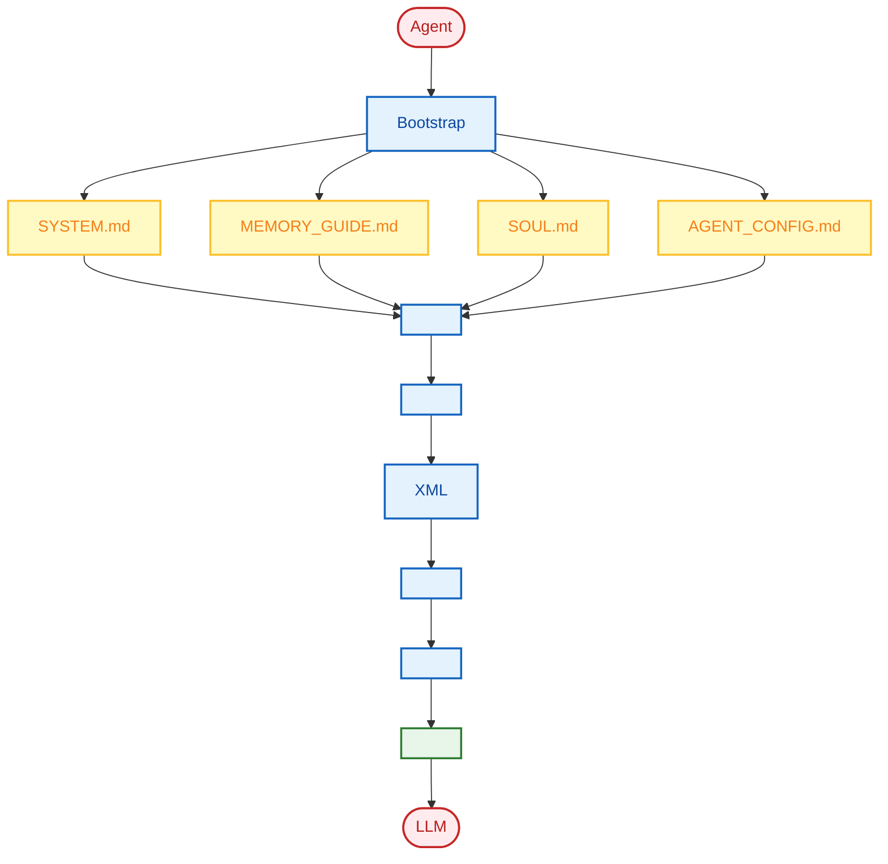

<div align="center">
  
  <h1><strong> 765</strong></h1>
  <p><strong> (LLM)  |  · </strong></p>
  <p>
    <a href="https://blog.csdn.net/Yunyi_Chi" target="_blank" style="text-decoration: none;">
      <span style="background-color: #f39c12; color: white; padding: 2px 8px; border-radius: 4px; font-size: 12px; font-weight: bold; display: inline-block;">CSDN ·  |</span>
    </a>
    <a href="https://github.com/xt765" target="_blank" style="text-decoration: none; margin-left: 8px;">
      <span style="background-color: #24292e; color: white; padding: 2px 8px; border-radius: 4px; font-size: 12px; font-weight: bold; display: inline-block;">GitHub · Follow</span>
    </a>
  </p>
</div>

---

### ****

- **** / RAG  / AI Agent  / 
- ****Python | RAG (LangChain / Dify + Milvus) | FastAPI + Docker
- ****

> ** AI **
> 

---

# FinchBot () -  AI Agent 


> 765 (xt765)
> [GitHub - FinchBot](https://github.com/xt765/finchbot)
> [Gitee - FinchBot](https://gitee.com/xt765/finchbot)

## 

FinchBot ()  AI Agent  **LangChain v1.2**  **LangGraph v1.0**  LLM 

1. ** Agent ** -  (Skill)  (Tool) 
2. ** Agent ** -  + Agentic RAG
3. ** Agent ** - 

 FinchBot  Agent 

---

##  FinchBot

 AI Agent  FinchBot

### 1.1 

|                  |                 | FinchBot                    |
| :------------------: | :---------------------- | :------------------------------ |
|  ****  |         |  Markdown     |
|  ****  |  LLM      |  +        |
| **** |           |                 |
|  ****  |  LangChain  API | LangChain v1.2 + LangGraph v1.0 |

### 1.2 FinchBot 

```mermaid
graph BT
    classDef roof fill:#ffebee,stroke:#c62828,stroke-width:3px,color:#b71c1c,rx:10,ry:10;
    classDef pillar fill:#e3f2fd,stroke:#1565c0,stroke-width:2px,color:#0d47a1,rx:8,ry:8;
    classDef base fill:#e8f5e9,stroke:#2e7d32,stroke-width:3px,color:#1b5e20,rx:10,ry:10;

    Roof("FinchBot Framework<br/> •  • "):::roof

    subgraph Pillars []
        direction LR
        P("<br/> Embedding<br/>"):::pillar
        M("<br/><br/>"):::pillar
        D("<br/><br/>"):::pillar
        S("<br/><br/>"):::pillar
        O("<br/><br/>"):::pillar
    end

    Base("<br/>LangChain v1.2 • LangGraph v1.0 • Python 3.13"):::base

    Base === P & M & D & S & O
    P & M & D & S & O === Roof
```

### 1.3 

FinchBot  **""** ——

#### 

FinchBot 

     

#### Web  (Beta)

FinchBot  React + Vite + FastAPI  Web 

```bash
# 
uv run finchbot serve

# 
cd web
npm install
npm run dev
```

Web 
- WebSocket 
-  ()
- 

#### 

FinchBot 

```bash
#  API 
uv run finchbot config

# 
uv run finchbot sessions

# 
uv run finchbot chat
```

|                    |                                                                          |
| :---------------------: | :--------------------------------------------------------------------------- |
| **** | `OPENAI_API_KEY``ANTHROPIC_API_KEY`  |
|  **i18n **  |                                              |
|   ****   | Tavily → Brave → DuckDuckGo                              |

---

## 

FinchBot  (Factory Pattern) 

### 2.1 

```mermaid
graph TB
    subgraph UI []
        CLI[CLI ]
        Web[Web ]
        API[REST API]
        Channels[<br/>Discord//]
    end

    subgraph Core [Agent ]
        Agent[LangGraph Agent<br/>]
        Context[ContextBuilder<br/>]
        Tools[ToolRegistry<br/>11]
        Memory[MemoryManager<br/>]
    end

    subgraph Infra []
        Storage[<br/>SQLite + VectorStore]
        LLM[LLM <br/>OpenAI/Anthropic/DeepSeek]
    end

    CLI --> Agent
    Web --> Agent
    API --> Agent
    Channels --> Agent

    Agent --> Context
    Agent <--> Tools
    Agent <--> Memory

    Memory --> Storage
    Agent --> LLM
```

### 2.2 Agent Factory

`AgentFactory`  Agent  Checkpointer LLM 

```python
# 
agent, checkpointer, tools = AgentFactory.create_for_cli(
    session_id=session_id,
    workspace=ws_path,
    model=chat_model,
    config=config_obj,
)
```

### 2.3 Tool Factory

`ToolFactory` 

---

##  + Agentic RAG

FinchBot **** LLM 

### 3.1  Agentic RAG

|            |  RAG     | Agentic RAG (FinchBot)      |
| :----------------: | :----------- | :-------------------------- |
| **** |      | Agent               |
| **** |  |  +      |
| **** |      |  remember/recall/forget |
| **** |            |  +        |
| **** |      |                     |

### 3.2 

```mermaid
flowchart TB
    %% 
    classDef businessLayer fill:#e3f2fd,stroke:#1565c0,stroke-width:2px,color:#0d47a1;
    classDef serviceLayer fill:#fff9c4,stroke:#fbc02d,stroke-width:2px,color:#f57f17;
    classDef storageLayer fill:#e8f5e9,stroke:#2e7d32,stroke-width:2px,color:#1b5e20;

    subgraph Business []
        MM[ MemoryManager<br/>remember/recall/forget]
    end
    class MM businessLayer

    subgraph Services []
        RS[ RetrievalService<br/> + RRF]
        CS[ ClassificationService<br/>]
        IS[ ImportanceScorer<br/>]
        ES[ EmbeddingService<br/>FastEmbed ]
    end
    class RS,CS,IS,ES serviceLayer

    subgraph Storage []
        direction LR
        SQLite[( SQLiteStore<br/><br/>)]
        Vector[( VectorStore<br/>ChromaDB<br/>)]
        DS[ DataSyncManager<br/>]
    end
    class SQLite,Vector,DS storageLayer

    %% 
    MM --> RS & CS & IS
    RS --> SQLite & Vector
    CS --> SQLite
    IS --> SQLite
    ES --> Vector
    
    SQLite <--> DS <--> Vector
```

### 3.3 

FinchBot ** RRF (Weighted Reciprocal Rank Fusion)** 

```python
class QueryType(StrEnum):
    """"""
    KEYWORD_ONLY = "keyword_only"      #  (1.0/0.0)
    SEMANTIC_ONLY = "semantic_only"    #  (0.0/1.0)
    FACTUAL = "factual"                #  (0.8/0.2)
    CONCEPTUAL = "conceptual"          #  (0.2/0.8)
    COMPLEX = "complex"                #  (0.5/0.5)
    AMBIGUOUS = "ambiguous"            #  (0.3/0.7)
```

---

##  Agent 

FinchBot ** + ** Agent 

### 4.1 Bootstrap 

```
~/.finchbot/
 SYSTEM.md           # 
 MEMORY_GUIDE.md     # 
 SOUL.md             # 
 AGENT_CONFIG.md     # Agent 
 workspace/
     skills/         # 
```

### 4.2 



---

##  Agent 

FinchBot ** (Tool)**  ** (Skill)**

### 5.1 

 Agent FinchBot  11 

#### 

```mermaid
flowchart TD
    %% 
    classDef check fill:#fff9c4,stroke:#fbc02d,stroke-width:2px,color:#f57f17;
    classDef engine fill:#e8f5e9,stroke:#2e7d32,stroke-width:2px,color:#1b5e20;
    classDef fallback fill:#e3f2fd,stroke:#1565c0,stroke-width:2px,color:#0d47a1;

    Start[ ]:::check
    
    Check1{TAVILY_API_KEY<br/>?}:::check
    Tavily[ Tavily<br/><br/>AI ]:::engine
    
    Check2{BRAVE_API_KEY<br/>?}:::check
    Brave[ Brave Search<br/><br/>]:::engine
    
    DDG[ DuckDuckGo<br/><br/>]:::fallback

    Start --> Check1
    Check1 -->|| Tavily
    Check1 -->|| Check2
    Check2 -->|| Brave
    Check2 -->|| DDG
```

|  |                    | API Key |                              |
| :----: | :--------------------: | :-----: | :------------------------------- |
|   1   |    **Tavily**    |    |  AI  |
|   2   | **Brave Search** |    |              |
|   3   |  **DuckDuckGo**  |    |                  |

### 5.2  Markdown  Agent 

 FinchBot ——** Markdown  Agent **

#### Agent 

FinchBot  **skill-creator** 

> ** Agent Agent **

```
: 

Agent: ...
       [ skill-creator ]
         skills/translator/SKILL.md
       
```

** Agent **

---

## Web  Docker 

### 6.1 Web  (Beta)

FinchBot  React + Vite + FastAPI  Web 

```mermaid
flowchart TB
    %% 
    classDef backend fill:#e3f2fd,stroke:#1565c0,stroke-width:2px,color:#0d47a1;
    classDef frontend fill:#e8f5e9,stroke:#2e7d32,stroke-width:2px,color:#1b5e20;
    classDef user fill:#fff9c4,stroke:#fbc02d,stroke-width:2px,color:#f57f17;

    subgraph Backend []
        API[FastAPI<br/>:8000]:::backend
        WS[WebSocket<br/>]:::backend
    end

    subgraph Frontend []
        React[React + Vite<br/>:5173]:::frontend
        MD[Markdown ]:::frontend
    end

    U[ ]:::user --> React
    React <--> WS
    WS <--> API

    API --> React
    React --> MD
    MD --> U
```

****

```bash
# 
uv run finchbot serve

# 
cd web
npm install
npm run dev
```

Web 
- 
- Markdown 
- 
- 

### 6.2 Docker 

FinchBot  Docker 

```bash
# 1. 
git clone https://gitee.com/xt765/finchbot.git
cd finchbot

# 2. 
cp .env.example .env
#  .env  API Key

# 3. 
docker-compose up -d

# 4. 
# Web : http://localhost:8000
```

**docker-compose.yml **

```yaml
services:
  finchbot:
    build:
      context: .
      dockerfile: Dockerfile
    container_name: finchbot
    ports:
      - "8000:8000"
    environment:
      - OPENAI_API_KEY=${OPENAI_API_KEY}
      - ANTHROPIC_API_KEY=${ANTHROPIC_API_KEY}
      - FINCHBOT_LANGUAGE=zh-CN
    volumes:
      - finchbot_workspace:/root/.finchbot/workspace
      - finchbot_models:/root/.cache/huggingface
    restart: unless-stopped
    healthcheck:
      test: ["CMD", "curl", "-f", "http://localhost:8000/health"]
      interval: 30s
      timeout: 10s
      retries: 3

volumes:
  finchbot_workspace:
  finchbot_models:
```

**Docker **

|  |  |
| :--: | :--- |
| **** | `docker-compose up -d` |
| **** |  |
| **** |  |
| **** |  x86_64  ARM64 |

---

## LangChain 1.2 

FinchBot  **LangChain v1.2**  **LangGraph v1.0**  Agent 

### 7.1  LLM 

|    |                         |              |
| :-------: | :-------------------------- | :--------------- |
|  OpenAI  | GPT-5, GPT-5.2, O3-mini     |      |
| Anthropic | Claude Sonnet 4.5, Opus 4.6 |  |
| DeepSeek | DeepSeek Chat, Reasoner     |    |
|  Gemini  | Gemini 2.5 Flash            | Google       |
|   Groq   | Llama 4 Scout/Maverick      |          |
| Moonshot | Kimi K1.5/K2.5              |      |

---

## 

FinchBot  LLM  Agent 

|              |                                         |
| :------------------: | :---------------------------------------------- |
|  ****  |                       |
|  ****  | Agentic RAG RRF                 |
| **** |                     |
|  ****  | 11  |
|  ****  | Markdown Agent          |
|  ****  | LangChain v1.2LangGraph v1.0                  |
|  ****  | CLI / Web  / Docker                         |
|  ****  | Rich CLIi18n          |


*   Embedding
*  
*  
*   + 
*  LangChain 1.2 + LangGraph
*  
*  CLI / Web / Docker

 AI Agent FinchBot 

---

## 

*  ****: [GitHub - FinchBot](https://github.com/xt765/finchbot) | [Gitee - FinchBot](https://gitee.com/xt765/finchbot)
*  ****: [FinchBot ](https://github.com/xt765/finchbot/tree/main/docs)
*  ****: [GitHub Issues](https://github.com/xt765/finchbot/issues)

---

>  Star 
