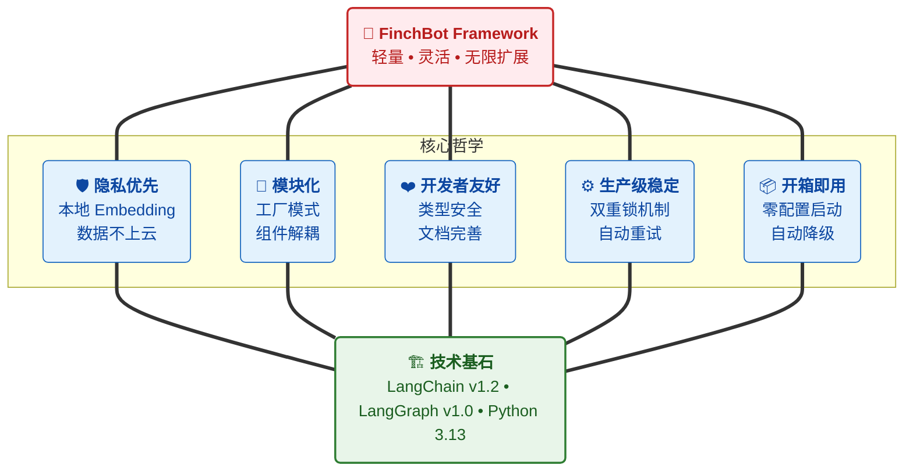

<div align="center">
  
  <h1><strong>玄同 765</strong></h1>
  <p><strong>大语言模型 (LLM) 开发工程师 | 中国传媒大学 · 数字媒体技术（智能交互与游戏设计）</strong></p>
  <p>
    <a href="https://blog.csdn.net/Yunyi_Chi" target="_blank" style="text-decoration: none;">
      <span style="background-color: #f39c12; color: white; padding: 2px 8px; border-radius: 4px; font-size: 12px; font-weight: bold; display: inline-block;">CSDN · 个人主页 |</span>
    </a>
    <a href="https://github.com/xt765" target="_blank" style="text-decoration: none; margin-left: 8px;">
      <span style="background-color: #24292e; color: white; padding: 2px 8px; border-radius: 4px; font-size: 12px; font-weight: bold; display: inline-block;">GitHub · Follow</span>
    </a>
  </p>
</div>

---

### **关于作者**

- **深耕领域**：大语言模型开发 / RAG 知识库 / AI Agent 落地 / 模型微调
- **技术栈**：Python | RAG (LangChain / Dify + Milvus) | FastAPI + Docker
- **工程能力**：专注模型工程化部署、知识库构建与优化，擅长全流程解决方案

> **「让 AI 交互更智能，让技术落地更高效」**
> 欢迎技术探讨与项目合作，解锁大模型与智能交互的无限可能！

---
# FinchBot (雀翎) - 一个真正灵活的 AI Agent 框架


> 作者：玄同765 (xt765)
> 项目地址：[GitHub - FinchBot](https://github.com/xt765/finchbot)
> 国内镜像：[Gitee - FinchBot](https://gitee.com/xt765/finchbot)


## 摘要

FinchBot (雀翎) 是一个轻量级、模块化的 AI Agent 框架，基于 **LangChain v1.2** 和 **LangGraph v1.0** 构建。它不是又一个简单的 LLM 封装，而是一个深思熟虑的架构设计，专注于三个核心问题：

1. **如何让 Agent 的能力无限扩展？** - 通过技能 (Skill) 和工具 (Tool) 的双层扩展机制
2. **如何让 Agent 拥有真正的记忆？** - 通过双层存储架构 + Agentic RAG
3. **如何让 Agent 的行为可定制？** - 通过动态提示词文件系统

本文将深入剖析 FinchBot 的架构设计，带你了解一个生产级 Agent 框架的诞生过程。

---

## 一、为什么选择 FinchBot？

在 AI Agent 框架百花齐放的今天，你可能会问：为什么还需要 FinchBot？

### 1.1 现有框架的痛点

|         痛点         | 传统方案                | FinchBot 方案                   |
| :------------------: | :---------------------- | :------------------------------ |
|  **扩展困难**  | 需要修改核心代码        | 继承基类或创建 Markdown 文件    |
|  **记忆脆弱**  | 依赖 LLM 上下文窗口     | 双层持久化存储 + 语义检索       |
| **提示词僵化** | 硬编码在代码中          | 文件系统，热加载                |
|  **架构过时**  | 基于 LangChain 旧版 API | LangChain v1.2 + LangGraph v1.0 |

### 1.2 FinchBot 的设计哲学



### 1.3 开箱即用体验

FinchBot 将 **"开箱即用"** 作为核心设计理念——无需复杂配置即可上手：

**三步快速上手：**

```bash
# 第一步：配置 API 密钥和默认模型
uv run finchbot config

# 第二步：管理你的会话
uv run finchbot sessions

# 第三步：开始对话
uv run finchbot chat
```

|          特性          | 说明                                                                         |
| :---------------------: | :--------------------------------------------------------------------------- |
|   **三步上手**   | `config` → `sessions` → `chat`，三个命令完成完整工作流程             |
| **环境变量配置** | 所有配置均可通过环境变量设置（`OPENAI_API_KEY`、`ANTHROPIC_API_KEY` 等） |
| **Rich CLI 界面** | 全屏键盘导航，↑/↓ 箭头选择，交互式操作                                     |
|  **i18n 国际化**  | 内置中英文支持，自动检测系统语言                                             |
|   **自动降级**   | 网页搜索自动降级：Tavily → Brave → DuckDuckGo                              |
|  **零配置启动**  | 只需设置 API Key，运行 `finchbot chat` 即可                                |

---

## 二、架构设计：模块化与工厂模式

FinchBot 采用工厂模式 (Factory Pattern) 来提升系统的灵活性和可维护性。

### 2.1 核心组件关系


### 2.2 Agent Factory

`AgentFactory` 负责组装一个完整的 Agent 实例。它屏蔽了复杂的初始化细节（如 Checkpointer 的创建、LLM 模型的配置、工具链的组装），对外提供简洁的创建接口。

```python
# 现在的创建方式简洁明了
agent, checkpointer, tools = AgentFactory.create_for_cli(
    session_id=session_id,
    workspace=ws_path,
    model=chat_model,
    config=config_obj,
)
```

### 2.3 Tool Factory

`ToolFactory` 集中管理所有工具的实例化逻辑。它不仅负责创建工具，还负责处理工具之间的依赖关系和自动降级逻辑。

例如，**网页搜索工具的自动降级** 就是在工厂中实现的：

```python
# ToolFactory 内部逻辑
def _create_web_search_tool(self):
    # 1. 尝试使用 Tavily (最佳质量)
    if self.config.tavily_api_key:
        return WebSearchTool(engine="tavily", ...)
    
    # 2. 尝试使用 Brave (隐私优先)
    if self.config.brave_api_key:
        return WebSearchTool(engine="brave", ...)
        
    # 3. 默认使用 DuckDuckGo (无需 Key)
    return WebSearchTool(engine="duckduckgo", ...)
```

---

## 三、记忆架构：双层存储 + Agentic RAG

FinchBot 实现了先进的**双层记忆架构**，彻底解决了 LLM 上下文窗口限制和长期记忆遗忘问题。

### 3.1 为什么是 Agentic RAG？

|      对比维度      | 传统 RAG     | Agentic RAG (FinchBot)      |
| :----------------: | :----------- | :-------------------------- |
| **检索触发** | 固定流程     | Agent 自主决策              |
| **检索策略** | 单一向量检索 | 混合检索 + 权重动态调整     |
| **记忆管理** | 被动存储     | 主动 remember/recall/forget |
| **分类能力** | 无           | 自动分类 + 重要性评分       |
| **更新机制** | 全量重建     | 增量同步                    |

### 3.2 双层存储架构


1.  **结构化层 (SQLite)**: 事实来源 (Source of Truth)，存储完整文本、元数据、分类和重要性评分。
2.  **语义层 (Vector Store)**: 基于 ChromaDB + FastEmbed，提供模糊检索和联想能力。

### 3.3 混合检索策略

FinchBot 采用**加权 RRF (Weighted Reciprocal Rank Fusion)** 策略，智能融合关键词检索和语义检索的结果。系统会根据查询类型（如事实型、概念型、模糊型）自动调整两者的权重，确保检索结果既准确又全面。

```python
class QueryType(StrEnum):
    """查询类型，决定检索权重"""
    KEYWORD_ONLY = "keyword_only"      # 纯关键词 (1.0/0.0)
    SEMANTIC_ONLY = "semantic_only"    # 纯语义 (0.0/1.0)
    FACTUAL = "factual"                # 事实型 (0.8/0.2)
    CONCEPTUAL = "conceptual"          # 概念型 (0.2/0.8)
    COMPLEX = "complex"                # 复杂型 (0.5/0.5)
    AMBIGUOUS = "ambiguous"            # 歧义型 (0.3/0.7)
```

---

## 四、动态提示词系统：用户可编辑的 Agent 大脑

FinchBot 的提示词系统采用**文件系统 + 模块化组装**的设计，让用户可以自由定制 Agent 的行为。

### 4.1 Bootstrap 文件系统

```
~/.finchbot/
├── SYSTEM.md           # 角色设定
├── MEMORY_GUIDE.md     # 记忆使用指南
├── SOUL.md             # 灵魂设定（性格特征）
├── AGENT_CONFIG.md     # Agent 配置
└── workspace/
    └── skills/         # 自定义技能
```

### 4.2 提示词加载流程


---

## 五、技能与工具：无限扩展的 Agent 能力

FinchBot 的扩展性建立在两个层次上：**工具层 (Tool)** 和 **技能层 (Skill)**。

### 5.1 工具系统：代码级能力扩展

工具是 Agent 与外部世界交互的桥梁。FinchBot 提供了 11 个内置工具，并支持轻松扩展。

#### 网页搜索：三引擎降级设计

FinchBot 的网页搜索工具采用巧妙的**三引擎自动降级机制**，兼顾灵活性和开箱即用体验：

| 优先级 |          引擎          | API Key | 特点                             |
| :----: | :--------------------: | :-----: | :------------------------------- |
|   1   |    **Tavily**    |  需要  | 质量最佳，专为 AI 优化，深度搜索 |
|   2   | **Brave Search** |  需要  | 免费额度大，隐私友好             |
|   3   |  **DuckDuckGo**  |  无需  | 始终可用，零配置                 |

这个设计确保**即使没有任何 API Key 配置，网页搜索也能开箱即用**！

### 5.2 技能系统：用 Markdown 定义 Agent 能力

技能是 FinchBot 的独特创新——**用 Markdown 文件定义 Agent 的能力边界**。

#### 最大特色：Agent 自动创建技能

FinchBot 内置了 **skill-creator** 技能，这也是开箱即用理念的体现：

> **只需告诉 Agent 你想要什么技能，Agent 就会自动创建好！**

```
用户: 帮我创建一个翻译技能，可以把中文翻译成英文

Agent: 好的，我来为你创建翻译技能...
       [调用 skill-creator 技能]
       ✅ 已创建 skills/translator/SKILL.md
       现在你可以直接使用翻译功能了！
```

无需手动创建文件、无需编写代码，**一句话就能扩展 Agent 能力**！

---

## 六、LangChain 1.2 架构实践

FinchBot 基于 **LangChain v1.2** 和 **LangGraph v1.0** 构建，采用最新的 Agent 架构。

### 6.1 Agent 创建流程

```python
from langchain.agents import create_agent
from langgraph.checkpoint.sqlite import SqliteSaver

def create_finch_agent(
    model: BaseChatModel,
    workspace: Path,
    tools: Sequence[BaseTool] | None = None,
    use_persistent: bool = True,
) -> tuple[CompiledStateGraph, SqliteSaver | MemorySaver]:
  
    # 1. 初始化检查点（持久化状态）
    if use_persistent:
        checkpointer = SqliteSaver.from_conn_string(str(db_path))
    else:
        checkpointer = MemorySaver()
  
    # 2. 构建系统提示
    system_prompt = build_system_prompt(workspace)
  
    # 3. 创建 Agent（使用 LangChain 官方 API）
    agent = create_agent(
        model=model,
        tools=list(tools) if tools else None,
        system_prompt=system_prompt,
        checkpointer=checkpointer,
    )
  
    return agent, checkpointer
```

### 6.2 LangGraph 状态管理


### 6.3 支持的 LLM 提供商

|  提供商  | 模型                      | 特点             |
| :-------: | :------------------------ | :--------------- |
|  OpenAI  | GPT-5, GPT-5.2, O3-mini     | 综合能力最强     |
| Anthropic | Claude Sonnet 4.5, Opus 4.6 | 安全性高，长文本 |
| DeepSeek | DeepSeek Chat, Reasoner           | 国产，性价比高   |
|  Gemini  | Gemini 2.5 Flash      | Google 最新      |
|   Groq   | Llama 4 Scout/Maverick          | 极速推理         |
| Moonshot | Kimi K1.5/K2.5            | 长文本，国产     |

---

## 七、总结

FinchBot 不是一个简单的 LLM 封装，而是一个深思熟虑的 Agent 框架设计：

|       核心特性       | 设计亮点                                        |
| :------------------: | :---------------------------------------------- |
|  **架构革新**  | 工厂模式解耦，高内聚低耦合                      |
|  **记忆架构**  | 双层存储，Agentic RAG，加权 RRF                 |
| **提示词系统** | 文件系统，热加载，模块化组装                    |
|  **工具系统**  | 注册表模式，线程安全，11 个内置工具，三引擎降级 |
|  **技能系统**  | Markdown 定义，Agent 自动创建，开箱即用         |
|  **架构实践**  | LangChain v1.2，LangGraph v1.0                  |
|  **开箱即用**  | 环境变量配置，Rich CLI，i18n，自动降级          |

如果你正在寻找一个：

* ✅ 隐私优先（本地 Embedding）
* ✅ 真持久化（双层记忆）
* ✅ 生产级稳定（完善的错误处理）
* ✅ 灵活扩展（技能 + 工具双层）
* ✅ 最新架构（LangChain 1.2 + LangGraph）
* ✅ 开箱即用（零配置启动，自动降级）

的 AI Agent 框架，FinchBot 值得一试。

---

## 相关链接

* 📦 **项目地址**: [GitHub - FinchBot](https://github.com/xt765/finchbot)
* 📖 **文档**: [FinchBot 文档](https://github.com/xt765/finchbot/tree/main/docs)
* 💬 **问题反馈**: [GitHub Issues](https://github.com/xt765/finchbot/issues)

---

> 如果这个项目对你有帮助，请给个 Star ⭐️
