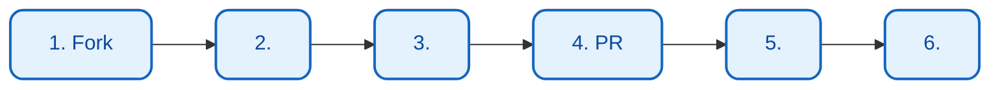

# 

 FinchBot 

## 

1. [](#1-)
2. [](#2-)
3. [](#3-)
4. [](#4-)
5. [](#5-)
6. [](#6-)

---

## 1. 

### 



### 1.1 Fork 

 GitHub  Gitee  Fork 

### 1.2 

 `main` 

```bash
git checkout -b feature/your-feature-name
# 
git checkout -b fix/your-bug-fix
```

### 1.3 

-  (Ruff)
- 
- 
-  `uv run` 

### 1.4  Pull Request

 Push  GitHub Pull Request PR 

---

## 2. 

### 2.1 

```bash
# 
uv sync --extra dev

#  pre-commit hooks
pre-commit install
```

### 2.2 

```mermaid
flowchart TD
    classDef check fill:#fff9c4,stroke:#fbc02d,stroke-width:2px,color:#f57f17;
    classDef pass fill:#e8f5e9,stroke:#2e7d32,stroke-width:2px,color:#1b5e20;
    classDef fail fill:#ffebee,stroke:#c62828,stroke-width:2px,color:#b71c1c;

    A[<br/>ruff format]:::check --> B{?}
    B -->|| C[<br/>ruff check]:::check
    B -->|| A
    C --> D{?}
    D -->|| E[<br/>basedpyright]:::check
    D -->|| F[]:::fail
    F --> C
    E --> G{?}
    G -->|| H[<br/>pytest]:::check
    G -->|| I[]:::fail
    I --> E
    H --> J{?}
    J -->|| K([]):::pass
    J -->|| L[]:::fail
    L --> H
```

### 2.3 

```bash
# 
uv run pytest

# 
uv run pytest tests/test_memory.py

# 
uv run pytest --cov=src --cov-report=html
```

---

## 3. 

### 3.1 

 **Ruff** 

```bash
# 
uv run ruff format .

# 
uv run ruff check .

# 
uv run ruff check --fix .
```

### 3.2 

 **Type Hints** BasedPyright 

```python
# 
def remember(self, content: str, category: str | None = None) -> str:
    ...

# 
def remember(self, content, category=None):
    ...
```

### 3.3 

 **Google Style Docstrings**

```python
def recall(self, query: str, top_k: int = 5) -> list[dict[str, Any]]:
    """.

    Args:
        query: .
        top_k: .

    Returns:
        .

    Raises:
        ValueError: .
    """
    ...
```

---

## 4. 

### 4.1 Conventional Commits

 [Conventional Commits](https://www.conventionalcommits.org/) 

```
<type>(<scope>): <description>

[optional body]

[optional footer(s)]
```

### 4.2 

|  |  |  |
| :--- | :--- | :--- |
| `feat` |  | `feat: add memory recall tool` |
| `fix` | Bug  | `fix: handle api timeout error` |
| `docs` |  | `docs: update installation guide` |
| `style` |  | `style: format with ruff` |
| `refactor` |  | `refactor: simplify memory manager` |
| `test` |  | `test: add unit tests for tools` |
| `chore` |  | `chore: update dependencies` |

### 4.3 

```bash
# 
git commit -m "feat: add web search fallback to DuckDuckGo"
git commit -m "fix: handle empty query in recall tool"
git commit -m "docs: update architecture diagram"

# 
git commit -m "update code"
git commit -m "fix bug"
git commit -m "changes"
```

---

## 5. 

### 5.1 

```
docs/
 zh-CN/              # 
    architecture.md
    api.md
    config.md
    deployment.md
    development.md
    contributing.md
    guide/
       usage.md
       extension.md
    blog/
 en-US/              # 
     ...
```

### 5.2 

1. ****: 
2. ****: 
3. **Mermaid **:  Mermaid 
4. ****: 

### 5.3 Mermaid 

```mermaid
flowchart TD
    classDef startEnd fill:#ffebee,stroke:#c62828,stroke-width:2px,color:#b71c1c;
    classDef process fill:#e3f2fd,stroke:#1565c0,stroke-width:2px,color:#0d47a1;
    classDef decision fill:#fff9c4,stroke:#fbc02d,stroke-width:2px,color:#f57f17;

    A([]):::startEnd --> B[]:::process
    B --> C{}:::decision
    C -->|| D([]):::startEnd
    C -->|| B
```

---

## 6. 

- 
- 
- 
- 

---

## 

- **Issues**: [GitHub Issues](https://github.com/xt765/finchbot/issues)
- **Pull Requests**: [GitHub PRs](https://github.com/xt765/finchbot/pulls)
- **Gitee**: [Gitee ](https://gitee.com/xt765/finchbot)


