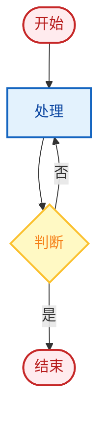

# 贡献指南

感谢您对 FinchBot 的关注！我们欢迎所有形式的贡献，包括代码、文档、设计、测试和反馈。

## 目录

1. [快速开始](#1-快速开始)
2. [开发工作流](#2-开发工作流)
3. [代码风格](#3-代码风格)
4. [提交规范](#4-提交规范)
5. [文档贡献](#5-文档贡献)
6. [行为准则](#6-行为准则)

---

## 1. 快速开始

### 贡献流程


### 1.1 Fork 仓库

在 GitHub 或 Gitee 上将项目 Fork 到您的账户。

### 1.2 创建分支

基于 `main` 分支创建您的功能分支：

```bash
git checkout -b feature/your-feature-name
# 或
git checkout -b fix/your-bug-fix
```

### 1.3 开发

- 遵循代码风格指南（Ruff）
- 为新功能添加单元测试
- 确保所有测试通过
- 使用 `uv run` 进行本地测试

### 1.4 提交 Pull Request

将您的分支推送到 GitHub 并创建 Pull Request。请在 PR 描述中详细说明您的更改。

---

## 2. 开发工作流

### 2.1 环境设置

```bash
# 安装开发依赖
uv sync --extra dev

# 配置 pre-commit 钩子（可选）
pre-commit install
```

### 2.2 开发检查清单


### 2.3 运行测试

```bash
# 运行所有测试
uv run pytest

# 运行特定测试
uv run pytest tests/test_memory.py

# 运行覆盖率测试
uv run pytest --cov=src --cov-report=html
```

---

## 3. 代码风格

### 3.1 格式化工具

使用 **Ruff** 进行代码格式化和检查：

```bash
# 格式化代码
uv run ruff format .

# 检查代码
uv run ruff check .

# 自动修复
uv run ruff check --fix .
```

### 3.2 类型注解

**类型注解是必需的**，由 BasedPyright 检查：

```python
# 好的示例
def remember(self, content: str, category: str | None = None) -> str:
    ...

# 不好的示例
def remember(self, content, category=None):
    ...
```

### 3.3 文档字符串

使用 **Google 风格文档字符串**：

```python
def recall(self, query: str, top_k: int = 5) -> list[dict[str, Any]]:
    """检索相关记忆。

    Args:
        query: 查询文本。
        top_k: 返回结果数量。

    Returns:
        记忆字典列表。

    Raises:
        ValueError: 如果查询为空。
    """
    ...
```

---

## 4. 提交规范

### 4.1 约定式提交

遵循 [Conventional Commits](https://www.conventionalcommits.org/) 规范：

```
<type>(<scope>): <description>

[可选的正文]

[可选的脚注]
```

### 4.2 提交类型

| 类型 | 说明 | 示例 |
| :--- | :--- | :--- |
| `feat` | 新功能 | `feat: 添加记忆检索工具` |
| `fix` | Bug 修复 | `fix: 处理 API 超时错误` |
| `docs` | 文档更新 | `docs: 更新安装指南` |
| `style` | 代码格式 | `style: 使用 ruff 格式化` |
| `refactor` | 重构 | `refactor: 简化记忆管理器` |
| `test` | 测试 | `test: 添加工具单元测试` |
| `chore` | 杂项 | `chore: 更新依赖` |

### 4.3 提交示例

```bash
# 好的提交
git commit -m "feat: 添加网页搜索降级到 DuckDuckGo"
git commit -m "fix: 处理检索工具中的空查询"
git commit -m "docs: 更新架构图"

# 不好的提交
git commit -m "更新代码"
git commit -m "修复 bug"
git commit -m "一些更改"
```

---

## 5. 文档贡献

### 5.1 文档结构

```
docs/
 zh-CN/              # 中文文档
     architecture.md
     api.md
     config.md
     deployment.md
     development.md
     contributing.md
     guide/
         usage.md
         extension.md
     blog/
 en-US/              # 英文文档
     ...
```

### 5.2 文档指南

1. **同步更新**：修改代码时更新相关文档
2. **双语维护**：保持中英文文档一致
3. **Mermaid 图表**：使用 Mermaid 绘制架构和流程图
4. **代码示例**：提供可运行的代码示例

### 5.3 Mermaid 图表风格



---

## 6. 行为准则

- 尊重所有贡献者
- 保持专业和友好的沟通
- 接受建设性批评
- 关注对社区最有利的事情

---

## 联系方式

- **Issues**: [GitHub Issues](https://github.com/xt765/finchbot/issues)
- **Pull Requests**: [GitHub PRs](https://github.com/xt765/finchbot/pulls)
- **Gitee**: [Gitee 仓库](https://gitee.com/xt765/finchbot)

感谢您的贡献！
