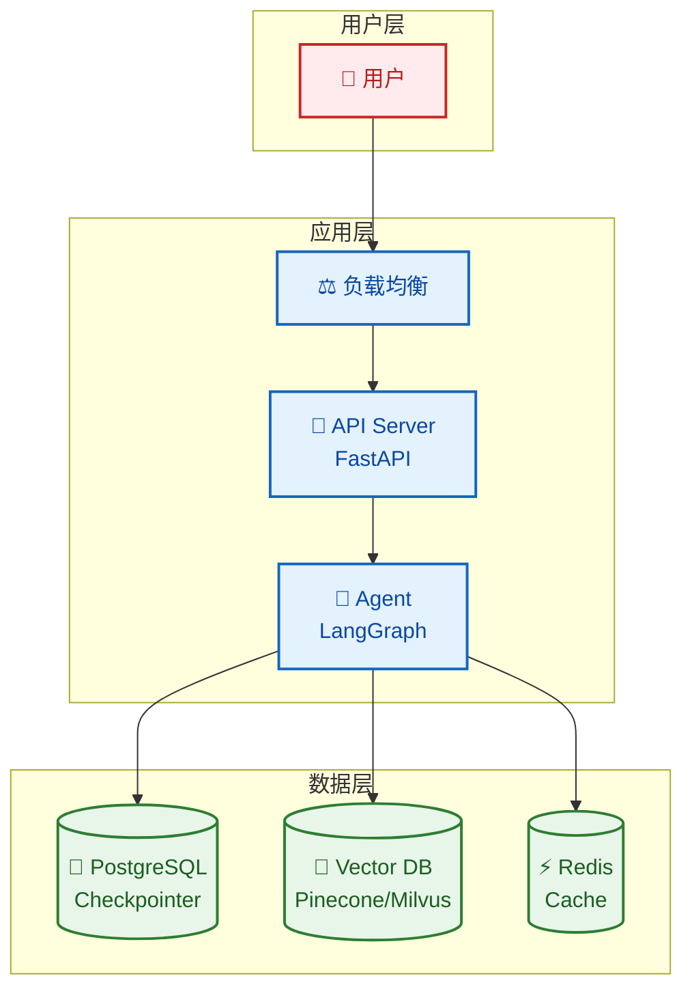
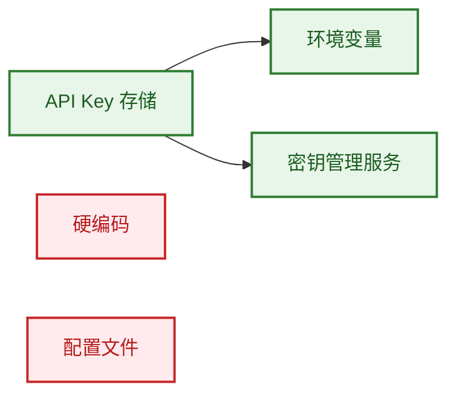

# 部署指南

本文档介绍 FinchBot 的部署方式，包括本地部署、Docker 部署和生产环境建议。

## 目录

1. [本地部署](#1-本地部署)
2. [Docker 部署](#2-docker-部署)
3. [生产环境建议](#3-生产环境建议)
4. [安全性考虑](#4-安全性考虑)

---

## 1. 本地部署

### 前置要求

| 要求 | 说明 |
| :--- | :--- |
| 操作系统 | Windows / Linux / macOS |
| Python | 3.13+ |
| 包管理器 | uv (推荐) |
| 磁盘空间 | ~500MB (含嵌入模型) |

### 快速部署

```bash
# 1. 克隆仓库
git clone https://gitee.com/xt765/finchbot.git
# 或 git clone https://github.com/xt765/finchbot.git

cd finchbot

# 2. 安装依赖
uv sync

# 3. 配置
uv run finchbot config

# 4. 运行
uv run finchbot chat
```

---

## 2. Docker 部署

FinchBot 尚未提供官方 Docker 镜像，但可以通过以下 `Dockerfile` 构建：

### Dockerfile

```dockerfile
FROM python:3.13-slim

WORKDIR /app

# 安装 uv
RUN pip install uv

# 复制项目文件
COPY pyproject.toml uv.lock ./
COPY src/ ./src/
COPY README.md ./

# 安装依赖
RUN uv sync --frozen

# 设置入口点
ENTRYPOINT ["uv", "run", "finchbot"]
CMD ["chat"]
```

### 构建并运行

```bash
# 构建镜像
docker build -t finchbot .

# 运行容器（交互模式）
docker run -it \
    -v ~/.finchbot:/root/.finchbot \
    -e OPENAI_API_KEY=sk-... \
    finchbot chat

# 运行 Web 服务
docker run -d \
    -p 8000:8000 \
    -v ~/.finchbot:/root/.finchbot \
    -e OPENAI_API_KEY=sk-... \
    finchbot serve
```

### Docker Compose

```yaml
version: '3.8'

services:
  finchbot:
    build: .
    ports:
      - "8000:8000"
    volumes:
      - ~/.finchbot:/root/.finchbot
    environment:
      - OPENAI_API_KEY=${OPENAI_API_KEY}
      - FINCHBOT_LANGUAGE=zh-CN
    command: serve
```

---

## 3. 生产环境建议

### 架构建议



### 数据库升级

| 组件 | 开发环境 | 生产环境 |
| :--- | :--- | :--- |
| Checkpointer | SQLite | PostgreSQL |
| 向量数据库 | ChromaDB (本地) | Pinecone / Milvus |
| 缓存 | 无 | Redis |

### 日志管理

```python
# 配置日志输出到 ELK Stack
import logging
from loguru import logger

# 移除默认处理器
logger.remove()

# 添加 JSON 格式输出
logger.add(
    "logs/finchbot.json",
    format="{message}",
    serialize=True,
    rotation="100 MB",
    retention="7 days"
)
```

### 监控指标

| 指标 | 说明 |
| :--- | :--- |
| 响应时间 | API 请求延迟 |
| Token 使用量 | LLM 调用统计 |
| 记忆存储量 | SQLite / Vector DB 大小 |
| 工具调用频率 | 各工具使用统计 |

---

## 4. 安全性考虑

### API Key 管理



| 方式 | 安全性 | 推荐场景 |
| :--- | :---: | :--- |
| 环境变量 | ✅ 高 | 所有环境 |
| 密钥管理服务 | ✅ 高 | 生产环境 |
| 配置文件 | ⚠️ 中 | 开发环境 |
| 硬编码 | ❌ 低 | 不推荐 |

### Shell 执行安全

`ExecTool` 具有潜在风险，建议：

1. **黑名单过滤**: 默认禁用高危命令 (`rm -rf /`, `mkfs`, `dd`)
2. **沙箱隔离**: 在 Docker 容器中运行
3. **权限限制**: 使用非 root 用户运行
4. **超时控制**: 设置命令执行超时

```python
# 配置 Shell 执行限制
tools:
  exec:
    timeout: 60
    disabled_commands:
      - "rm -rf /"
      - "mkfs"
      - "dd"
      - "shutdown"
```

### 文件系统安全

```python
# 限制文件操作范围
tools:
  restrict_to_workspace: true
```

| 设置 | 说明 |
| :--- | :--- |
| `restrict_to_workspace: true` | 文件操作限制在工作区内 |
| `restrict_to_workspace: false` | 允许访问任意路径（不推荐） |

---

## 部署检查清单

- [ ] API Key 已配置为环境变量
- [ ] 文件操作限制在工作区
- [ ] Shell 执行已配置黑名单
- [ ] 日志输出已配置
- [ ] 数据库备份策略已设置
- [ ] 监控告警已配置
