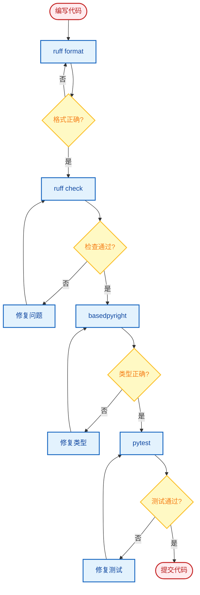
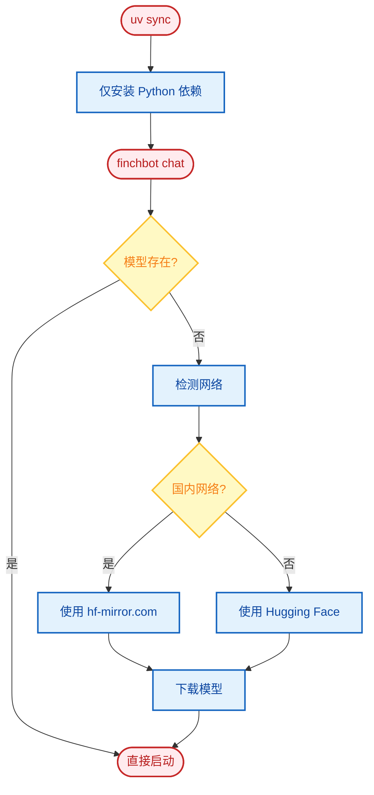

# 开发指南

本文档介绍 FinchBot 开发环境设置、测试、代码质量标准和项目结构。

## 目录

1. [环境设置](#1-环境设置)
2. [测试](#2-测试)
3. [代码质量](#3-代码质量)
4. [目录结构](#4-目录结构)
5. [自动化机制](#5-自动化机制)

---

## 1. 环境设置

### 1.1 安装 UV

FinchBot 使用 [uv](https://github.com/astral-sh/uv) 进行依赖管理和虚拟环境隔离。

```powershell
# Windows (PowerShell)
powershell -ExecutionPolicy ByPass -c "irm https://astral.sh/uv/install.ps1 | iex"

# macOS/Linux
curl -LsSf https://astral.sh/uv/install.sh | sh
```

### 1.2 克隆仓库

```bash
# Gitee（国内用户推荐）
git clone https://gitee.com/xt765/FinchBot.git
# 或 git clone https://github.com/xt765/FinchBot.git

cd finchbot
```

### 1.3 安装依赖

**生产环境**（普通用户）：

```bash
uv sync
```

**开发环境**（贡献者）：

```bash
uv sync --extra dev
```

> **注意**：
> - `uv sync` 安装生产依赖
> - `--extra dev` 额外安装开发工具：pytest、ruff、basedpyright
> - 嵌入模型（约 95MB）将在首次运行时自动下载到 `.models/fastembed/`，无需手动干预

### 1.4 开发环境设置流程


---

## 2. 测试

### 2.1 运行单元测试

```bash
uv run pytest
```

### 2.2 运行覆盖率测试

```bash
uv run pytest --cov=src --cov-report=html
```

查看 `htmlcov/index.html` 报告。

### 2.3 测试特定模块

```bash
# 测试特定文件
uv run pytest tests/test_memory.py

# 测试特定函数
uv run pytest tests/test_memory.py::test_remember

# 详细输出
uv run pytest -v tests/
```

### 2.4 测试结构

```
tests/
 test_agent.py        # Agent 相关测试
 test_memory.py       # 记忆系统测试
 test_tools.py        # 工具测试
 test_config.py       # 配置测试
 conftest.py          # 测试配置和 fixtures
```

---

## 3. 代码质量

### 3.1 格式化

```bash
uv run ruff format .
```

### 3.2 代码检查

```bash
uv run ruff check .
```

### 3.3 类型检查

```bash
uv run basedpyright src
```

### 3.4 开发工作流



### 3.5 Pre-commit 钩子（可选）

创建 `.pre-commit-config.yaml`：

```yaml
repos:
  - repo: https://github.com/astral-sh/ruff-pre-commit
    rev: v0.1.0
    hooks:
      - id: ruff
        args: [--fix]
      - id: ruff-format
```

---

## 4. 目录结构

```
finchbot/
 src/finchbot/          # 源代码
     agent/             # Agent 逻辑
         core.py       # Agent 创建与运行
         factory.py    # AgentFactory
         context.py    # ContextBuilder
         skills.py     # SkillsLoader
     memory/            # 记忆系统
         manager.py    # MemoryManager
         types.py      # 类型定义
         services/     # 服务层
         storage/      # 存储层
     tools/             # 工具集合
         base.py       # FinchTool 基类
         factory.py    # ToolFactory
         registry.py   # ToolRegistry
         *.py          # 工具实现
     channels/          # 多平台消息
         base.py       # BaseChannel
         bus.py        # MessageBus
         manager.py    # ChannelManager
     cli/               # 命令行界面
         chat_session.py
         config_manager.py
         ui.py
     config/            # 配置管理
         loader.py
         schema.py
     constants.py       # 统一常量定义
     i18n/              # 国际化
         loader.py
         locales/
     providers/         # LLM 提供商
         factory.py
     server/            # Web 服务器
         main.py       # FastAPI
         loop.py       # AgentLoop
     sessions/          # 会话管理
     utils/             # 工具函数
         cache.py      # 通用缓存基类
         logger.py
         model_downloader.py
 tests/                 # 测试目录
 docs/                  # 文档
     zh-CN/            # 中文文档
     en-US/            # 英文文档
 web/                   # Web 前端
     src/
     package.json
 .models/               # 本地模型缓存（自动生成）
 pyproject.toml         # 项目配置
 uv.lock               # 依赖锁定
```

---

## 5. 自动化机制

### 5.1 模型延迟加载

FinchBot 对大型文件依赖采用**运行时延迟加载**策略：



1. **安装阶段**：`uv sync` 仅安装 Python 依赖，不包含模型
2. **运行阶段**：用户运行 `finchbot chat` 时：
    - 系统检查 `.models/fastembed` 目录
    - 如果模型不存在，自动选择最佳镜像（国内/国际）并下载
    - 下载完成后无缝进入应用

这个设计避免了构建隔离问题，并确保国内用户有良好的下载体验。

### 5.2 工具延迟加载

工具注册使用**单锁模式**实现线程安全的延迟加载：

```python
def _ensure_tools_registered(
    workspace: Path | None = None,
    tools: Sequence[BaseTool] | None = None
) -> None:
    global _tools_registered

    with _tools_lock:
        if _tools_registered:
            return
        # 实际注册逻辑...
        _tools_registered = True
```

### 5.3 异步启动优化

FinchBot 使用 `asyncio` + `ThreadPoolExecutor` 进行并发初始化：

| 任务 | 耗时 | 并发 |
| :--- | :--- | :---: |
| LLM 模型初始化 | 约 2-5s |  |
| SQLite 连接 | 约 0.1s |  |
| 工作区检查 | 约 0.1s |  |
| 工具创建 | 约 0.5s |  |

---

## 常见问题

### Q: 如何调试 Agent 行为？

```bash
# 启用 DEBUG 日志
finchbot -vv chat
```

### Q: 如何测试特定工具？

```python
# tests/test_tools.py
from finchbot.tools.filesystem import ReadFileTool

def test_read_file():
    tool = ReadFileTool()
    result = tool._run(file_path="test.txt")
    assert result is not None
```

### Q: 如何添加新测试？

1. 在 `tests/` 目录创建 `test_*.py` 文件
2. 使用 `pytest` 框架编写测试
3. 运行 `uv run pytest` 验证
