# 开发指南

本文档介绍 FinchBot 的开发环境搭建、测试、代码质量规范和项目结构。

## 目录

1. [环境搭建](#1-环境搭建)
2. [测试](#2-测试)
3. [代码质量](#3-代码质量)
4. [目录结构](#4-目录结构)
5. [自动化机制](#5-自动化机制)

---

## 1. 环境搭建

### 1.1 安装 UV

FinchBot 使用 [uv](https://github.com/astral-sh/uv) 进行依赖管理和虚拟环境隔离。

```powershell
# Windows (PowerShell)
powershell -ExecutionPolicy ByPass -c "irm https://astral.sh/uv/install.ps1 | iex"

# macOS/Linux
curl -LsSf https://astral.sh/uv/install.sh | sh
```

### 1.2 克隆仓库

```bash
# Gitee（国内推荐）
git clone https://gitee.com/xt765/finchbot.git

# 或 GitHub
git clone https://github.com/xt765/finchbot.git

cd finchbot
```

### 1.3 安装依赖

**生产环境**（普通用户）：

```bash
uv sync
```

**开发环境**（贡献者）：

```bash
uv sync --extra dev
```

> **说明**：
> - `uv sync` 安装生产依赖
> - `--extra dev` 额外安装开发工具：pytest、ruff、basedpyright
> - 嵌入模型（~95MB）会在首次运行时自动下载到 `.models/fastembed/`，无需手动干预。

### 1.4 开发环境配置流程

```mermaid
flowchart LR
    %% 样式定义
    classDef step fill:#e3f2fd,stroke:#1565c0,stroke-width:2px,color:#0d47a1,rx:10,ry:10;

    A["1️⃣ 安装 uv"]:::step --> B["2️⃣ 克隆仓库"]:::step
    B --> C["3️⃣ uv sync --extra dev"]:::step
    C --> D["4️⃣ finchbot config"]:::step
    D --> E["5️⃣ 开始开发"]:::step
```



---

## 2. 测试

### 2.1 运行单元测试

```bash
uv run pytest
```

### 2.2 运行覆盖率测试

```bash
uv run pytest --cov=src --cov-report=html
```

查看 `htmlcov/index.html` 报告。

### 2.3 测试特定模块

```bash
# 测试特定文件
uv run pytest tests/test_memory.py

# 测试特定函数
uv run pytest tests/test_memory.py::test_remember

# 详细输出
uv run pytest -v tests/
```

### 2.4 测试结构

```
tests/
├── test_agent.py        # Agent 相关测试
├── test_memory.py       # 记忆系统测试
├── test_tools.py        # 工具测试
├── test_config.py       # 配置测试
└── conftest.py          # 测试配置和 fixtures
```

---

## 3. 代码质量

### 3.1 格式化

```bash
uv run ruff format .
```

### 3.2 代码检查

```bash
uv run ruff check .
```

### 3.3 类型检查

```bash
uv run basedpyright src
```

### 3.4 开发工作流

```mermaid
flowchart TD
    %% 样式定义
    classDef startEnd fill:#ffebee,stroke:#c62828,stroke-width:2px,color:#b71c1c;
    classDef process fill:#e3f2fd,stroke:#1565c0,stroke-width:2px,color:#0d47a1;
    classDef check fill:#fff9c4,stroke:#fbc02d,stroke-width:2px,color:#f57f17;

    A([📝 编写代码]):::startEnd --> B[🔧 ruff format]:::process
    B --> C{格式正确?}:::check
    C -->|否| B
    C -->|是| D[🔍 ruff check]:::process
    D --> E{Lint 通过?}:::check
    E -->|否| F[修复问题]:::process
    F --> D
    E -->|是| G[📊 basedpyright]:::process
    G --> H{类型正确?}:::check
    H -->|否| I[修复类型]:::process
    I --> G
    H -->|是| J[🧪 pytest]:::process
    J --> K{测试通过?}:::check
    K -->|否| L[修复测试]:::process
    L --> J
    K -->|是| M([✅ 提交代码]):::startEnd
```



### 3.5 Pre-commit Hooks (可选)

创建 `.pre-commit-config.yaml`:

```yaml
repos:
  - repo: https://github.com/astral-sh/ruff-pre-commit
    rev: v0.1.0
    hooks:
      - id: ruff
        args: [--fix]
      - id: ruff-format
```

---

## 4. 目录结构

```
finchbot/
├── src/finchbot/          # 源码目录
│   ├── agent/             # 智能体逻辑
│   │   ├── core.py       # Agent 创建与运行
│   │   ├── factory.py    # AgentFactory
│   │   ├── context.py    # ContextBuilder
│   │   └── skills.py     # SkillsLoader
│   ├── memory/            # 记忆系统
│   │   ├── manager.py    # MemoryManager
│   │   ├── types.py      # 类型定义
│   │   ├── services/     # 服务层
│   │   └── storage/      # 存储层
│   ├── tools/             # 工具集
│   │   ├── base.py       # FinchTool 基类
│   │   ├── factory.py    # ToolFactory
│   │   ├── registry.py   # ToolRegistry
│   │   └── *.py          # 各工具实现
│   ├── channels/          # 多平台消息
│   │   ├── base.py       # BaseChannel
│   │   ├── bus.py        # MessageBus
│   │   └── manager.py    # ChannelManager
│   ├── cli/               # 命令行界面
│   │   ├── chat_session.py
│   │   ├── config_manager.py
│   │   └── ui.py
│   ├── config/            # 配置管理
│   │   ├── loader.py
│   │   └── schema.py
│   ├── i18n/              # 国际化
│   │   ├── loader.py
│   │   └── locales/
│   ├── providers/         # LLM 提供商
│   │   └── factory.py
│   ├── server/            # Web 服务器
│   │   ├── main.py       # FastAPI
│   │   └── loop.py       # AgentLoop
│   ├── sessions/          # 会话管理
│   └── utils/             # 工具函数
│       ├── logger.py
│       └── model_downloader.py
├── tests/                 # 测试目录
├── docs/                  # 文档目录
│   ├── zh-CN/            # 中文文档
│   └── en-US/            # 英文文档
├── web/                   # Web 前端
│   ├── src/
│   └── package.json
├── .models/               # 本地模型缓存（自动生成）
├── pyproject.toml         # 项目配置
└── uv.lock               # 依赖锁定
```

---

## 5. 自动化机制

### 5.1 模型懒加载

FinchBot 采用**运行时懒加载 (Runtime Lazy Loading)** 策略管理大文件依赖：

```mermaid
flowchart TD
    %% 样式定义
    classDef startEnd fill:#ffebee,stroke:#c62828,stroke-width:2px,color:#b71c1c;
    classDef process fill:#e3f2fd,stroke:#1565c0,stroke-width:2px,color:#0d47a1;
    classDef decision fill:#fff9c4,stroke:#fbc02d,stroke-width:2px,color:#f57f17;

    A([📦 uv sync]):::startEnd --> B[仅安装 Python 依赖]:::process
    B --> C([🚀 finchbot chat]):::startEnd
    C --> D{模型存在?}:::decision
    D -->|是| E([✅ 直接启动]):::startEnd
    D -->|否| F[检测网络环境]:::process
    F --> G{国内网络?}:::decision
    G -->|是| H[使用 hf-mirror.com]:::process
    G -->|否| I[使用 Hugging Face]:::process
    H --> J[下载模型]:::process
    I --> J
    J --> E
```



1. **安装阶段**: `uv sync` 仅安装 Python 依赖库，不下载模型。
2. **运行阶段**: 当用户执行 `finchbot chat` 时：
    - 系统检测 `.models/fastembed` 目录。
    - 如果模型不存在，自动选择最佳镜像（国内/国外）并下载。
    - 下载完成后无缝进入应用。

这种设计避免了构建隔离带来的问题，并确保了国内用户的下载体验。

### 5.2 工具懒加载

工具注册采用**双重检查锁定 (Double-checked locking)** 实现线程安全的懒加载：

```python
def _register_default_tools() -> None:
    global _default_tools_registered

    if _default_tools_registered:
        return

    with _tools_registration_lock:
        if _default_tools_registered:
            return
        # 实际注册逻辑...
        _default_tools_registered = True
```

### 5.3 异步启动优化

FinchBot 使用 `asyncio` + `ThreadPoolExecutor` 并发执行耗时初始化：

| 任务 | 耗时 | 并发执行 |
| :--- | :--- | :---: |
| LLM 模型初始化 | ~2-5s | ✅ |
| SQLite 连接 | ~0.1s | ✅ |
| 工作区检查 | ~0.1s | ✅ |
| 工具创建 | ~0.5s | ✅ |

---

## 常见问题

### Q: 如何调试 Agent 行为？

```bash
# 启用 DEBUG 日志
finchbot -vv chat
```

### Q: 如何测试特定工具？

```python
# tests/test_tools.py
from finchbot.tools.filesystem import ReadFileTool

def test_read_file():
    tool = ReadFileTool()
    result = tool._run(file_path="test.txt")
    assert result is not None
```

### Q: 如何添加新的测试？

1. 在 `tests/` 目录创建 `test_*.py` 文件
2. 使用 `pytest` 框架编写测试
3. 运行 `uv run pytest` 验证
