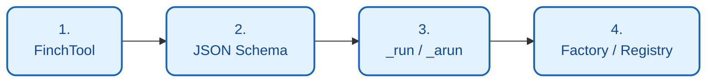
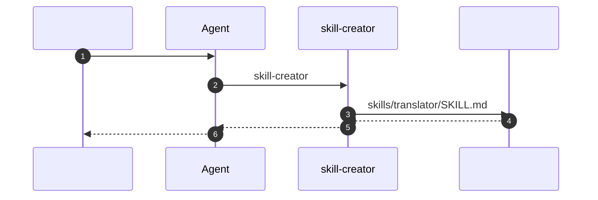

# 

FinchBot  ** (Tools)**  ** (Skills)**  Agent 

## 

1. [](#1-)
2. [](#2-)
3. [](#3-)
4. [ LLM ](#4--llm-)
5. [](#5-)

---

## 1. 

 Python  API `finchbot.tools.base.FinchTool`

### 



###  1: 

 Python  `src/finchbot/tools/custom/my_tool.py`

```python
from typing import Any, ClassVar
from finchbot.tools.base import FinchTool

class WeatherTool(FinchTool):
    """.
    
     Agent 
    """
    
    name: str = "get_weather"
    
    description: str = "Get current weather for a specific city."
    
    parameters: ClassVar[dict[str, Any]] = {
        "type": "object",
        "properties": {
            "city": {
                "type": "string",
                "description": "The name of the city, e.g. Beijing, New York",
            },
            "unit": {
                "type": "string",
                "enum": ["celsius", "fahrenheit"],
                "description": "Temperature unit",
                "default": "celsius"
            }
        },
        "required": ["city"],
    }

    def _run(self, city: str, unit: str = "celsius") -> str:
        """."""
        return f"The weather in {city} is Sunny, 25 degrees {unit}."

    async def _arun(self, city: str, unit: str = "celsius") -> str:
        """ ()."""
        return self._run(city, unit)
```

###  2: 

** A:  ()**

 `src/finchbot/tools/factory.py`  `create_default_tools` :

```python
from finchbot.tools.custom.my_tool import WeatherTool

class ToolFactory:
    def create_default_tools(self) -> list[BaseTool]:
        tools: list[BaseTool] = [
            # ... 
            WeatherTool(),  # 
        ]
        return tools
```

** B:  ()**

```python
from finchbot.tools.registry import get_global_registry
from my_plugin import WeatherTool

registry = get_global_registry()
registry.register(WeatherTool())
```

### 

|  |  |
| :---: | :--- |
| **** |  |
| **** | `description`  `parameters`  LLM  |
| **** |  |
| **** |  |

### session_title

`session_title` 

|  |  |  |
| :---: | :--- | :--- |
| **** |  2-3 AI  | "Python " |
| **Agent ** |  Agent " XXX" | Agent  |
| **** |  `r`  |  |

```python
# Agent 
session_title(action="set", title="")

# 
session_title(action="get")
```

---

## 2. 

 (Skills)  Markdown  Agent  " (SOP)"  "In-Context Learning" 

### Agent 

FinchBot  **skill-creator** 



> ** Agent Agent **

```
: 

Agent: ...
       [ skill-creator ]
         skills/translator/SKILL.md
       
```

** Agent **

### 


### 

 `skills/`  `~/.finchbot/workspace/skills/`

```text
workspace/
  skills/
    data-analysis/
      SKILL.md      # 
    python-coding/
      SKILL.md
```

###  1: 

 `skills/`  `report-writing`

###  2:  SKILL.md

 `SKILL.md`  **YAML Frontmatter**  **Markdown **

****:

```markdown
---
name: report-writing
description:  Agent 
metadata:
  finchbot:
    emoji: 
    always: false  #  (true/false)
    requires:
      bins: []     #  CLI 
      env: []      # 
---

# 


## 1. 

*   ****: 
*   ** (Executive Summary)**: 200
*   ****: 
*   ****: 
*   ****: 

## 2. 

*   
*   
*   
```

### Frontmatter 

|  |  |  |  |
| :--- | :--- | :---: | :--- |
| `name` | string |  |  |
| `description` | string |  |  Agent  |
| `metadata.finchbot.emoji` | string |  |  |
| `metadata.finchbot.always` | boolean |  |  false |
| `metadata.finchbot.requires.bins` | list |  |  CLI  |
| `metadata.finchbot.requires.env` | list |  |  |

### 

```mermaid
flowchart TD
    classDef startEnd fill:#ffebee,stroke:#c62828,stroke-width:2px,color:#b71c1c;
    classDef process fill:#e3f2fd,stroke:#1565c0,stroke-width:2px,color:#0d47a1;
    classDef decision fill:#fff9c4,stroke:#fbc02d,stroke-width:2px,color:#f57f17;

    A([Agent ]):::startEnd --> B[ skills/ ]:::process
    B --> C{always: true?}:::decision
    C -->|| D[ System Prompt]:::process
    C -->|| E[]:::process
    D --> F([]):::startEnd
    E --> F
```

1. ****: Agent  `skills/` 
2. ****:
    -  `always: true` System Prompt 
    -  `always: false` `name`  `description`  System Prompt 

---

## 3. 

FinchBot  ** RRF**  `QueryType`  `RetrievalService` 

### 

 `src/finchbot/memory/types.py`  `QueryType` 

```python
QUERY_WEIGHTS = {
    QueryType.KEYWORD_ONLY: (1.0, 0.0),    # (, )
    QueryType.SEMANTIC_ONLY: (0.0, 1.0),
    QueryType.FACTUAL: (0.8, 0.2),
    QueryType.CONCEPTUAL: (0.2, 0.8),
    QueryType.COMPLEX: (0.5, 0.5),
    QueryType.AMBIGUOUS: (0.3, 0.7),
}
```

### 

 `RetrievalService`  `search()` 

```python
from finchbot.memory.services.retrieval import RetrievalService

class MyRetrievalService(RetrievalService):
    async def search(
        self,
        query: str,
        query_type: QueryType,
        top_k: int = 5,
        **kwargs
    ) -> list[dict]:
        # 
        results = await super().search(query, query_type, top_k, **kwargs)
        
        # 
        results = self._apply_custom_ranking(results)
        
        return results
```

---

## 4.  LLM 

 `src/finchbot/providers/factory.py`  Provider 

### 

```python
from langchain_core.language_models import BaseChatModel
from langchain_openai import ChatOpenAI

def create_my_provider_model(config: ProviderConfig) -> BaseChatModel:
    """."""
    return ChatOpenAI(
        model=config.model or "my-default-model",
        api_key=config.api_key,
        base_url=config.api_base or "https://api.my-provider.com/v1",
        temperature=config.temperature or 0.7,
    )

#  ProviderFactory 
PROVIDER_FACTORIES = {
    # ... 
    "my-provider": create_my_provider_model,
}
```

---

## 5. 

###  vs 

```mermaid
flowchart TB
    classDef tool fill:#e3f2fd,stroke:#1565c0,stroke-width:2px,color:#0d47a1;
    classDef skill fill:#e8f5e9,stroke:#2e7d32,stroke-width:2px,color:#1b5e20;

    subgraph Tools []
        T1[<br/>//]:::tool
        T2[ API]:::tool
        T3[]:::tool
    end

    subgraph Skills []
        S1[/]:::skill
        S2[]:::skill
        S3[]:::skill
    end

    Need{?}
    
    Need -->|| Tools
    Need -->|| Skills
```

|  |  |  |
| :--- | :---: | :---: |
|  |  |  |
|  |  |  |
|  API |  |  |
|  Agent  |  |  |

### 

1. ****: 
2. ****:  `description`  `parameters` 
3. ****: 
4. ****: 

### 

1. ****: 
2. ****: 
3. ****: 
4. ****: 

### 

```python
# 
from typing import Any, ClassVar
from finchbot.tools.base import FinchTool
import aiohttp

class JokeTool(FinchTool):
    """."""
    
    name: str = "get_joke"
    description: str = "Get a random joke to make the user happy."
    parameters: ClassVar[dict[str, Any]] = {
        "type": "object",
        "properties": {
            "category": {
                "type": "string",
                "enum": ["programming", "general", "dad"],
                "description": "Joke category",
                "default": "programming"
            }
        },
        "required": [],
    }
    
    async def _arun(self, category: str = "programming") -> str:
        async with aiohttp.ClientSession() as session:
            url = f"https://official-joke-api.appspot.com/jokes/{category}/random"
            async with session.get(url) as response:
                if response.status == 200:
                    data = await response.json()
                    joke = data[0] if isinstance(data, list) else data
                    return f"{joke['setup']} - {joke['punchline']}"
                return "Sorry, couldn't fetch a joke right now."
    
    def _run(self, category: str = "programming") -> str:
        import asyncio
        return asyncio.run(self._arun(category))
```
