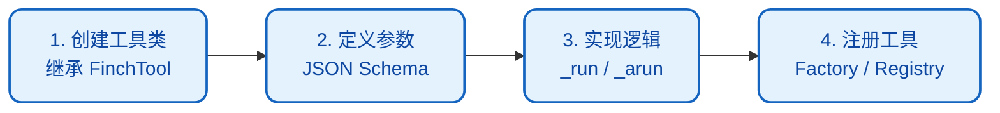
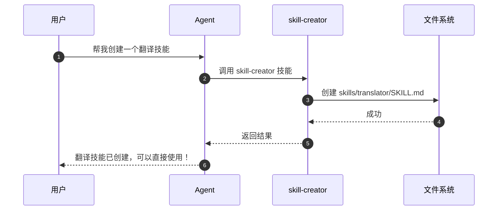
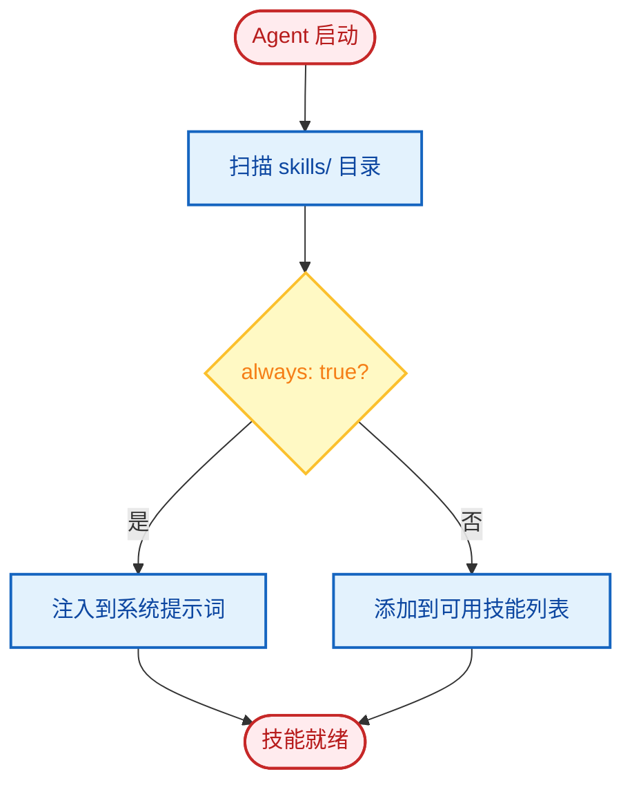
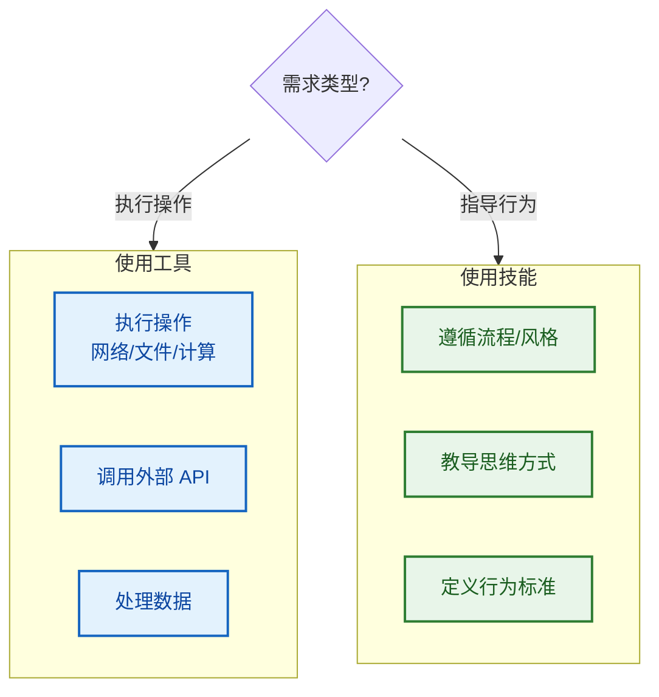

# 扩展指南

FinchBot 提供强大的扩展能力，开发者可以通过**添加新工具**和**编写新技能**来增强 Agent 能力。

## 目录

1. [添加新工具](#1-添加新工具)
2. [编写新技能](#2-编写新技能)
3. [自定义记忆检索策略](#3-自定义记忆检索策略)
4. [添加新的 LLM 提供商](#4-添加新的-llm-提供商)
5. [最佳实践](#5-最佳实践)

---

## 1. 添加新工具

工具是用于执行实际操作（如调用 API、处理数据、操作文件等）的 Python 代码。所有工具必须继承 `finchbot.tools.base.FinchTool`。

### 工具开发流程



### 步骤一：创建工具类

创建新的 Python 文件（如 `src/finchbot/tools/custom/my_tool.py`）并定义工具类。

```python
from typing import Any, ClassVar
from finchbot.tools.base import FinchTool

class WeatherTool(FinchTool):
    """天气查询工具。
    
    允许 Agent 查询指定城市的天气状况。
    """
    
    name: str = "get_weather"
    
    description: str = "获取指定城市的当前天气。"
    
    parameters: ClassVar[dict[str, Any]] = {
        "type": "object",
        "properties": {
            "city": {
                "type": "string",
                "description": "城市名称，如北京、纽约",
            },
            "unit": {
                "type": "string",
                "enum": ["celsius", "fahrenheit"],
                "description": "温度单位",
                "default": "celsius"
            }
        },
        "required": ["city"],
    }

    def _run(self, city: str, unit: str = "celsius") -> str:
        """同步执行逻辑。"""
        return f"{city}的天气是晴天，25度{unit}。"

    async def _arun(self, city: str, unit: str = "celsius") -> str:
        """异步执行逻辑（可选）。"""
        return self._run(city, unit)
```

### 步骤二：注册工具

**方法 A：修改工具工厂（推荐用于内置工具）**

修改 `src/finchbot/tools/factory.py` 中的 `create_default_tools`：

```python
from finchbot.tools.custom.my_tool import WeatherTool

class ToolFactory:
    def create_default_tools(self) -> list[BaseTool]:
        tools: list[BaseTool] = [
            # ... 现有工具
            WeatherTool(),  # 添加新工具实例
        ]
        return tools
```

**方法 B：运行时注册（推荐用于插件）**

```python
from finchbot.tools.registry import get_global_registry
from my_plugin import WeatherTool

registry = get_global_registry()
registry.register(WeatherTool())
```

### 工具设计原则

| 原则 | 说明 |
| :---: | :--- |
| **单一职责** | 一个工具只做一件事 |
| **描述清晰** | `description` 和 `parameters` 必须清晰，这决定了 LLM 能否正确调用 |
| **错误处理** | 返回有意义的错误信息，不要抛出异常 |
| **安全限制** | 敏感操作需要权限检查 |

### 内置工具示例：session_title

`session_title` 工具体现了 FinchBot 的开箱即用理念：

| 操作方式 | 说明 | 示例 |
| :---: | :--- | :--- |
| **自动生成** | 对话 2-3 轮后，AI 自动根据内容生成标题 | "Python 异步编程讨论" |
| **Agent 修改** | 告诉 Agent "把会话标题改成 XXX" | Agent 调用工具自动修改 |
| **手动重命名** | 在会话管理器中按 `r` 键重命名 | 用户手动输入新标题 |

```python
# Agent 调用示例
session_title(action="set", title="新会话标题")

# 获取当前标题
session_title(action="get")
```

---

## 2. 编写新技能

技能是基于 Markdown 的文档，用于教导 Agent 如何处理特定类型的任务。它们类似于"标准操作流程（SOP）"或"上下文学习（In-Context Learning）"示例。

### 开箱即用：Agent 自动创建技能

FinchBot 内置了 **skill-creator** 技能，这是开箱即用理念的极致体现：



> **只需告诉 Agent 你想要什么技能，它就会自动创建好！**

```
用户: 帮我创建一个翻译技能，可以把中文翻译成英文

Agent: 好的，我来为你创建翻译技能...
       [调用 skill-creator 技能]
       已创建 skills/translator/SKILL.md
       现在你可以直接使用翻译功能了！
```

无需手动创建文件、无需编写代码，**一句话就能扩展 Agent 能力**！

### 手动创建技能

如果您更喜欢手动创建技能，请按以下步骤操作。

### 技能目录结构

技能文件存储在工作区的 `skills/` 目录（默认为 `~/.finchbot/workspace/skills/`）。

```text
workspace/
  skills/
    data-analysis/
      SKILL.md      # 技能定义文件
    python-coding/
      SKILL.md
```

### 步骤一：创建技能目录

在 `skills/` 下创建新目录，如 `report-writing`。

### 步骤二：编写 SKILL.md

在目录中创建 `SKILL.md` 文件。文件包含 **YAML Frontmatter** 和 **Markdown 内容**。

**示例**：

```markdown
---
name: report-writing
description: 指导 Agent 如何撰写专业分析报告
metadata:
  finchbot:
    emoji: 
    always: false  # 是否始终加载此技能（true/false）
    requires:
      bins: []     # 所需 CLI 工具
      env: []      # 所需环境变量
---

# 报告撰写指南

当用户请求分析报告时，遵循以下结构和原则：

## 1. 结构要求

*   **标题**：清晰反映主题。
*   **执行摘要**：简要概述关键发现（200 字以内）。
*   **方法论**：说明数据来源和分析方法。
*   **详细分析**：用数据支撑呈现观点。
*   **结论和建议**：提供可操作的建议。

## 2. 写作风格

*   保持客观中立。
*   使用专业术语，但解释不常见的术语。
*   使用列表和表格呈现数据。
```

### Frontmatter 字段说明

| 字段 | 类型 | 必需 | 说明 |
| :--- | :--- | :---: | :--- |
| `name` | string |  | 技能唯一标识 |
| `description` | string |  | 技能描述，用于 Agent 决定何时使用 |
| `metadata.finchbot.emoji` | string |  | 技能图标 |
| `metadata.finchbot.always` | boolean |  | 是否始终加载（默认 false） |
| `metadata.finchbot.requires.bins` | list |  | 所需 CLI 工具列表 |
| `metadata.finchbot.requires.env` | list |  | 所需环境变量列表 |

### 技能加载机制



1. **自动发现**：Agent 启动时自动扫描 `skills/` 目录
2. **动态注入**：
    - 如果 `always: true`，技能内容直接追加到系统提示词
    - 如果 `always: false`，技能的 `name` 和 `description` 出现在系统提示词的可用技能列表中

---

## 3. 自定义记忆检索策略

FinchBot 的记忆检索使用**加权 RRF** 策略。您可以通过修改 `QueryType` 或自定义 `RetrievalService` 来调整检索行为。

### 修改检索权重

修改 `src/finchbot/memory/types.py` 中的 `QueryType` 权重映射：

```python
QUERY_WEIGHTS = {
    QueryType.KEYWORD_ONLY: (1.0, 0.0),    # (关键词权重, 语义权重)
    QueryType.SEMANTIC_ONLY: (0.0, 1.0),
    QueryType.FACTUAL: (0.8, 0.2),
    QueryType.CONCEPTUAL: (0.2, 0.8),
    QueryType.COMPLEX: (0.5, 0.5),
    QueryType.AMBIGUOUS: (0.3, 0.7),
}
```

### 自定义检索服务

继承 `RetrievalService` 并重写 `search()` 方法：

```python
from finchbot.memory.services.retrieval import RetrievalService

class MyRetrievalService(RetrievalService):
    async def search(
        self,
        query: str,
        query_type: QueryType,
        top_k: int = 5,
        **kwargs
    ) -> list[dict]:
        # 自定义检索逻辑
        results = await super().search(query, query_type, top_k, **kwargs)
        
        # 应用自定义排序
        results = self._apply_custom_ranking(results)
        
        return results
```

---

## 4. 添加新的 LLM 提供商

在 `src/finchbot/providers/factory.py` 中添加新的 Provider 类。

### 示例：添加自定义提供商

```python
from langchain_core.language_models import BaseChatModel
from langchain_openai import ChatOpenAI

def create_my_provider_model(config: ProviderConfig) -> BaseChatModel:
    """创建自定义提供商模型实例。"""
    return ChatOpenAI(
        model=config.model or "my-default-model",
        api_key=config.api_key,
        base_url=config.api_base or "https://api.my-provider.com/v1",
        temperature=config.temperature or 0.7,
    )

# 在 ProviderFactory 中注册
PROVIDER_FACTORIES = {
    # ... 现有提供商
    "my-provider": create_my_provider_model,
}
```

---

## 5. 最佳实践

### 工具 vs 技能



| 场景 | 使用工具 | 使用技能 |
| :--- | :---: | :---: |
| 需要执行操作（网络、读文件、计算） |  |  |
| 需要遵循流程或特定风格 |  |  |
| 需要调用外部 API |  |  |
| 需要教导 Agent 如何思考 |  |  |

### 工具开发最佳实践

1. **原子性**：保持工具功能单一，一个工具做一件事
2. **文档化**：为工具编写清晰的 `description` 和 `parameters`
3. **错误处理**：返回有意义的错误信息，不要抛出异常
4. **安全限制**：敏感操作需要权限检查

### 技能开发最佳实践

1. **场景清晰**：技能描述应明确定义适用场景
2. **提供示例**：包含具体的输入/输出示例
3. **结构清晰**：使用标题、列表、表格组织内容
4. **长度适中**：技能内容不宜过长，避免消耗过多上下文

### 扩展示例

```python
# 完整的自定义工具示例
from typing import Any, ClassVar
from finchbot.tools.base import FinchTool
import aiohttp

class JokeTool(FinchTool):
    """随机笑话工具。"""
    
    name: str = "get_joke"
    description: str = "获取一个随机笑话让用户开心。"
    parameters: ClassVar[dict[str, Any]] = {
        "type": "object",
        "properties": {
            "category": {
                "type": "string",
                "enum": ["programming", "general", "dad"],
                "description": "笑话类别",
                "default": "programming"
            }
        },
        "required": [],
    }
    
    async def _arun(self, category: str = "programming") -> str:
        async with aiohttp.ClientSession() as session:
            url = f"https://official-joke-api.appspot.com/jokes/{category}/random"
            async with session.get(url) as response:
                if response.status == 200:
                    data = await response.json()
                    joke = data[0] if isinstance(data, list) else data
                    return f"{joke['setup']} - {joke['punchline']}"
                return "抱歉，暂时无法获取笑话。"
    
    def _run(self, category: str = "programming") -> str:
        import asyncio
        return asyncio.run(self._arun(category))
```
