# 扩展指南

FinchBot 提供了强大的扩展能力，允许开发者通过 **添加新工具 (Tools)** 和 **编写新技能 (Skills)** 来增强 Agent 的能力。

## 目录

1. [添加新工具](#1-添加新工具)
2. [编写新技能](#2-编写新技能)
3. [自定义记忆检索策略](#3-自定义记忆检索策略)
4. [添加新的 LLM 提供商](#4-添加新的-llm-提供商)
5. [最佳实践](#5-最佳实践)

---

## 1. 添加新工具

工具是 Python 代码，用于执行实际操作（如调用 API、处理数据、操作文件等）。所有工具必须继承自 `finchbot.tools.base.FinchTool`。

### 工具开发流程

```mermaid
flowchart LR
    classDef step fill:#e3f2fd,stroke:#1565c0,stroke-width:2px,color:#0d47a1,rx:10,ry:10;

    A["1. 创建工具类<br/>继承 FinchTool"]:::step --> B["2. 定义参数<br/>JSON Schema"]:::step
    B --> C["3. 实现逻辑<br/>_run / _arun"]:::step
    C --> D["4. 注册工具<br/>Factory / Registry"]:::step
```



### 步骤 1: 创建工具类

创建一个新的 Python 文件（例如 `src/finchbot/tools/custom/my_tool.py`），并定义工具类。

```python
from typing import Any, ClassVar
from finchbot.tools.base import FinchTool

class WeatherTool(FinchTool):
    """天气查询工具.
    
    允许 Agent 查询指定城市的天气情况。
    """
    
    name: str = "get_weather"
    
    description: str = "Get current weather for a specific city."
    
    parameters: ClassVar[dict[str, Any]] = {
        "type": "object",
        "properties": {
            "city": {
                "type": "string",
                "description": "The name of the city, e.g. Beijing, New York",
            },
            "unit": {
                "type": "string",
                "enum": ["celsius", "fahrenheit"],
                "description": "Temperature unit",
                "default": "celsius"
            }
        },
        "required": ["city"],
    }

    def _run(self, city: str, unit: str = "celsius") -> str:
        """同步执行逻辑."""
        return f"The weather in {city} is Sunny, 25 degrees {unit}."

    async def _arun(self, city: str, unit: str = "celsius") -> str:
        """异步执行逻辑 (可选)."""
        return self._run(city, unit)
```

### 步骤 2: 注册工具

**方法 A: 修改工厂类 (推荐用于内置工具)**

修改 `src/finchbot/tools/factory.py` 中的 `create_default_tools` 方法:

```python
from finchbot.tools.custom.my_tool import WeatherTool

class ToolFactory:
    def create_default_tools(self) -> list[BaseTool]:
        tools: list[BaseTool] = [
            # ... 现有工具
            WeatherTool(),  # 添加新工具实例
        ]
        return tools
```

**方法 B: 运行时注册 (推荐用于插件)**

```python
from finchbot.tools.registry import get_global_registry
from my_plugin import WeatherTool

registry = get_global_registry()
registry.register(WeatherTool())
```

### 工具设计原则

| 原则 | 说明 |
| :---: | :--- |
| **单一职责** | 一个工具只做一件事 |
| **清晰描述** | `description` 和 `parameters` 必须清晰，这决定了 LLM 能否正确调用 |
| **错误处理** | 返回有意义的错误信息，而非抛出异常 |
| **安全限制** | 敏感操作需要权限检查 |

### 内置工具示例：session_title

`session_title` 是一个体现开箱即用理念的工具：

| 操作方式 | 说明 | 示例 |
| :---: | :--- | :--- |
| **自动生成** | 对话 2-3 轮后，AI 自动根据内容生成标题 | "Python 异步编程讨论" |
| **Agent 修改** | 告诉 Agent "把会话标题改成 XXX" | Agent 调用工具自动修改 |
| **手动重命名** | 在会话管理器中按 `r` 键重命名 | 用户手动输入新标题 |

```python
# Agent 调用示例
session_title(action="set", title="新会话标题")

# 获取当前标题
session_title(action="get")
```

---

## 2. 编写新技能

技能 (Skills) 是基于 Markdown 的文档，用于教导 Agent 如何处理特定类型的任务。它们类似于 "标准作业程序 (SOP)" 或 "In-Context Learning" 示例。

### 开箱即用：Agent 自动创建技能

FinchBot 内置了 **skill-creator** 技能，这是开箱即用理念的极致体现：

```mermaid
sequenceDiagram
    autonumber
    participant U as 用户
    participant A as Agent
    participant S as skill-creator
    participant F as 文件系统

    U->>A: 帮我创建一个翻译技能
    A->>S: 调用 skill-creator 技能
    S->>F: 创建 skills/translator/SKILL.md
    F-->>S: 创建成功
    S-->>A: 返回结果
    A-->>U: 已创建翻译技能，可以直接使用！
```



> **只需告诉 Agent 你想要什么技能，Agent 就会自动创建好！**

```
用户: 帮我创建一个翻译技能，可以把中文翻译成英文

Agent: 好的，我来为你创建翻译技能...
       [调用 skill-creator 技能]
       ✅ 已创建 skills/translator/SKILL.md
       现在你可以直接使用翻译功能了！
```

无需手动创建文件、无需编写代码，**一句话就能扩展 Agent 能力**！

### 手动创建技能

如果你希望手动创建技能，请按以下步骤操作。

### 技能目录结构

技能文件存放在工作区的 `skills/` 目录下（默认为 `~/.finchbot/workspace/skills/`）。

```text
workspace/
  skills/
    data-analysis/
      SKILL.md      # 技能定义文件
    python-coding/
      SKILL.md
```

### 步骤 1: 创建技能目录

在 `skills/` 下创建一个新目录，例如 `report-writing`。

### 步骤 2: 编写 SKILL.md

在目录中创建 `SKILL.md` 文件。文件包含 **YAML Frontmatter** 和 **Markdown 正文**。

**示例**:

```markdown
---
name: report-writing
description: 指导 Agent 如何撰写专业的分析报告
metadata:
  finchbot:
    emoji: 📝
    always: false  # 是否总是加载此技能 (true/false)
    requires:
      bins: []     # 依赖的 CLI 工具
      env: []      # 依赖的环境变量
---

# 报告撰写指南

当用户要求撰写分析报告时，请遵循以下结构和原则：

## 1. 结构要求

*   **标题**: 清晰反映主题。
*   **摘要 (Executive Summary)**: 简要概述核心发现（200字以内）。
*   **方法论**: 说明数据来源和分析方法。
*   **详细分析**: 分点阐述，使用数据支撑观点。
*   **结论与建议**: 给出可执行的建议。

## 2. 写作风格

*   保持客观、中立。
*   使用专业术语，但对生僻词进行解释。
*   多使用列表和表格来展示数据。
```

### Frontmatter 字段说明

| 字段 | 类型 | 必填 | 说明 |
| :--- | :--- | :---: | :--- |
| `name` | string | ✅ | 技能唯一标识符 |
| `description` | string | ✅ | 技能描述，用于 Agent 决定何时使用 |
| `metadata.finchbot.emoji` | string | ❌ | 技能图标 |
| `metadata.finchbot.always` | boolean | ❌ | 是否总是加载（默认 false） |
| `metadata.finchbot.requires.bins` | list | ❌ | 依赖的 CLI 工具列表 |
| `metadata.finchbot.requires.env` | list | ❌ | 依赖的环境变量列表 |

### 技能加载机制

```mermaid
flowchart TD
    classDef startEnd fill:#ffebee,stroke:#c62828,stroke-width:2px,color:#b71c1c;
    classDef process fill:#e3f2fd,stroke:#1565c0,stroke-width:2px,color:#0d47a1;
    classDef decision fill:#fff9c4,stroke:#fbc02d,stroke-width:2px,color:#f57f17;

    A([Agent 启动]):::startEnd --> B[扫描 skills/ 目录]:::process
    B --> C{always: true?}:::decision
    C -->|是| D[直接注入 System Prompt]:::process
    C -->|否| E[添加到可用技能列表]:::process
    D --> F([技能就绪]):::startEnd
    E --> F
```



1. **自动发现**: Agent 启动时会自动扫描 `skills/` 目录
2. **动态注入**:
    - 如果 `always: true`，技能内容会被直接拼接到 System Prompt 中
    - 如果 `always: false`，技能的 `name` 和 `description` 会出现在 System Prompt 的可用技能列表中

---

## 3. 自定义记忆检索策略

FinchBot 的记忆检索采用 **加权 RRF** 策略，你可以通过修改 `QueryType` 或自定义 `RetrievalService` 来调整检索行为。

### 修改检索权重

在 `src/finchbot/memory/types.py` 中修改 `QueryType` 的权重映射：

```python
QUERY_WEIGHTS = {
    QueryType.KEYWORD_ONLY: (1.0, 0.0),    # (关键词权重, 语义权重)
    QueryType.SEMANTIC_ONLY: (0.0, 1.0),
    QueryType.FACTUAL: (0.8, 0.2),
    QueryType.CONCEPTUAL: (0.2, 0.8),
    QueryType.COMPLEX: (0.5, 0.5),
    QueryType.AMBIGUOUS: (0.3, 0.7),
}
```

### 自定义检索服务

继承 `RetrievalService` 并重写 `search()` 方法：

```python
from finchbot.memory.services.retrieval import RetrievalService

class MyRetrievalService(RetrievalService):
    async def search(
        self,
        query: str,
        query_type: QueryType,
        top_k: int = 5,
        **kwargs
    ) -> list[dict]:
        # 自定义检索逻辑
        results = await super().search(query, query_type, top_k, **kwargs)
        
        # 应用自定义排序
        results = self._apply_custom_ranking(results)
        
        return results
```

---

## 4. 添加新的 LLM 提供商

在 `src/finchbot/providers/factory.py` 中添加新的 Provider 类。

### 示例：添加自定义提供商

```python
from langchain_core.language_models import BaseChatModel
from langchain_openai import ChatOpenAI

def create_my_provider_model(config: ProviderConfig) -> BaseChatModel:
    """创建自定义提供商的模型实例."""
    return ChatOpenAI(
        model=config.model or "my-default-model",
        api_key=config.api_key,
        base_url=config.api_base or "https://api.my-provider.com/v1",
        temperature=config.temperature or 0.7,
    )

# 在 ProviderFactory 中注册
PROVIDER_FACTORIES = {
    # ... 现有提供商
    "my-provider": create_my_provider_model,
}
```

---

## 5. 最佳实践

### 工具 vs 技能

```mermaid
flowchart TB
    classDef tool fill:#e3f2fd,stroke:#1565c0,stroke-width:2px,color:#0d47a1;
    classDef skill fill:#e8f5e9,stroke:#2e7d32,stroke-width:2px,color:#1b5e20;

    subgraph Tools [使用工具]
        T1[执行动作<br/>联网/读文件/计算]:::tool
        T2[调用外部 API]:::tool
        T3[处理数据]:::tool
    end

    subgraph Skills [使用技能]
        S1[遵循流程/风格]:::skill
        S2[教导思考方式]:::skill
        S3[定义行为规范]:::skill
    end

    Need{需求类型?}
    
    Need -->|执行操作| Tools
    Need -->|指导行为| Skills
```



| 场景 | 使用工具 | 使用技能 |
| :--- | :---: | :---: |
| 需要执行动作（联网、读文件、计算） | ✅ | ❌ |
| 需要遵循流程或特定风格 | ❌ | ✅ |
| 需要调用外部 API | ✅ | ❌ |
| 需要教导 Agent 如何思考 | ❌ | ✅ |

### 工具开发最佳实践

1. **原子性**: 保持工具功能单一，一个工具只做一件事
2. **文档**: 为工具编写清晰的 `description` 和 `parameters` 说明
3. **错误处理**: 返回有意义的错误信息，而非抛出异常
4. **安全限制**: 敏感操作需要权限检查

### 技能开发最佳实践

1. **明确场景**: 技能描述要明确适用场景
2. **提供示例**: 包含具体的输入输出示例
3. **结构清晰**: 使用标题、列表、表格组织内容
4. **适度长度**: 技能内容不宜过长，避免占用过多上下文

### 扩展示例

```python
# 完整的自定义工具示例
from typing import Any, ClassVar
from finchbot.tools.base import FinchTool
import aiohttp

class JokeTool(FinchTool):
    """随机笑话工具."""
    
    name: str = "get_joke"
    description: str = "Get a random joke to make the user happy."
    parameters: ClassVar[dict[str, Any]] = {
        "type": "object",
        "properties": {
            "category": {
                "type": "string",
                "enum": ["programming", "general", "dad"],
                "description": "Joke category",
                "default": "programming"
            }
        },
        "required": [],
    }
    
    async def _arun(self, category: str = "programming") -> str:
        async with aiohttp.ClientSession() as session:
            url = f"https://official-joke-api.appspot.com/jokes/{category}/random"
            async with session.get(url) as response:
                if response.status == 200:
                    data = await response.json()
                    joke = data[0] if isinstance(data, list) else data
                    return f"{joke['setup']} - {joke['punchline']}"
                return "Sorry, couldn't fetch a joke right now."
    
    def _run(self, category: str = "programming") -> str:
        import asyncio
        return asyncio.run(self._arun(category))
```
