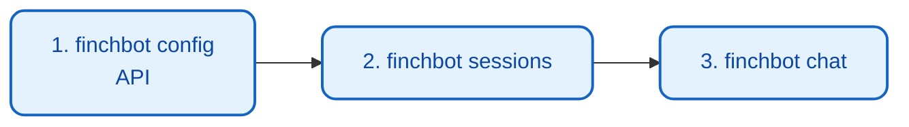

# 

FinchBot  (CLI) 

## 

```bash
#  API 
uv run finchbot config

# 
uv run finchbot sessions

# 
uv run finchbot chat
```

 FinchBot 



|  |  |  |
| :--- | :--- | :--- |
| `finchbot config` |  |  LLM API  |
| `finchbot sessions` |  |  |
| `finchbot chat` |  |  |

---

## 1. 

### 1.1  (CLI)

####  FinchBot

```bash
finchbot chat
```

 `uv run`

```bash
uv run finchbot chat
```

#### 

 ID 

```bash
finchbot chat --session "project-alpha"
```

#### 

```bash
finchbot chat --model "gpt-5"
```

### 1.2 Web  (Beta)

FinchBot  Web 

```mermaid
flowchart TB
    classDef backend fill:#e3f2fd,stroke:#1565c0,stroke-width:2px,color:#0d47a1;
    classDef frontend fill:#e8f5e9,stroke:#2e7d32,stroke-width:2px,color:#1b5e20;
    classDef user fill:#fff9c4,stroke:#fbc02d,stroke-width:2px,color:#f57f17;

    subgraph Backend []
        API[FastAPI<br/>:8000]:::backend
        WS[WebSocket<br/>]:::backend
    end

    subgraph Frontend []
        React[React + Vite<br/>:5173]:::frontend
        MD[Markdown ]:::frontend
    end

    U[]:::user --> React
    React <--> WS
    WS <--> API

    API --> React
    React --> MD
    MD --> U
```

#### 

```bash
uv run finchbot serve
```

 `http://127.0.0.1:8000` 

#### 

```bash
cd web
npm install
npm run dev
```

 `http://localhost:5173` 

Web 
- 
- Markdown 
- 
- 

---

## 2.  (Slash Commands)

 `/` 

### `/history`


- ****: AI
- ****: 

****:

```
  1  

                             
  test@example.com


  FinchBot                     
   

```

### `/rollback <index> [new_session_id]`


- ****:
    - `<index>`:  `/history` 
    - `[new_session_id]` (): 
- ****:
    - `/rollback 5`:  5  > 5 
    - `/rollback 5 branch-b`:  5  `branch-b` 

****:
- 
- 

### `/back <n>`

 n 

- ****:
    - `<n>`: 
- ****:
    - `/back 1`: 
    - `/back 2`:  + AI 

---

## 3. 

FinchBot 

### 


```bash
finchbot sessions
```

 `finchbot chat`

### 

|  |  |
| :--- | :--- |
| ↑ / ↓ |  |
| Enter |  |
| r |  |
| d |  |
| n |  |
| q |  |

### 


|  |  |
| :--- | :--- |
| ID |  |
|  |  |
|  |  |
|  |  |
|  |  |
|  |  |

---

## 4. 

FinchBot 

### 

```bash
finchbot config
```


### 

|  |  |
| :--- | :--- |
|  | / |
| LLM  | OpenAIAnthropicDeepSeek  |
| API  |  API Key |
| API Base URL |  API  |
|  |  |
|  | Tavily / Brave Search API Key |

###  LLM 

|  |  |
| :--- | :--- |
| OpenAI | GPT-5, GPT-5.2, O3-mini |
| Anthropic | Claude Sonnet 4.5, Claude Opus 4.6 |
| DeepSeek | DeepSeek Chat, DeepSeek Reasoner |
| DashScope |  (Qwen, QwQ) |
| Groq | Llama 4 Scout/Maverick, Llama 3.3 |
| Moonshot | Kimi K1.5/K2.5 |
| OpenRouter |  |
| Google Gemini | Gemini 2.5 Flash |

### 


```bash
# OpenAI
export OPENAI_API_KEY="sk-..."
export OPENAI_API_BASE="https://api.openai.com/v1"  # 

# Anthropic
export ANTHROPIC_API_KEY="sk-ant-..."

# DeepSeek
export DEEPSEEK_API_KEY="sk-..."

# Tavily ()
export TAVILY_API_KEY="tvly-..."
```

---

## 5. 

### 

FinchBot ****

 `finchbot chat`  `.models/fastembed/` 

> **** 95MB

### 


```bash
finchbot models download
```


-  hf-mirror.com 
-  Hugging Face 

****
- `BAAI/bge-small-zh-v1.5`
- 

---

## 6. 

FinchBot  11 

```mermaid
flowchart TB
    classDef category fill:#e3f2fd,stroke:#1565c0,stroke-width:2px,color:#0d47a1;
    classDef tool fill:#e8f5e9,stroke:#2e7d32,stroke-width:2px,color:#1b5e20;

    subgraph Tools [11 ]
        File[]:::category
        Web[]:::category
        Memory[]:::category
        System[]:::category
    end

    File --> F1[read_file]:::tool
    File --> F2[write_file]:::tool
    File --> F3[edit_file]:::tool
    File --> F4[list_dir]:::tool

    Web --> W1[web_search]:::tool
    Web --> W2[web_extract]:::tool

    Memory --> M1[remember]:::tool
    Memory --> M2[recall]:::tool
    Memory --> M3[forget]:::tool

    System --> S1[exec]:::tool
    System --> S2[session_title]:::tool
```

### 

|  |  |  |
| :--- | :--- | :--- |
| `read_file` |  |  |
| `write_file` |  |  |
| `edit_file` |  |  |
| `list_dir` |  |  |

****

```
1.  list_dir 
2.  read_file 
3.  write_file  edit_file
```

### 

|  |  |  |
| :--- | :--- | :--- |
| `web_search` |  |  |
| `web_extract` |  |  |

****
1. Tavily AI 
2. Brave Search
3. DuckDuckGo API 

****

```
1.  web_search  URL
2.  web_extract 
```

### 

|  |  |  |
| :--- | :--- | :--- |
| `remember` |  |  |
| `recall` |  |  |
| `forget` |  |  |

#### 

|  |  |  |
| :--- | :--- | :--- |
| personal |  |  |
| preference |  |  |
| work |  |  |
| contact |  |  |
| goal |  |  |
| schedule |  |  |
| general |  |  |

####  (QueryType)

|  |  |  |
| :--- | :--- | :--- |
| `factual` |  0.8 /  0.2 | "" |
| `conceptual` |  0.2 /  0.8 | "" |
| `complex` |  0.5 /  0.5 |  |
| `ambiguous` |  0.3 /  0.7 |  |
| `keyword_only` |  1.0 /  0.0 |  |
| `semantic_only` |  0.0 /  1.0 |  |

### 

|  |  |  |
| :--- | :--- | :--- |
| `exec` |  shell  |  |
| `session_title` |  | / |

---

## 7. Bootstrap 

FinchBot  Bootstrap  Agent 

### Bootstrap 

|  |  |
| :--- | :--- |
| `SYSTEM.md` |  Agent  |
| `MEMORY_GUIDE.md` |  |
| `SOUL.md` | Agent  |
| `AGENT_CONFIG.md` | Agent  |

###  Bootstrap 

 Agent 

```bash
# 
finchbot chat --workspace "~/my-workspace"

# 
# : ~/my-workspace/SYSTEM.md
```

** -  SYSTEM.md**

```markdown
# FinchBot ()

 Python 

## 
 FinchBot Python 

## 
- Python 3.13+ 
-  (asyncio)
-  (type hints)
-  (TDD)
```

---

## 8. 

`finchbot` 

|  |  |
| :--- | :--- |
| `--help` |  |
| `--version` |  |
| `-v` |  INFO  |
| `-vv` |  DEBUG  |

****:

```bash
#  INFO 
finchbot chat -v

#  DEBUG 
finchbot chat -vv
```

---

## 9. 

|  |  |
| :--- | :--- |
| `finchbot chat` |  |
| `finchbot chat -s <id>` | / |
| `finchbot chat -m <model>` |  |
| `finchbot chat -w <dir>` |  |
| `finchbot sessions` |  |
| `finchbot config` |  |
| `finchbot models download` |  |
| `finchbot version` |  |

---

## 10. 

|  |  |
| :--- | :--- |
| `/history` |  |
| `/rollback <n>` |  n  |
| `/rollback <n> <new_id>` |  |
| `/back <n>` |  n  |
| `exit` / `quit` / `q` |  |
